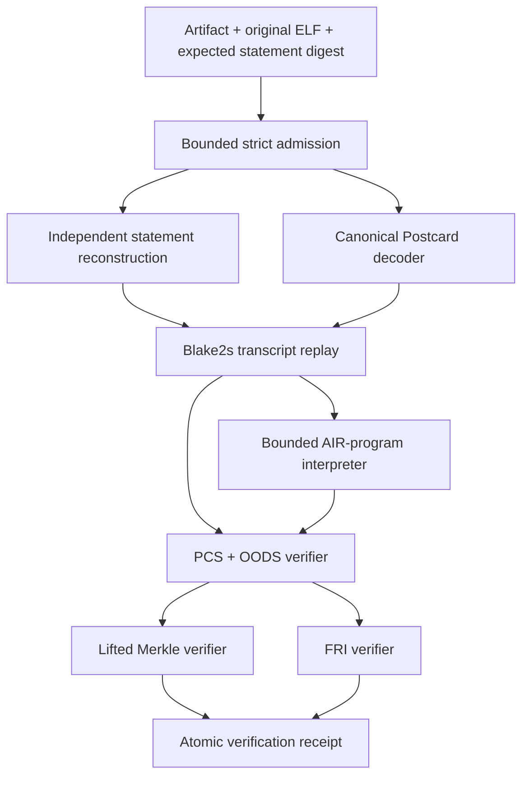

# Independent proof-system validation engineering plan

**Status:** engineering design; implementation not started.

**Primary result:** a source-isolated second verifier accepts the production
RISC-V schema-v4 artifact, reconstructs the statement from the original ELF,
replays the complete Fiat–Shamir transcript, and independently verifies the
AIR composition, PCS openings, Merkle paths, OODS identities, and FRI proof.

**Adversarial result:** a versioned corpus continuously demonstrates rejection
of bit flips, truncations, cross-proof splices, wrong statements, hostile
framing, and invalid protocol parameters by both production and independent
verifiers.

**Review result:** an external cryptography reviewer evaluates the complete
PCS, FRI/list-decoding, randomized-LogUp, proof-of-work, and Fiat–Shamir
accounting. The current heuristic security total is either justified under
explicit assumptions or replaced by reviewed parameters and a protocol bump.

**Protocol boundary:** the Sail-authoritative RISC-V artifact and security
profiles fixed by
[`conformance/2026-07-26-riscv-sail-contract.md`](../conformance/2026-07-26-riscv-sail-contract.md).

This document is the executable scope for the repository's independent
proof-system assurance workstream. It specifies implementation independence,
wire coverage, mutation ownership, external-review artifacts, promotion gates,
staffing, and defensible claim language. Commands and paths labelled
“planned” do not exist at the date of this document.

## 1. Objective and claim boundary

The project has three inseparable deliverables:

1. implement a second verifier that reads a real serialized RISC-V proof;
2. maintain positive and adversarial wire corpora against both verifiers; and
3. obtain an external review of the security reduction and parameter
   accounting.

The second verifier must decide the same complete proposition as the production
verifier:

> For the caller-supplied expected-statement digest, original ELF, requested
> security policy, and schema-v4 artifact, the committed traces satisfy the
> admitted RISC-V AIR and public closure, the claimed openings are bound to
> their commitments, the composition polynomial has the required degree, and
> the Fiat–Shamir transcript and proof-of-work checks are exact.

This work is not another execution oracle. Sail remains the ISA semantic
authority and Spike remains its executable cross-check. The independent
proof-system verifier begins at the proof artifact and does not execute the ELF
to decide architectural behavior.

A completed implementation provides strong evidence against common-mode bugs
in:

- artifact and Postcard decoding;
- security-policy admission;
- statement-digest reconstruction;
- transcript ordering and byte encoding;
- M31, CM31, and QM31 arithmetic;
- circle-domain and quotient evaluation;
- Merkle decommitment reconstruction;
- query sampling and position projection;
- FRI folding and final-degree checking;
- AIR expression interpretation and component ordering; and
- rejection behavior at the untrusted-file boundary.

It does **not** by itself prove:

- collision resistance or random-oracle behavior of Blake2s;
- an information-theoretic FRI theorem;
- that a shared AIR description correctly expresses RV32IM;
- that AIR satisfaction universally refines Sail;
- exact-multiset meaning from one randomized LogUp equality without the
  reviewed reduction;
- security against an implementation compromise shared below the documented
  dependency boundary; or
- that every future proof format is covered.

The external review addresses the reduction and parameter claims. It does not
turn computational assumptions into unconditional theorems, and it does not
replace the Universal AIR → Sail refinement workstream.

## 2. Current baseline and exact gap

The repository already has several useful verifier-like surfaces. None closes
this scope.

| Existing surface | What it establishes | Why it is not the requested verifier |
| --- | --- | --- |
| Production Zig RISC-V verifier | Full schema-v4 proof verification | It is the implementation being independently checked |
| `tools/stwo-interop-rs` | Cross-language Native proof compatibility | It imports pinned Stwo verifier code and does not verify the RISC-V protocol |
| `tools/stwo-cairo-verifier-rs` | Isolated official Cairo verification | It imports pinned Stwo and Cairo AIR code and targets a different statement |
| `scripts/air_satisfaction.py` | Independent committed-row and LogUp re-evaluation | It never reads commitments, openings, OODS, FRI, or the proof transcript |
| RISC-V staged smoke | Separate-process Zig verification and selected mutations | The process is separate, but the verifier implementation is the same |
| Native interchange mutations | Rich JSON-wire semantic mutations | They target Native example artifacts rather than the production RISC-V wire |

The production RISC-V artifact is also easy to misidentify:

- the outer artifact is strict JSON with
  `artifact_kind = "stwo_riscv_proof"`;
- its current schema is version `4`;
- its exchange mode is `riscv_proof_json_wire_v4`;
- `proof_bytes_hex` contains lowercase-hex **Postcard** bytes; and
- the original ELF and an externally supplied expected-statement digest are
  required for verification.

The package
[`src/interop/proof_wire`](../src/interop/proof_wire/README.md) owns a generic
Stwo JSON shape and an `STWOPRW1` binary codec. It explicitly does not own
statement framing or verification policy. Implementing a second verifier only
for that package would not satisfy this plan.

Current RISC-V wire mutations cover:

- one trailing byte;
- one-byte truncation;
- a Postcard length bomb;
- a wrong external statement digest;
- a wrong ELF;
- selected artifact-field mutations;
- same-family claim reordering; and
- hostile JSON framing.

Those checks are retained, but they are not yet the maintained, structural
bit-flip/truncation/splice/wrong-statement corpus required here.

Finally, the exposed `secure` profile currently reports a heuristic 96-bit
total:

```text
pow_bits + log_blowup_factor * n_queries
  = 26 + 1 * 70
  = 96
```

The repository labels this formula conjectural. It is not yet a reviewed
composition of FRI/list-decoding error, OODS error, LogUp compression error,
Merkle binding, Fiat–Shamir assumptions, grinding, and multi-component union
bounds.

## 3. Independence contract

“Another process” and “another command” are not sufficient definitions of
independence. The project uses the following levels:

| Level | Meaning | Current state |
| --- | --- | --- |
| I0 | Separate verifier invocation and caller-supplied statement | present |
| I1 | Separate executable and implementation modules | missing for RISC-V proof verification |
| I2 | Source-isolated implementation with an audited dependency closure | target of this plan |
| I3 | Independently authored protocol specification and security analysis | partially supplied by external review, not claimed automatically |

The release target is I2. Any I3 claim requires the external reviewer to state
exactly which specifications and derivations were independently reconstructed.

### 3.1 Selected implementation boundary

The planned implementation is a standalone Rust package:

```text
tools/riscv-proof-verifier-rs/
```

Rust is selected because the repository already pins and operates a Rust
toolchain, the resulting executable is memory-safe without a garbage-collected
runtime, and the package can be isolated with its own empty workspace and
lockfile. Language choice alone does not create independence; the source and
dependency rules below do.

The package must:

- declare an empty local `[workspace]`;
- commit `Cargo.lock`;
- use no Git dependency;
- use no path dependency;
- import no Zig-generated source;
- import no Stwo, Stwo-Cairo, constraint-framework, or repository AIR crate;
- include no source file copied from `src/core`, `src/prover`,
  `src/frontends/riscv`, `tools/stwo-interop-rs`, or a pinned upstream
  verifier;
- build from an explicit, reviewed crate allowlist;
- publish a complete dependency tree and source digest receipt; and
- contain no proving code.

Primitive crates for strict JSON, SHA-256, Blake2s, command-line parsing, and
constant-time comparison may be admitted after review. Field arithmetic,
circle-domain operations, transcript scheduling, Merkle verification, PCS,
FRI, and AIR interpretation are repository-owned second implementations.

### 3.2 Shared data versus shared implementation

The verifier may consume versioned protocol data:

- opcode and infrastructure identifiers;
- fixed lookup-table definitions;
- component geometry;
- a canonical AIR verification program;
- transcript event schemas; and
- known-answer vectors.

It may not consume production evaluator code or generated Rust translations of
that code. The AIR verification program is data interpreted by a new verifier,
not executable code shared with Zig.

This boundary intentionally detects a wrong interpreter, transcript, or proof
implementation in either verifier. It does not independently prove that the
shared AIR program means RV32IM; that is a separate formal-semantic obligation.

### 3.3 Clean-room development procedure

The implementation workflow is:

1. freeze a human-readable protocol specification and machine-readable
   manifest;
2. have one reviewer map the specification to production source anchors;
3. have the independent-verifier implementer work from the specification,
   manifest, and black-box vectors;
4. exchange intermediate values only through versioned vector files;
5. prohibit copying or mechanically translating production functions;
6. audit the final source for suspicious structural identity; and
7. record implementer and reviewer attestations in the release receipt.

Debug traces may expose values such as transcript digests, sampled points, and
FRI-layer roots. They must not expose production source or become a runtime
dependency.

## 4. Frozen protocol specification

Implementation starts only after a protocol specification is complete enough
for two people to implement without reading one another's verifier.

Planned authorities:

```text
conformance/riscv/proof-protocol-v1.md
conformance/riscv/proof-protocol-v1.json
conformance/riscv/proof-protocol-v1.sha256
```

The Markdown file explains the protocol. The JSON file carries exact constants,
ordered fields, tags, widths, limits, and source anchors. Neither is generated
from the second verifier.

### 4.1 Artifact and statement layer

The specification fixes:

- strict JSON field names, types, order-insensitive object meaning, and
  duplicate/unknown-field rejection;
- schema-v4 identity and unconditional rejection of versions 1 through 3;
- maximum artifact, proof, I/O, component, row, and committed-cell limits;
- lowercase canonical hexadecimal encoding;
- all three security policies and their exact PCS configuration;
- source and provenance validation;
- component and infrastructure ordering, sharding, geometry, and claim widths;
- public input, public output, completion, register, clock, and root fields;
- original-ELF hashing and release-ABI validation;
- decoded-program commitment reconstruction;
- input digest reconstruction from the bound public input;
- expected-statement digest domain and every little-endian field; and
- the distinction between release status, protocol policy, backend identity,
  and implementation provenance.

The independent verifier recomputes all derived values. It does not trust
statement digests, program roots, proof sizes, or transcript receipts embedded
in an artifact.

### 4.2 Postcard proof wire

The specification describes the exact serialized shape of:

- PCS configuration;
- four commitment roots;
- sampled values;
- four trace decommitments;
- queried M31 values;
- PCS proof-of-work nonce;
- first FRI layer;
- every inner FRI layer; and
- final line polynomial.

It fixes canonical Postcard unsigned-integer encoding, option tags, sequence
lengths, nesting, byte order, and end-of-input behavior. Decoding must reject:

- noncanonical variable-length integers;
- integer overflow;
- unknown option tags;
- lengths exceeding policy before allocation;
- lengths inconsistent with statement geometry;
- trailing bytes;
- truncation at every field;
- noncanonical M31 limbs; and
- allocation-size arithmetic overflow.

The preflight parser and semantic decoder are separate passes. Both are
independent of the Zig Postcard implementation.

### 4.3 Arithmetic and domains

The specification fixes:

- M31 modulus and canonical representation;
- CM31 and QM31 tower construction;
- addition, subtraction, multiplication, inverse, conjugation, and equality;
- circle points and the canonical circle coset;
- bit-reversed domain indexing;
- secure-field serialization order;
- line-polynomial representation;
- quotient denominator conventions;
- fold coordinates and twiddle selection; and
- packed FRI leaf order.

Each operation has known-answer, boundary, algebraic-property, and malformed
input vectors. Randomized property tests are supplemental and use committed
seeds.

### 4.4 Fiat–Shamir transcript

The transcript specification is an ordered event ledger, not prose such as
“mix the claims.” Every event records:

- event identifier;
- input type and exact bytes;
- hash prefix or domain;
- digest before and after;
- draw counter before and after;
- challenge count and interpretation; and
- the source field that supplied the input.

At minimum it covers:

1. PCS configuration;
2. complete public data;
3. preprocessed commitment root;
4. main commitment root;
5. canonical main claim and shard manifest;
6. ten-bit interaction proof of work;
7. all twelve relation-challenge pairs in canonical order;
8. canonical interaction claim;
9. interaction commitment root;
10. composition random coefficient and OODS point;
11. sampled values;
12. FRI commitments and folding challenges;
13. PCS proof-of-work nonce;
14. query-position sampling; and
15. the final transcript-state receipt digest.

All existing and future domain-separated extensions appear in the same ledger.
A protocol change cannot add an unledgered transcript operation.

### 4.5 AIR composition and public closure

The protocol package contains a canonical, versioned verification program for:

- all 17 opcode families;
- program, memory, Merkle, Poseidon2, and clock-update infrastructure;
- all six fixed lookup tables;
- selector and padding constraints;
- interaction-column recurrences;
- component log-size and column placement;
- claimed-sum extraction;
- public LogUp compensation; and
- global cancellation.

The second verifier implements a bounded interpreter for this program. The
interpreter accepts only the frozen opcode set and fails on unknown expressions,
indices, relation IDs, arities, or degree metadata.

The program manifest binds every expression group to:

- component kind;
- production source anchor;
- canonical digest;
- maximum degree;
- preprocessed, main, and interaction column ranges; and
- expected claimed-sum width.

### 4.6 PCS, OODS, and Merkle verification

The specification fixes:

- commitment-tree count and column log sizes;
- lifted Blake2s Merkle leaf and node encodings;
- multi-column leaf packing;
- sorted and deduplicated query semantics;
- tree-specific projection of global query positions;
- Merkle witness consumption order;
- sampled-point construction;
- random linear combination of column quotients;
- composition-tree geometry;
- OODS constraint evaluation and equality;
- lifting-log-size derivation; and
- shape rejection before expensive work.

Every witness element must be consumed exactly once. Too few and too many
hashes or queried values both reject.

### 4.7 FRI verification

The specification fixes:

- initial degree bound;
- circle-to-line transition;
- fold step;
- layer count and domain sizes;
- packed-leaf geometry;
- challenge derivation;
- per-query folding equations;
- query-index reduction between layers;
- first-layer and inner-layer Merkle checks;
- final polynomial coefficient order;
- final-degree bound; and
- agreement between final polynomial evaluations and folded query values.

The verifier may optimize only after a direct reference path passes the same
vectors. The direct path remains available to differential tests.

## 5. Verifier architecture



Planned internal modules:

```text
src/
  artifact/       strict JSON, policy, statement digest, ELF binding
  wire/           bounded Postcard preflight and decode
  field/          M31, CM31, QM31
  circle/         domains, points, bit reversal, line polynomials
  hash/           Blake2s encodings and Merkle hashing
  transcript/     typed event schedule and challenge draws
  air/            verification-program parser and interpreter
  logup/          relation compression and global closure
  pcs/            sampled points, quotients, OODS, tree projection
  fri/            commitment, folding, decommitment, degree check
  receipt/        stable result and identity schema
  command/        identity, verify, self-test
```

There is no prover module and no general-purpose plugin surface.

### 5.1 Resource and failure contract

The untrusted boundary is fail-closed:

- open each input read-only and bind its identity before parsing;
- reject an input that changes during the read;
- cap bytes, sequence counts, recursion depth, rows, columns, and allocations;
- perform checked arithmetic for every size and offset;
- allocate only after structural validation;
- impose a caller-owned wall timeout and memory limit;
- never follow artifact-supplied paths;
- never load dynamic code from the artifact;
- emit no partial “verified” result;
- publish a result atomically without overwriting an existing file; and
- use nonzero, stable exit classes for admission failure, invalid proof,
  resource exhaustion, and internal failure.

A panic, timeout, out-of-memory condition, or unknown error is never a proof
rejection receipt and never a success.

### 5.2 Planned CLI

The interface is intentionally narrow:

```sh
riscv-proof-verifier identity --json
riscv-proof-verifier self-test --vectors vectors/proof_validation
riscv-proof-verifier verify \
  --artifact proof.json \
  --elf program.elf \
  --protocol secure \
  --expect-statement-digest <64-lowercase-hex> \
  --result verification.json
```

`verify` requires every argument shown. There is no default downgrade from
`secure`, no “trust embedded statement” mode, and no compatibility acceptance
for schema versions 1 through 3.

### 5.3 Receipt

The stable receipt contains:

- schema and verifier role;
- `verified` status;
- artifact kind and schema;
- requested and admitted security policy;
- statement, artifact, proof, ELF, protocol-specification, and AIR-program
  digests;
- proof byte count;
- final transcript digest and draw count;
- verifier source, executable, dependency-lock, and toolchain digests;
- dirty-state and reproducibility status;
- resource high-water marks and elapsed time as diagnostics; and
- a canonical receipt digest.

Rejections use a separate diagnostic schema. A rejected proof cannot be
mistaken for a verified receipt by testing only whether a JSON file exists.

## 6. Complete verification procedure

The second implementation performs these steps in order:

1. **Measure inputs.** Open and hash the artifact and ELF, enforce byte caps,
   and retain file identities through the complete read.
2. **Parse the artifact.** Reject malformed JSON, duplicate or unknown fields,
   legacy versions, noncanonical hex, and invalid fixed identities.
3. **Apply policy.** Match requested policy, artifact protocol, outer PCS
   configuration, proof-embedded PCS configuration, and release status.
4. **Rebuild the statement.** Hash and parse the original ELF, validate the
   release ABI, rebuild the decoded program commitment, reconstruct public
   input and completion bindings, and recompute the expected-statement digest.
5. **Validate geometry.** Recompute component ordering, sharding, column
   counts, log sizes, fixed-table layout, claim widths, and cell limits.
6. **Decode the proof.** Preflight and decode the complete Postcard payload,
   requiring four roots and exact consumption of all bytes.
7. **Rebuild preprocessing.** Materialize or stream the exact preprocessed
   columns and require their root to match tree zero.
8. **Replay the claim phase.** Mix configuration, public data, roots, shard
   manifest, interaction PoW, relation draws, claims, and interaction root in
   ledger order.
9. **Check public closure.** Canonicalize all claims, compute public LogUp
   compensation, and require global cancellation.
10. **Evaluate composition.** Build verifier components, interpret the AIR
    program at the OODS point, and require the claimed composition value.
11. **Verify PCS and FRI.** Check sampled values, trace Merkle openings,
    quotient answers, all FRI layers, PCS PoW, sampled query positions, and the
    final degree bound.
12. **Publish the receipt.** Recompute artifact and executable identity, bind
    the final transcript state, and atomically publish success.

No step is advisory. A later check cannot convert an earlier structural failure
into acceptance.

## 7. Versioned positive and adversarial corpora

The corpus is generated deterministically from immutable positive seeds. Large
mutated artifacts need not be committed individually; a manifest records the
positive input digest, mutation algorithm version, seed, coordinates, expected
rejection class, and mutated digest.

Planned root:

```text
vectors/proof_validation/
  manifest-v1.json
  positive/
  mutations/
  transcripts/
  arithmetic/
  receipts/
```

### 7.1 Positive corpus

The minimum positive corpus contains:

- a smallest admitted ADDI proof;
- a load/store proof with signed-load and masked-store activity;
- a DIV/REM proof covering divide-by-zero and signed overflow;
- one proof with every one of the 17 opcode families;
- one proof with every infrastructure component and fixed table;
- a proof crossing an opcode-family shard boundary;
- a proof with more than one memory shard;
- every released completion kind;
- every released proof-producing backend whose canonical bytes are admitted;
- `functional` fixtures for fast development; and
- `secure` fixtures for release evidence.

`smoke` is verified only where the product exposes it, and its receipt must
remain visibly non-security. No test-profile acceptance is evidence for the
secure profile.

Each positive entry records:

- artifact and proof digest;
- original ELF digest;
- expected-statement digest;
- component and column inventory;
- PCS configuration;
- transcript checkpoints;
- production-verifier receipt;
- independent-verifier receipt; and
- the exact commits and toolchains that produced both.

### 7.2 Rejection classes

Mutations are assigned to one of these broad classes:

| Class | Earliest expected rejection |
| --- | --- |
| framing | strict JSON, hex, or Postcard admission |
| policy | schema, profile, release, provenance, or parameter admission |
| statement | ELF, input, public data, completion, geometry, or digest binding |
| transcript | ordered absorption, challenge, or proof-of-work replay |
| commitment | Merkle root, opening, or witness consumption |
| composition | sampled value, OODS identity, AIR, claim, or LogUp closure |
| fri | layer commitment, fold, query path, or final degree |

Both verifiers must reject every negative case. They need not return identical
internal error strings, but each rejection must map to the same broad class.
An internal crash or resource failure does not count as semantic rejection.

### 7.3 Bit-flip corpus

For a canonical minimal proof, the scheduled exhaustive lane flips every bit
of:

- outer artifact identity and policy fields;
- source and provenance digests;
- statement and public-data scalars;
- every interaction-claim limb;
- proof configuration;
- each commitment root;
- sampled values;
- queried values;
- Merkle witnesses;
- both proof-of-work nonces;
- FRI witnesses and roots; and
- final polynomial coefficients.

For large release proofs, a deterministic stratified set covers every
structural region, field role, byte position class, and bit position. It
includes the first, middle, and last value of every variable-length sequence
and all serialization boundaries.

If a bit lies in demonstrably nonsemantic formatting, the canonical parser
must reject the alternate representation. If two byte strings can encode the
same admitted artifact, the wire is not canonical and the release gate fails
until the ambiguity is removed or specified.

### 7.4 Truncation corpus

The minimal fixture is truncated at every byte offset, including the empty
file. Large fixtures are truncated at:

- every field and sequence boundary;
- one byte before and after each boundary;
- every power-of-two offset;
- each Merkle and FRI layer transition;
- the start and end of each variable-length integer;
- the last byte of every commitment and secure-field value; and
- a deterministic sample inside each large vector.

Prefix acceptance, partial receipt publication, and out-of-bounds reads are
failures even if the verifier later reports an error.

### 7.5 Splice corpus

Two individually valid proofs with different statements, shapes, transcripts,
and challenges are spliced at every structural boundary:

- outer statement from A with proof from B;
- roots from A with openings from B;
- sampled values from A with commitments from B;
- trace decommitments from A with FRI from B;
- an individual Merkle witness path from B;
- an individual FRI layer from B;
- final polynomial from B;
- prefix from A plus suffix from B at each boundary;
- repeated, omitted, and reordered vectors or layers; and
- same-profile, cross-profile, and cross-version pairs.

The corpus includes same-size proofs so rejection cannot depend only on byte
length.

### 7.6 Wrong-statement corpus

One proof is replayed against independently changed:

- external expected-statement digest;
- original ELF byte;
- ELF entry point or loadable segment;
- input byte and input digest;
- initial or final PC;
- initial or final register;
- register last-access clock;
- program and RW root;
- public input or output word;
- completion kind, address, value, or clock;
- opcode family, shard order, row count, or log size;
- infrastructure geometry;
- interaction claim or claim order; and
- requested security policy.

Tests distinguish outer admission from cryptographic binding. For example, a
mutation that recomputes the outer statement digest must still fail after the
transcript is replayed.

### 7.7 Hostile framing and shape corpus

The existing corrupt JSON, duplicate field, unknown field, missing claim,
legacy version, release relabel, trailing byte, one-byte truncation, and length
bomb cases remain permanent regression seeds.

The expanded set adds:

- noncanonical Postcard integers;
- invalid option and enum tags;
- odd, uppercase, and non-hex proof strings;
- valid JSON with excessive nesting;
- zero, maximum, and overflowing vector lengths;
- multiplication and addition overflow in allocation sizes;
- empty or extra commitment trees;
- too few or too many sampled columns;
- duplicate and out-of-range query positions;
- extra and missing Merkle witness nodes;
- invalid FRI layer count;
- final-polynomial degree drift; and
- proof configuration inconsistent with the outer profile.

### 7.8 Corpus manifest contract

The manifest records, for every case:

- stable mutation ID and family;
- generator schema and source digest;
- positive seed ID and digest;
- exact mutation coordinates;
- expected rejection class;
- applicability by schema and profile;
- mutated artifact digest;
- production-verifier result;
- independent-verifier result; and
- last successful verification commit.

Generation must prove that each mutation changes bytes and the intended
semantic leaf. A no-op mutation, an unexecuted case, or an accepted negative
fails the gate.

### 7.9 Disagreement policy

A verifier disagreement is not resolved by majority vote.

- positive accepted by only one verifier: quarantine the vector and block
  release;
- negative accepted by either verifier: security failure and release blocker;
- crash or timeout in either verifier: infrastructure failure and release
  blocker for the affected profile;
- differing rejection classes: investigate before updating the expected class;
- protocol-specification ambiguity: freeze promotion until the specification
  is amended and both implementations are updated.

The production verifier remains authoritative for current releases until the
shadow and promotion gates below are complete. After promotion, both are
required.

## 8. Test and evidence strategy

### 8.1 Primitive known-answer tests

Committed vectors cover:

- every field operation at zero, one, modulus boundaries, and random seeds;
- tower-field basis and limb order;
- circle points, doubling, domain enumeration, and bit reversal;
- Blake2s mix, draw, proof-of-work, and Merkle prefixes;
- transcript checkpoints after every event;
- Merkle roots and authentication paths for uneven column heights;
- quotient evaluations at ordinary and exceptional coordinates;
- each FRI fold and query-index transition; and
- final line-polynomial evaluation and degree rejection.

Vectors include intermediate values, not only final acceptance.

### 8.2 Differential verification

The differential controller invokes immutable production and independent
executables with the same files and policy. It never links either verifier as a
library.

For positives it requires:

- both exit successfully;
- both bind the same statement, artifact, proof, ELF, and protocol digests;
- both finish with the same transcript digest and draw count; and
- both publish independently valid receipts.

For negatives it requires:

- both exit nonzero;
- neither emits a success receipt;
- both map the result to the expected rejection class; and
- repeated execution is deterministic.

### 8.3 Fuzzing and sanitizers

Fuzz targets include:

- strict artifact parser;
- Postcard preflight;
- Postcard semantic decoder;
- field and domain decoders;
- Merkle witness consumer;
- FRI proof consumer;
- AIR-program parser; and
- complete `verify` admission with bounded small shapes.

Every crash, hang, excessive allocation, or acceptance is minimized into a
committed regression seed. Fuzzing supplements deterministic corpora; a fuzz
hour count is not a correctness claim.

### 8.4 Sensitivity controls

The pipeline must be demonstrated failing when temporary test builds:

- skip statement-digest comparison;
- omit one transcript absorption;
- swap two relation challenge pairs;
- accept a noncanonical M31 value;
- skip a Merkle sibling;
- ignore one sampled value;
- skip one FRI layer;
- raise the final degree bound;
- remove one AIR constraint group; or
- omit public LogUp compensation.

These mutants are built in isolated test jobs and must accept at least one
negative seed that the real verifier rejects. Otherwise the corpus has not
shown sensitivity to the named obligation.

## 9. External security review

The external review is a deliverable with a fixed source snapshot, question
set, findings ledger, and remediation gate. An informal call or generic code
review does not satisfy it.

### 9.1 Review dossier

Before reviewer engagement, the project supplies:

- the frozen protocol specification and manifest;
- production and second-verifier source digests;
- exact security profiles;
- transcript event ledger and known-answer vectors;
- AIR degree and component inventory;
- PCS and FRI equations;
- query-sampling and deduplication rules;
- Merkle and packed-leaf definitions;
- LogUp relation arities, tuple counts, and challenge schedule;
- both proof-of-work roles;
- mutation coverage report;
- current heuristic accounting;
- explicit trusted computing base; and
- a list of known gaps and non-claims.

### 9.2 Required accounting

The reviewer must address at least:

1. **FRI proximity soundness.** Applicable circle-FRI/list-decoding theorem,
   rate regime, fold schedule, final degree, number of queries, and exact error
   term.
2. **Query dependence.** Sampling with or without replacement, duplicate
   queries, projection between unequal tree heights, and whether
   `blowup_bits × queries` is justified.
3. **OODS and composition.** Constraint degree, extension-field challenge,
   batching coefficient, denominator-zero events, and Schwartz–Zippel terms.
4. **Randomized LogUp.** Tuple compression, denominator collisions, claimed-sum
   batching, relation count, row-count dependence, and the ten-bit interaction
   grinding step.
5. **Merkle binding.** Lifted-tree construction, leaf packing, domain prefixes,
   root mixing, and the exact collision/preimage assumptions required.
6. **Fiat–Shamir.** Complete event ordering, domain separation, challenge
   reuse, aborts, grinding, proof-of-work interaction, and random-oracle
   assumptions.
7. **Parameter composition.** Whether probabilities add, multiply, or are
   conditioned; union bounds across components, relations, segments, and
   repeated proofs; and the resulting classical security lower bound.
8. **Multi-target use.** Adaptive statements, many proofs under one profile,
   selective failure, and any degradation not represented by a single-proof
   number.
9. **Serialization and policy.** Malleability, downgrade resistance, embedded
   versus requested parameters, and statement binding.
10. **Claim wording.** The exact defensible meaning of the final advertised
    security level.

The review must not assume the desired 96-bit answer. If the current profile
does not meet the selected target, parameters change and the protocol version
bumps.

### 9.3 Machine-readable security ledger

Planned authority:

```text
conformance/security/proof-security-ledger-v1.json
```

Each row records:

- obligation ID and description;
- theorem or computational assumption;
- exact formula;
- parameter inputs and source anchors;
- numeric error probability or work factor;
- independence or conditioning assumptions;
- composition rule;
- reviewer disposition;
- residual caveat; and
- protocol versions to which the row applies.

The ledger separately reports information-theoretic error, computational
binding assumptions, grinding work, and Fiat–Shamir model assumptions. It does
not compress incomparable quantities into one number without an explicit
composition rule.

### 9.4 Reviewer independence and artifacts

The reviewer must:

- be independent of the verifier implementation;
- disclose financial, employment, and authorship conflicts;
- have demonstrable PCS/FRI or STARK protocol expertise;
- receive the exact immutable review snapshot; and
- approve publication of the scope, limitations, and final disposition.

Committed review artifacts include:

- engagement scope;
- reviewer identity and conflict disclosure;
- snapshot manifest;
- initial report;
- finding-by-finding remediation ledger;
- final report or letter;
- project response;
- artifact digests; and
- license or publication permission.

Private vulnerability details may be embargoed while a fix is prepared. The
public final report must still identify the affected obligation, resolution,
and reviewed version.

### 9.5 Finding and promotion policy

Findings use severity plus status:

- critical/high unresolved: release blocked;
- medium affecting the claimed bit level: release blocked or claim reduced;
- medium implementation hardening: owner and deadline required;
- low/informational: tracked with explicit disposition;
- disputed: both arguments published or adjudicated by another reviewer.

“Reviewed” means the exact final snapshot and ledger were assessed. It does not
mean every future protocol change inherits the result.

Changes to transcript order, field construction, FRI geometry, query count,
blowup, proof-of-work, packing, component batching, LogUp challenges, or
statement binding invalidate the corresponding review rows and require
re-review before promotion.

## 10. Planned repository layout

```text
tools/riscv-proof-verifier-rs/
  Cargo.toml
  Cargo.lock
  README.md
  src/
  tests/

conformance/riscv/
  proof-protocol-v1.md
  proof-protocol-v1.json
  proof-protocol-v1.sha256

conformance/security/
  proof-security-ledger-v1.json
  reviews/
    <review-id>/

vectors/proof_validation/
  manifest-v1.json
  positive/
  mutations/
  transcripts/
  arithmetic/
  receipts/

scripts/
  proof_validation.py
  proof_validation_lib/
```

The verifier package receives the same owner documentation standard as every
other package: purpose, boundaries, architecture, public CLI, dependency
policy, build/test commands, invariants, resource limits, and review checklist.

## 11. Planned commands and CI

These are planned interfaces, not commands available today:

```sh
cargo build --release --locked \
  --manifest-path tools/riscv-proof-verifier-rs/Cargo.toml
cargo test --locked \
  --manifest-path tools/riscv-proof-verifier-rs/Cargo.toml

python3 scripts/proof_validation.py check-spec
python3 scripts/proof_validation.py generate-corpus
python3 scripts/proof_validation.py check-corpus
python3 scripts/proof_validation.py differential --profile functional
python3 scripts/proof_validation.py differential --profile secure
python3 scripts/proof_validation.py check-independence
python3 scripts/proof_validation.py check-security-ledger
python3 scripts/proof_validation.py receipt
```

### 11.1 Pull-request lane

Triggered by proof wire, RISC-V statement, AIR, verifier, transcript, PCS, FRI,
Merkle, profile, protocol-specification, corpus, or security-ledger changes.

It runs:

- dependency and source-independence audit;
- strict parser and decoder tests;
- primitive known-answer tests;
- smallest functional positive proof;
- deterministic PR mutation subset with every rejection class;
- generated-manifest drift check; and
- production/independent receipt comparison.

### 11.2 Scheduled lane

It runs:

- clean toolchain and empty-cache build;
- complete functional positive corpus;
- exhaustive minimal-proof bit flips and truncations;
- full splice and wrong-statement corpora;
- sanitizer and fuzz campaigns;
- sensitivity mutants;
- reproducibility check; and
- dependency-vulnerability review.

### 11.3 Release lane

It requires:

- complete secure-profile positive corpus;
- complete release mutation manifest;
- immutable production and independent verifier executables;
- exact protocol and AIR-program digests;
- no verifier disagreement;
- source-isolation receipt;
- reviewed security ledger;
- no blocking external finding; and
- retained signed evidence bundle.

The independent verifier first runs in shadow mode. Promotion to a required
release gate needs at least two complete scheduled cycles and one secure
release rehearsal with no unexplained disagreement.

## 12. Work packages and exit gates

### PV-00 — authority and independence freeze

Deliver:

- this plan reviewed;
- target artifact and policy boundary;
- I2 dependency and source-isolation rules;
- verifier CLI and receipt schemas;
- protocol-specification template; and
- trusted computing base.

Exit gate: reviewers agree what “independent verifier” does and does not mean.

### PV-01 — artifact, Postcard, and statement vertical slice

Deliver:

- standalone package and locked dependency closure;
- bounded strict JSON parser;
- canonical Postcard preflight and decoder;
- schema-v4 policy validation;
- ELF and input binding;
- statement-digest implementation; and
- framing, truncation, length, downgrade, and wrong-statement tests.

Exit gate: both implementations derive identical statement and proof shapes
from positive vectors, while all admission mutations reject.

### PV-02 — arithmetic, transcript, and Merkle foundations

Deliver:

- independent field and circle arithmetic;
- Blake2s channel and proof-of-work checks;
- typed transcript event engine;
- complete claim-phase checkpoints;
- lifted Merkle verification;
- known-answer and property tests; and
- transcript and Merkle sensitivity mutants.

Exit gate: all intermediate checkpoints match frozen vectors without importing
production logic.

### PV-03 — PCS, OODS, and FRI vertical slice

Deliver:

- sampled-point and quotient implementation;
- AIR verification-program interpreter;
- composition and OODS checks;
- query sampling and tree projection;
- direct FRI verifier;
- final-degree validation; and
- a smallest ADDI proof accepted end to end.

Exit gate: the second executable independently accepts one real proof and
rejects mutations attributed to every proof-system layer.

### PV-04 — complete RISC-V protocol coverage

Deliver:

- all 17 opcode families;
- every infrastructure component;
- all six fixed tables;
- canonical claims and public compensation;
- all-family and multi-shard fixtures;
- every exposed security policy; and
- exact component/AIR-program coverage reporting.

Exit gate: coverage agrees with the schema-v4 artifact and production component
manifests with no unknown or silently skipped component.

### PV-05 — maintained adversarial corpus

Deliver:

- versioned positive manifest;
- bit-flip, truncation, splice, wrong-statement, framing, and shape generators;
- rejection-class mapping;
- exhaustive minimal-fixture lanes;
- fuzz regression workflow;
- sensitivity mutants; and
- deterministic disagreement triage.

Exit gate: every negative is shown changing its target and rejected by both
immutable verifier executables without crash or ambiguous receipt.

### PV-06 — shadow, promotion, and reproduction

Deliver:

- process-isolated differential controller;
- PR, scheduled, and release lanes;
- clean-room reproduction;
- complete identity and independence receipt;
- two green scheduled cycles;
- secure release rehearsal; and
- promotion review.

Exit gate: both verifiers are required for RISC-V release evidence.

### SR-00 — security dossier and ledger

Deliver:

- security target decision;
- complete assumption and error-term inventory;
- transcript and parameter ledger;
- current formula analysis;
- reviewer question set;
- immutable review snapshot; and
- public non-claim language.

Exit gate: an external expert can review the protocol without reconstructing
its basic definitions from code.

### SR-01 — independent external review

Deliver:

- signed engagement scope and disclosure;
- initial external report;
- tracked findings;
- implementation and parameter remediation;
- rerun evidence; and
- final reviewer disposition.

Exit gate: no unresolved finding blocks the selected security claim.

### SR-02 — accounting promotion

Deliver:

- final machine-readable ledger;
- reviewed profile values;
- protocol bump and regenerated corpora if parameters changed;
- documentation and API terminology updates;
- review invalidation rules in CI; and
- public final report.

Exit gate: no released surface describes the conjectural formula as reviewed,
and every advertised security number maps to the final ledger.

## 13. Staffing and planning range

Recommended ownership:

- one proof-system engineer for field, PCS, and FRI implementation;
- one independent-verifier engineer for artifact, statement, AIR interpreter,
  and integration;
- one repository protocol reviewer for source bindings and corpus ownership;
- one external PCS/FRI cryptography reviewer; and
- a security owner for remediation and final claim language.

Planning range:

| Work | Engineer-weeks | Calendar dependency |
| --- | ---: | --- |
| Specification and independence freeze | 3–5 | first |
| Artifact, statement, and decoder | 4–6 | after freeze |
| Arithmetic, transcript, and Merkle | 5–8 | parallel after freeze |
| PCS, OODS, FRI, and AIR interpreter | 9–14 | critical path |
| Complete RISC-V coverage and corpora | 6–10 | after vertical slice |
| CI, shadow, and reproduction | 3–5 | after corpus |
| Security dossier and remediation | 5–9 | overlaps implementation |
| **Internal total** | **35–57** | **roughly 5–8 months with two core engineers** |

External reviewer procurement and review commonly add an independent calendar
lead. The plan reserves 4–8 review weeks after a complete dossier is available,
plus remediation time. This is a planning range, not a commitment; PV-03 is the
estimate-reset gate because it exposes the real PCS/FRI and AIR-interpreter
complexity.

## 14. Principal risks and mitigations

| Risk | Failure mode | Mitigation |
| --- | --- | --- |
| False independence | New executable wraps Stwo or copies Zig logic | I2 dependency ban, source audit, attestation, black-box vector boundary |
| Wrong wire target | Generic proof codec passes while release artifact is unread | Schema-v4/Postcard target is explicit and exercised end to end |
| Shared-spec bug | Both implementations verify the same wrong AIR program | State this non-claim; bind sources; use formal AIR→Sail and independent AIR audit separately |
| Parser denial of service | Length or nesting bomb allocates before validation | Two-pass preflight, checked sizes, hard resource caps, fuzzing |
| Transcript near-match | Values match but event boundaries or draw order differ | Typed event ledger and digest/draw checkpoints after every event |
| Under-specified FRI | Implementation agreement hides a shared mathematical error | External theorem/parameter review and machine-readable error ledger |
| Mutation theater | Cases do not alter semantics or never execute | Mutation target proof, digest manifest, coverage, and sensitivity mutants |
| Error-string coupling | Harmless diagnostic change breaks corpus | Stable broad rejection classes, not shared internal strings |
| Reviewer rubber stamp | Review scope omits the difficult reduction | Required question set, immutable dossier, public findings and limitations |
| Parameter inertia | Review finds less than 96 bits but product keeps the label | Protocol bump, profile change, regenerated vectors, release block |
| Review staleness | Later transcript change inherits old approval | Source-anchor invalidation and mandatory affected-row re-review |
| Performance pressure | Optimized verifier drops reference checks | Direct path retained; optimize only under differential equivalence |

## 15. Definition of done

“Independent proof-system validation” is complete only when:

- a standalone source-isolated verifier reads the production schema-v4
  RISC-V artifact and original ELF;
- its dependency graph contains no Stwo, Cairo AIR, local verifier, path, or Git
  dependency;
- it independently reconstructs the statement and expected-statement digest;
- it strictly decodes the complete Postcard proof under resource limits;
- it replays every Fiat–Shamir and proof-of-work event;
- it verifies all commitments, Merkle paths, sampled values, OODS equations,
  AIR composition, public closure, FRI folds, and final degree;
- it covers all 17 opcode families, all infrastructure, and all six tables;
- positive functional and secure corpora pass both verifiers;
- versioned bit-flip, truncation, splice, wrong-statement, framing, and shape
  corpora are rejected by both;
- sensitivity mutants prove the corpus reaches each named obligation;
- clean-room builds and identity receipts are reproducible;
- two scheduled shadow cycles and one secure release rehearsal have no
  unexplained disagreement;
- the external reviewer has assessed the exact final protocol snapshot;
- all blocking findings are remediated;
- the security ledger publishes formulas, assumptions, composition rules, and
  the resulting claim;
- changes to reviewed surfaces invalidate the relevant review rows; and
- both verifier receipts are mandatory release evidence.

Before that point, acceptable language is:

> “second-verifier artifact parser,” “independent PCS/FRI vertical slice,”
> “shadow differential verifier,” or “external security review in progress.”

After PV-06 but before SR-02, acceptable language is:

> “Two source-isolated implementations agree on the complete retained corpus;
> the security accounting remains under external review.”

After every gate, the precise claim is:

> “Production and source-isolated verifiers independently accept the same
> schema-v4 RISC-V proofs and reject the maintained adversarial corpus. An
> external review supports the published PCS/FRI/LogUp/Fiat–Shamir security
> ledger under its stated computational and random-oracle assumptions.”

The project must still not shorten that claim to an unconditional proof that
every accepted artifact is a correct Sail execution.

## 16. Primary review references

These papers are the review's starting literature, not a substitute for mapping
the implementation to theorem hypotheses. SR-00 must identify the exact result,
assumption, parameter, and source anchor used for every ledger row; a title-level
citation is insufficient.

- Ben-Sasson et al.,
  [*Fast Reed-Solomon Interactive Oracle Proofs of Proximity*][fri].
- Ben-Sasson et al.,
  [*DEEP-FRI: Sampling Outside the Box Improves Soundness*][deep-fri].
- Haböck, Levit, Papini, and Schmid,
  [*Circle STARKs*][circle-starks].
- Block, Goldin, and Szepieniec,
  [*Fiat-Shamir Security of FRI and Related SNARKs*][fri-fiat-shamir].
- Haböck,
  [*Multivariate lookups based on logarithmic derivatives*][logup].
- Diamond and Posen,
  [*From List-Decodability to Proximity Gaps: Revisiting FRI Soundness*]
  [fri-proximity-gaps].

Later versions, corrections, or results needed by the concrete reduction must
be added to the dossier and pinned by version. The reviewer must resolve any
conflict between the implementation, this scope, and the cited literature in
the findings ledger rather than silently selecting the favorable
interpretation.

[fri]: https://drops.dagstuhl.de/entities/document/10.4230/LIPIcs.ICALP.2018.14
[deep-fri]: https://eprint.iacr.org/2019/336
[circle-starks]: https://eprint.iacr.org/2024/278
[fri-fiat-shamir]: https://eprint.iacr.org/2023/1071
[logup]: https://eprint.iacr.org/2022/1530
[fri-proximity-gaps]: https://eprint.iacr.org/2025/870
