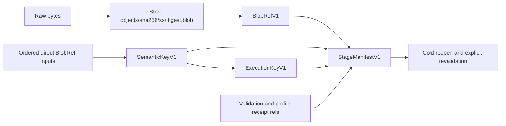

# `stwo_artifact_store`

`stwo_artifact_store` is the host-neutral persistent artifact substrate for
long-running, restartable proving pipelines. It stores immutable raw bytes once,
names them by SHA-256, and keeps semantic work identity separate from execution
policy and verifier evidence.

| Property | Value |
| :--- | :--- |
| Version | `0.1.0` |
| Layer | `service` |
| Owner | `artifact-store` |
| Public Zig module | `stwo_artifact_store` |
| Focused CI host | Linux |

The [package contract](package.contract.json) and [facade](mod.zig) define the
stable boundary. The Metal session package consumes this package through a thin
adapter instead of maintaining a second cache implementation.

## Purpose and architecture



The `Store` publishes a temporary file only after the file is synchronized,
then hard-links it into a digest-sharded namespace and synchronizes the target
directory. Two processes may race to publish identical content; both converge
on one raw object. A conflicting pre-existing digest name fails closed.
`openOrCreate` performs bounded directory setup and lazily opens only requested
digest paths; it never rehashes the whole workspace at startup. Explicit
`auditAndRebuildIndex` maintenance reopens and hashes every canonical object.
`initNew` retains the exclusive owner-thread behavior needed by the established
Metal process.

`BlobRefV1` preserves `ArtifactKindV1`, format version, native schema version,
byte count, and SHA-256. Empty blobs are valid because captured stdout or stderr
may be empty. A proof-specific validator, rather than the raw store, decides
whether an empty payload is meaningful.

`SemanticKeyV1` binds `StageKindV1`, a stable campaign namespace, local task
identity, protocol, program, profile, PCS, security, statement, provider,
layout, registry, semantic options, and ordered role-tagged `InputRefV1` values.
It never binds paths, timestamps, power source, worker count, or a whole campaign
inventory. `ExecutionKeyV1` additionally binds producer, verifier, source,
executable, toolchain, backend, optimization, `worker_policy_identity`, and
`memory_policy_identity`, plus explicit build, retention, and timeout policy
identities. Output content SHA remains distinct from both keys.

## Public API

```zig
const artifacts = @import("stwo_artifact_store");

var store = try artifacts.Store.openOrCreate(allocator, absolute_root, false);
defer store.deinit();
const blob = try store.putBytes(.proof_artifact, 1, proof_bytes);
var reopened = try store.openBlob(blob, .proof_artifact, 1, maximum_bytes);
defer reopened.deinit(allocator);
```

The primary value types are `Digest`, `ArtifactKindV1`, `BlobRefV1`,
`InputRoleV1`, `InputRefV1`, `StageKindV1`, `SemanticKeyFieldsV1`,
`SemanticKeyV1`, `ExecutionKeyFieldsV1`, `ExecutionKeyV1`,
`StageManifestFieldsV1`, `StageManifestV1`, `StagePhaseV1`, and
`StageStatusV1`. Typed evidence uses `ValidationReceiptRefV1` and
`ProfileReceiptRefV1`.

Owned decode and store values are `OwnedSemanticKeyV1`,
`OwnedStageManifestV1`, `OwnedBlobV1`, and `Snapshot`; callers must invoke the
documented deinitializer. Compatibility and measurement exports are
`CopyMethod`, `IngestPolicy`, `ObjectRef`, `FileIdentity`, `Measurement`,
`measureFile`, and `digestBytes`. Exact wire entrypoints are
`decodeSemanticKeyAlloc`, `decodeExecutionKey`, and
`decodeStageManifestAlloc`. The lower-level modules `encoding`, `types`,
`manifest`, `wire`, and `store` are exposed for typed adapters.

## Dependencies

This package has no first-party package dependency and uses only Zig standard
library facilities. It deliberately contains no frontend, prover, verifier,
Metal, CUDA, recursive AIR, controller, or Python policy. Consumers project
their native kind and schema into `BlobRefV1` without renumbering them.

## Build, test, and run

From the repository root, run exactly:

```sh
zig build test --build-file src/artifact_store/build.zig -Doptimize=Debug -j2
```

The package is a library rather than a standalone pipeline worker. Future
workers should return the Zig-sealed key and manifest bytes in one response;
external controllers consume those bytes and must not implement a parallel key
algorithm.

## Contract and invariants

- A digest or durable receipt is evidence and an index, never cryptographic
  admission and never a serializable fresh verifier capability.
- A new process cold-opens and revalidates receipt bytes. A live verifier may
  separately reuse an owned lease.
- Validator version changes alter the manifest and trigger revalidation, but do
  not change the reusable proof semantic key by themselves.
- Semantic inputs are ordered direct dependencies. A legacy whole-plan identity
  belongs in a remintable validation envelope.
- Canonical decoders reject truncation, trailing bytes, duplicate input roles,
  wrong format, invalid kind or schema, and malformed receipt types.
- Content publication is immutable, process-safe, rehashed on cold open, and
  independent of artifact interpretation.

## Change checklist

1. Preserve the fixed 48-byte `BlobRefV1` field order and numeric kind registry.
2. Add a golden vector before changing a key or manifest encoding.
3. Keep validator and profile receipt identities outside `SemanticKeyV1`.
4. Test cold reopen, corruption, collision, concurrent publication, and every
   allocation failure for new owned decoding paths.
5. Update the Metal adapter and cross-language sealed-manifest consumer together.

## Related documentation

- [Metal session adapter](../tools/metal_session/README.md)
- [Package release policy](../../conformance/zig-package-release-policy.md)
