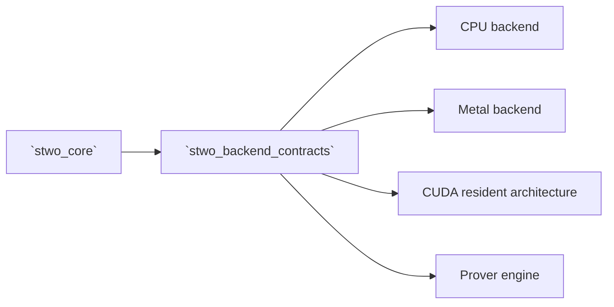

# `stwo_backend_contracts`

`stwo_backend_contracts` defines the compile-time capabilities that prover
implementations may request from a compute backend. It is the abstraction
boundary between proof orchestration and CPU, Metal, or other backend
implementations; it contains contracts, not a working backend.

| Property | Value |
| :--- | :--- |
| Version | `0.1.0` |
| Layer | `contract` |
| Owner | `backend-contracts` |
| Public Zig module | `stwo_backend_contracts` |
| Focused CI host | Linux |

See the [package contract](package.contract.json) for the exact dependency and
API ledger and [mod.zig](mod.zig) for the public facade.

## Purpose and boundaries

The package makes backend claims explicit and compile-time checked:

- every backend declares column storage and a `Capabilities` value;
- required proof paths validate the typed Merkle contract;
- optional host batch inversion and backend FRI folding are opt-in;
- claiming an optimization validates its concrete function signature; and
- not claiming an optimization requires the corresponding operation to be
  absent, preventing placeholders from masquerading as capabilities.

It does not implement CPU arithmetic, initialize a GPU runtime, or orchestrate
a proof. Concrete work lives in backend packages and
`stwo_prover_engine`.



## Public API

```zig
const contracts = @import("stwo_backend_contracts");
const cpu = @import("stwo_cpu_backend");

comptime {
    contracts.assertBackend(cpu.CpuBackend);
}
```

| Area | Exports |
| :--- | :--- |
| Top-level checks | `assertBackend`, `assertBackendForChannel` |
| Core types | `Capabilities`, `Column` |
| Storage contracts | `column`, `resident_storage`, `secure_column`, `arena_plan` |
| Operation contracts | `field_ops`, `fri_ops`, `line_evaluation`, `merkle_ops`, `recovery` |
| Proof-program contract | `proof_program` |
| Capability definitions | `capabilities` |

Use `assertBackend` for the minimum backend contract and
`assertBackendForChannel` when a proof path also needs a typed Merkle hasher and
channel combination. Both execute at compile time.

## Dependencies

The only first-party dependency is:

- `stwo_core` — shared field, proof, PCS, and commitment types used in
  signatures.

The package must never depend on a concrete backend or the prover engine.

## Build, test, and run

From the repository root:

```sh
zig build test --build-file src/backend/build.zig -Doptimize=ReleaseFast -j2
```

This is a contract library and has no executable. To exercise it, compile a
concrete backend package or a product that instantiates the prover engine.

## Contract and invariants

The focused contract anchors are:

- API signature: a truthful minimum capability set is accepted.
- Behavioral invariant: the Native AIR proof-program contract rejects
  unbound or internally inconsistent ingress.

Tests should cover both sides of capability admission. A new capability is not
complete until a valid implementation compiles and missing, misspelled, or
incorrectly typed implementations fail at compile time.

## Change checklist

1. Treat capability changes as public API changes.
2. Keep optional operations absent when their capability bit is false.
3. Test positive and negative compile-time shapes.
4. Update every affected backend contract and its package API ledger.
5. Run this package test plus `python3 scripts/check_package_workspace.py`.

## Related documentation

- [Backend capability implementation audit](../../conformance/2026-07-28-zig-package-workspace-release-audit.md)
- [Protocol core package](../core/README.md)
- [Stable prover API](../prover_api/README.md)
- [Prover engine](../prover/README.md)
- [Package release policy](../../conformance/zig-package-release-policy.md)
