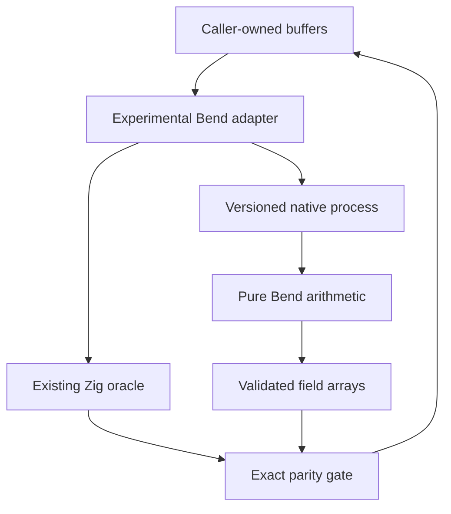

# `stwo_bend_backend`

| Fact | Value |
|---|---|
| Version | `0.1.0` |
| Layer | `backend` |
| Owner | `bend-experiment` |
| Focused CI host | Linux |

## Purpose

Experimental Bend compute backend, isolated from PR #198.

Base: `1358234f1e8a2ac34241658dcd3505bad5feb1fc`, PR #198.

## Contract and hypothesis

Bend owns arithmetic on arrays, not protocol decisions, commitments, storage,
Fiat-Shamir, recursive AIR, or verification. The first bridge is a bounded native
subprocess: Zig supplies canonical M31 values and exact twiddles, Bend returns
canonical values, and the experiment requires equality against Zig before
retaining measurements. Inputs/outputs are caller-owned; the child owns and
releases its tree heap on exit. Process startup, serialization, and copies are
part of end-to-end latency, separate from arithmetic timing. No hidden fallback
is permitted in evidence.

Hypothesis: balanced independent recursive transforms expose useful Bend CPU/GPU
parallelism despite tree allocation and U32-only multiplication overhead. Compare
with the existing fused Zig/SIMD transform, not an invented scalar baseline.
Success means exact parity first, then lower measured latency or useful scaling;
failure means retain the negative result and leave production selection disabled.
The tree formulation uses O(n log n) arithmetic and O(n) live data per column,
with allocation traffic measured separately from flat-buffer logical bytes.

The experimental transport must validate version, operation, size, canonical
field values, output length, and child exit status. Missing binaries and malformed
outputs are errors, not a CPU fallback. CPU results do not qualify Metal/CUDA.
Benchmarks are arithmetic experiments, not verified-proof throughput claims.

PR #198's retained parent phase measurements motivate an independent-prefix
experiment after FFT/FRI. A prefix kernel alone does not replace tuple projection
or the full typed interaction program. The original measurements must remain
source-pinned and must not be presented as measurements of this branch.

## Public API

`BendBackend` (called with an explicit config) produces a proving backend with
`circle_transform`, `fri_folding` and `fri_multi_fold` enabled and
`transformCircleBuffers` plus the existing interpolate/evaluate/combined-LDE
hooks. The new contract formalizes one core-only `!void` primitive; higher-level
hooks retain existing prover execution receipts. This avoids introducing a
backend-contract dependency on the prover engine or changing Metal's APIs.
`CpuBackend` implements the same primitive without changing its PCS scheduling.

`abi` is the versioned little-endian array transport. `runtime` manages the native
child and validates its response. `circle` serializes exact Circle twiddle plans
and checks results. `fri` implements checked line/circle/multi-fold adapters. Keeping the core oracle
call boundary explicit with `@call(.never_inline, ...)` removes the observed
ReleaseFast discrepancy in the retained fixtures; core arithmetic is unchanged.
Host `MerkleTree` and commit hooks satisfy the full prover contract.
`BendBackendWithHost` injects host composition services at the integration layer.
Resident GPU storage is not provided. A configured backend always executes Bend; it never silently substitutes
CPU results. The subsequent Zig parity computation is deliberate validation cost.

```zig
const bend = @import("stwo_bend_backend");
const B = bend.BendBackend(.{
    .executable = "/absolute/path/to/stwo-bend",
    .threads = 8,
});
// B.transformCircleBuffers(allocator, buffers, domain, twiddles, .evaluate)
```

## Dependencies

`stwo_core` supplies field/domain types and the FRI oracle.
`stwo_backend_contracts` owns capability validation.
`stwo_prover_engine` supplies the existing optimized Circle oracle and receipts.
The optional native runner requires Node, the exact Bend checkout in
`bend/toolchain.json`, and clang 14+ for CPU. Zig 0.15.2's clang was used here.
No generated C, binary, downloaded toolchain or new third-party source is committed.

## Architecture



The foreign C shim only constructs runtime values and handles IO. Its internal
allocation/tag assumptions are compiler-version-specific, so the build rejects
a different or dirty Bend toolchain. All arithmetic lives in Bend. A subprocess
boundary is intentional until the computation shows value and a stable embedding
ABI exists. Current multi-column execution starts one process per column; it is
not a fused or resident batch benchmark.

## Build, test, and run

Run from the repository root with Zig 0.15.2 on PATH:

```sh
zig build test --build-file src/backends/bend/build.zig -Doptimize=ReleaseSafe -j2
zig build --build-file src/backends/bend/build.zig -Doptimize=ReleaseFast -j2
python3 scripts/build_bend_experiment.py --bend-root /path/to/pinned/bend
zig build test-integration --build-file src/backends/bend/build.zig -Doptimize=ReleaseSafe -Dbend-executable=/absolute/path/to/stwo-bend -j2
python3 autoresearch/benchmarks/bend_circle_fft.py --bend .zig-cache/bend/stwo-bend --oracle src/backends/bend/zig-out/bin/bend-oracle --output /tmp/bend-matrix.json
```

The build script checks `PROOF.bend`, retains generated C under the chosen output
path and writes compiler/source/binary provenance. `--target gpu` emits the same
arithmetic with a GPU call and refuses missing-device CPU fallback. Metal/CUDA
compilation and execution have not been tested here; no GPU performance is claimed.
Use `bend_fri.py` and `bend_interactions.py` for the separate experimental lanes.

## Contract and invariants

The request is bounded to log24 M31 words (FRI therefore at most log22 QM31
values), canonical little-endian u32 residues, exact lengths and no trailing data.
Twiddles are host-precomputed and supplied in recursive preorder. The last Circle
layer uses the existing y/-y/-x/x ordering, not ordinary multiplicative FFT roots.
IFFT includes inverse-size normalization. 2x LDE zero-pads coefficients before
forward evaluation. Runtime failures and mismatches are errors. A failing batch
may have completed earlier columns; callers must discard the operation on error.

The native process owns its temporary heap; the Zig caller owns inputs, outputs,
serialization and validation allocations. Current bridge calls block and support
only trusted pinned binaries. The Python search harness enforces a per-child
60-second deadline; the direct Zig bridge has no cancellation/deadline yet and is
not suitable for untrusted candidates or production service admission.

U32 M31 multiplication splits canonical residues into 16/15-bit limbs. Each low
product fits U32; cross products individually fit 31 bits, are field-added before
31-bit rotation by 16, and the high product is doubled using 2^32 = 2 modulo p.
All additions are bounded below 2^32. The seven Bend laws prove named boundary
examples, not universal arithmetic correctness. Millions of differential values
are useful evidence but do not replace a universal proof or the repository's
pinned Rust oracle gate.

## Change checklist

- Keep protocol, transcript, claim binding, recursive AIR and verification untouched.
- Run compiler laws, backend contracts, runtime rejection tests and native parity.
- Freeze oracle, transport and workload digests for algorithm search.
- Retain failures, raw samples, exact timing scopes and actual execution lanes.
- Qualify Rust parity, GPU execution, cancellation and ownership before promotion.

## Related documentation

See [retained results](../../../vectors/reports/bend-pr198/README.md),
[search environment](../../../autoresearch/environments/bend_circle_fft/README.md),
and [PR #198](https://github.com/teddyjfpender/stwo-zig/pull/198).

## Second optimization pass

[Pass-two evidence](../../../vectors/reports/bend-pr198/pass2/README.md) retains
log22/log24 measurements, paired baseline comparisons, and end-to-end FFT/IFFT/2x
LDE backend calls. Flat leaf loops, bounded transform fusion and chunked scans
reduce split/join allocation. Arithmetic remains Bend source; generated C is
unchanged by hand. This is an explicitly expanded experiment, not admission under
the original two-file autoresearch surface. Full-proof throughput remains unmeasured.

## Complete proof integration

The [RISC-V Bend integration](../../integrations/riscv_bend/README.md) binds this
backend to real CSP proofs. Circle FFT/IFFT, exact 2x LDE and FRI run in Bend;
host commitment and composition services are explicit. All numerical parity
checks remain enabled. Config `.persistent = true` reuses one serialized child
for up to 65,536 requests; call `runtime.shutdown()` when work finishes.
Single-request mode remains the default. The persistent wire uses distinct
`BND2` magic so an old one-request binary fails rather than silently changing
framing. Input and output are buffered in 64 KiB blocks; IO contains no field
arithmetic. Direct calls still require a trusted binary; the proof harness kills
the process group on timeout. Exact 2x LDE skips its redundant first forward
layer, and FRI prepares inverses in one host batch instead of per point.
