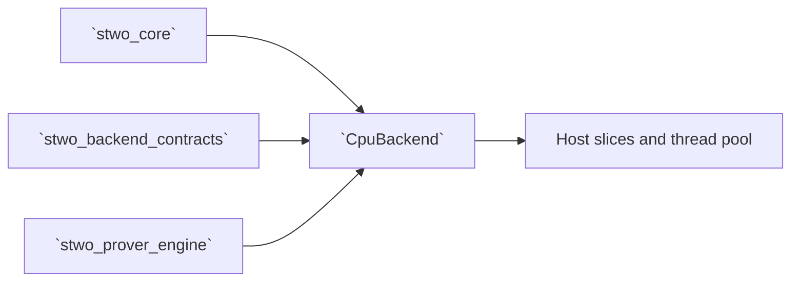

# `stwo_cpu_backend`

`stwo_cpu_backend` is the portable host-memory implementation of the generic
prover backend contract. Its zero-sized `CpuBackend` type selects scalar and
thread-pool implementations at compile time; columns remain ordinary Zig
slices owned by the caller or prover transaction.

| Property | Value |
| :--- | :--- |
| Version | `0.1.0` |
| Layer | `backend` |
| Owner | `cpu-backend` |
| Public Zig module | `stwo_cpu_backend` |
| Focused CI host | Linux |

See [package.contract.json](package.contract.json) for the enforced dependency
surface and [mod.zig](mod.zig) for the implementation facade.

## Purpose and execution model

- `CpuBackend.ColumnType(F)` is `[]F`.
- Field and polynomial operations execute on host memory.
- Merkle commitment work can use the prover's global `std.Thread.Pool`.
- The backend advertises host batch inversion, FRI folding, and multi-folding.
- Large commitment/composition paths reuse the prover worker pool and explicit
  caller-provided allocation.



This package does not own an application statement or CLI, and it is not a
fallback implementation for device backends. Metal and CUDA paths must fail
according to their own contracts rather than silently selecting `CpuBackend`.

## Public API

```zig
const contracts = @import("stwo_backend_contracts");
const cpu = @import("stwo_cpu_backend");

const Backend = cpu.CpuBackend;
comptime contracts.assertBackend(Backend);

const M31Column = Backend.ColumnType(@import("stwo_core").fields.m31.M31);
```

The sole top-level contractual export is `CpuBackend`. Its namespace provides
the column, field, interpolation, commitment, Merkle, FRI, recovery, and
optional profiling hooks consumed by `stwo_prover_engine`. Those methods are
backend protocol, not independent application entry points.

## Dependencies

- `stwo_core` — fields, domains, FRI, and proof types.
- `stwo_backend_contracts` — capability and signature validation.
- `stwo_prover_engine` — reusable scalar prover operations and worker-pool
  infrastructure.

The CPU backend must not import a frontend or integration package.

## Build, test, and run

From the repository root:

```sh
zig build test --build-file src/backends/cpu_scalar/build.zig -Doptimize=ReleaseFast -j2
```

There is no backend-only executable. To run the backend with Native workloads:

```sh
zig build stwo-native-cpu -Doptimize=ReleaseFast

zig-out/bin/stwo-zig-native-cpu prove \
  --example xor --log-size 12 --protocol functional \
  --proof-artifact-out proof.json
```

Frontend-specific CPU products, such as `stwo-cairo-cpu` and
`stwo-zig-riscv-cpu`, bind this backend through their integration packages.

## Contract and invariants

- API signature: `CpuBackend` satisfies the complete backend contract.
- Behavioral invariant: `batchInverse` delegates to the canonical field
  implementation and produces identical results.

For performance changes, retain scalar correctness as the oracle and verify
deterministic proof bytes. Threading must not change transcript order,
commitment order, or ownership.

## Change checklist

1. Keep every claimed capability backed by a real implementation.
2. Preserve plain-slice ownership and allocator symmetry.
3. Test single-threaded and worker-pool paths when scheduling changes.
4. Compare proof bytes and verification against the canonical scalar path.
5. Run this package, affected integration packages, and the release gate.

## Related documentation

- [Backend capability contracts](../../backend/README.md)
- [Prover engine](../../prover/README.md)
- [Native examples](../../examples/README.md)
- [Repository product guide](../../../README.md)
- [Package-workspace audit](../../../conformance/2026-07-28-zig-package-workspace-release-audit.md)
