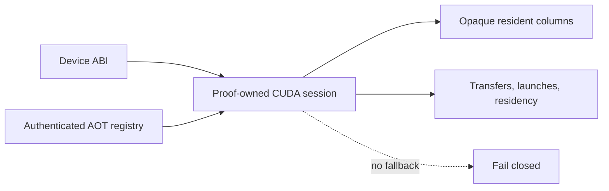

# `stwo_cuda_backend`

`stwo_cuda_backend` defines the resident NVIDIA CUDA runtime architecture,
strict-AOT registry, and device ABI. CUDA work is owned by a proof session:
device columns remain opaque, transfers are counted, and no CPU fallback API
exists.

| Property | Value |
| :--- | :--- |
| Version | `0.1.0` |
| Layer | `backend` |
| Owner | `cuda-backend` |
| Public Zig module | `stwo_cuda_backend` |
| Focused CI host | Linux |
| Product status | Staged; not released |

See [package.contract.json](package.contract.json) and the
[public facade](mod.zig) for the authoritative package boundary.

## Architecture and status



This is not the generic host-slice backend contract implemented by
`CpuBackend`. `CudaBackend` intentionally exposes only resident `Session` and
`Context` types plus two architectural declarations:
`resident = true` and `allows_cpu_fallback = false`.

The package has substantial staged implementation, but the repository product
matrix still marks CUDA products unavailable for production use. Do not
interpret package compilation or host-stub tests as device acceptance.

## Public API

```zig
const cuda = @import("stwo_cuda_backend");

const Session = cuda.CudaBackend.Session;
const Context = cuda.CudaBackend.Context;

comptime {
    if (!cuda.CudaBackend.resident) @compileError("resident CUDA required");
    if (cuda.CudaBackend.allows_cpu_fallback) @compileError("fallback forbidden");
}
```

| Area | Exports |
| :--- | :--- |
| Backend identity | `CudaBackend` |
| Device ABI | `abi` |
| Runtime | `runtime` |
| AOT ownership | `aot`, `product_aot` |
| Pinned embedded inputs | `upstream_sources` |

Application-specific request compilation belongs to Native or Cairo CUDA
integration packages, not this backend.

## Dependencies

- `stwo_backend_contracts` — architectural capability vocabulary.

The narrow dependency is deliberate. Protocol/frontends enter only through
integration packages so the resident runtime can be audited separately.

## Build, test, and run

Host-independent package tests use C stubs and do not require a GPU:

```sh
zig build test --build-file src/backends/cuda/build.zig -Doptimize=ReleaseFast -j2
```

There is no released backend-only process. The staged Linux product build is
registered as `stwo-native-cuda`, but it is unavailable unless every explicit
CUDA toolchain path and architecture option is supplied. Treat those builds as
engineering/device-acceptance work, not a production release.

## Contract and invariants

- API signature: the backend exposes resident session/context types only.
- Behavioral invariant: the public identity is resident, fail closed, has no
  `ColumnType`, and has no `fallback` declaration.

Real-device evidence must separately cover AOT identity, runtime/toolchain
identity, all transfer and launch accounting, zero fallback, deterministic
proofs, and independent verification.

## Change checklist

1. Do not add an implicit toolchain search or CPU fallback.
2. Keep device columns opaque outside the owning session.
3. Authenticate generated kernels and registry entries before launch.
4. Account for every host/device transfer, allocation, launch, and teardown.
5. Run host contract tests and the explicit Linux/NVIDIA acceptance scope.

## Related documentation

- [Backend contracts](../../backend/README.md)
- [Native CUDA integration](../../integrations/native_cuda/README.md)
- [Cairo CUDA integration](../../integrations/cairo_cuda/README.md)
- [CUDA system architecture goal](../../../conformance/2026-07-24-cuda-system-architecture-goal.md)
- [Repository product status](../../../README.md#product-support)
