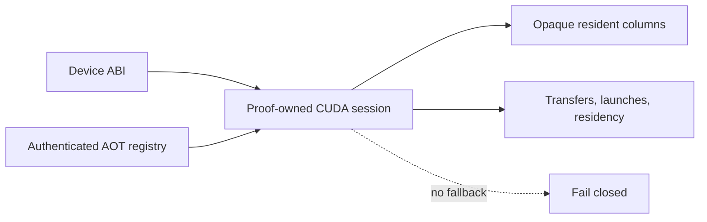

# `stwo_cuda_backend`

`stwo_cuda_backend` defines the resident NVIDIA CUDA runtime architecture,
strict-AOT registry, and device ABI. CUDA work is owned by a proof session:
device columns remain opaque, transfers are counted, and no CPU fallback API
exists.

| Property | Value |
| :--- | :--- |
| Version | `0.1.0` |
| Layer | `backend` |
| Owner | `cuda-backend` |
| Public Zig module | `stwo_cuda_backend` |
| Focused CI host | Linux |
| Product status | Staged; not released |

See [package.contract.json](package.contract.json) and the
[public facade](mod.zig) for the authoritative package boundary.

## Architecture and status



This is not the generic host-slice backend contract implemented by
`CpuBackend`. `CudaBackend` intentionally exposes only resident `Session` and
`Context` types plus two architectural declarations:
`resident = true` and `allows_cpu_fallback = false`.

The package has substantial staged implementation, but the repository product
matrix still marks CUDA products unavailable for production use. Do not
interpret package compilation or host-stub tests as device acceptance.

## Public API

```zig
const cuda = @import("stwo_cuda_backend");

const Session = cuda.CudaBackend.Session;
const Context = cuda.CudaBackend.Context;

comptime {
    if (!cuda.CudaBackend.resident) @compileError("resident CUDA required");
    if (cuda.CudaBackend.allows_cpu_fallback) @compileError("fallback forbidden");
}
```

| Area | Exports |
| :--- | :--- |
| Backend identity | `CudaBackend` |
| Device ABI | `abi` |
| Runtime | `runtime` |
| AOT ownership | `aot`, `product_aot` |
| Pinned embedded inputs | `upstream_sources` |

Application-specific request compilation belongs to Native or Cairo CUDA
integration packages, not this backend.

## Frontend integration state

The backend boundary is partly generic, but it is not yet a complete frontend
plug-in surface. Frontends can emit the backend-neutral `ProofProgram`, and the
CUDA backend compiles that into a target-bound `CudaPlan`. Kernel selection,
statement binding, and several execution controllers are still owned by the
individual integration packages.

| Frontend | CUDA state |
| :--- | :--- |
| Native examples | NVIDIA staged; Native CuMetal wide-Fibonacci proof/verify gate qualified locally |
| Cairo | Staged on NVIDIA; CuMetal fails closed pending AOT and proof parity |
| RISC-V | CuMetal/NVIDIA fail closed pending authenticated AOT and proof parity |
| SM83 | No CUDA product descriptor |

The AOT half of the reusable boundary is now explicit:
`aot/native/product_sets.json` maps each frontend to its exact authenticated
sets. The builder accepts only that mapping. Native and Cairo select distinct
catalogues, while RISC-V and SM83 fail closed as unavailable. A frontend still
supplies its trace/constraint programs and statement binding through an
integration package; the backend owns residency, PCS stages, scheduling,
telemetry, strict-AOT loading, and teardown.

## Dependencies

- `stwo_backend_contracts` — architectural capability vocabulary.

The public `CuMetalBackend` binds the same resident session architecture to the
Apple-GPU translation provider, and `frontend_contract` is the shared formal
admission seam used by Native, Cairo, and RISC-V integrations. Provider tags
are part of plan keys and receipts, so CuMetal evidence cannot alias NVIDIA
CUDA evidence.

The narrow dependency is deliberate. Protocol/frontends enter only through
integration packages so the resident runtime can be audited separately.

## Build, test, and run

Host-independent package tests use C stubs and do not require a GPU:

```sh
zig build test --build-file src/backends/cuda/build.zig -Doptimize=ReleaseFast -j2
```

There is no released backend-only process. The staged Linux product build is
registered as `stwo-native-cuda`, but it is unavailable unless every explicit
CUDA toolchain path and architecture option is supplied. Treat those builds as
engineering/device-acceptance work, not a production release.

### Apple Silicon portability development

[CuMetal](https://github.com/Lulzx/cuda-metal) is useful as an optional,
source-first portability and correctness screen on Apple Silicon. It is not a
CUDA product target and must not satisfy NVIDIA acceptance or performance
gates. In particular, translated Metal timing says nothing reliable about
NVIDIA occupancy, memory hierarchy, graphs, or launch behavior.

The checked 2026-08-04 audit pins CuMetal 0.1.3 commit
`e88dd103bddaff9a134913dec4bd8439817d160c` plus the repository's authenticated
compatibility patch. All 33 maintained Native runtime translation units meet
the recorded translation floor; two use their existing host-parity
bit-reversal definition. The patch identity is included in every build plan and
receipt, so an unpatched or differently patched checkout fails closed.

The repository-owned execution corpus compiles the actual
`constraints/powers.cu`, runs it on the Apple GPU, and compares 32 QM31 powers
with an independent host oracle. The audit accepts it only when CuMetal reports
an Apple-GPU launch, the exact numerical marker is present, and neither fallback
nor a stub appears in provenance.

`cuda-cumetal-native-archive` builds the selected six-source authority closure,
all 33 Native runtime CUDA units, one host loader, and the 15-entry strict Native
AOT pack. Two small kernels—PoW search and query normalization—are exact
source-native Metal modules because CuMetal 0.1.3 cannot faithfully lower those
PTX forms. They retain the CUDA ABI, are hash-bound into the build identity, and
execute on the same resident Apple-GPU stream; they are not CPU fallbacks.

`run-native-cumetal-smoke` is the local Native integration gate. It constructs a
resident wide-Fibonacci proof through trace commitment, constraints, OODS,
quotient, FRI, PoW, decommitment, and proof assembly, asserts strict AOT and zero
fallback, then decodes and independently verifies the proof in Zig. This
qualifies that pinned workload and provider boundary, not every Native AIR and
not NVIDIA behavior.

CI checks the ledger's exact 33-source coverage without invoking CuMetal. The
translation and execution lanes remain intentionally opt-in and never enter a
product closure. On macOS, run them with an explicit CuMetal build:

```sh
zig build cuda-cumetal-portability \
  -Dcuda-cumetalc=/absolute/path/to/cumetalc \
  -Dcuda-cumetal-root=/absolute/path/to/cuda-metal

zig build cuda-cumetal-audit \
  -Dcuda-cumetalc=/absolute/path/to/cumetalc \
  -Dcuda-cumetal-root=/absolute/path/to/cuda-metal \
  -Dcuda-air-inspect=/absolute/path/to/air_inspect \
  -Dcuda-air-validate=/absolute/path/to/air_validate

zig build run-native-cumetal-smoke \
  -Dcuda-cumetal-clang=/absolute/path/to/clang \
  -Dcuda-cumetalc=/absolute/path/to/cumetalc \
  -Dcuda-cumetal-root=/absolute/path/to/cuda-metal \
  -Dcuda-cumetal-library=/absolute/path/to/libcumetal.dylib \
  -Dcuda-air-inspect=/absolute/path/to/air_inspect \
  -Dcuda-air-validate=/absolute/path/to/air_validate
```

`cuda-cumetal-ledger` validates the 33-source checked contract without CuMetal.
The portability and audit steps emit machine-readable cache receipts containing
tool, source, diagnostic, metallib, and execution-provenance hashes. Adding
translated outputs to source control, accepting a smaller floor, or using
translated timings as CUDA evidence is not permitted.

### Generated Cairo evaluation sources

The 33 recorded-witness bodies in the 48-entry Native catalogue are emitted by
Zig into a structured cache product from
`vectors/cairo/sn_pie_2_witness_programs.bin`. The generator reproduces every
checked source hash while retaining only the 15 maintained Native AOT sources.

The 271 exact SN2 Cairo evaluation bodies are likewise emitted into the build
cache from `vectors/cairo/sn_pie_2_composition.bin`. Checked manifests remain
the authentication pins, and an archive is rejected unless each generated
manifest matches exactly. Native archives select only the Native catalogue,
avoiding 271 unnecessary `nvcc` compilations per target SM.

The host-independent generator can be inspected directly with:

```sh
zig build cuda-cairo-eval-aot -Doptimize=ReleaseFast
zig build cuda-native-aot -Doptimize=ReleaseFast
```

## Contract and invariants

- API signature: the backend exposes resident session/context types only.
- Behavioral invariant: the public identity is resident, fail closed, has no
  `ColumnType`, and has no `fallback` declaration.

Real-device evidence must separately cover AOT identity, runtime/toolchain
identity, all transfer and launch accounting, zero fallback, deterministic
proofs, and independent verification.

## Change checklist

1. Do not add an implicit toolchain search or CPU fallback.
2. Keep device columns opaque outside the owning session.
3. Authenticate generated kernels and registry entries before launch.
4. Account for every host/device transfer, allocation, launch, and teardown.
5. Run host contract tests and the explicit Linux/NVIDIA acceptance scope.
6. Treat CuMetal as portability evidence only; never publish its timing as CUDA
   performance evidence.
7. Keep Cairo and RISC-V CuMetal execution unavailable until their explicit AOT,
   parity, and independent-verifier TODOs are closed.

## Related documentation

- [Backend contracts](../../backend/README.md)
- [Native CUDA integration](../../integrations/native_cuda/README.md)
- [Cairo CUDA integration](../../integrations/cairo_cuda/README.md)
- [CUDA system architecture goal](../../../conformance/2026-07-24-cuda-system-architecture-goal.md)
- [CUDA production qualification](../../../conformance/cuda-production-qualification-v1.md)
- [CUDA source authority](UPSTREAM.md)
- [Repository product status](../../../README.md#product-support)
