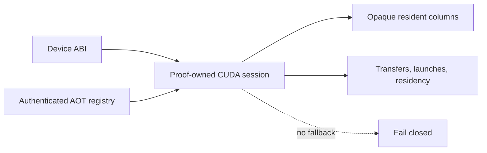

# `stwo_cuda_backend`

`stwo_cuda_backend` defines the resident NVIDIA CUDA runtime architecture,
strict-AOT registry, and device ABI. CUDA work is owned by a proof session:
device columns remain opaque, transfers are counted, and no CPU fallback API
exists.

| Property | Value |
| :--- | :--- |
| Version | `0.1.0` |
| Layer | `backend` |
| Owner | `cuda-backend` |
| Public Zig module | `stwo_cuda_backend` |
| Focused CI host | Linux |
| Product status | Staged; not released |

See [package.contract.json](package.contract.json) and the
[public facade](mod.zig) for the authoritative package boundary.

## Architecture and status



This is not the generic host-slice backend contract implemented by
`CpuBackend`. `CudaBackend` intentionally exposes only resident `Session` and
`Context` types plus two architectural declarations:
`resident = true` and `allows_cpu_fallback = false`.

The package has substantial staged implementation, but the repository product
matrix still marks CUDA products unavailable for production use. Do not
interpret package compilation or host-stub tests as device acceptance.

## Public API

```zig
const cuda = @import("stwo_cuda_backend");

const Session = cuda.CudaBackend.Session;
const Context = cuda.CudaBackend.Context;

comptime {
    if (!cuda.CudaBackend.resident) @compileError("resident CUDA required");
    if (cuda.CudaBackend.allows_cpu_fallback) @compileError("fallback forbidden");
}
```

| Area | Exports |
| :--- | :--- |
| Backend identity | `CudaBackend` |
| Device ABI | `abi` |
| Runtime | `runtime` |
| AOT ownership | `aot`, `product_aot` |
| Pinned embedded inputs | `upstream_sources` |

Application-specific request compilation belongs to Native or Cairo CUDA
integration packages, not this backend.

## Frontend integration state

The backend boundary is partly generic, but it is not yet a complete frontend
plug-in surface. Frontends can emit the backend-neutral `ProofProgram`, and the
CUDA backend compiles that into a target-bound `CudaPlan`. Kernel selection,
statement binding, and several execution controllers are still owned by the
individual integration packages.

| Frontend | CUDA state |
| :--- | :--- |
| Native examples | Staged product with resident integration packages |
| Cairo | Staged, partial resident product; production admission remains closed |
| RISC-V | Explicitly unavailable until a parity-gated adapter exists |
| SM83 | No CUDA product descriptor |

The next reusable boundary is a per-frontend kernel catalog and binding
contract: a frontend should supply authenticated trace/constraint programs and
statement bindings, while the backend continues to own residency, PCS stages,
scheduling, telemetry, and teardown. Native and Cairo now select distinct
authenticated AOT sets; the remaining work is to expose the same catalog and
binding contract to new frontend adapters.

## Dependencies

- `stwo_backend_contracts` — architectural capability vocabulary.

The narrow dependency is deliberate. Protocol/frontends enter only through
integration packages so the resident runtime can be audited separately.

## Build, test, and run

Host-independent package tests use C stubs and do not require a GPU:

```sh
zig build test --build-file src/backends/cuda/build.zig -Doptimize=ReleaseFast -j2
```

There is no released backend-only process. The staged Linux product build is
registered as `stwo-native-cuda`, but it is unavailable unless every explicit
CUDA toolchain path and architecture option is supplied. Treat those builds as
engineering/device-acceptance work, not a production release.

### Apple Silicon portability development

[CuMetal](https://github.com/Lulzx/cuda-metal) is useful as an optional,
source-first portability and correctness screen on Apple Silicon. It is not a
CUDA product target and must not satisfy NVIDIA acceptance or performance
gates. In particular, translated Metal timing says nothing reliable about
NVIDIA occupancy, memory hierarchy, graphs, or launch behavior.

The 2026-08-04 audit against CuMetal commit
`e88dd103bddaff9a134913dec4bd8439817d160c` found:

| Source population | Strict compile coverage |
| :--- | ---: |
| Maintained Native CUDA translation units | 17 / 33 |
| Native AOT translation units | 31 / 48 |
| Generated Cairo evaluation translation units | 221 / 271 |

The maintained QM31 power-expansion kernel also passed an exact numerical
Apple-GPU execution probe. Unsupported paths failed closed. The largest common
gap was CuMetal lowering of `__nv_brev`; other gaps included funnel shifts,
shared atomics, CUB, and incomplete runtime constants. The checked ledger below
preserves those gaps. The numerical probe remains audit evidence, rather than a
gate, until its CuMetal execution harness is repository-owned and reproducible.

The local maintained-device-code floor is intentionally outside CI and never
enters a product closure. On macOS, run it with an explicit CuMetal build:

```sh
zig build cuda-cumetal-portability \
  -Dcuda-cumetalc=/absolute/path/to/cumetalc
```

The CuMetal 0.1.3 compatibility ledger covers all 33 maintained translation
units: 17 translate unchanged, and two trace units translate through their
existing host-parity bit-reversal implementation. The remaining 14 blockers are
recorded by category: CUDA runtime API coverage (5), funnel shifts (4), shared
atomics (2), CUB (1), 64-bit `atomicMin` (1), and bit reversal (1). The positive
step therefore translates 19 units to validated Metal libraries in Zig's build
cache without changing the NVIDIA production path. Adding translated outputs
to source control, accepting a smaller floor, or using translated timings as
CUDA evidence is not permitted.

### Generated Cairo evaluation sources

The 271 exact SN2 Cairo evaluation bodies are emitted by Zig into the build
cache from `vectors/cairo/sn_pie_2_composition.bin`; they are not maintained
source files. The checked-in `aot_manifest.json` remains the authentication pin,
and a Cairo CUDA archive is rejected unless the generated manifest matches it
exactly. Native CUDA archives select only the 48 Native AOT entries, avoiding
271 unnecessary `nvcc` compilations per target SM.

The host-independent generator can be inspected directly with:

```sh
zig build cuda-cairo-eval-aot -Doptimize=ReleaseFast
```

## Contract and invariants

- API signature: the backend exposes resident session/context types only.
- Behavioral invariant: the public identity is resident, fail closed, has no
  `ColumnType`, and has no `fallback` declaration.

Real-device evidence must separately cover AOT identity, runtime/toolchain
identity, all transfer and launch accounting, zero fallback, deterministic
proofs, and independent verification.

## Change checklist

1. Do not add an implicit toolchain search or CPU fallback.
2. Keep device columns opaque outside the owning session.
3. Authenticate generated kernels and registry entries before launch.
4. Account for every host/device transfer, allocation, launch, and teardown.
5. Run host contract tests and the explicit Linux/NVIDIA acceptance scope.
6. Treat CuMetal as portability evidence only; never publish its timing as CUDA
   performance evidence.

## Related documentation

- [Backend contracts](../../backend/README.md)
- [Native CUDA integration](../../integrations/native_cuda/README.md)
- [Cairo CUDA integration](../../integrations/cairo_cuda/README.md)
- [CUDA system architecture goal](../../../conformance/2026-07-24-cuda-system-architecture-goal.md)
- [Repository product status](../../../README.md#product-support)
