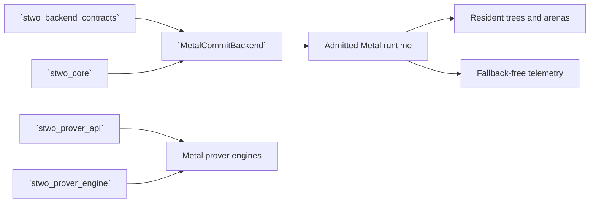

# `stwo_metal_backend`

`stwo_metal_backend` implements the Apple Metal commitment and prover-engine
path. It owns runtime admission, device trees, arena planning, shader/source
identity, telemetry, recovery, and the typed Metal engine bindings. It does not
depend on the CPU backend and does not permit a CPU commitment fallback.

| Property | Value |
| :--- | :--- |
| Version | `0.1.0` |
| Layer | `backend` |
| Owner | `metal-backend` |
| Public Zig module | `stwo_metal_backend` |
| Focused CI host | macOS |

The exact surface and dependency graph are in
[package.contract.json](package.contract.json); [mod.zig](mod.zig) is the
public facade.

## Architecture



The package distinguishes protocol behavior from runtime policy:

- `Runtime` owns Metal device/library admission and command execution.
- `MetalCommitBackend` satisfies the generic commitment capability contract.
- `MetalProverEngine` and `PlainMetalProverEngine` bind engine protocol types.
- arena, recipe, source-contract, and shader manifests make generated work
  reviewable and identity-bound.
- telemetry and lifecycle snapshots expose what actually executed.

Runtime initialization and execution fail closed. A missing device, rejected
source/AOT identity, or kernel failure is an error—not permission to enter the
CPU backend.

## Public API

```zig
const metal = @import("stwo_metal_backend");
const contracts = @import("stwo_backend_contracts");

comptime contracts.assertBackend(metal.MetalCommitBackend);
const Engine = metal.PlainMetalProverEngine;
```

| Area | Exports |
| :--- | :--- |
| Runtime and storage | `Runtime`, `Tree`, `runtime`, `shared_runtime`, `arena_plan` |
| Commitments | `MetalCommitBackend`, `MetalMerkleTree`, `commit_backend`, `merkle_tree`, `commit_policy` |
| Proving | `MetalProverEngine`, `PlainMetalProverEngine`, `prover_engine`, `protocol_recipes`, `recipes` |
| Reliability | `recovery`, `telemetry`, `source_contract` |
| Generated/device assets | `shaders` |

Prefer the typed engine or an integration package over reaching into runtime
submodules. Low-level runtime APIs require explicit lifecycle, ownership, and
telemetry handling.

## Dependencies

- `stwo_core`
- `stwo_backend_contracts`
- `stwo_prover_api`
- `stwo_prover_engine`

There is intentionally no `stwo_cpu_backend` dependency.

## Build, test, and run

The owner-local test step requires macOS and the Apple Metal SDK. It compiles
the public and deep test roots with Foundation, Metal, Objective-C, and libc:

```sh
zig build test --build-file src/backends/metal/build.zig -Doptimize=ReleaseSafe -j2
```

Device execution is validated through assembled products:

```sh
zig build stwo-native-metal -Doptimize=ReleaseFast
zig build test-native-metal -Doptimize=ReleaseFast
```

The Cairo authenticated-AOT path additionally requires a full-Xcode producer
host or a previously retained, revalidated AOT bundle. See the
[repository Cairo instructions](../../../README.md#cairo-frontend).

## Contract and invariants

- API signature: `MetalCommitBackend` satisfies the declared capability
  contract.
- Behavioral invariant: telemetry can be inspected without constructing a
  runtime.

Device acceptance must additionally establish runtime identity, zero completed
fallbacks, deterministic proof bytes, bounded residency, and successful
independent verification.

## Change checklist

1. Preserve the no-CPU dependency and fail-closed behavior.
2. Bind generated shaders and AOT artifacts to canonical identities.
3. Keep runtime lifecycle and allocations explicit and rollback-safe.
4. Update telemetry when adding a transfer, launch, cache, or fallback-relevant
   path.
5. Run source checks plus real-device product acceptance on macOS.

## Related documentation

- [Backend contracts](../../backend/README.md)
- [Metal session service](../../tools/metal_session/README.md)
- [Cairo Metal integration](../../integrations/cairo_metal/README.md)
- [RISC-V Metal integration](../../integrations/riscv_metal/README.md)
- [Package-workspace audit](../../../conformance/2026-07-28-zig-package-workspace-release-audit.md)
