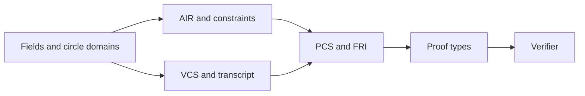

# `stwo_core`

`stwo_core` is the backend-independent protocol and verifier foundation of
stwo-zig. It owns field arithmetic, circle domains, commitments, FRI/PCS proof
types, transcript primitives, AIR interfaces, and verification. It deliberately
contains no prover orchestration and has no dependency on a compute backend.

| Property | Value |
| :--- | :--- |
| Version | `0.1.0` |
| Layer | `protocol` |
| Owner | `protocol-core` |
| Public Zig module | `stwo_core` |
| Focused CI host | Linux |

The [package contract](package.contract.json) is the machine-readable authority
for this package. The [public facade](mod.zig) is its only primary module root.

## Purpose and boundaries

This package is responsible for:

- the M31, CM31, and QM31 field tower and circle-domain geometry;
- transcript channels, proof-of-work, Merkle commitments, PCS, and FRI;
- AIR and constraint-evaluation interfaces shared by provers and verifiers;
- canonical proof data structures and backend-independent verification; and
- low-level vector helpers shared across protocol layers.

It does **not** select a backend, construct a prover engine, own a VM frontend,
or define an application statement. Those responsibilities belong to the
backend, engine, frontend, and integration packages.



## Public API

Consumers import the package by its declared module name:

```zig
const core = @import("stwo_core");

const M31 = core.fields.m31.M31;
const ColumnList = core.ColumnVec(M31);
const Proof = core.proof.StarkProof(core.vcs_lifted.blake2_merkle.Blake2sPrefixedMerkleHasher);
```

The contractually reviewed surface is grouped below.

| Area | Exports |
| :--- | :--- |
| Fields and domains | `fields`, `circle`, `fft`, `poly`, `fraction` |
| AIR and algebra | `air`, `constraint_framework`, `constraints`, `queries` |
| Commitments and transcript | `channel`, `crypto`, `proof_of_work`, `vcs`, `vcs_lifted` |
| Proof system | `pcs`, `fri`, `proof`, `proof_json`, `verifier`, `verifier_types` |
| Shared helpers | `ColumnVec`, `ComponentVec`, `utils`, `test_utils` |

`ColumnVec(T)` and `ComponentVec(T)` construct typed `std.ArrayList` wrappers.
Proof objects own nested allocations according to the deinitialization
contracts on their concrete types; callers should not copy an owning proof and
deinitialize both copies.

## Dependencies

`stwo_core` has no first-party package dependencies. This is enforced by its
manifest, contract, and the repository package-workspace checker. Adding a
backend, engine, frontend, or integration import here would invert the package
graph and is forbidden.

## Build, test, and run

Run commands from the repository root. The owner-local command both compiles
the public module and runs its focused and deep tests:

```sh
zig build test --build-file src/core/build.zig -Doptimize=ReleaseFast -j2
```

The root product build emits the focused library object:

```sh
zig build stwo-core -Doptimize=ReleaseFast
```

This is a library package, so it has no standalone process to run. Import
`stwo_core` into a consumer module, or use one of the assembled products
described in the [repository README](../../README.md).

## Contract and invariants

The package contract pins two representative review anchors:

- API signature: `ColumnVec` and `ComponentVec` preserve their element types.
- Behavioral invariant: component-vector flattening preserves component and
  column order.

The focused suite also covers field laws, domain operations, transcript
behavior, commitment verification, FRI, PCS, proof serialization, and negative
verification paths.

## Change checklist

When changing this package:

1. Keep the package free of first-party dependencies.
2. Add new public names to `api_surface` in
   [package.contract.json](package.contract.json).
3. Preserve verifier behavior independently of any concrete prover backend.
4. Add both positive and adversarial tests for protocol-visible changes.
5. Run the owner-local test command and `python3 scripts/check_package_workspace.py`.

## Related documentation

- [Repository architecture and product usage](../../README.md)
- [Package-workspace release audit](../../conformance/2026-07-28-zig-package-workspace-release-audit.md)
- [Package release and versioning policy](../../conformance/zig-package-release-policy.md)
- [API parity policy](../../conformance/api-parity.md)
