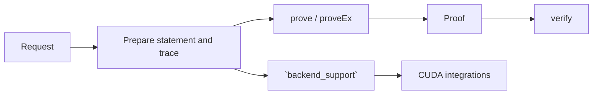

# `stwo_native_examples`

`stwo_native_examples` contains seven small, auditable AIR applications used to
exercise the complete proving stack: Blake, Plonk, Plonk with LogUp, Poseidon,
a state machine, wide Fibonacci, and XOR lookup. Each module owns its statement,
input preparation, proving entry points, and verification wrapper.

| Property | Value |
| :--- | :--- |
| Version | `0.1.0` |
| Layer | `example` |
| Owner | `native-examples` |
| Public Zig module | `stwo_native_examples` |
| Focused CI host | Linux |

See [package.contract.json](package.contract.json) and
[mod.zig](mod.zig) for the enforced public surface.

## Purpose and boundaries

Examples are production-quality protocol fixtures rather than throwaway demos.
They provide:

- compact end-to-end prover/verifier applications;
- parity vectors for Rust/Zig protocol comparison;
- representative lookup, permutation, hashing, and recurrence workloads; and
- narrow implementation hooks for concrete accelerator integrations.

They do not own a GPU runtime or product CLI. `backend_support` exposes named,
reviewable hooks so accelerator integrations do not cross package boundaries
through relative file imports.



## Public API

```zig
const examples = @import("stwo_native_examples");

const output = try examples.xor.prove(allocator, pcs_config, statement);
try examples.xor.verify(
    allocator,
    pcs_config,
    output.statement,
    output.proof,
);
```

Exact request and result signatures differ by workload. Each application
exports `prove`, a statement/request type, and a `verify` path; most also expose
`proveEx`, profiled, prepared-input, session, and backend-generic variants.
The verification wrappers consume their proof argument, including cleanup on
failure, so callers must not deinitialize that proof a second time.

| Export | Workload |
| :--- | :--- |
| `blake` | Exact Blake compression/scheduler proof |
| `plonk` | Plonk constraint example |
| `plonk_logup` | Plonk with LogUp interaction |
| `poseidon` | Poseidon permutation and lookup proof |
| `state_machine` | Transition and telescoping-statement proof |
| `wide_fibonacci` | Configurable-width recurrence |
| `xor` | XOR lookup argument |
| `backend_support` | Narrow implementation hooks for integrations |

## Dependencies

- `stwo_core`
- `stwo_prover_api`
- `stwo_prover_engine`
- `stwo_cpu_backend`
- `stwo_proof_wire`

Device packages consume the examples; examples do not depend on a device
backend.

## Build, test, and run

Focused package suite:

```sh
zig build test --build-file src/examples/build.zig -Doptimize=ReleaseFast -j2
```

Run examples through the released Native CPU product:

```sh
zig build stwo-native-cpu -Doptimize=ReleaseFast

zig-out/bin/stwo-zig-native-cpu prove \
  --example xor --log-size 12 --protocol secure \
  --proof-artifact-out proof.json

zig-out/bin/stwo-zig-native-cpu verify \
  --artifact proof.json --protocol secure
```

Use the CLI's `applications` command for the compiled workload and capability
registry.

## Contract and invariants

- API signature: every application module exposes a proving entry point.
- Behavioral invariant: the Poseidon prove/verify wrapper round-trips.

All examples must bind the statement, PCS configuration, and transcript
consistently. Prepared, backend-generic, and profiled variants must produce
proof-equivalent results.

## Change checklist

1. Keep statement validation separate from witness construction.
2. Preserve deterministic proof bytes across equivalent entry points.
3. Update CPU, wire, parity, and accelerator consumers together.
4. Add malformed-statement and inconsistent-proof tests.
5. Run package, protocol, and affected product tests.

## Related documentation

- [CPU backend](../backends/cpu_scalar/README.md)
- [Proof-wire codec](../interop/proof_wire/README.md)
- [Native CUDA integration](../integrations/native_cuda/README.md)
- [Repository prove guide](../../README.md#prove)
- [API parity policy](../../conformance/api-parity.md)
