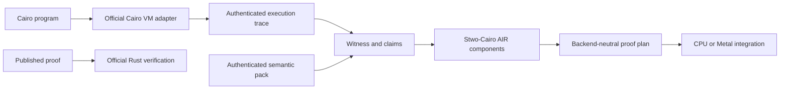

# `stwo_cairo_frontend`

`stwo_cairo_frontend` turns authenticated Cairo executions and
program-specific semantic artifacts into the statements, witnesses, claims,
and AIR components required for Stwo-Cairo proofs. It is backend neutral and
supports both CPU and authenticated Metal integrations.

| Property | Value |
| :--- | :--- |
| Version | `0.1.0` |
| Layer | `frontend` |
| Owner | `cairo-frontend` |
| Public Zig module | `stwo_cairo_frontend` |
| Focused CI host | Linux |

The exact surface is declared in
[package.contract.json](package.contract.json) and exported through
[mod.zig](mod.zig).

## Architecture



The frontend owns Cairo decoding, Felt252/CASM state, preprocessed data,
component claims, statement construction, witness scheduling, compact protocol
geometry, and proof planning. Backend runtime code and product CLI policy stay
outside this package.

## Public API

```zig
const cairo = @import("stwo_cairo_frontend");

const Felt252 = cairo.Felt252;
const CasmState = cairo.CasmState;
const ProverInput = cairo.ProverInput;

const receipt = try cairo.proveCairo(
    Backend,
    Oracle,
    allocator,
    &backend,
    &oracle,
    request,
);
```

| Area | Exports |
| :--- | :--- |
| Core data and adaptation | `common`, `Felt252`, `CasmState`, `adapter`, `ProverInput` |
| AIR and claims | `air`, `claim_generator`, `claim_registry`, `preprocessed` |
| Witness construction | `witness`, `witness_scheduler`, `arena_lifetime`, `staged_arena_planner` |
| Statements and geometry | `statement`, `statement_bootstrap`, `compact_protocol_geometry`, `compact_verifier_interchange` |
| Proving | `proving`, `proof`, `proof_plan`, `prove_trace`, `prover`, `proveCairo` |
| Authority and generation | `rust_oracle`, `conformance`, `codegen` |

`proveCairo` is the high-level generic facade. Production products normally use
the more explicit transaction modules in `stwo_cairo_cpu_integration` or
`stwo_cairo_metal_integration`.

## Dependencies

- `stwo_core`
- `stwo_backend_contracts`
- `stwo_prover_api`
- `stwo_prover_engine`

The frontend has no CPU, Metal, or CUDA backend dependency.

## Build, test, and run

The focused suite reads authenticated conformance vectors from the monorepo.
Its build file pins the test working directory to the repository root:

```sh
zig build test --build-file src/frontends/cairo/build.zig -Doptimize=ReleaseFast -j2
```

Build and run the released CPU product:

```sh
zig build stwo-cairo-cpu -Doptimize=ReleaseFast

zig-out/bin/stwo-cairo-cpu run-and-prove \
  --program program.executable.json \
  --program-type executable \
  --arguments arguments.json \
  --proof proof.json \
  --verify
```

The macOS authenticated-AOT product is built with
`zig build stwo-cairo-metal -Doptimize=ReleaseFast`.

## Contract and invariants

- API signature: the facade preserves statement and proving entry points.
- Behavioral invariant: the prover rejects a noncanonical official-Rust oracle
  identity.

The product gates extend this with admitted-program coverage, exact proof
transport behavior, CPU/Metal byte parity, zero-fallback telemetry, and
acceptance by the pinned official Rust verifier.

## Change checklist

1. Keep execution inputs and semantic packs authenticated and identity-bound.
2. Preserve the separation between frontend semantics and backend execution.
3. Update claim, statement, witness, and verifier geometry together.
4. Add fixtures for every affected builtin, opcode, and transport.
5. Run the frontend package plus CPU/Metal oracle gates as applicable.

## Related documentation

- [Cairo production-port goal](../../../conformance/2026-07-26-stwo-cairo-production-port-goal.md)
- [CPU integration](../../integrations/cairo_cpu/README.md)
- [Metal integration](../../integrations/cairo_metal/README.md)
- [Repository Cairo guide](../../../README.md#cairo-frontend)
- [Package-workspace audit](../../../conformance/2026-07-28-zig-package-workspace-release-audit.md)
