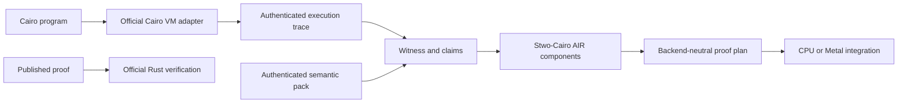

# `stwo_cairo_frontend`

`stwo_cairo_frontend` turns authenticated Cairo executions and
program-specific semantic artifacts into the statements, witnesses, claims,
and AIR components required for Stwo-Cairo proofs. It is backend neutral and
supports both CPU and authenticated Metal integrations.

| Property | Value |
| :--- | :--- |
| Version | `0.1.0` |
| Layer | `frontend` |
| Owner | `cairo-frontend` |
| Public Zig module | `stwo_cairo_frontend` |
| Focused CI host | Linux |

The exact surface is declared in
[package.contract.json](package.contract.json) and exported through
[mod.zig](mod.zig).

## Architecture


```mermaid
flowchart LR
    Program[Cairo program] --> VM[Official Cairo VM adapter]
    VM --> Trace[Authenticated execution trace]
    Trace --> Witness[Witness and claims]
    Semantics[Authenticated semantic pack] --> Witness
    Witness --> AIR[Stwo-Cairo AIR components]
    AIR --> Plan[Backend-neutral proof plan]
    Plan --> Integration[CPU or Metal integration]
    Proof[Published proof] --> Oracle[Official Rust verification]
```

The frontend owns Cairo decoding, Felt252/CASM state, preprocessed data,
component claims, statement construction, witness scheduling, compact protocol
geometry, and proof planning. Backend runtime code and product CLI policy stay
outside this package.

## Public API

```zig
const cairo = @import("stwo_cairo_frontend");

const Felt252 = cairo.Felt252;
const CasmState = cairo.CasmState;
const ProverInput = cairo.ProverInput;

const receipt = try cairo.proveCairo(
    Backend,
    Oracle,
    allocator,
    &backend,
    &oracle,
    request,
);
```

| Area | Exports |
| :--- | :--- |
| Core data and adaptation | `common`, `Felt252`, `CasmState`, `adapter`, `ProverInput` |
| AIR and claims | `air`, `claim_generator`, `claim_registry`, `preprocessed` |
| Witness construction | `witness`, `witness_scheduler`, `arena_lifetime`, `staged_arena_planner` |
| Statements and geometry | `statement`, `statement_bootstrap`, `compact_protocol_geometry`, `compact_verifier_interchange` |
| Proving | `proving`, `proof`, `proof_plan`, `prove_trace`, `prover`, `proveCairo` |
| Authority and generation | `rust_oracle`, `conformance`, `codegen` |

`proveCairo` is the high-level generic facade. Production products normally use
the more explicit transaction modules in `stwo_cairo_cpu_integration` or
`stwo_cairo_metal_integration`.

## Dependencies

- `stwo_core`
- `stwo_backend_contracts`
- `stwo_prover_api`
- `stwo_prover_engine`

The frontend has no CPU, Metal, or CUDA backend dependency.

## Build, test, and run

The focused suite reads authenticated conformance vectors from the monorepo.
Its build file pins the test working directory to the repository root:

```sh
zig build test --build-file src/frontends/cairo/build.zig -Doptimize=ReleaseFast -j2
```

Build and run the released CPU product:

```sh
zig build stwo-cairo-cpu -Doptimize=ReleaseFast

zig-out/bin/stwo-cairo-cpu run-and-prove \
  --program program.executable.json \
  --program-type executable \
  --arguments arguments.json \
  --proof proof.json \
  --verify
```

The macOS authenticated-AOT product is built with
`zig build stwo-cairo-metal -Doptimize=ReleaseFast`.

### PIE execution and large-input planning

Both products also execute Cairo PIE archives in proof mode through StarkWare's
simple bootloader. This uses `cairo-program-runner-lib` from the official
[proving repository](https://github.com/starkware-libs/proving/tree/5a7c5ede4299c91a61df19a07cba4f7502c14230),
with Blake task hashing. The embedded bootloader and fixture are pinned in
[execution provenance](../../../tools/stwo-cairo-vm-adapter-rs/resources/provenance.json).
This execution addition preserves the existing Stwo-Cairo 1.2.2 AIR/proof
authority; it is not a migration to the latest proof protocol.

```sh
zig-out/bin/stwo-cairo-cpu run-and-prove \
  --program block.pie.zip --program-type pie \
  --proof block.proof.json --report-out block.report.json \
  --stage-profile-out block.stages.json --verify

zig-out/bin/stwo-cairo-cpu inspect --prover-input block.cpi
```

`run-and-prove` uses the streaming [compact transport](adapter/compact_input_v1.md)
by default. `prove` and `inspect` admit both official JSON and compact inputs
through the same semantic validators. Compact decoding avoids retaining a
second copy of the input's memory and execution tables. PIE decoding streams
memory cells and rejects missing, repeated, unknown, or oversized ZIP members.

The default profile uses the smaller Pedersen tables, including EC builtins.
Before witness construction, known sequence requirements above log 20 select
the official canonical profile, whose sequence columns extend through log 25.
An explicitly selected small profile rejects those inputs immediately.
Data-dependent distinct-key counts remain unresolved until witness execution;
the inspector marks incomplete trace sizes as lower bounds, not peak-memory
estimates. The inspector does not qualify a proof.

Metal uses the authenticated composition AOT library by default, with declared
host components where kernels are absent. The stage report counts device,
host, and fallback components separately. Unexpected device failures fail the
product's publication gate. The first use can require substantial device
pipeline compilation; subsequent processes reuse the bounded archive cache.

### Performance qualification

Use [benchmark_cairo.py](../../../scripts/benchmark_cairo.py) to record complete
process wall time, proving time, peak process RSS, Darwin product physical
footprint (including Metal allocations), proof hashes, stage reports,
and acceptance by the official Rust verifier. All recorded proofs must use
70 queries, 26 PoW bits and log blowup 1. Execution and publication are included
in process wall time; official Rust verification is measured separately.
RSS is the maximum reported by `wait4`, not the sum of simultaneous parent and
child footprints. Physical footprint is measured in the prover product and
excludes the adapter child; missing platform measurements remain null.
Every trial is recorded, including cold-start costs.

```sh
python3 scripts/benchmark_cairo.py \
  --product zig-out/bin/stwo-cairo-cpu \
  --oracle tools/stwo-cairo-official-verifier-rs/target/debug/stwo-cairo-official-verifier \
  --program tools/stwo-cairo-vm-adapter-rs/resources/fibonacci_pie.zip \
  --program-type pie --trials 3 --out zig-out/cairo-benchmark
```

Initial 2026-09-27 qualifications on Apple M5 Max, 18 logical CPUs, 64 GiB RAM,
ReleaseFast. The compiler's `apple_m1` baseline ISA target is not the host model:

| Workload | Proving | Complete process | Peak RSS | Qualification |
| --- | ---: | ---: | ---: | --- |
| All builtins, small profile, CPU | 1.806 s | 1.84 s | 1.176 GB | Zig and official Rust accepted |
| Genuine Fibonacci PIE, CPU | 1.439 s | 2.083 s | 1.503 GB | Zig and official Rust accepted |
| Same PIE, Metal, populated cache, median of 3 | 0.621 s | 0.786 s | 1.540 GB | Exact CPU bytes, official Rust accepted, zero fallbacks |
| Same PIE, Metal, first pipeline compilation | 102.717 s | 103.402 s | 1.878 GB | Same accepted proof; cold compilation included |
| SN PIE 2, CPU baseline, complete ZIP execution | 108.449 s | 110.829 s | 45.138 GB | Zig and official Rust accepted |
| SN PIE 2, CPU prefix reuse + SIMD, first recorded run | 44.910 s | 47.202 s | 41.788 GB | Same proof bytes, table cache miss |
| Same SN PIE 2 binary, table cache populated | 36.178 s | 38.622 s | 41.808 GB | Same proof bytes, official Rust accepted |
| SN PIE 2, compact tree cache, first run | 44.970 s | 47.702 s | 41.790 GB | Same proof bytes; table and tree cache misses |
| Same binary, table and tree cached, median of 2 | 35.146 s | 37.567 s | 41.827 GB | Same proof bytes; both caches hit |
| SN PIE 2, Metal, first pipeline compilation | 80.501 s | 82.888 s | 27.188 GB | Same CPU proof bytes, official Rust accepted, zero unexpected fallbacks |
| Same SN PIE 2 Metal binary, populated cache | 17.835 s | 20.211 s | 27.039 GB | Same CPU proof bytes, official Rust accepted, zero unexpected fallbacks |
| SN PIE 2, stored-domain Metal + parallel counting, warm median of 2 | 17.795 s | 20.236 s | 27.041 GB | Same CPU proof bytes, official Rust accepted, zero unexpected fallbacks |
| SN PIE 3, CPU, complete ZIP execution | 108.455 s | 113.197 s | 48.907 GB | Zig and official Rust accepted |

The Fibonacci PIE is a small integration workload. SN PIE 2 runs the actual
provided archive through the proof-mode bootloader: 7,977,397 steps, canonical
profile, 70 queries / 26 PoW bits. These rows are individual qualification
trials; the first and populated-cache SN2 trials are not a cold/warm median.
At that stage, the warm SN2 result improved 2.95× from the measured complete-process
baseline; its two individual complete-process trials were 37.352 s and 37.782 s.
The compact preprocessed cache stores ~256 MiB of upper tree layers and
reconstructs omitted lower nodes from retained columns during openings. This
keeps the canonical tree inside the existing 2 GiB directory budget. Cold
setup and cache hits are both reported above. Its proof
SHA-256 is `ddf5b47bb928a75b699d0297b75fd0c3fb40ad6679f4ab26c32d2dfee9149545`;
the baseline and optimized proofs are byte-identical. Receipts and stage
breakdowns are in [the local research record](../../../autoresearch/notes/2026-09-27-cairo-completion).
All four SN PIEs now qualify on CPU and Metal; the complete current matrix
and receipts appear below. The early warm SN2 Metal trial
is 5.48× faster than the original CPU baseline and 1.86× faster than its contemporary
CPU median. These are different backends and cache conditions. The first Metal
trial includes 53.188 s of pipeline admission and 9.650 s of table setup;
its warm result is a single measured trial, not a median. SN2 composition uses
42 device components and 16 declared host components, with 141 Metal dispatches.

CPU and Metal Fibonacci PIE proofs have SHA-256
`f288e3efd48c4d0e49ec5336f156f00e7205d26929adc20321cff88e153b543f`.
The Metal PIE uses 40 device composition components and 2 declared host
components, with 118 total Metal dispatches. Shared canonical Felt252 inversion
is 342× faster in the isolated paired benchmark; that is not an end-to-end
speedup. See [the paired receipt](../../../autoresearch/notes/2026-09-27-cairo-completion/felt-inverse-pair.json).

Focused input checks can run without repeating the complete frontend suite:

```sh
zig build test --build-file src/frontends/cairo/build.zig \
  -Doptimize=ReleaseFast '-Dtest-filter=Cairo input' -j2
```

The pinned diverse benchmark suite is available with:

```sh
python3 scripts/benchmark_cairo_suite.py --cpu zig-out/bin/stwo-cairo-cpu \
  --metal zig-out/bin/stwo-cairo-metal \
  --oracle tools/stwo-cairo-official-verifier-rs/target/debug/stwo-cairo-official-verifier \
  --tier all --pie-dir /path/to/pie-archives --trials 3 --out /path/to/new-results
```

It records canonical 70-query/26-bit security, workload/proof hashes, separate
execution/proving timings, measured peak process RSS, cache evidence, failures,
CPU/Metal proof parity and pinned official verification. The manifest contains
15 workloads; missing external PIEs fail their selected cases. Worker-width
sweeps use `--workers 4 8 16`. See [the current suite results and limitations](../../../autoresearch/notes/2026-09-27-cairo-completion/README.md).

## Contract and invariants

- API signature: the facade preserves statement and proving entry points.
- Behavioral invariant: the prover rejects a noncanonical official-Rust oracle
  identity.

The product gates extend this with admitted-program coverage, exact proof
transport behavior, CPU/Metal byte parity, zero-fallback telemetry, and
acceptance by the pinned official Rust verifier.

## Change checklist

1. Keep execution inputs and semantic packs authenticated and identity-bound.
2. Preserve the separation between frontend semantics and backend execution.
3. Update claim, statement, witness, and verifier geometry together.
4. Add fixtures for every affected builtin, opcode, and transport.
5. Run the frontend package plus CPU/Metal oracle gates as applicable.

## Related documentation

- [Cairo production-port goal](../../../conformance/2026-07-26-stwo-cairo-production-port-goal.md)
- [CPU integration](../../integrations/cairo_cpu/README.md)
- [Metal integration](../../integrations/cairo_metal/README.md)
- [Repository Cairo guide](../../../README.md#cairo-frontend)
- [Package-workspace audit](../../../conformance/2026-07-28-zig-package-workspace-release-audit.md)

An earlier paired SN PIE 2 warm Metal qualification measured **16.066 s** complete
ZIP process and **13.605 s** proving (three alternating pairs), at canonical
70-query/26-bit PoW security with exact CPU-reference proof bytes accepted by
the pinned official verifier and 27.669 GB peak process RSS. This comparison
retains a 6 GiB preprocessed-cache budget and warm Metal archives. It is about
6.9 times faster than the original 110.829 s CPU process; backend and cache
conditions differ. The improvement against its contemporaneous Metal control
is 4.4%, primarily from bounded parallel large-table multiplicity scatter.
Later single trials must not be presented as paired medians. Cold Metal
pipeline compilation remains substantial and is recorded separately.

That build also qualified **SN PIE 1 at 50.546 s**
complete process / 45.998 s proving / 45.392 GB peak RSS and **SN PIE 3 at
39.980 s** / 35.365 s / 45.060 GB. These are single qualifications with exact
CPU-reference proof bytes and official acceptance, not paired medians.
Committed-column openings also enable the resident raw-quotient route;
SN1 opening and FRI costs fall to 1.585 s and 2.199 s. Memory remains a target.
Full receipts and failed/cancelled experiments are recorded in the
[Cairo completion research note](../../../autoresearch/notes/2026-09-27-cairo-completion/README.md).

Authenticated preprocessed hash reuse now qualifies six SN2 proofs with exact
bytes and zero runtime fallbacks. Its three-pair process comparison is roughly
neutral (16.086 s control / 16.205 s candidate; the initial cache miss is
retained). On the two recorded authenticated hits, product physical footprint
is **37.15 GB**, versus **41.18 GB** for the control: about **4.03 GB less**.
RSS alone does not show this released Metal hash storage. Fresh column LDE and
GPU sampling/quotient work remain active. The cache owns authentication layers
and a separate proof-scoped Metal column view; it does not cache witness trees.
The raw and summarized evidence is linked in the research note. These are
memory qualifications, not a claim of reaching the 10× timing target.

The later bounded-interaction comparison measures SN PIE 2 at **15.082 s**
complete process / **12.693 s** proving, versus 15.870 / 13.428 s for its
same-binary control (three alternating pairs). All six canonical proofs match
exactly and pass the pinned official verifier; the initial control cache miss
is retained. Interaction generation itself falls from 1.839 to 1.438 s. SN PIE
1 confirms the direction with two pairs: 33.038 → 31.251 s complete process and
3.607 → 3.235 s interaction generation. These results are recorded in the
[Cairo research notes](../../../autoresearch/notes/2026-09-27-cairo-completion/README.md).
Fresh fixed-data Merkle compaction also keeps SN2's product physical peak at
about **37.15 GB on first use**, extending the earlier 4 GB saving beyond
cache hits. Physical footprint includes Metal memory and is reported
separately from process RSS.

The v22 default policies also pass the full pinned 15-workload suite twice
(30 accepted proofs). The large PIEs' second process observations are SN1
29.973 s, SN2 15.886 s, SN3 29.985 s and SN4 20.329 s; these are individual
coverage observations, not replacements for paired medians. Small warm
workloads range from roughly 0.43 to 0.79 s, and canonical all-builtins is
3.800 s. Both initial and subsequent trials, physical memory and exact
identities are preserved in the
[v22 qualification receipt](../../../autoresearch/notes/2026-09-27-cairo-completion/cairo-suite-qualification-v22.json).


Wide native witness programs now use bounded row tiles for inputs, outputs
and lookup channels. Three canonical SN PIE 2 pairs measure **15.299 →
14.210 s process**, **12.910 → 11.741 s proving**, and **3.511 → 2.051 s
witness generation**, with the initial candidate artifact miss retained.
Physical peak remains **37.153 GB**. All six proofs match the existing CPU
proof bytes and pass the pinned official verifier without runtime fallback.
[Paired receipt](../../../autoresearch/notes/2026-09-27-cairo-completion/sn2-native-row-tiles-v24-summary.json).

The complete 15-workload matrix also qualifies twice. Subsequent individual
observations are SN1 **29.723 s**, SN2 **14.620 s**, SN3 **27.648 s** and
SN4 **18.149 s** process; these observations do not replace the isolated paired
result. Every proof retains canonical security and exact prior bytes.
[Full v24 receipt](../../../autoresearch/notes/2026-09-27-cairo-completion/cairo-suite-qualification-v24.json).

### Latest norm-based LogUp qualification

The shared CPU interaction writer now uses SIMD base-norm scaled QM31 batch inversion by default. Three controlled SN PIE 2 pairs measured **12.951 → 12.608 s end to end**, **10.555 → 10.267 s proving**, and **1.435 → 1.286 s interaction**, with unchanged **37.153 GB** product physical peak. This uses canonical 70-query / 26-bit PoW parameters and preserves exact proof bytes. [Paired receipt](../../../autoresearch/notes/2026-09-27-cairo-completion/sn2-norm-logup-v31-summary.json).

The complete 15-workload matrix qualified all 30 proofs with official verification and no fallback. Its subsequent SN PIE 2 observation was **13.247 s end to end / 10.816 s proving**; the initial trial was 13.198 s. These are retained-cache process measurements on the M5 Max, and the official verifier runs separately. [Full receipt](../../../autoresearch/notes/2026-09-27-cairo-completion/cairo-suite-qualification-v31.json). Set `STWO_CAIRO_NORM_LOGUP=0` only to compare with the prior inversion algorithm.


### Latest CPU and Metal proving qualification

On the Apple M5 Max (64 GiB), three alternating canonical SN PIE 2 pairs
measure **30.473 → 14.847 s proving (2.053×)** and **32.812 → 17.168 s full
ZIP-to-proof process (1.911×)**. All six proofs retain exact bytes and pass
the pinned official verifier, which runs separately. These are CPU results;
Metal results above have their own qualification. Security remains plain
BLAKE2s PCS, 70 queries and 26 PoW bits.
[Paired receipt](../../../autoresearch/notes/2026-09-27-cairo-completion/sn2-cpu-native-paired-v55-summary.json).

The largest CPU workload, SN PIE 3, now has a separate three-pair qualification:
**62.082 → 26.340 s proving (2.357×)** and **66.435 → 30.647 s full process
(2.168×)**. Peak product physical footprint falls from **68.461 to 50.248 GB**.
The CPU product samples committed evaluations directly, matching Metal's
storage policy, instead of retaining a second coefficient representation.
All six canonical proofs are byte-identical and officially accepted. This
qualifies a further 2× on SN PIE 3; the requested further 2× on SN PIE 2 has
not yet qualified. [SN PIE 3 paired receipt](../../../autoresearch/notes/2026-09-27-cairo-completion/sn3-cpu-retention-paired-v67-summary.json).

The latest qualified observations use the unchanged **v76 CPU baseline** and
**v77 Metal**. The v76 matrix qualified 60 CPU/Metal proofs; v77 adds 30 Metal
proofs across the same 15 workloads, with official acceptance, zero fallback,
and exact equality with all recorded CPU proof bytes. CPU workloads were not
rerun for this Metal-only change. The M5 Max has 64 GiB unified memory. These
are subsequent-trial observations, not paired speedup medians; all initial
trials and pipeline preparation costs remain in the receipts. Public caches
and Metal pipeline archives are retained, with a 6 GiB public artifact cache
budget; prepared coefficient caching is disabled.

| Workload | Backend | Proving | Complete ZIP-to-proof process | Peak physical footprint |
|---|---|---:|---:|---:|
| SN PIE 1 | CPU | 22.450 s | 26.920 s | 51.143 GB |
| SN PIE 1 | Metal | 15.390 s | 19.933 s | 51.526 GB |
| SN PIE 2 | CPU | 13.793 s | 16.205 s | 29.383 GB |
| SN PIE 2 | Metal | 10.194 s | 12.625 s | 32.198 GB |
| SN PIE 3 | CPU | 22.632 s | 26.980 s | 50.328 GB |
| SN PIE 3 | Metal | 15.285 s | 19.833 s | 50.848 GB |
| SN PIE 4 | CPU | 18.950 s | 22.921 s | 40.911 GB |
| SN PIE 4 | Metal | 12.439 s | 16.472 s | 40.435 GB |

Physical footprint is each product process's lifetime peak, including Metal
allocations and compressed-memory accounting. Adapter child memory is excluded
from that metric. The official verifier runs separately from the timed product.
CPU and Metal timings here use the same security and proof bytes.
[CPU baseline receipt](../../../autoresearch/notes/2026-09-27-cairo-completion/cairo-suite-both-v76-summary.json),
[latest Metal suite and recorded CPU parity](../../../autoresearch/notes/2026-09-27-cairo-completion/cairo-suite-metal-v77-summary.json).

Three alternating SN PIE 3 Metal pairs qualify bounded LDE coefficient epochs
and tiled quotient numerators: **18.663 → 16.873 s proving**, **23.004 →
21.652 s full process**, and **59.004 → 54.099 GB peak physical footprint**
(8.31% lower). The v73 matrix also releases composition staging before FRI;
its subsequent 53.614 GB SN3 peak is an observation, not a separate paired
claim. [Paired memory receipt](../../../autoresearch/notes/2026-09-27-cairo-completion/sn3-metal-memory-paired-v72-summary.json).

Large Metal commitments now retain upper Merkle layers and reconstruct bounded
query subtrees through the same engine reader as CPU commitments. Source arenas
and query caches have independent lifetimes; allocation refusal preserves the
original tree. Three final SN PIE 3 alternating pairs, with both public caches
populated, measure **53.629 → 50.669 GB peak physical footprint** (5.52% lower),
**16.125 → 16.200 s proving** (+0.46%), and **20.574 → 20.598 s complete process**.
Timings are approximately maintained; this is a memory qualification, not a
speedup claim. Initial cache misses and setup proofs remain recorded separately.
[Final paired receipt](../../../autoresearch/notes/2026-09-27-cairo-completion/sn3-metal-query-subtree-warm-paired-v76-summary.json).

Segmented Metal quotients now reduce shorter columns at their native height
before lifting them, across arbitrary source runs, with a 256 MiB partial cap.
Three alternating SN PIE 3 pairs measure **2.152 → 0.553 s** for quotient/FRI
build and commit (3.89× faster), **16.504 → 15.469 s proving** (6.27% less time),
and **20.933 → 20.097 s complete process** (3.99% less time). Peak physical
footprint is **50.668 → 50.848 GB** (+0.35%): this is a speed improvement, not a
memory reduction. All six proofs have identical bytes and official acceptance,
with zero fallback. The initial v77 trial's two public-cache misses are included.
[Paired receipt](../../../autoresearch/notes/2026-09-27-cairo-completion/sn3-metal-native-segment-paired-v77-summary.json).

The expanded SN PIE 3 trace still retains about 43 GB. Further memory reduction
requires bounded polynomial/evaluation storage. The Metal product currently uses
native CPU witness generation and defaults to CPU interaction generation; moving
those stages to efficient device execution remains necessary for a larger GPU
speed advantage.

The Metal AIR artifact uses authenticated shared field-shape facts,
nine-product QM31 multiplication and canonical Mersenne reductions. Its first
SN2 use required 77.865 s of pipeline compilation (88.274 s proving total);
that earlier cold observation is retained separately and is not represented by
the warm table above. Each subsequent library use records archive admission.
[Cold/warm Metal receipt](../../../autoresearch/notes/2026-09-27-cairo-completion/sn2-metal-shapes-v58-summary.json).
Prepared public coefficient/evaluation caching remains experimental and opt-in.

### Compact storage experiments (v84; opt-in CPU only)

The production storage policy remains unchanged. The experimental CPU modes
`STWO_CAIRO_COMPACT_POLYNOMIALS=preprocessed` (fixed data only) and `=1` (all
trees) retain native coefficients and reconstruct values when required.
They preserve the canonical proof bytes and official verification, but have
not qualified as speed-preserving memory improvements.

| SN PIE3 storage | Proving time | Peak physical footprint | Measurement |
|---|---:|---:|---|
| Ordinary CPU | 22.821 s | 50.320 GB | Three alternating pairs |
| Compact fixed data | 24.794 s | 48.080 GB | Three alternating pairs |
| Compact all trees | 32.099 s | 43.374 GB | One separate observation |

The paired fixed-data saving is 4.45% with an 8.65% proving-time increase.
The all-tree observation reduces memory further but is slower, so neither
mode is enabled by default. All runs use canonical 70-query / 26-bit PoW
security and the unchanged SN PIE3 proof digest. Source generation, ownership,
selective FFT openings, hybrid bounded quotients, cached layers and terminal
hash-block continuation pass 17 focused tests. Metal coefficient storage and
GPU reconstruction remain unimplemented. Complete receipts, cache evidence
and frozen product identities: [v84 qualification](../../../autoresearch/notes/2026-09-27-cairo-completion/sn3-cpu-compact-storage-v84-summary.json).

A separate unchanged-storage native Metal SN PIE3 observation on the same
frozen v84 products verifies in **15.202 s**, with **50.848 GB** peak physical
footprint, 344 Metal dispatches and zero CPU fallbacks. This is a qualification
observation, not a paired GPU speedup claim; see [Metal receipt](../../../autoresearch/notes/2026-09-27-cairo-completion/sn3-metal-default-v84-summary.json).

### Memory-table placement and peak diagnosis (v85)

Implicit address, big-value and small-value tables now write directly into final
commitment columns on both CPU and Metal. The collector owns those values on
success and failure; only headers are reordered for the multiplicity-first AIR.
Subcomponent feeds are released after the fixed and memory count passes join,
before implicit table construction. Disjoint column workers retain no private
table slabs. This changes placement and lifetime, not the storage policy.

Three alternating SN PIE3 pairs per backend preserve exact proof bytes and
canonical official verification:

| Backend | Prior proving median | Updated proving median | Prior peak physical | Updated peak physical |
|---|---:|---:|---:|---:|
| CPU | 22.605 s | 23.150 s | 50.248 GB | 50.302 GB |
| Metal | 14.779 s | 14.929 s | 50.848 GB | 50.848 GB |

These measurements **do not qualify a speed or peak-memory improvement**.
All initial trials remain included, including the updated CPU product's two
public-cache misses. All twelve paired proofs verify; Metal records zero
fallbacks. Sixteen focused storage tests cover independent memory-value formulas,
padding, parallel writes, direct ownership transfer and allocation failures.
Eight additional full proofs cover all opcodes, all builtins at canonical
security, Fibonacci PIE and SN PIE1 on both backends, with exact CPU/Metal parity.
Those single observations are qualification, not paired speedup claims.

A separate instrumented Metal SN3 proof places the peak after witness creation:
about 47.388 GB at the composition-to-interpolation boundary, 48.596 GB lifetime
peak at the opening boundary, and 50.847 GB by completion. Its AIR staging copies
41,161 MiB, taking 652.846 ms, with 177 dispatches in 177 submissions. This run is
excluded from performance comparisons. The larger opportunity remains native
coefficient storage with GPU AIR reconstruction, coefficient-folded quotients
and selective openings; temporary-table removal cannot shrink retained traces.
[Complete v85 receipts and diagnosis](../../../autoresearch/notes/2026-09-27-cairo-completion/cairo-direct-memory-v85-summary.json).

### Latest compact Metal memory experiment (v88)

Canonical SN PIE 3, three alternating same-binary pairs: ordinary Metal
**17.35 s / 50.85 GB** versus experimental compact Metal **39.65 s / 41.30 GB**
(median isolated proving / maximum lifetime physical footprint including GPU
allocations). All six proofs are accepted by the official verifier, with exact
proof-byte parity and zero CPU fallbacks. Compact storage saves 18.77% peak
memory but is 2.285× slower, so it remains experimental; the speed-preserving
memory target has not passed. CPU SN3 remains **23.15 s / 50.30 GB** (v85).

Full receipts and focused qualification logs are in
[the Cairo research notes](../../../autoresearch/notes/2026-09-27-cairo-completion/README.md).

### Compact Metal follow-up (v90–v91; experimental)

GPU coefficient folding, page-aligned reconstruction scratch and preserved
within-domain buffer ordering reduce compact SN PIE 3 median proving from
**39.16 s to 32.57 s** in three alternating pairs. All six proofs are officially
accepted with exact proof bytes and zero fallback. Maximum physical footprint
is **42.62 GB**, including the initial fixed-table cache-miss trial; no new peak
reduction is claimed. Ordinary storage remains faster and stays the default.

The final planned-streaming build qualifies all 15 suite workloads, with exact
ordinary-proof parity. Single compact Metal trials: SN1 **32.89 s / 41.72 GB**,
SN2 **19.07 s / 21.97 GB**, SN3 **32.37 s / 41.10 GB**,
SN4 **25.59 s / 32.21 GB** (isolated proving / lifetime physical peak, decimal
GB including Metal). These are qualification observations, not paired speedup
claims. A speed-preserving memory reduction remains unfinished. Full receipts
and failure/ownership qualification are in the linked Cairo research notes.

Final v91 same-binary SN3 comparison (three alternating pairs, all official
proofs accepted): ordinary **15.19 s / 50.85 GB**, experimental compact
**33.22 s / 41.30 GB**. Median process time is 19.62 s versus 37.58 s.
Peak falls **18.77%**, but proving is **2.187× slower**; compact remains opt-in
and the speed-preserving memory gate remains unmet. The new ordinary time is
not an isolated speedup claim against older binaries. See the research notes'
`sn3-metal-planned-storage-paired-v91-summary.json` for all six initial trials.

### Joined witness feed lifetime qualification (v92; opt-in)

Fixed and memory multiplicities can now be consumed after each producer joins,
with subcomponent feed retirement after the last dependency-plan consumer.
Interaction lookup slabs retain separate ownership. Memory-count allocation and
producer ownership transfer are failure-safe. Four executed focused tests and
CPU/Metal ReleaseFast builds pass. Enable with
`STWO_CAIRO_INCREMENTAL_MULTIPLICITIES=1`; batch counting stays the default.

Canonical SN PIE 3, ordinary storage, three alternating same-binary pairs:

| Backend | Default batch time / peak | Incremental time / peak |
| --- | ---: | ---: |
| CPU | 22.47 s / 50.25 GB | 22.64 s / 50.25 GB |
| Metal | 14.83 s / 50.85 GB | 14.59 s / 50.85 GB |

Time is median isolated proving; peak is maximum product lifetime physical
footprint in decimal GB, including Metal allocations. All 12 proofs are
accepted and byte identical. Initial Metal baseline fixed-table cache misses
are retained. Small mixed timing differences establish no robust speedup;
overall peak is unchanged, so the memory gate remains unmet.

The final opt-in Metal suite accepts all 15 pinned workloads with exact ordinary
proof parity and zero fallback. Single qualification trials: SN1 **17.31 s /
51.53 GB**, SN2 **11.09 s / 32.20 GB**, SN3 **15.57 s / 50.85 GB**,
SN4 **12.71 s / 40.44 GB**. These are not paired speedup claims. Complete
measurements, focused tests, and the pause checkpoint are recorded in
[the research notes](../../../autoresearch/notes/2026-09-27-cairo-completion/README.md).
The [GPU cost thesis](../../../autoresearch/notes/2026-09-27-cairo-completion/gpu-economics-thesis-v1.md)
distinguishes unified-memory footprint from CUDA VRAM and makes no NVIDIA
performance prediction. Further optimization is paused for the GPU discussion.


A subsequent Runpod H100 session builds and executes the diagnostic CUDA SN2
path, repairs two buffer lifetime errors, and passes seven hardware component
checks. The assembled proof still rejects its final FRI degree verdict; no
accepted CUDA timing is available. Its arena reserves **80.09 GB** and sampled
whole-device memory reaches **81.72 GB**, so a single RTX 5090 does not fit the
current plan. Source changes, hardware receipts, the remaining qualification
work and GPU unit-cost thresholds are recorded in the
[CUDA Runpod research notes](../../../autoresearch/notes/2026-09-28-cairo-cuda-runpod/README.md).
The rental was deleted after preserving the diagnostics; observed spend was
**$4.31**.
