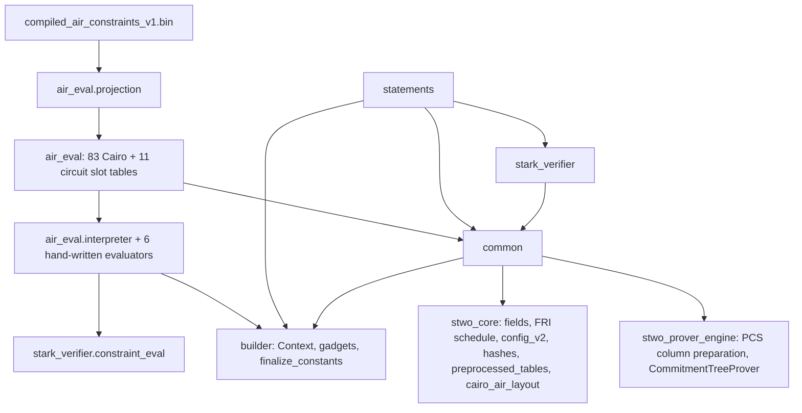

# `stwo_circuit_frontend`

The circuit recursion frontend: a call-order-exact Zig port of StarkWare's
circuit recursion stage (the `circuits`, `circuit_common`, `stark_verifier`,
`circuit_verifier`, `circuit_multiverifier` and `cairo_verifier` crates of
[starkware-libs/proving](https://github.com/starkware-libs/proving) at
commit `5a7c5ede4299c91a61df19a07cba4f7502c14230`). Byte parity with Rust is
the contract: the same inputs must give the same preprocessed roots, circuit
hashes, gate lists and proofs.

| Property | Value |
| --- | --- |
| Version | `0.1.0` |
| Layer | `frontend` |
| Owner | `circuit-frontend` |
| Public Zig module | `stwo_circuit_frontend` |
| Focused CI host | Linux |
| Upstream | `proving@5a7c5ed` |

The [package contract](package.contract.json) and [public facade](mod.zig) are
the authoritative API records. The design is
[02-design.md](../../../design/starknet-proving-pipeline/recursion/02-design.md)
§2.2, §3, §5 and §8; the Rust-to-Zig map is
[01-rust-map.md](../../../design/starknet-proving-pipeline/recursion/01-rust-map.md).

## Purpose and architecture

The package follows the layout of design §2.2: one Zig file per Rust file, Rust function order kept inside each file. It is
being filled milestone by milestone. Today it holds:

- `builder` (`crates/circuits`): `Context(QM31)` builds a circuit with values
  (the production value path), `Context(NoValue)` the same topology without
  values. It owns variables, interned constants, guesses, reserved output
  wires, the primitive gates, `finalize_constants` and `finalize`, plus the
  gadgets: wrappers (M31, U16, U32), `Simd` lanes, `extract_bits`, the
  Blake2s gates and hash gadgets, and `select_by_index`.
- `common`: the shared component list (`ComponentList`, `PerComponent`,
  relation ids, `RelationUse`, `INTERACTION_POW_BITS`, static component
  facts), `ComponentSizes` and the padded-size rules, the circuit hash
  (`configWords`, `hostCircuitHash`), preprocessing (`ColumnLayout`,
  `PreprocessedCircuit` built from a `CircuitView`, and `preprocessedRoot`
  through the prover's PCS commit path) and `component_utils`
  (`seq_of_component_size`); the gate-emitting `pad_to_targets`/`pad_context`
  and `add_zk_blinding` (M2), which run on a finalized builder context.
- `air_eval` (M4, design §5.4): the in-circuit constraint evaluators. A reader
  of the compiled-AIR projection, an interpreter that replays each projected
  function through the circuit builder, the six hand-written evaluators and
  the 83 Cairo / 11 circuit slot tables. Upstream's ~56k lines of generated
  evaluators are interpreted from a pinned, SHA-256-authenticated projection
  produced by `tools/stwo-circuit-oracle-rs`, not transcribed.
- `stark_verifier`: `ProofConfig`, `ProofInfo` (the proof size model),
  `N_COMPOSITION_COLUMNS`, `pack_into_qm31s`, the composition accumulator
  (`constraint_eval`), `logup` and the `test_utils` harness data.
- `statements`: `circuit_verifier_proof_config`, `CircuitConfig`,
  `SharedConfig` and the fold shared config of `CanonicalCircuit::build`;
  `cairo_statement` (M6, the port of `CairoStatement`, see below) and
  `cairo_leaf_config` (`leaf_verifier_config`: enabled components and the
  leaf `ProofConfig` over the projection's Cairo slot table).

The gate-emitting verifier gadgets (channel, Merkle, FRI, OODS, composition,
the statements' `guess` traversals and `build_*_circuit`) come next and sit on
top of these modules. The R3 tests still drive the evaluators through the
test-only `air_eval/testing/builder_stand_in.zig`; moving them onto `builder`
is open.



Representation differs from Rust only where no order is observable:
variables and gate fields are `u32` (a circuit holds fewer than 2^31 variables
so addresses fit M31 columns), a `BlakeGGate` stores its four consecutive
outputs as `out_base` (asserted when the gate is added), permutations share
flat CSR lists, and gadget temporaries live in a per-context scratch arena.

### Status against design §3

Implemented as specified: `u32` vars and gates, the `out_base` BlakeGGate,
CSR permutations, `Context(QM31 | NoValue)`, first-use constant interning,
index-only peepholes, `finalize_constants` with `swapRemove`/ordered `retain`,
guess finalization, padding and ZK blinding through the real builder API, and
the order lint. Where this port and the design text differ:

- Padding appends real rows. The run-length pad descriptors of §3.1 are a
  memory optimization scheduled with the other builder wins (§9.2, M11); they
  must reproduce these rows exactly.
- The gate vectors are not pre-reserved from registry targets yet, and
  `Stats` and the unused-variable sets are always on rather than audit-only.
  Neither affects numbering.
- The lint allows `std.mem.sort`: in Zig 0.15 it is the stable block sort,
  which matches Rust's stable sorts. It bans the unstable `sortUnstable`,
  `std.sort.pdq` and `std.sort.heap`, and it runs as `zig build circuit-lint`.
- Upstream's `debug_info` map (diagnostics for `circuit_analysis`) is not
  ported; it never affects numbering.
- The `circuit_hash` R2 case replays `compute_circuit_hash` of
  `crates/circuit_verifier` in the test harness. The production gadget
  belongs to the circuit-verifier statement (M5).

### The Cairo statement (M6)

`statements/cairo_statement.zig` ports `crates/cairo_verifier/src/statement.rs`
in upstream call order: `CairoStatement::new`, `AuxData::parse_from_vars`,
`output_limbs_from_hash`, `verify_builtins`, `verify_claim`,
`claims_to_mix`, `public_params`, `public_logup_sum` and its helpers. It is
generic over a builder facade `B` whose members map one-to-one to the Rust
builder calls (the table is in the file header). Cairo layout facts
(variants, ordered preprocessed ids, builtin cells, the aux-data layout,
`programHash`, leaf components) come from `stwo_core.cairo_air_layout`;
relation ids and verifier constants come from the caller, which reads them
from the projection or from `vectors/circuit/r6/cairo_statement.json`.

## Public API

```zig
const circuit = @import("stwo_circuit_frontend");

const layout = try circuit.common.preprocessed.ColumnLayout.fromComponentSizes(sizes);
const log_sizes = try circuit.statements.circuit_statement.circuitComponentLogSizes(&layout);
const hash = try circuit.common.circuit_hash.hostCircuitHash(log_sizes, log_blowup, root);

var projection = try circuit.air_eval.projection.parse(allocator, bytes);
defer projection.deinit();
var cairo = try circuit.air_eval.cairo_components.build(allocator, &projection);
defer cairo.deinit();
try cairo.evaluate(i, Ctx, &ctx, &component_data, &accumulator, scratch);

const builder = circuit.builder;

var ctx = try builder.Context(QM31).init(allocator, 8); // 8 reserved output wires
defer ctx.deinit();
const a = try ctx.guess(value);
const b = try ctx.constant(QM31.one());
const sum = try ctx.add(a, b);
const digest = try builder.blake.blake2sU32s(QM31, &ctx, words, n_bytes);
try ctx.setOutputs(&output_vars);
try ctx.finalize(false);
try circuit.common.finalize.padToTargets(QM31, &ctx, targets);

const Statement = circuit.statements.cairo_statement.CairoStatement(Builder);
const statement = try Statement.init(arena, &ctx, inputs);
```

| Area | Exports |
| :--- | :--- |
| Builder namespace | `builder` (`Context`, `Var`, `Circuit`, `NoValue`, and the modules `circuit`, `context`, `ivalue`, `ops`, `wrappers`, `simd`, `extract_bits`, `blake`, `select`, `finalize_constants`, `debug_format`) |
| Post-finalize passes | `common.finalize` (`ComponentSizes`, `padToTargets`, `padContext`), `common.zk_blinding` (`addZkBlinding`) |
| Component list | `common.component_list` (`ComponentList`, `PerComponent`, relation ids, `RelationUse`, `component_facts`) |
| Projection | `air_eval.projection` (`parse`, `Projection`, `Source`, `Function`, `Expr`, `Step`) |
| Interpreter | `air_eval.interpreter.Interpreter(Ctx, Data)` |
| Slot tables | `air_eval.cairo_components` (83 slots), `air_eval.circuit_components` (11), `air_eval.component_table` |
| Composition | `stark_verifier.constraint_eval` (`CompositionConstraintAccumulator`, `InteractionAtOods`), `stark_verifier.logup` |
| Harness data | `stark_verifier.test_utils.TestComponentData` |
| Utilities | `common.component_utils.seqOfComponentSize` |
| Statements | `statements.circuit_statement`, `statements.multiverifier`, `statements.cairo_statement`, `statements.cairo_leaf_config` |

Every evaluator is generic over a builder context type `Ctx` exposing `Var`,
`zero`, `one`, `constant`, `add`, `sub`, `mul`, `eq`, `inv` and `newVar` with
the semantics of `crates/circuits/src/{context,ops}.rs`.

Gadgets are free functions `f(comptime V, ctx: *Context(V), ...)`; the
primitive gates (`add`, `sub`, `mul`, `pointwiseMul`, `eq`, `div`, `inv`,
`guess*`, `permute`, `output`, and the `*Into` forms) are `Context` methods.
Every operation returns `error.OutOfMemory` or `error.TooManyVars`; after an
error the context may only be deinitialized. `Simd` data and returned slices
are owned by `ctx.scratch()` and live until `deinit`.

## Dependencies

- `stwo_core`: fields (M31/QM31 and the pointwise helpers), `ChaCha20Rng`,
  `BLAKE_SIGMA`, `fri.allFoldSteps`, `pcs.config_v2`, the Blake2s
  hashers and channel profiles, `preprocessed_tables`, `cairo_air_layout`.
- `stwo_prover_engine`: `pcs.column_preparation`, `TwiddleSource` and
  `pcs.CommitmentTreeProver` for the preprocessed root.

There is no dependency on `stwo_cairo_frontend` or on
`src/frontends/riscv/recursion`; the RISC-V recursion builder hash-conses and
folds constants, which would renumber circuit variables. The Cairo slot order
and the Cairo constants come from the projection header; the test-only root
`conformance/circuit_slot_order/circuit_cairo_slot_order_test_root.zig`
asserts the slot order equals `official_claim_registry.enable_slots`.

## Build, test, and run

```sh
zig build test --build-file src/frontends/circuit/build.zig -Doptimize=ReleaseFast -j2
zig build test-r3 --build-file src/frontends/circuit/build.zig -j2
zig build circuit-parity-r6-fold --build-file src/frontends/circuit/build.zig
zig build circuit-air-projection-check --build-file src/frontends/circuit/build.zig -j2
zig build circuit-parity-r1 --build-file src/frontends/circuit/build.zig
zig build circuit-parity-r2 --build-file src/frontends/circuit/build.zig
python3 scripts/lint_circuit_frontend.py
```

Tests that read `vectors/circuit` run from the repository root.

- The unit tests hold the upstream `expect!` snapshots of `crates/circuits`,
  kept verbatim; the fixture test rebuilds all 20 cases of
  `vectors/circuit/r2/gadgets.json` in value and topology mode and compares
  gate-list, value and `Debug`-text digests, output wires and values.
- `test-r3` runs all 94 evaluators in value and topology mode against
  `vectors/circuit/r3/components.json`, the two upstream
  `sample_evaluations.json` files and the per-stage statement trace
  `vectors/circuit/r3/statement_trace.json`.
- The fold topology rung (`conformance/fold_topology_test.zig`) checks the
  45-column layout, every committed registry's circuit hash, the R0
  circuit-hash vectors, the static component facts against the R3 fixture,
  and `ProofInfo.totalBytes` against the 182,884-byte multiverifier
  `proof.bin`.
- The Cairo leaf host inputs and R10b roots are gated from the Cairo side
  (`zig build test-cairo-frontend`, `zig build test-cairo-leaf-proof`).

## Contract and invariants

- Variables 0, 1 and 2 are zero, one and `u`; `u` is an output from the
  constructor; `init(gpa, n)` reserves variables `3..3+n`.
- Variables are numbered in call order. Constants are interned in first-use
  order and keep interning after `finalize`.
- `add` elides a gate only when an operand is variable 0, `mul` only when an
  operand is variable 0 or 1. Nothing folds values or hash-conses gates.
- `finalize` is `finalize_constants` (verbatim, including `IndexMap`
  `swap_remove` and `retain` order), the optional use check, then one
  yield gate per guess in guess order.
- `Context(QM31)` and `Context(NoValue)` build identical gate lists.
- Value-mode `div`/`inv` of zero and malformed `u32` witnesses panic, as the
  Rust builder does.
- Every evaluator emits the builder ops of the generated (or hand-written)
  Rust code in the same order. The interpreter never folds, interns or caches
  values; the builder's index-only peepholes decide which ops become gates.
- The projection reader (format version 2) authenticates each function record
  by SHA-256 over its canonical form (strings inline) and rejects unknown
  tags, invalid flags, out-of-range string indices, trailing bytes and
  truncation. It asserts, and never recomputes, the generator rules the
  oracle applied (trimmed lookup tuples, sorted used atoms, manual exclusion).
- A function body that reads `Seq` calls `seq_of_component_size` once, at its
  top, as the generated code does; subroutine bodies repeat it.
- `PerComponent` and `ComponentList` are the only circuit component order;
  `circuit_components.build` rejects a projection whose slot order differs,
  and the hand-written circuit slots take their shapes from
  `component_list.component_facts`.
- Every circuit has 45 preprocessed columns, stable-sorted by length.
- `configWords` is the only definition of the 12-byte config layout.
- `ComponentSizes` is the only size struct; registry log sizes map into it
  by field name.
- `preprocessedRoot` commits through the prover's own path (the PCS column
  preparation shared by every commit, the owned `TwiddleSource`, and
  `CommitmentTreeProver`), like upstream's `CommitmentTreeProver::new`; it
  composes no interpolation, extension, twiddle or Merkle steps itself.
- `CircuitView.validate` checks every index `fromCircuit` dereferences;
  malformed views fail with `VariableOutOfRange` where upstream panics, and
  addresses `>= P` fail with `AddressOutOfField` where upstream reduces.
- Sorting is stable (`std.sort.insertion`), and no hash-map iteration
  order reaches an output.

## Change checklist

- Cite the upstream Rust file and keep its function order.
- Add or update a parity test against upstream output or a committed fixture.
- Keep new shared rules in one place and import them.
- Regenerate fixtures only with
  `python3 scripts/generate_circuit_oracle_vectors.py`.
- A new hand-written upstream evaluator needs a `manual/` port and an entry in
  `cairo_components.zig` or `circuit_components.zig`.
- Keep each file's builder calls in upstream order; `eval!` expressions expand
  left subtree, right subtree, operation.
- Run the focused CI commands above, `test-r3` and
  `python3 scripts/lint_circuit_frontend.py`.

## Related documentation

- [Porting map](../../../design/starknet-proving-pipeline/recursion/01-rust-map.md)
- [Design](../../../design/starknet-proving-pipeline/recursion/02-design.md)
- [Circuit fixtures](../../../vectors/circuit/README.md)
