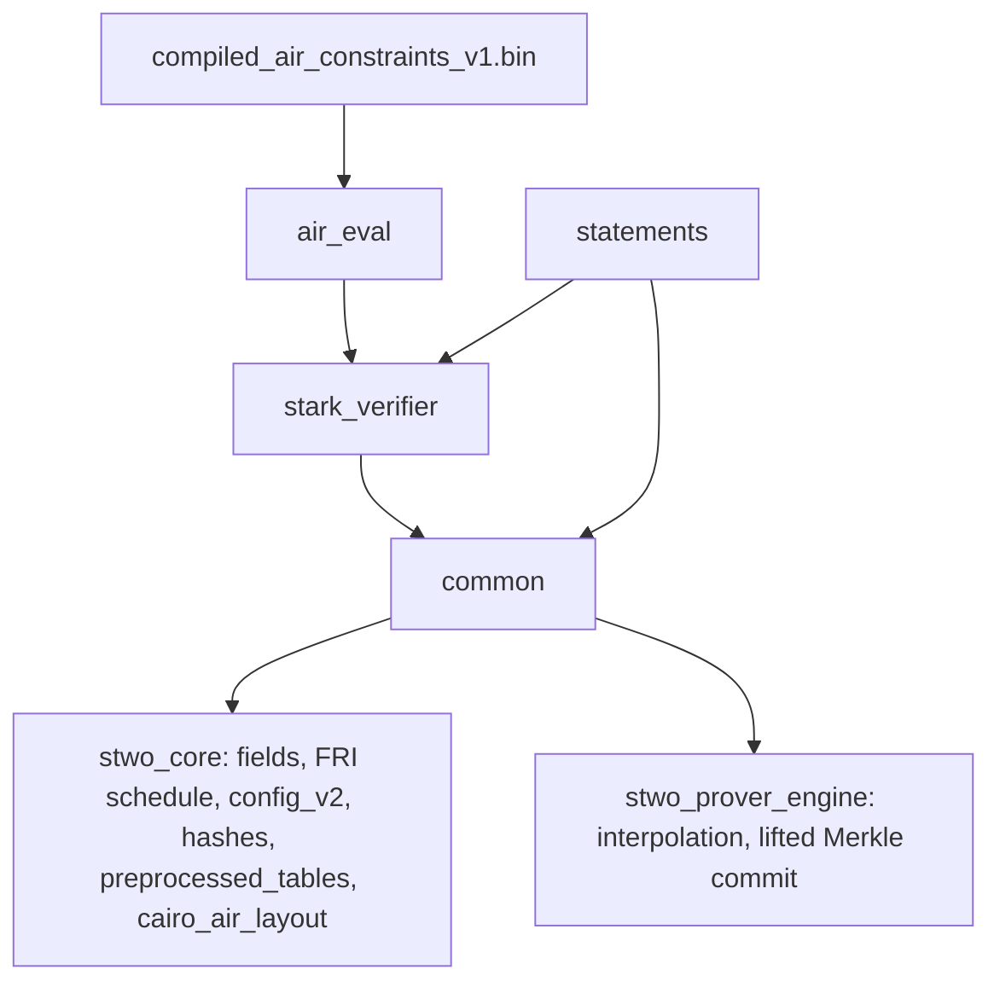

# `stwo_circuit_frontend`

The circuit recursion frontend: a call-order-exact Zig port of StarkWare's
circuit recursion stage (the `circuits`, `circuit_common`, `stark_verifier`,
`circuit_verifier`, `circuit_multiverifier` and `cairo_verifier` crates of
[starkware-libs/proving](https://github.com/starkware-libs/proving) at
commit `5a7c5ede4299c91a61df19a07cba4f7502c14230`). Byte parity with Rust is
the contract: the same inputs must give the same preprocessed roots, circuit
hashes and proofs.

| Property | Value |
| :--- | :--- |
| Version | `0.1.0` |
| Layer | `frontend` |
| Owner | `circuit-frontend` |
| Public Zig module | `stwo_circuit_frontend` |
| Focused CI host | Linux |
| Upstream | `proving@5a7c5ed` |

The [package contract](package.contract.json) and [public facade](mod.zig) are
the authoritative API records. The design is
[`02-design.md`](../../../design/starknet-proving-pipeline/recursion/02-design.md)
§2.2, §5 and §8.

## Purpose and architecture

One Zig file per Rust file, with the Rust function order kept inside each
file. The package is filled milestone by milestone:

- `air_eval` (M4): a reader of the compiled-AIR projection, an interpreter
  that replays each projected function through the circuit builder, the six
  hand-written evaluators, and the 83 Cairo and 11 circuit slot tables.
- `common` (M5): the shared component list, `ComponentSizes` and padded
  sizes, the circuit hash, and preprocessing (`ColumnLayout`,
  `PreprocessedCircuit`, `preprocessedRoot` over the prover's interpolation
  and lifted Merkle commitment); `component_utils` (M4).
- `stark_verifier` (M4, M5): the composition accumulator and logup terms,
  `ProofConfig`, `ProofInfo` (the proof size model) and `pack_into_qm31s`.
- `statements` (M5, M6): the circuit-verifier and multiverifier
  configuration, and `cairo_statement`, the port of `CairoStatement` (see
  below).

The builder (`builder/`, M2) and the gate-emitting verifier gadgets
(channel, Merkle, FRI, OODS, the statements' `guess` traversals and
`build_*_circuit`) come next and sit on top of these modules.



### The Cairo statement (M6)

`statements/cairo_statement.zig` ports `crates/cairo_verifier/src/statement.rs`
in upstream call order: `CairoStatement::new`, `AuxData::parse_from_vars`,
`output_limbs_from_hash`, `verify_builtins`, `verify_claim`,
`claims_to_mix`, `public_params`, `public_logup_sum` and its helpers. Until
the M2 builder lands, it is generic over a builder facade `B` whose members
map one-to-one to the Rust builder calls (the table is in the file header).
Cairo layout facts (variants, ordered preprocessed ids, builtin cells, leaf
components) come from `stwo_core.cairo_air_layout`; relation ids and verifier
constants come from the caller, which reads them from the projection or from
`vectors/circuit/r6/cairo_statement.json`.

## Public API

```zig
const circuit = @import("stwo_circuit_frontend");

var projection = try circuit.air_eval.projection.parse(allocator, bytes);
defer projection.deinit();
var cairo = try circuit.air_eval.cairo_components.build(allocator, &projection);
defer cairo.deinit();
try cairo.evaluate(i, Ctx, &ctx, &component_data, &accumulator, scratch);

const layout = try circuit.common.preprocessed.ColumnLayout.fromComponentSizes(sizes);
const log_sizes = try circuit.statements.circuit_statement.circuitComponentLogSizes(&layout);
const hash = try circuit.common.circuit_hash.hostCircuitHash(log_sizes, log_blowup, root);

const Statement = circuit.statements.cairo_statement.CairoStatement(Builder);
const statement = try Statement.init(arena, &ctx, inputs);
```

| Area | Exports |
| :--- | :--- |
| Projection | `air_eval.projection` (`parse`, `Projection`, `Source`, `Function`, `Expr`, `Step`) |
| Interpreter | `air_eval.interpreter.Interpreter(Ctx, Data)` |
| Slot tables | `air_eval.cairo_components` (83 slots), `air_eval.circuit_components` (11), `air_eval.component_table` |
| Composition | `stark_verifier.constraint_eval`, `stark_verifier.logup` |
| Proof model | `stark_verifier.proof`, `stark_verifier.proof_from_stark_proof`, `stark_verifier.verify` |
| Circuit common | `common.component_list`, `common.finalize`, `common.circuit_hash`, `common.preprocessed`, `common.component_utils` |
| Statements | `statements.circuit_statement`, `statements.multiverifier`, `statements.cairo_statement` |

## Dependencies

- `stwo_core`: fields, `fri.allFoldSteps`, `pcs.config_v2`, the Blake2s
  hashers and channel profiles, `preprocessed_tables`, `cairo_air_layout`.
- `stwo_prover_engine`: circle interpolation and evaluation and
  `MerkleProverLifted.commitLifted` for the preprocessed root.

There is no dependency on `stwo_cairo_frontend` or on
`src/frontends/riscv/recursion`; the RISC-V recursion builder hash-conses and
folds constants, which would renumber circuit variables. The test-only root
`conformance/circuit_slot_order/circuit_cairo_slot_order_test_root.zig`
asserts the projection's Cairo slot order equals
`official_claim_registry.enable_slots`.

## Build, test, and run

```sh
zig build test --build-file src/frontends/circuit/build.zig -Doptimize=ReleaseFast -j2
zig build test-r3 --build-file src/frontends/circuit/build.zig -j2
zig build circuit-parity-r6-fold --build-file src/frontends/circuit/build.zig
zig build circuit-air-projection-check --build-file src/frontends/circuit/build.zig -j2
```

Tests that read `vectors/circuit` run from the repository root. `test-r3`
runs all 94 evaluators in value and topology mode against
`vectors/circuit/r3/components.json` and the upstream sample evaluations.
The fold topology rung checks the 45-column layout, every committed
registry's circuit hash, the R0 circuit-hash vectors and `ProofInfo`
against the 182,884-byte multiverifier `proof.bin`. The Cairo leaf host
inputs and R10b roots are gated from the Cairo side
(`zig build test-cairo-frontend`, `zig build test-circuit-leaf-cairo-roots`).

## Contract and invariants

- Every evaluator and statement emits the builder ops of the Rust code in
  the same order; the builder's index-only peepholes decide which ops become
  gates, and nothing here folds, interns or caches values.
- The projection reader authenticates each function record by SHA-256 and
  rejects unknown tags, invalid flags, out-of-range string indices, trailing
  bytes and truncation.
- Every circuit has 45 preprocessed columns, stable-sorted by length.
  `configWords` is the only definition of the 12-byte config layout;
  `PerComponent` and `ComponentList` are the only component order.
- Sorting is stable, and no hash-map iteration order reaches an output.

## Change checklist

- Cite the upstream Rust file and keep its function order.
- Add or update a parity test against upstream output or a committed fixture.
- Regenerate fixtures only with `python3 scripts/generate_circuit_oracle_vectors.py`.
- Keep new shared rules in one place and import them.
- Run the focused CI commands above.

## Related documentation

- [Circuit recursion design](../../../design/starknet-proving-pipeline/recursion/02-design.md)
- [Rust porting map](../../../design/starknet-proving-pipeline/recursion/01-rust-map.md)
- [Circuit parity fixtures](../../../vectors/circuit/README.md)
