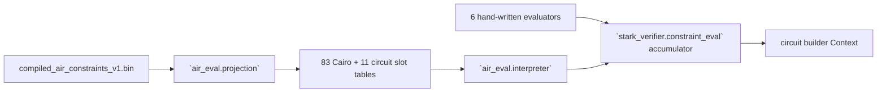

# `stwo_circuit_frontend`

`stwo_circuit_frontend` is the Zig port of StarkWare's circuit recursion stage
(`https://github.com/starkware-libs/proving` at
`5a7c5ede4299c91a61df19a07cba4f7502c14230`). This revision holds the in-circuit
constraint evaluators (design milestone M4): a reader of the compiled-AIR
projection, an interpreter that replays each projected function through the
circuit builder, the six hand-written evaluators, and the evaluator slot tables.

| Property | Value |
| :--- | :--- |
| Version | `0.1.0` |
| Layer | `frontend` |
| Owner | `circuit-frontend` |
| Public Zig module | `stwo_circuit_frontend` |
| Focused CI host | Linux |
| Upstream | `proving@5a7c5ed` |

The [package contract](package.contract.json) and [public facade](mod.zig) are
the authoritative API records. The design is
[`02-design.md`](../../../design/starknet-proving-pipeline/recursion/02-design.md)
§2.2 and §5.4.

## Purpose and boundaries



The package owns the in-circuit side of the recursion verifier. It does not
generate Rust-shaped Zig: upstream's ~56k lines of generated evaluators are
interpreted from a pinned, SHA-256-authenticated projection produced by
`tools/stwo-circuit-oracle-rs`. The circuit builder (`builder/`), the rest of
`stark_verifier/`, the statements and the prover-side circuit AIR are later
milestones.

## Public API

```zig
const circuit = @import("stwo_circuit_frontend");

var projection = try circuit.air_eval.projection.parse(allocator, bytes);
defer projection.deinit();
var cairo = try circuit.air_eval.cairo_components.build(allocator, &projection);
defer cairo.deinit();
// Emit slot `i` into a builder context and composition accumulator.
try cairo.evaluate(i, Ctx, &ctx, &component_data, &accumulator, scratch);
```

The facade exports three namespaces: `air_eval`, `stark_verifier` and
`common`.

| Area | Exports |
| :--- | :--- |
| Projection | `air_eval.projection` (`parse`, `Projection`, `Source`, `Function`, `Expr`, `Step`) |
| Interpreter | `air_eval.interpreter.Interpreter(Ctx, Data)` |
| Slot tables | `air_eval.cairo_components` (83 slots), `air_eval.circuit_components` (11), `air_eval.component_table` |
| Composition | `stark_verifier.constraint_eval` (`CompositionConstraintAccumulator`, `InteractionAtOods`, `RelationUse`), `stark_verifier.logup` |
| Harness data | `stark_verifier.test_utils.TestComponentData` |
| Utilities | `common.component_utils.seqOfComponentSize` |

Every evaluator is generic over a builder context type `Ctx` exposing `Var`,
`zero`, `one`, `constant`, `add`, `sub`, `mul`, `eq`, `inv` and `newVar` with
the semantics of `crates/circuits/src/{context,ops}.rs`.

## Dependencies

- `stwo_core` (`../../core`): M31/QM31 arithmetic.

The package must not depend on `stwo_cairo_frontend`. The Cairo slot order and
the Cairo constants come from the projection header; the test-only root
`conformance/circuit_cairo_slot_order_test_root.zig` asserts the slot order
equals `official_claim_registry.enable_slots`.

## Build, test, and run

```bash
zig build test --build-file src/frontends/circuit/build.zig -Doptimize=ReleaseFast -j2
zig build test-r3 --build-file src/frontends/circuit/build.zig -j2
zig build circuit-air-projection-check --build-file src/frontends/circuit/build.zig -j2
```

`test-r3` runs all 94 evaluators in value and topology mode against
`vectors/circuit/r3/components.json` and the two upstream
`sample_evaluations.json` files.

## Contract and invariants

- Byte parity with Rust is the contract: every evaluator emits the builder ops
  of the generated (or hand-written) Rust code in the same order. The
  interpreter never folds, interns or caches values; the builder's index-only
  peepholes decide which ops become gates.
- The reader authenticates each function record by SHA-256 and rejects unknown
  tags, invalid flags, out-of-range string indices, trailing bytes and
  truncation. It asserts, and never recomputes, the generator rules the oracle
  applied (trimmed lookup tuples, sorted used atoms, manual exclusion).
- A function body that reads `Seq` calls `seq_of_component_size` once, at its
  top, as the generated code does; subroutine bodies repeat it.

## Change checklist

- Regenerate the projection only with
  `python3 scripts/generate_circuit_oracle_vectors.py`.
- Keep R3 green: `zig build test-r3` compares n_vars, per-kind gate hashes,
  gate-list, debug-text and value hashes, and results for all 94 evaluators.
- A new hand-written upstream evaluator needs a `manual/` port and an entry in
  `cairo_components.zig` or `circuit_components.zig`.

## Related documentation

- [Circuit recursion design](../../../design/starknet-proving-pipeline/recursion/02-design.md)
- [Rust porting map](../../../design/starknet-proving-pipeline/recursion/01-rust-map.md)
- [Circuit parity fixtures](../../../vectors/circuit/README.md)
