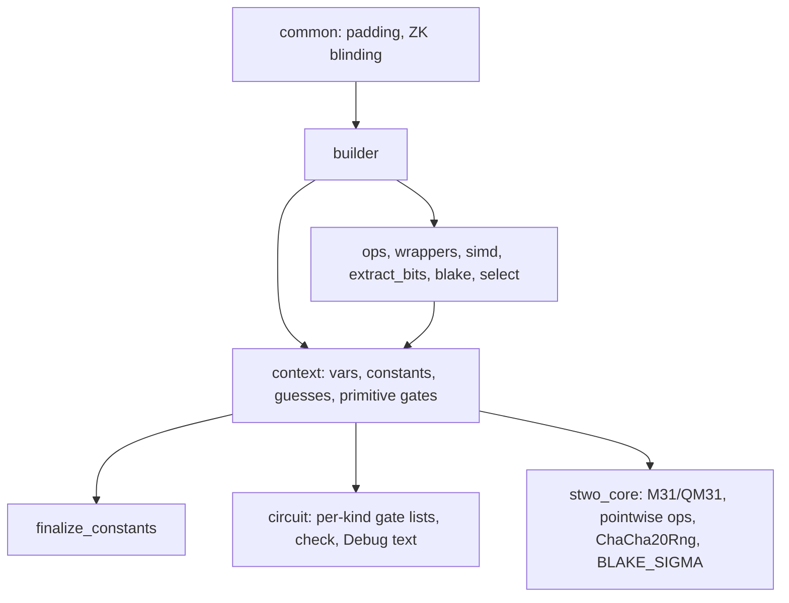

# `stwo_circuit_frontend`

The circuit recursion frontend: a call-order-exact Zig port of StarkWare's
circuit recursion stage ([starkware-libs/proving](https://github.com/starkware-libs/proving)
at commit `5a7c5ede4299c91a61df19a07cba4f7502c14230`). Byte parity with Rust
is the contract: for the same inputs the Zig builder numbers every variable,
interns every constant and appends every gate exactly as the Rust builder
does, so preprocessed roots, circuit hashes and proofs can match byte for
byte.

| Property | Value |
| :--- | :--- |
| Version | `0.1.0` |
| Layer | `frontend` |
| Owner | `circuit-frontend` |
| Public Zig module | `stwo_circuit_frontend` |
| Focused CI host | Linux |
| Upstream | `proving@5a7c5ed` (`crates/circuits`, `crates/circuit_common`) |

The [package contract](package.contract.json) and [public facade](mod.zig) are
the authoritative API records. The design is
[02-design.md](../../../design/starknet-proving-pipeline/recursion/02-design.md)
§2.2 and §3; the Rust-to-Zig map is
[01-rust-map.md](../../../design/starknet-proving-pipeline/recursion/01-rust-map.md).

## Purpose and architecture

The package is filled milestone by milestone. Milestone M2 provides the
builder every later layer emits gates through:

- `builder` (`crates/circuits`): `Context(QM31)` builds a circuit with values
  (the production value path), `Context(NoValue)` the same topology without
  values. It owns variables, interned constants, guesses, reserved output
  wires, the primitive gates, `finalize_constants` and `finalize`, plus the
  gadgets: wrappers (M31, U16, U32), `Simd` lanes, `extract_bits`, the
  Blake2s gates and hash gadgets, and `select_by_index`.
- `common` (`crates/circuit_common`, the gate-emitting part of `finalize.rs`):
  `ComponentSizes`, `pad_to_targets`/`pad_context` and `add_zk_blinding`,
  which run on a finalized context through the real builder API.



Representation differs from Rust only where no order is observable:
variables and gate fields are `u32` (a circuit holds fewer than 2^31 variables
so addresses fit M31 columns), a `BlakeGGate` stores its four consecutive
outputs as `out_base` (asserted when the gate is added), permutations share
flat CSR lists, and gadget temporaries live in a per-context scratch arena.

### Status against design §3

Implemented as specified: `u32` vars and gates, the `out_base` BlakeGGate,
CSR permutations, `Context(QM31 | NoValue)`, first-use constant interning,
index-only peepholes, `finalize_constants` with `swapRemove`/ordered `retain`,
guess finalization, padding and ZK blinding through the real builder API, and
the order lint. Where this port and the design text differ:

- Padding appends real rows. The run-length pad descriptors of §3.1 are a
  memory optimization scheduled with the other builder wins (§9.2, M11); they
  must reproduce these rows exactly.
- The gate vectors are not pre-reserved from registry targets yet, and
  `Stats` and the unused-variable sets are always on rather than audit-only.
  Neither affects numbering.
- The lint allows `std.mem.sort`: in Zig 0.15 it is the stable block sort,
  which matches Rust's stable sorts. It bans the unstable `sortUnstable`,
  `std.sort.pdq` and `std.sort.heap`, and it runs as `zig build circuit-lint`.
- Upstream's `debug_info` map (diagnostics for `circuit_analysis`) is not
  ported; it never affects numbering.
- The `circuit_hash` R2 case replays `compute_circuit_hash` of
  `crates/circuit_verifier` in the test harness. The production gadget
  belongs to the circuit-verifier statement (M5).

## Public API

```zig
const circuit = @import("stwo_circuit_frontend");
const builder = circuit.builder;

var ctx = try builder.Context(QM31).init(allocator, 8); // 8 reserved output wires
defer ctx.deinit();
const a = try ctx.guess(value);
const b = try ctx.constant(QM31.one());
const sum = try ctx.add(a, b);
const digest = try builder.blake.blake2sU32s(QM31, &ctx, words, n_bytes);
try ctx.setOutputs(&output_vars);
try ctx.finalize(false);
try circuit.common.finalize.padToTargets(QM31, &ctx, targets);
```

| Area | Exports |
| :--- | :--- |
| Builder namespace | `builder` (`Context`, `Var`, `Circuit`, `NoValue`, and the modules `circuit`, `context`, `ivalue`, `ops`, `wrappers`, `simd`, `extract_bits`, `blake`, `select`, `finalize_constants`, `debug_format`) |
| Post-finalize passes | `common` (`finalize`: `ComponentSizes`, `padToTargets`, `padContext`; `zk_blinding`: `addZkBlinding`) |

Gadgets are free functions `f(comptime V, ctx: *Context(V), ...)`; the
primitive gates (`add`, `sub`, `mul`, `pointwiseMul`, `eq`, `div`, `inv`,
`guess*`, `permute`, `output`, and the `*Into` forms) are `Context` methods.
Every operation returns `error.OutOfMemory` or `error.TooManyVars`; after an
error the context may only be deinitialized. `Simd` data and returned slices
are owned by `ctx.scratch()` and live until `deinit`.

## Dependencies

- `stwo_core`: M31/QM31 arithmetic, the QM31 pointwise helpers, `ChaCha20Rng`
  and `BLAKE_SIGMA`.

The package must not depend on `stwo_cairo_frontend`; the lint enforces it.

## Build, test, and run

From the repository root:

```sh
zig build test --build-file src/frontends/circuit/build.zig -Doptimize=ReleaseFast -j2
zig build circuit-parity-r1 --build-file src/frontends/circuit/build.zig
zig build circuit-parity-r2 --build-file src/frontends/circuit/build.zig
python3 scripts/lint_circuit_frontend.py
```

The package test step runs the unit tests (the upstream `expect!` snapshots
of `crates/circuits`, kept verbatim) and the fixture test, which rebuilds all
20 cases of `vectors/circuit/r2/gadgets.json` in value and topology mode and
compares gate-list, value and `Debug`-text digests, output wires and values
with the oracle. Neither needs Rust.

## Contract and invariants

- Variables 0, 1 and 2 are zero, one and `u`; `u` is an output from the
  constructor; `init(gpa, n)` reserves variables `3..3+n`.
- Variables are numbered in call order. Constants are interned in first-use
  order and keep interning after `finalize`.
- `add` elides a gate only when an operand is variable 0, `mul` only when an
  operand is variable 0 or 1. Nothing folds values or hash-conses gates.
- `finalize` is `finalize_constants` (verbatim, including `IndexMap`
  `swap_remove` and `retain` order), the optional use check, then one
  yield gate per guess in guess order.
- `Context(QM31)` and `Context(NoValue)` build identical gate lists.
- Value-mode `div`/`inv` of zero and malformed `u32` witnesses panic, as the
  Rust builder does.

## Change checklist

- Keep each file's builder calls in upstream order; `eval!` expressions expand
  left subtree, right subtree, operation.
- Run the package tests and `python3 scripts/lint_circuit_frontend.py`.
- A change of upstream revision regenerates the oracle vectors first.

## Related documentation

- [Recursion design](../../../design/starknet-proving-pipeline/recursion/02-design.md)
- [Rust porting map](../../../design/starknet-proving-pipeline/recursion/01-rust-map.md)
- [Circuit fixtures](../../../vectors/circuit/README.md)
