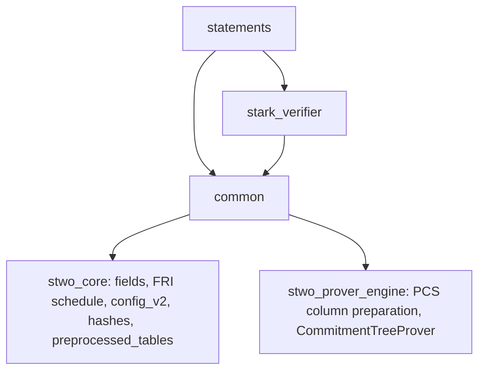

# `stwo_circuit_frontend`

The circuit recursion frontend: a call-order-exact Zig port of StarkWare's
circuit recursion stage (the `circuits`, `circuit_common`, `stark_verifier`,
`circuit_verifier` and `circuit_multiverifier` crates of
[starkware-libs/proving](https://github.com/starkware-libs/proving) at
commit `5a7c5ede4299c91a61df19a07cba4f7502c14230`). Byte parity with Rust is
the contract: the same inputs must give the same preprocessed roots, circuit
hashes and proofs.

| Property | Value |
| --- | --- |
| Version | `0.1.0` |
| Layer | `frontend` |
| Owner | `circuit-frontend` |
| Focused CI host | Linux |

## Purpose and architecture

The package follows the layout of design §2.2
([02-design.md](../../../design/starknet-proving-pipeline/recursion/02-design.md)):
one Zig file per Rust file, Rust function order kept inside each file. It is
being filled milestone by milestone. Today it holds the parts of M5 that do
not emit gates:

- `common`: the shared component list (`ComponentList`, `PerComponent`,
  relation ids, `INTERACTION_POW_BITS`, static component facts),
  `ComponentSizes` and the padded-size rules, the circuit hash
  (`configWords`, `hostCircuitHash`), and preprocessing (`ColumnLayout`,
  `PreprocessedCircuit` built from a `CircuitView`, and `preprocessedRoot`
  through the prover's PCS commit path).
- `stark_verifier`: `ProofConfig`, `ProofInfo` (the proof size model),
  `N_COMPOSITION_COLUMNS` and `pack_into_qm31s`.
- `statements`: `circuit_verifier_proof_config`, `CircuitConfig`,
  `SharedConfig` and the fold shared config of `CanonicalCircuit::build`.

The builder (`builder/`, M2), the in-circuit evaluators (`air_eval/`, M4),
and the gate-emitting verifier gadgets (channel, Merkle, FRI, OODS,
composition, the statements' `guess` traversals and `build_*_circuit`) come
next and sit on top of these modules.



## Public API

```zig
const circuit = @import("stwo_circuit_frontend");

const layout = try circuit.common.preprocessed.ColumnLayout.fromComponentSizes(sizes);
const log_sizes = try circuit.statements.circuit_statement.circuitComponentLogSizes(&layout);
const hash = try circuit.common.circuit_hash.hostCircuitHash(log_sizes, log_blowup, root);
```

- `common`: component list, finalize sizing, circuit hash, preprocessing.
- `stark_verifier`: proof configuration and size model.
- `statements`: circuit-verifier and multiverifier configuration.

## Dependencies

- `stwo_core`: fields, `fri.allFoldSteps`, `pcs.config_v2`, the Blake2s
  hashers and channel profiles, `preprocessed_tables`.
- `stwo_prover_engine`: `pcs.column_preparation`, `TwiddleSource` and
  `pcs.CommitmentTreeProver` for the preprocessed root.

There is no dependency on `stwo_cairo_frontend` or on
`src/frontends/riscv/recursion`; the RISC-V recursion builder hash-conses and
folds constants, which would renumber circuit variables.

## Build, test, and run

```sh
zig build test --build-file src/frontends/circuit/build.zig -Doptimize=ReleaseFast -j2
zig build circuit-parity-r6-fold --build-file src/frontends/circuit/build.zig
```

Tests that read `vectors/circuit` run from the repository root. The fold
topology rung (`conformance/fold_topology_test.zig`) checks the 45-column
layout, every committed registry's circuit hash, the R0 circuit-hash
vectors, the static component facts against the R3 fixture, and
`ProofInfo.totalBytes` against the 182,884-byte multiverifier `proof.bin`.

## Contract and invariants

- Every circuit has 45 preprocessed columns, stable-sorted by length.
- `configWords` is the only definition of the 12-byte config layout;
  `PerComponent` and `ComponentList` are the only component order.
- `ComponentSizes` is the only size struct; registry log sizes map into it
  by field name.
- `preprocessedRoot` commits through the prover's own path (the PCS column
  preparation shared by every commit, the owned `TwiddleSource`, and
  `CommitmentTreeProver`), like upstream's `CommitmentTreeProver::new`; it
  composes no interpolation, extension, twiddle or Merkle steps itself.
- `CircuitView.validate` checks every index `fromCircuit` dereferences;
  malformed views fail with `VariableOutOfRange` where upstream panics, and
  addresses `>= P` fail with `AddressOutOfField` where upstream reduces.
- Sorting is stable (`std.sort.insertion`), and no hash-map iteration
  order reaches an output.

## Change checklist

- Cite the upstream Rust file and keep its function order.
- Add or update a parity test against upstream output or a committed fixture.
- Keep new shared rules in one place and import them.
- Run the focused CI command above.

## Related documentation

- [Porting map](../../../design/starknet-proving-pipeline/recursion/01-rust-map.md)
- [Design](../../../design/starknet-proving-pipeline/recursion/02-design.md)
- [Circuit fixtures](../../../vectors/circuit/README.md)
