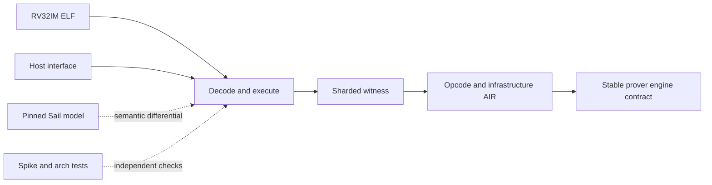

# `stwo_riscv_frontend`

`stwo_riscv_frontend` is the backend-neutral, Sail-authoritative RV32IM zkVM
frontend. It loads and executes supported ELF programs, constructs sharded
execution witnesses, defines the RISC-V AIR and claims, and drives any engine
that satisfies the stable prover transaction contract.

| Property | Value |
| :--- | :--- |
| Version | `0.1.0` |
| Layer | `frontend` |
| Owner | `riscv-frontend` |
| Public Zig module | `stwo_riscv_frontend` |
| Focused CI host | Linux |
| ISA profile | `rv32im-zkvm-v1` |

The [package contract](package.contract.json) is the API/dependency authority;
[mod.zig](mod.zig) is the public facade.

## Architecture and semantic authority



The pinned Sail model owns instruction semantics. Spike and architectural tests
provide independent execution checks. Legacy Stark-V material is not semantic
or release authority.

The frontend covers all 46 admitted proof opcodes and owns access-clock,
witness-layout, opcode-manifest, statement, and infrastructure-trace rules. It
does not select CPU or Metal; integration packages make that decision.

## Public API

```zig
const riscv = @import("stwo_riscv_frontend");

var result = try riscv.runWithInput(
    allocator,
    elf_bytes,
    public_input,
    max_steps,
);
defer result.deinit();

// Backend integrations call the engine-generic proving entry points.
const Claim = riscv.RiscVClaim;
```

| Area | Exports |
| :--- | :--- |
| Execution | `runner`, `Cpu`, `Memory`, `Opcode`, `runWithInput`, `runWithHost` |
| Host boundary | `host`, `HostInterface`, `HostRuntime` |
| AIR and witness | `air`, `access_clock`, `infra_trace`, `witness_layout`, `opcode_manifest` |
| ISA and diagnostics | `isa`, `diagnostics`, `testing` |
| Statement ownership | `RiscVClaim`, `owned_statement` |
| Engine-generic proving | `prover_mod`, `proveRiscVWithEngineAndPublicData`, `verifyRiscVWithEngine`, `proveAndVerifyElfWithEngine` |
| Trace-only proving | `proveRiscVTraceOnlyNoPublicIo` — synthesizes an empty public-I/O region, so it is for hand-built traces and I/O-free guests only and rejects a run whose committed memory carries public I/O |

The execution result and proof objects contain owned allocations; follow the
deinitialization methods on the returned concrete types. Host callbacks are
part of the public statement boundary and must be deterministic.

## Dependencies

- `stwo_core`
- `stwo_prover_api`
- `stwo_prover_engine`

No concrete backend dependency is allowed in the frontend.

## Build, test, and run

Focused package tests:

```sh
zig build test --build-file src/frontends/riscv/build.zig -Doptimize=ReleaseFast -j2
```

The same tests also run under the product gate, so they can be focused by name:

```sh
zig build test-riscv-cpu-product -Driscv-test-filter="access clock"
```

**Adding a test to this package.** Name its file in
[`test_inventory.zig`](test_inventory.zig). Zig collects a `test` only from a file
the compiler was made to analyse, and neither a `pub const x = @import("x.zig")`
nor `std.testing.refAllDecls` does that -- so a test in an unlisted file compiles
nowhere and reports nothing. `test_inventory_test.zig` fails when a test-bearing
file is missing from the list, and `test_floor` in `build.zig` fails when the
binary's test count drops.

Build and run the released CPU product:

```sh
zig build stwo-zig-riscv-cpu -Doptimize=ReleaseFast

zig-out/bin/stwo-zig-riscv-cpu prove \
  --elf vectors/riscv_elfs/branch_fib.elf \
  --backend cpu \
  --output riscv-proof.json --report-out riscv-report.json
```

Use the product help/application registry for the exact command surface. The
macOS Metal product is separate and fail closed:

```sh
zig build stwo-riscv-metal -Doptimize=ReleaseFast
```

That product step builds and installs the authenticated core metallib, binds its
manifest digest into the executable identity, and admits it before any prover
warmup. Proving and benchmarking fail closed if the bundle is missing, altered,
or cannot supply the resident RISC-V AIR kernels; help, registry, and retained
proof verification remain device-free.

## EthProofs CSP benchmark

The standard client-side proving benchmark runs SHA-256, Keccak-256,
Poseidon2-M31, and pure-software secp256k1 ECDSA workloads pinned in
[`vectors/riscv_csp/manifest-v2.json`](../../../vectors/riscv_csp/manifest-v2.json).
The manifest authenticates the upstream CSP revision and generators, every
guest source and lockfile, committed RV32IM ELFs, deterministic inputs,
expected outputs, exact retirement counts, and precompile classification.

Run the complete canonical matrix with:

```sh
zig build riscv-csp-bench -Doptimize=ReleaseFast
zig build riscv-csp-bench-metal -Doptimize=ReleaseFast
```

Each build step installs its production prover and the separately owned trace
diagnostic, then runs sixteen rows with the `secure` protocol: five byte sizes
for each hash, five field-element sizes for Poseidon2-M31, and the exact dynamic
k256 ECDSA case. It performs one warmup and ten verified samples per row. CPU
evidence is written to `vectors/reports/riscv_csp_benchmark_report.json`; Metal
evidence uses `vectors/reports/riscv_csp_benchmark_report.metal.json` so the two
lanes cannot overwrite one another.

Every Metal row additionally retains structured resident-polynomial telemetry.
Publication fails unless every verified sample dispatched both the semantic and
lookup AIR batches from authenticated AOT and recorded zero eligible-route
declines; an opaque log digest is not accepted as proof of GPU execution.

For a quick, non-headline development run:

```sh
zig build stwo-zig-riscv-cpu riscv-trace-dump -Doptimize=ReleaseFast
python3 scripts/riscv_csp_benchmark.py \
  --targets sha256 --sizes 128 --warmups 0 --samples 1
```

The CSP proving duration is execution plus witness construction plus proof
generation; verification is reported separately. Proof size counts the
canonical Postcard proof bytes, while preprocessing size counts the retained
guest ELF. Every sample is internally verified, and the retained proof is
verified again in a separate process against the original ELF and expected
statement digest.

Every report carries one `result_class`, and the command never uploads a
result:

- `official-host-comparable` — captured on CSP's AWS `mac2.metal` Apple M1,
  8-core, 16-GiB host, on admissible power, over the complete canonical matrix
  with the required memory available. Only this class is CSP-comparable.
- `power-condition-non-publishable` — the run's power conditions cannot carry
  published timings: the host was not on AC power, or low power mode was not
  positively observed to be disabled. This class is decided *before* the host
  comparison and outranks it, because a throttled run is not a weaker
  measurement of the workload but not a measurement of it at all — including on
  the official host.
- `host-qualified-non-comparable` — power was admissible, but something else
  disqualifies the run from comparison: a host other than the publication host,
  an incomplete matrix, or insufficient available memory.

SHA-256, Keccak-256, and secp256k1 ECDSA are canonical CSP zkVM workloads.
Poseidon2-M31 is an explicitly labelled field-native extension: it uses CSP's
exact seeded M31 inputs but is not relabelled as CSP's BN254 `poseidon2`
target. Classic Poseidon, BN254 Poseidon2, and P-256 ECDSA remain in the
unsupported ledger. All four implemented targets use ordinary RV32IM software,
not precompiles. A one-byte-mutated k256 signature is retained as a negative
fixture and must produce the all-zero rejection output.

### Retained results and CSP rank — 2026-07-28

The table below is the retained secure matrix captured on 2026-07-28 from
commit `ed573380db2f7ee1bc364a091cf6c82a00500ec3`; the complete machine-readable
data is in the
[`riscv_csp_benchmark_report.json`](../../../vectors/reports/riscv_csp_benchmark_report.json)
report. `Proof` is execution plus witness construction plus proof generation.
Times are seconds.

| CSP workload | Input | Proof | Verify | RV32IM cycles | CSP proof-time rank/status on 2026-07-28 | Base RV32IM software | Dedicated crypto opcode | Precompile |
| :--- | ---: | ---: | ---: | ---: | :--- | :---: | :---: | :---: |
| SHA-256 | 128 B | 1.985 | 0.164 | 14,056 | Unranked; published `stark-v` reference: **#12/16** (1.830 s) | Yes | No | No |
| SHA-256 | 256 B | 2.572 | 0.176 | 22,832 | Unranked; published `stark-v` reference: **#12/16** (1.861 s) | Yes | No | No |
| SHA-256 | 512 B | 2.696 | 0.182 | 40,384 | Unranked; published `stark-v` reference: **#11/16** (1.907 s) | Yes | No | No |
| SHA-256 | 1,024 B | 3.017 | 0.182 | 75,488 | Unranked; published `stark-v` reference: **#9/16** (1.977 s) | Yes | No | No |
| SHA-256 | 2,048 B | 3.754 | 0.178 | 145,696 | Unranked; published `stark-v` reference: **#7/16** (2.175 s) | Yes | No | No |
| Keccak-256 | 128 B | 2.252 | 0.175 | 19,114 | Unranked; published `stark-v` reference: **#8/10** (1.828 s) | Yes | No | No |
| Keccak-256 | 256 B | 2.287 | 0.176 | 36,904 | Unranked; published `stark-v` reference: **#8/10** (1.861 s) | Yes | No | No |
| Keccak-256 | 512 B | 3.388 | 0.180 | 72,408 | Unranked; published `stark-v` reference: **#5/10** (1.927 s) | Yes | No | No |
| Keccak-256 | 1,024 B | 3.540 | 0.181 | 143,416 | Unranked; published `stark-v` reference: **#4/10** (2.053 s) | Yes | No | No |
| Keccak-256 | 2,048 B | 5.209 | 0.191 | 285,456 | Unranked; published `stark-v` reference: **#3/10** (2.329 s) | Yes | No | No |
| Poseidon2-M31 | 2 elements | 2.670 | 0.179 | 82,297 | **N/A** — M31 extension; CSP `poseidon2` is BN254 | Yes | No | No |
| Poseidon2-M31 | 4 elements | 3.607 | 0.185 | 164,403 | **N/A** — M31 extension; CSP `poseidon2` is BN254 | Yes | No | No |
| Poseidon2-M31 | 8 elements | 6.490 | 0.209 | 328,615 | **N/A** — M31 extension; CSP `poseidon2` is BN254 | Yes | No | No |
| Poseidon2-M31 | 12 elements | 6.829 | 0.232 | 492,827 | **N/A** — M31 extension; CSP `poseidon2` is BN254 | Yes | No | No |
| Poseidon2-M31 | 16 elements | 8.906 | 0.240 | 657,039 | **N/A** — M31 extension; CSP `poseidon2` is BN254 | Yes | No | No |
| secp256k1 ECDSA | 32 B digest | 55.745 | 0.232 | 5,425,005 | **Unranked** — exact CSP workload, not uploaded | Yes | No | No |

Rank methodology: the [EthProofs CSP benchmark
page](https://ethproofs.org/csp-benchmarks) was checked on 2026-07-28
(Europe/Lisbon); its dataset reported a last update of 2026-06-30 08:32 UTC.
The displayed reference ordinal is obtained by sorting all published systems
for the same target and input size by proof duration, fastest first. It belongs
to the historical published `stark-v` row, not to the current
`stwo-zig-riscv` binary. The current report was collected on an Apple M5 Max,
not CSP's AWS `mac2.metal` Apple M1/8-core/16-GiB host, and was not uploaded;
therefore its timings are host-qualified and its official CSP rank is
`Unranked`. Poseidon2-M31 has no ordinal because changing the field changes the
workload. The upstream workload source is pinned to
[`privacy-ethereum/csp-benchmarks@269c43c`](https://github.com/privacy-ethereum/csp-benchmarks/tree/269c43cc32d3127e3d9ce74d20652887d894cca3).

An audit can additionally regenerate every input and expected digest from a
clean checkout of the pinned upstream repository:

```sh
python3 scripts/riscv_csp_benchmark.py \
  --audit-csp-source /path/to/csp-benchmarks \
  --targets sha256 --sizes 128 --warmups 0 --samples 1
```

The upstream checkout must be at the manifest commit, be clean, contain the
authenticated source files, and have its locked release `utils` executable and
library built. The audit recompiles the repository adapter against that
library, regenerates the byte, M31, k256, and negative fixtures, and fails
rather than falling back to committed inputs.

## Contract and invariants

- API signature: runner and engine-generic proving entry points remain present.
- Behavioral invariant: every one of the 46 proof opcodes reaches its witness,
  semantic, lookup, and component authorities.

Release evidence additionally covers operand classes, trace vectors,
adversarial witnesses, selector rigidity, access determinacy, Sail
differentials, and independent artifact verification.

### Formal-refinement integration

Production semantics and formal export share the same typed
`ConstraintProgram`; a second handwritten AIR model is not an accepted source
of evidence. The manifest-wide publication gate is designed to bind all 46
selectors to generated AIR, generated Sail, exact theorem identities, source
digests, and axiom records. It remains fail-closed until every binding is
present. Changes under this package are included in
`.github/workflows/riscv-refinement.yml` and must keep the neutral publication
inventory exact.

Completed FV-1/FV-2 artifacts establish local opcode retirement refinement;
the aggregate 46-opcode receipt has not yet been promoted. Even after that
promotion, FV-1/FV-2 do not establish arbitrary frontend-trace composition,
the complete Word32/M31 invariant, or proof-system soundness. The authoritative
boundary and remaining gates are in
[`RISCV_FRONTEND_VERIFICATION_STATUS.md`](../../../soundness/RISCV_FRONTEND_VERIFICATION_STATUS.md);
the reproducible proof entry point is documented in
[`formal/riscv-refinement/README.md`](../../../formal/riscv-refinement/README.md).

## Change checklist

1. Derive semantic changes from the pinned Sail contract.
2. Keep execution, witness, AIR, and public statement mappings explicit.
3. Extend positive, negative, and adversarial coverage for every affected
   opcode family.
4. Preserve backend neutrality and deterministic host behavior.
5. Run the package suite, `python3 scripts/riscv_refinement.py verify`, and the
   complete RISC-V release gate.

## Related documentation

- [RISC-V Sail contract](../../../conformance/2026-07-26-riscv-sail-contract.md)
- [RISC-V release evidence](../../../conformance/riscv-release-evidence.md)
- [RISC-V verification status](../../../soundness/RISCV_FRONTEND_VERIFICATION_STATUS.md)
- [Universal AIR to Sail refinement plan](../../../soundness/UNIVERSAL_AIR_SAIL_REFINEMENT.md)
- [CPU integration](../../integrations/riscv_cpu/README.md)
- [Metal integration](../../integrations/riscv_metal/README.md)
