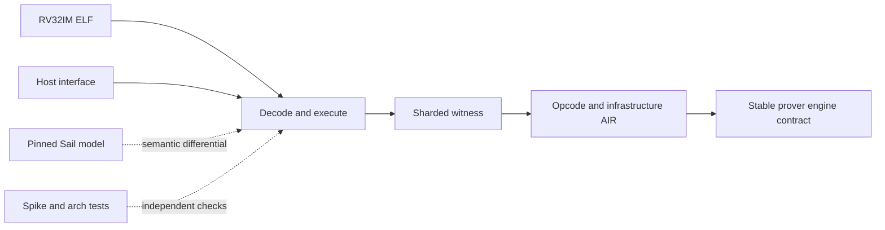

# `stwo_riscv_frontend`

`stwo_riscv_frontend` is the backend-neutral, Sail-authoritative RV32IM zkVM
frontend. It loads and executes supported ELF programs, constructs sharded
execution witnesses, defines the RISC-V AIR and claims, and drives any engine
that satisfies the stable prover transaction contract.

| Property | Value |
| :--- | :--- |
| Version | `0.1.0` |
| Layer | `frontend` |
| Owner | `riscv-frontend` |
| Public Zig module | `stwo_riscv_frontend` |
| Focused CI host | Linux |
| ISA profile | `rv32im-zkvm-v1` |

The [package contract](package.contract.json) is the API/dependency authority;
[mod.zig](mod.zig) is the public facade.

## Architecture and semantic authority



The pinned Sail model owns instruction semantics. Spike and architectural tests
provide independent execution checks. Legacy Stark-V material is not semantic
or release authority.

The frontend covers all 46 admitted proof opcodes and owns access-clock,
witness-layout, opcode-manifest, statement, and infrastructure-trace rules. It
does not select CPU or Metal; integration packages make that decision.

## Public API

```zig
const riscv = @import("stwo_riscv_frontend");

var result = try riscv.runWithInput(
    allocator,
    elf_bytes,
    public_input,
    max_steps,
);
defer result.deinit();

// Backend integrations call the engine-generic proving entry points.
const Claim = riscv.RiscVClaim;
```

| Area | Exports |
| :--- | :--- |
| Execution | `runner`, `Cpu`, `Memory`, `Opcode`, `runWithInput`, `runWithHost` |
| Host boundary | `host`, `HostInterface`, `HostRuntime` |
| AIR and witness | `air`, `access_clock`, `infra_trace`, `witness_layout`, `opcode_manifest` |
| ISA and diagnostics | `isa`, `diagnostics`, `testing` |
| Statement ownership | `RiscVClaim`, `owned_statement` |
| Engine-generic proving | `prover_mod`, `proveRiscVWithEngine`, `proveRiscVWithEngineAndPublicData`, `verifyRiscVWithEngine`, `proveAndVerifyElfWithEngine` |

The execution result and proof objects contain owned allocations; follow the
deinitialization methods on the returned concrete types. Host callbacks are
part of the public statement boundary and must be deterministic.

## Dependencies

- `stwo_core`
- `stwo_prover_api`
- `stwo_prover_engine`

No concrete backend dependency is allowed in the frontend.

## Build, test, and run

Focused package tests:

```sh
zig build test --build-file src/frontends/riscv/build.zig -Doptimize=ReleaseFast -j2
```

Build and run the released CPU product:

```sh
zig build stwo-zig-riscv-cpu -Doptimize=ReleaseFast

zig-out/bin/stwo-zig-riscv-cpu prove \
  --elf vectors/riscv_elfs/branch_fib.elf \
  --backend cpu \
  --output riscv-proof.json --report-out riscv-report.json
```

Use the product help/application registry for the exact command surface. The
macOS Metal product is separate and fail closed:

```sh
zig build stwo-riscv-metal -Doptimize=ReleaseFast
```

## EthProofs CSP benchmark

The standard client-side proving benchmark runs the exact SHA-256 and
Keccak-256 workloads pinned in
[`vectors/riscv_csp/manifest-v1.json`](../../../vectors/riscv_csp/manifest-v1.json).
The manifest authenticates the upstream CSP revision, guest sources and
lockfiles, committed RV32IM ELFs, deterministic inputs, expected digests, and
expected retirement counts.

Run the complete canonical matrix with:

```sh
zig build riscv-csp-bench -Doptimize=ReleaseFast
```

The build step installs the production CPU prover and trace diagnostic, then
runs both targets over 128, 256, 512, 1024, and 2048 input bytes with the
`secure` protocol. It performs one warmup and ten verified samples per row and
writes `vectors/reports/riscv_csp_benchmark_report.json`.

For a quick, non-headline development run:

```sh
zig build stwo-zig-riscv-cpu riscv-trace-dump -Doptimize=ReleaseFast
python3 scripts/riscv_csp_benchmark.py \
  --targets sha256 --sizes 128 --warmups 0 --samples 1
```

The CSP proving duration is execution plus witness construction plus proof
generation; verification is reported separately. Proof size counts the
canonical Postcard proof bytes, while preprocessing size counts the retained
guest ELF. Every sample is internally verified, and the retained proof is
verified again in a separate process against the original ELF and expected
statement digest.

Results collected away from CSP's AWS `mac2.metal` Apple M1, 8-core, 16-GiB
host are deliberately labelled `host-qualified-non-comparable`. The command
never uploads a result. ECDSA, Poseidon, and Poseidon2 remain in the manifest's
explicit unsupported ledger until workload-identical guests are committed.

An audit can additionally regenerate every input and expected digest from a
clean checkout of the pinned upstream repository:

```sh
python3 scripts/riscv_csp_benchmark.py \
  --audit-csp-source /path/to/csp-benchmarks \
  --targets sha256 --sizes 128 --warmups 0 --samples 1
```

The upstream checkout must be at the manifest commit, be clean, contain the
authenticated source files, and have its locked release `utils` executable
built. Audit failure is fatal and cannot silently fall back to committed
fixtures.

## Contract and invariants

- API signature: runner and engine-generic proving entry points remain present.
- Behavioral invariant: every one of the 46 proof opcodes reaches its witness,
  semantic, lookup, and component authorities.

Release evidence additionally covers operand classes, trace vectors,
adversarial witnesses, selector rigidity, access determinacy, Sail
differentials, and independent artifact verification.

## Change checklist

1. Derive semantic changes from the pinned Sail contract.
2. Keep execution, witness, AIR, and public statement mappings explicit.
3. Extend positive, negative, and adversarial coverage for every affected
   opcode family.
4. Preserve backend neutrality and deterministic host behavior.
5. Run the package suite and the complete RISC-V release gate.

## Related documentation

- [RISC-V Sail contract](../../../conformance/2026-07-26-riscv-sail-contract.md)
- [RISC-V release evidence](../../../conformance/riscv-release-evidence.md)
- [Universal AIR to Sail refinement plan](../../../soundness/UNIVERSAL_AIR_SAIL_REFINEMENT.md)
- [CPU integration](../../integrations/riscv_cpu/README.md)
- [Metal integration](../../integrations/riscv_metal/README.md)
