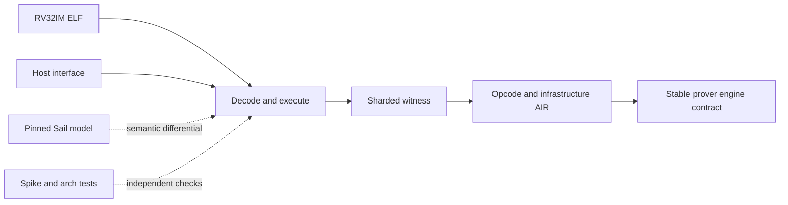

# `stwo_riscv_frontend`

`stwo_riscv_frontend` is the backend-neutral, Sail-authoritative RV32IM zkVM
frontend. It loads and executes supported ELF programs, constructs sharded
execution witnesses, defines the RISC-V AIR and claims, and drives any engine
that satisfies the stable prover transaction contract.

| Property | Value |
| :--- | :--- |
| Version | `0.1.0` |
| Layer | `frontend` |
| Owner | `riscv-frontend` |
| Public Zig module | `stwo_riscv_frontend` |
| Focused CI host | Linux |
| ISA profile | `rv32im-zkvm-v1` |

The [package contract](package.contract.json) is the API/dependency authority;
[mod.zig](mod.zig) is the public facade.

The [composition preparation boundary](recursion/COMPOSITION_PREPARATION.md)
documents immutable recursive preparation, explicit admission and audit checks,
and its focused development commands.
The [proving-stack development plan](../../../design/riscv-proving-stack/plan.md)
tracks small complete proofs, shared protocol ownership and measured scaling.

## Architecture and semantic authority


```mermaid
flowchart LR
    ELF[RV32IM ELF] --> Runner[Decode and execute]
    Host[Host interface] --> Runner
    Runner --> Witness[Sharded witness]
    Witness --> AIR[Opcode and infrastructure AIR]
    AIR --> Engine[Stable prover engine contract]
    Sail[Pinned Sail model] -. semantic differential .-> Runner
    Spike[Spike and arch tests] -. independent checks .-> Runner
```

The pinned Sail model owns instruction semantics. Spike and architectural tests
provide independent execution checks. Legacy Stark-V material is not semantic
or release authority.

The frontend covers all 46 admitted proof opcodes and owns access-clock,
witness-layout, opcode-manifest, statement, and infrastructure-trace rules. It
does not select CPU or Metal; integration packages make that decision.

Each protocol decision must have one owning definition: instruction admission,
AIR expressions and layouts, lookup ordering, claims, transcript order and
continuation. Native, recursive and backend adapters consume those definitions;
an optimized evaluator must not introduce a second constraint specification.
Independent reference checks remain separate. Remove superseded implementations
and their exports/build targets together once the surviving route passes its
proof gate; retain versioned readers required by supported proof artifacts.

## Public API

```zig
const riscv = @import("stwo_riscv_frontend");

var result = try riscv.runWithInput(
    allocator,
    elf_bytes,
    public_input,
    max_steps,
);
defer result.deinit();

// Backend integrations call the engine-generic proving entry points.
const Claim = riscv.RiscVClaim;
```

| Area | Exports |
| :--- | :--- |
| Execution | `runner`, `Cpu`, `Memory`, `Opcode`, `runWithInput`, `runWithHost` |
| Host boundary | `host`, `HostInterface`, `HostRuntime` |
| AIR, recursion, and witness | `air`, `recursion`, `access_clock`, `infra_trace`, `witness_layout`, `opcode_manifest`, `statement_shape_inspection` |
| ISA and diagnostics | `isa`, `diagnostics`, `testing` |
| Statement ownership | `RiscVClaim`, `owned_statement` |
| Engine-generic proving | `prover_mod`, `proveRiscVWithEngineAndPublicData`, `proveRiscVWithEngineAndPublicDataWithExecution`, `verifyRiscVWithEngine`, `provePoseidon2WithEngineAndPublicData`, `verifyPoseidon2WithEngine`, `proveAndVerifyElfWithEngine` |
| Ethereum-profile proving | `proveEthereumWithEngine`, `proveEthereumWithEngineUsingExecution`, `verifyEthereumWithEngine` |
| Segment proving and verified capture | `proveRiscVSegmentV2WithEngine`, `verifyRiscVSegmentV2WithEngine`, `verifyRiscVSegmentV2WithEngineUsingChannelAndCapture`, `verifyRiscVWithEngineUsingChannelAndProofCapture`, `verifyRiscVWithEngineUsingChannelAndQueryCapture` |
| Proving instrumentation | `process_usage`, `provePoseidon2WithEngineAndPublicDataUsingChannelAndPhaseMeter` |
| Execution geometry | `MAX_EXECUTION_STEPS` — the canonical one-shot AIR clock bound shared by execution admission and guest-profile routing |
| Trace-only proving | `proveRiscVTraceOnlyNoPublicIo` — synthesizes an empty public-I/O region, so it is for hand-built traces and I/O-free guests only and rejects a run whose committed memory carries public I/O |

The execution result and proof objects contain owned allocations; follow the
deinitialization methods on the returned concrete types. Host callbacks are
part of the public statement boundary and must be deterministic.


## Dependencies

- `stwo_core`
- `stwo_prover_api`
- `stwo_prover_engine`

No concrete backend dependency is allowed in the frontend.

## Build, test, and run

Focused package tests:

```sh
zig build test --build-file src/frontends/riscv/build.zig -Doptimize=Debug -j2
```

The same tests also run under the product gate, so they can be focused by name:

```sh
zig build test-riscv-cpu-product -Driscv-test-filter="access clock"
```

**Adding a test to this package.** Name its file in
[`test_inventory.zig`](test_inventory.zig). Zig collects a `test` only from a file
the compiler was made to analyse, and neither a `pub const x = @import("x.zig")`
nor `std.testing.refAllDecls` does that -- so a test in an unlisted file compiles
nowhere and reports nothing. `test_inventory_test.zig` fails when a test-bearing
file is missing from the list, and `test_floor` in `build.zig` fails when the
binary's test count drops.

Build and run the released CPU product:

```sh
zig build stwo-zig-riscv-cpu -Doptimize=ReleaseFast

zig-out/bin/stwo-zig-riscv-cpu prove \
  --elf vectors/riscv_elfs/branch_fib.elf \
  --backend cpu \
  --output riscv-proof.json --report-out riscv-report.json
```

Use the product help/application registry for the exact command surface. The
macOS Metal product is separate and fail closed:

```sh
zig build stwo-riscv-metal -Doptimize=ReleaseFast
```

That product step builds and installs the authenticated core metallib, binds its
manifest digest into the executable identity, and admits it before any prover
warmup. Proving and benchmarking fail closed if the bundle is missing, altered,
or cannot supply the resident RISC-V AIR kernels; help, registry, and retained
proof verification remain device-free.

For native CSP performance and proof verification, use the pinned matrix:

```sh
zig build riscv-csp-bench -Doptimize=ReleaseFast
```

The retained detached SegmentV2 leaf/parent tools are built by the CPU package;
Metal supplies explicit backend-bound producers. See the
[CPU integration](../../integrations/riscv_cpu/README.md),
[Metal integration](../../integrations/riscv_metal/README.md), and
[canonical recursion contract](../../../design/riscv-proving-stack/recursion/canonical-typed-recursion.md).
This protocol proves bounded execution spans. It does not by itself establish
all global memory, lookup, ROM, and caller relations required for a complete
Ethereum block statement.

The experimental block-v5 architecture and its former product/build commands
are preserved on `archive/riscv-ethereum-block-v5-20261006` at commit
`f374b1db6`. Shared SHA, Keccak, elliptic-curve precompiles and the
CSP-compatible Ethereum guest profile remain in the supported frontend.

## Contract and invariants

- API signature: runner and engine-generic proving entry points remain present.
- Behavioral invariant: every one of the 46 proof opcodes reaches its witness,
  semantic, lookup, and component authorities.

Release evidence additionally covers operand classes, trace vectors,
adversarial witnesses, selector rigidity, access determinacy, Sail
differentials, and independent artifact verification.

### Formal-refinement integration

Production semantics and formal export share the same typed
`ConstraintProgram`; a second handwritten AIR model is not an accepted source
of evidence. The manifest-wide publication gate is designed to bind all 46
selectors to generated AIR, generated Sail, exact theorem identities, source
digests, and axiom records. It remains fail-closed until every binding is
present. Changes under this package are included in
`.github/workflows/riscv-refinement.yml` and must keep the neutral publication
inventory exact.

Completed FV-1/FV-2 artifacts establish local opcode retirement refinement;
the aggregate 46-opcode receipt has not yet been promoted. Even after that
promotion, FV-1/FV-2 do not establish arbitrary frontend-trace composition,
the complete Word32/M31 invariant, or proof-system soundness. The authoritative
boundary and remaining gates are in
[`RISCV_FRONTEND_VERIFICATION_STATUS.md`](../../../soundness/RISCV_FRONTEND_VERIFICATION_STATUS.md);
the reproducible proof entry point is documented in
[`formal/riscv-refinement/README.md`](../../../formal/riscv-refinement/README.md).

## Change checklist

1. Derive semantic changes from the pinned Sail contract.
2. Keep execution, witness, AIR, and public statement mappings explicit.
3. Extend positive, negative, and adversarial coverage for every affected
   opcode family.
4. Preserve backend neutrality and deterministic host behavior.
5. Run the package suite, `python3 scripts/riscv_refinement.py verify`, and the
   complete RISC-V release gate.

## Related documentation

- [RISC-V Sail contract](../../../conformance/2026-07-26-riscv-sail-contract.md)
- [RISC-V Sail differential gate](../../../conformance/riscv-sail-differential-gate.md)
- [RISC-V verification status](../../../soundness/RISCV_FRONTEND_VERIFICATION_STATUS.md)
- [Universal AIR to Sail refinement plan](../../../soundness/UNIVERSAL_AIR_SAIL_REFINEMENT.md)
- [CPU integration](../../integrations/riscv_cpu/README.md)
- [Metal integration](../../integrations/riscv_metal/README.md)
