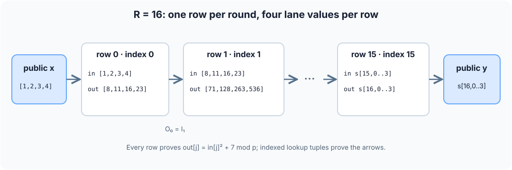

# 3. AIR rows, lookup closure, and proof polynomials

An arithmetic circuit is a graph. An AIR is a table layout plus polynomial
constraints on its rows. S31 compiles generic circuit gates into the pinned
circuit AIR. For one recognized recurrence, it can add a specialized AIR
component called the repeated-step chip. Both kinds of component enter **one
Stwo proof**.

## The program the chip recognizes

```s31
fn step(v: [m31; 4]) -> [m31; 4] {
    v .* v + splat<4>(7_m31)
}
circuit arith4_m31(public x: [m31; 4]) -> public [m31; 4] {
    let result = iterate<256>(step, x);
    result
}
```

The normalized relation has one `repeat` node with `rounds: 256` and body
`[{"op":"square"},{"op":"add_const","constant":7}]`. The programmer can
select `direct-gate` or `direct-chip` for this all-M31 source. Gate mode
unrolls 256 pointwise multiplications and 256 additions into the circuit.
Chip mode keeps public endpoint bindings in the circuit and proves the
256 transitions in a separate, linked AIR component. The chip accepts only
four public input lanes, four public output lanes, no assertions, this exact
square-then-add body, and a power-of-two round count from 16 to 32768.

## Fill a trace by hand

For each lane `j`, let `s[0,j]=x[j]` and
`s[i+1,j]=s[i,j]^2+7 mod p`, where `p=2147483647`.
The lane index `j` selects one of the four entries in the fixed array;
the row index `i` selects one recurrence step. One row holds **all four**
lane inputs and outputs. In mathematical notation:

$$
s_{0,j}=x_j,\qquad s_{i+1,j}=s_{i,j}^{2}+7\pmod p,
\qquad i=0,\ldots,R-1,\quad j=0,1,2,3.
$$

The chip has **nine base columns** and one row per round:

| Column | Meaning at logical row `i` |
| --- | --- |
| `index` | `i`, as an M31 element. |
| `in0..in3` | `s[i,0..3]`. |
| `out0..out3` | `s[i+1,0..3]`. |

Take a smaller eligible instance with `R=16` and public input
`x=[1,2,3,4]`. The first two rows are:

```text
logical row    index     in[0..3]          out[0..3]
     0           0       [1,2,3,4]         [8,11,16,23]
     1           1       [8,11,16,23]      [71,128,263,536]
     ...
    15          15       s[15,0..3]        y = s[16,0..3]
```



For row zero, lane three: `23 - 4² - 7 = 0`. For row one, lane zero:
`71 - 8² - 7 = 0`. These are hand calculations of the local AIR equation.
Internally Stwo stores rows in a bit-reversed circle-domain order; `index`
still denotes the logical round. The witness writer fills `index=i`, but
the AIR does not rely on that host loop as a constraint. The indexed lookup
below proves that the committed rows form the required endpoint path, up to
the lookup argument's collision probability.

## The chip's six actual row constraints

Four constraints prove the transition, one per lane:

```text
C[j] = out[j] - in[j]² - c = 0,       j = 0,1,2,3.
```

Equivalently, the four constraints are instances of
$C_j(i)=\operatorname{out}_{i,j}-\operatorname{in}_{i,j}^{2}-c=0$.
For the first hand-filled row, $C_3(0)=23-4^2-7=0$.

Here `c=7` is fixed in the program/key; a different build can pin another
canonical M31 constant. A local transition check alone does not say that
`out` in row `i` is `in` in row `i+1`. The chip therefore makes two
six-element tuples per row using a fixed relation tag `D=0x53333102`:

```text
I_i = (D, index,   in0,  in1,  in2,  in3)
O_i = (D, index+1, out0, out1, out2, out3)
```

The verifier draws random `alpha,z` in QM31 after the base commitment. Define
`H(t)=t0+alpha*t1+...+alpha^5*t5-z`. On each row, the interaction trace
stores `first = 1/H(I_i)` and a cyclic cumulative value `current`; let
`previous` be the preceding cumulative value. The chip claims a QM31 sum
`S`. Its two remaining row constraints are **exactly**:

```text
C[4] = first * H(I_i) - 1 = 0
C[5] = (current - previous - first + S/R) * H(O_i) + 1 = 0
```

`S/R` is field division by the nonzero public round count. `first` occupies
four M31 interaction columns and `current` occupies four more: eight
interaction columns total. The equations enforce nonzero tuple
denominators. Rearranging `C[5]` gives
`current-previous = 1/H(I_i)-1/H(O_i)-S/R`. Summing over all `R`
cyclic rows cancels the `current-previous` terms and yields

```text
S = Σ_i (1/H(I_i) - 1/H(O_i)).
```

For an honest path, every internal `O_i` equals the next `I_(i+1)`, so those
fractions cancel. The native verifier checks the public endpoint equation:

```text
S - 1/H(D,0,x0,x1,x2,x3) + 1/H(D,R,y0,y1,y2,y3) = 0.
```

The circuit separately binds the same `x` and `y` to the public statement.
There are exactly `R` chip rows, each edge advances its index by one, and
`R < p`, so an endpoint path from index zero to `R` uses all rows when the
random tuple compression has no collision. This is the reason the lookup
can connect rows without a conventional next-row selector. Its soundness
still depends on the lookup challenge and the reviewed AIR/PCS parameters.

## Where polynomials appear

Each fixed, base, and interaction column is committed as evaluations of a
low-degree circle-domain polynomial. An AIR expression such as
`out[j]-in[j]²-c` is evaluated from those column polynomials. On the trace
domain `H_R`, each of the six expressions must vanish. Schematically, if
`Z_H` vanishes exactly on `H_R`, the prover forms random linear combinations
of quotients `C_k/Z_H` on a larger evaluation domain. The actual Stwo
implementation uses circle-domain vanishing factors and lifted component
domains; `Z_H` is notation for that factor, **not** an assumption that
the trace domain is an ordinary multiplicative subgroup with `X^R-1`.

The schematic quotient identity for a local constraint is

$$
Q_j(X)=\frac{C_j(X)}{Z_{H_R}(X)},\qquad
C_j(X)=O_j(X)-I_j(X)^2-c.
$$

Here $I_j$ and $O_j$ interpolate the committed input/output columns. If
the trace values satisfy the recurrence, $C_j$ vanishes at every trace
point, so division by the trace vanishing factor leaves a low-degree
quotient. The actual Stwo circle-domain construction uses its own domain
mapping and composition rules; this equation explains the algebraic test,
not a serialized proof-polynomial format.

```text
committed trace columns ─▶ evaluate C_0..C_5 ─▶ divide by trace vanishing factor
                                            └─▶ random composition ─▶ FRI degree check
```

The verifier reconstructs challenges from the transcript, recomputes the
AIR expressions at sampled out-of-domain points, checks Merkle openings and
the FRI proof, and checks the lookup endpoint equation. A false witness
would need to satisfy the polynomial identities and all random checks. The
prover's calculation of `y` is only witness generation; it is not the proof
of the recurrence.

The generic circuit arithmetic component uses the same polynomial/quotient
machinery. Its fixed opcode/address columns and twelve value columns are
described in [the circuit chapter](circuits.md). Its LogUp relation proves
wire consistency across rows. Chip and circuit components share base and
interaction commitment trees, composition, FRI, transcript challenges, and
one native verifier invocation. The chip adds one AIR component with no new
preprocessed columns.

## What is inspectable today

`s31 lower` prints normalized relation JSON. `s31 explain PACKAGE` prints
source positions, canonical IDs, gate-row spans, selected profile, chip round
count, raw/padded rows, and fixed-cell cost. `s31 inspect PACKAGE` prints the
backend cost report and bound hashes. The six chip expressions above come
from the current row evaluator used by both prover and verifier.

The CLI does **not** yet render the pinned generic circuit AIR's full
instantiated polynomial program as text. The circuit equations in this guide
give the implemented gate semantics; a complete symbolic export and
source-to-constraint identity check remain audit-tool work. See
[packages and audit](proofs.md) for how to inspect the artifacts available
now.
