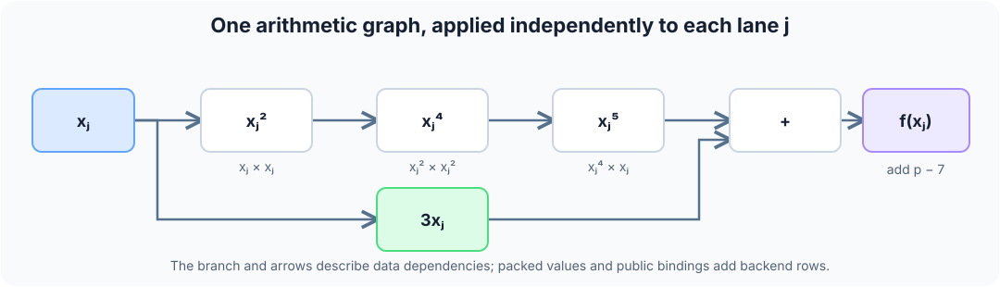
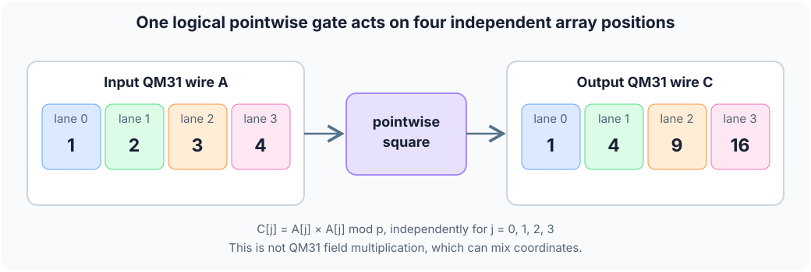

# 3. Normalized relation to circuit gates

The relation compiler first makes a canonical static single-assignment (SSA)
graph. Each input and operation has an ID; dependencies point to earlier IDs.
It folds constant arithmetic, removes identity operations such as `x+0`,
orders the operands of commutative `add`/`mul`, and shares identical
expressions. Source names remain in a source map even when two names share an
ID. The graph digest is recorded in the package. Witness values are never
used to choose this graph.

## Hand-drawn polynomial circuit

This complete text program computes `f(x)=x^5+3x-7` over M31, four lanes at
once. Its [assignment](../examples/arithmetic/math_polynomial4.valid.json) uses
`x=[0,1,2,7]` and claims
`f(x)=[2147483640,2147483644,31,16821]`.

Here **lane** means an array position: lane 0 holds `x[0]=0`, lane 1 holds
`x[1]=1`, and so on. The same formula is evaluated independently for each
position. With `p=2147483647`, the claimed function is

$$
f(x_j)=x_j^5+3x_j-7\pmod p,\qquad j\in\lbrace 0,1,2,3\rbrace.
$$

```s31
circuit math_polynomial4(public x: [m31; 4]) -> public [m31; 4] {
    let fifth = std::math::pow<5>(x);
    let triple = x .* splat<4>(3_m31);
    let combined = fifth + triple;
    let result = std::math::sub(combined, splat<4>(7_m31));
    result
}
```

`s31 lower` emits these six arithmetic nodes; the constants are shown in
canonical M31 form:

```text
x ─────┬─ [.* x] ── x² ── [.* x²] ── x⁴ ── [.* x] ── x⁵ ───┐
       │                                                   [+] ── t ── [+ (p-7)] ── result
       └───────────────── [.* 3] ─────────────────── 3x ───┘
```



The checked-in [handwritten normalized relation](../examples/arithmetic/math_polynomial4.s31.json)
is:

```json
{
  "version": 1,
  "name": "math_polynomial4",
  "inputs": [{"name":"x","kind":"m31","length":4,"visibility":"public"}],
  "nodes": [
    {"name":"_s31_0","op":"mul","lhs":"x","rhs":"x"},
    {"name":"_s31_1","op":"mul","lhs":"_s31_0","rhs":"_s31_0"},
    {"name":"fifth","op":"mul","lhs":"_s31_1","rhs":"x"},
    {"name":"triple","op":"mul_const","lhs":"x","constant":3},
    {"name":"combined","op":"add","lhs":"fifth","rhs":"triple"},
    {"name":"result","op":"add_const","lhs":"combined","constant":2147483640}
  ],
  "assertions": [],
  "public_outputs": ["result"]
}
```

The six nodes are the **source arithmetic**, not the entire proof trace.
Input guesses, packing, constants, output bindings, and address/permutation
rows also become circuit gates. For this exact source under `direct-gate`, the
acceptance suite measured 329 raw QM31-operation rows, padded to 512, and
8 × 512 = 4096 fixed cells. Both text and handwritten JSON produced the same
canonical IR digest and cost geometry; both native verifiers accepted proofs.

Read **down a column** to follow one array position. For example, lane 2
starts with `x[2]=2`, so its square is 4, fourth power is 16, fifth power is
32, and result is `32+6-7=31`. The last subtraction is implemented as
addition by the canonical field constant `p-7=2147483640`.

| Source value or operation | Formula for each lane `j` | Lane 0: `x[0]=0` | Lane 1: `x[1]=1` | Lane 2: `x[2]=2` | Lane 3: `x[3]=7` |
| --- | --- | ---: | ---: | ---: | ---: |
| Input `x` | `x[j]` | 0 | 1 | 2 | 7 |
| `x²` | `x[j]·x[j]` | 0 | 1 | 4 | 49 |
| `x⁴` | `x²[j]·x²[j]` | 0 | 1 | 16 | 2401 |
| `x⁵` | `x⁴[j]·x[j]` | 0 | 1 | 32 | 16807 |
| `3x` | `3·x[j]` | 0 | 3 | 6 | 21 |
| Result | `(x⁵[j]+3x[j]-7) mod p` | 2147483640 | 2147483644 | 31 | 16821 |

The four columns are **four values in one program**, not four separate
programs or four consecutive AIR rows. The source has six arithmetic nodes;
the backend can pack the four lane values for a node into one QM31 wire.

## Four M31 lanes in one circuit wire

S31 packs four independent M31 values into the coordinates of one QM31
circuit value:



```text
wire A = (a0, a1, a2, a3)
wire B = (b0, b1, b2, b3)
pointwise_mul(A,B) = (a0*b0, a1*b1, a2*b2, a3*b3) mod p
```

This is **not** QM31 field multiplication. The circuit has a separate
QM31-multiplication gate. `.*` and the `mul` relation node use the pointwise
gate, so the four polynomial evaluations remain independent. `+` adds the
coordinates independently. A length not divisible by four is padded inside
the packing helper; the source still has its declared length and the ABI
binds only its real elements.

For one semantic arithmetic gate with input wires `A`, `B`, output `C`, the
operation equation is one of:

```text
add:            C - A - B = 0                     over QM31
sub:            C - A + B = 0                     over QM31
mul:            C - A·B = 0                     over QM31
pointwise_mul:  C[j] - A[j]·B[j] = 0, j=0..3    over M31
```

Those are the meaning of the gate opcodes; the pinned circuit AIR expresses
them in its component constraint program along with lookup constraints. The
`direct-gate` arithmetic component has **eight preprocessed columns**:
four opcode flags, three wire addresses (`in0`, `in1`, `out`), and an output
multiplicity. Its **twelve main witness columns** contain the four M31
coordinates of each of `A`, `B`, and `C`. Eight interaction columns carry two
QM31 LogUp values. Preprocessing groups gates by opcode and appends
permutation rows, then pads the table to a power of two; source-map spans are
builder gate counts, not a promise that a source node owns contiguous physical
rows in the committed table.

For a smaller two-operation circuit, take `x=[1,2,3,4]`, compute
`t=x.*x`, then `y=t+7`. The following is an **illustrative logical gate
table**, with hand-chosen wire addresses; actual generated rows have their
own addresses and include input, constant, public-binding, and finalization
gates.

| Opcode | `in0` address/value | `in1` address/value | `out` address/value | Local equation |
| --- | --- | --- | --- | --- |
| pointwise multiply | `10 / [1,2,3,4]` | `10 / [1,2,3,4]` | `11 / [1,4,9,16]` | `C[j]=A[j]B[j]` |
| add | `11 / [1,4,9,16]` | `13 / [7,7,7,7]` | `12 / [8,11,16,23]` | `C=A+B` |

Address 10 is used twice in the first row, so its input producer has output
multiplicity two. The tuple for address 11 is emitted once by the multiply
row and consumed once by the add row. Address 12 is connected to the public
output binding. This is the small circuit behind the first row of the
repeated-step example in [the AIR chapter](air.md).

To visualize an AIR constraint from the table, let the fixed opcode flag
`s_mul` be one on the first row and zero on the second. An equivalent
semantic row expression is `s_mul · (C[j]-A[j]B[j])=0` for each coordinate
`j`. An `s_add` flag similarly activates `C[j]-A[j]-B[j]=0`. The real pinned
generic AIR also includes address and lookup expressions, and its exact
symbolic term listing is not currently emitted by `explain`.

## Why wire addresses need a lookup

A local row equation proves only that *that row's* `C` is the declared
operation on *that row's* `A` and `B`. It does not by itself prove that a
consumer's `A` equals the earlier producer's `C`. Circuit wires have fixed
addresses in the preprocessed columns. For a row whose input addresses are
`a,b`, output address is `c`, and output is consumed `m` times, the component
contributes the semantic LogUp terms:

```text
+ (GATE, a, A0, A1, A2, A3)
+ (GATE, b, B0, B1, B2, B3)
- m · (GATE, c, C0, C1, C2, C3)
```

The verifier draws random lookup-compression challenges after the base trace
commitment. Interaction columns turn matching tuples into cancelling field
fractions. Public-output terms and finalization rows close the relation.
The result is a proof of both arithmetic **and** consistent wiring. A host
calculation of the right output without these constraints would be insufficient.
The [AIR guide](air.md) works through the simpler chip lookup algebra in full.

## Inputs, assertions, selectors, and public binding

An input is a witness value guessed into a circuit wire. `u16` inputs also
activate range obligations. A direct-M31 input is forced into the base-field
coordinate of its QM31 wire; each public word must be canonical (`< p`).
`cast_m31` preserves a `u16` value and its constrained range origin.

`assert_eq(a,b)` adds circuit equality gates. The full `gate` profile has an
Eq AIR component for them; arithmetic-only `direct-*` and `sparse-*`
profiles reject circuits that need Eq. A `select(bit,a,b)` enforces
`bit²-bit=0` and, lane by lane,
`out-(1-bit)·a-bit·b=0`. In direct mode the selector must be a directly
referenced M31 input; its producing gate is `bit·bit=bit`. That direct
self-product both constrains the bit and preserves the circuit's one-producer
wire rule. A digest selector uses the same equation for each of its eight
words.

Public inputs are ordered by declaration, followed by named public outputs.
The circuit binds those words to output gates and the verifier's eight-slot
statement. The verifier reconstructs the same output values from the public
statement and checks the circuit lookup closure. Private inputs influence
the witness and constraints, but never appear in that public statement.

## Which circuit/AIR profile is built?

| `--lowering` | Circuit components | Fixed columns | Extra chip | Accepted shape |
| --- | ---: | ---: | --- | --- |
| `gate` | 11 | 45 | none | General implemented relation, including equality and BLAKE2s. |
| `chip` | 11 | 45 | one step AIR | Exact public four-lane square/add recurrence. |
| `sparse-gate` | 3 | 12 | none | Arithmetic circuits with conversion/range machinery, no Eq/XOR/Blake. |
| `sparse-chip` | 3 | 12 | one step AIR | Same arithmetic profile plus recognized recurrence. |
| `sparse-wide-gate` | 4 | 14 | none | Arithmetic and equality, including wide integer limbs; no XOR/Blake. |
| `direct-gate` | 1 | 8 | none | All-M31 arithmetic/Poseidon2 circuit, no Eq/XOR/Blake. |
| `direct-chip` | 1 | 8 | one step AIR | All-M31 recognized recurrence. |

The three sparse components are QM31 operations, M31-to-`u32` conversion,
and the `u16` range table. The wide profile also retains Eq so that limb
arithmetic and checked comparisons can constrain their carries and borrows.
The direct profile keeps only QM31 operations.
Each profile has a different proof/key domain and native verification path.
The chip does not prove an arbitrary `repeat`; it recognizes the exact shape
specified in [the next chapter](air.md).
