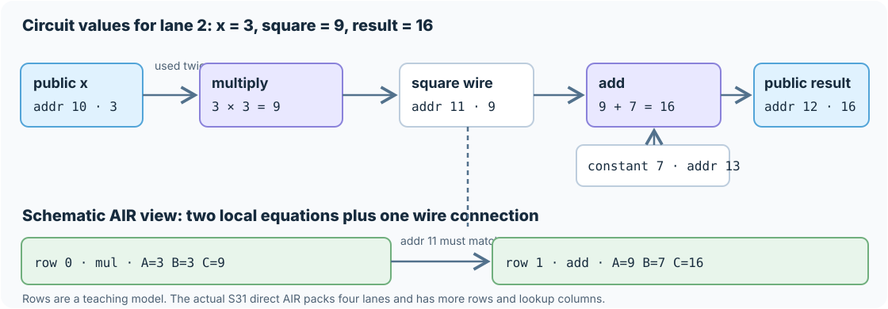

# Start here: one computation, one proof

This chapter follows **one S31 function** from input to verifier. The small
tables are meant to be computed with pencil and paper. Later chapters give
the exact S31 types, the generic circuit layout, and the specialized AIR
chip. You can understand the central claim without reading those chapters.

## The five-minute version

Imagine a program as a recipe. A prover fills in the scratch work for one
run. A **circuit** turns each recipe step into a rule such as “this box must
equal the product of those two boxes.” An **AIR** arranges the boxes into
columns and rows and writes the rules as equations. A STARK proof lets a
verifier check that those equations hold for the committed scratch work,
without receiving the whole table.

The verifier also checks that the public input and output in the proof are
the ones it was asked about. It does **not** trust the prover's claim that it
ran the program correctly. For a function with a private input, the claim is
that **some** private value satisfying all the rules exists. The proof does
not mean that the verifier knows that private value, nor that it is unique.
S31 does not presently promise that every aspect of its proofs is zero
knowledge; “absent from the public statement” is the precise privacy claim
here.

| Thing | In this example | Job |
| --- | --- | --- |
| Computation | `x²+7` for each position of an array | The result we want to justify. |
| Circuit | A multiply gate followed by an add gate, with wires joining them | Specifies the allowed arithmetic and data flow. |
| Witness | Actual values for every wire, such as `3 → 9 → 16` | The prover's proposed scratch work. |
| AIR trace | Values placed in columns and rows | A form in which Stwo can prove the circuit rules. |
| Constraint | An equation required to equal zero | Detects an incorrect gate or broken connection. |
| Proof | Commitments, queried values, and degree-check data | Convinces the verifier without sending the full trace. |
| Native verifier | Generated binary plus program-bound key | Checks the public claim and the STARK proof. |

## 1. Write a real S31 program

S31's `m31` field has modulus $p=2^{31}-1=2147483647$. Arithmetic wraps
modulo $p$. The input is an array of **four lanes**: a lane is just an array
position. Each lane runs the same formula independently; a lane is neither a
separate program nor an AIR row.

```s31
circuit square_plus_seven(public x: [m31; 4]) -> public [m31; 4] {
    let square = x .* x;
    let result = square + splat<4>(7_m31);
    result
}
```

For public `x=[1,2,3,4]`, the claimed public result is
`[8,11,16,23]`. `.*` means multiplication at matching positions; `splat`
supplies four copies of the compile-time constant 7. Here is the entire
calculation:

| Array position (lane) | Input `x[j]` | Multiply: `x[j]·x[j]` | Add: `square[j]+7` | Claimed `result[j]` |
| ---: | ---: | ---: | ---: | ---: |
| 0 | 1 | 1 | 8 | 8 |
| 1 | 2 | 4 | 11 | 11 |
| 2 | 3 | 9 | 16 | 16 |
| 3 | 4 | 16 | 23 | 23 |

All numbers here are below $p$, so no modular wrap happens. If an addition
did reach $p$, its value would continue from zero.

## 2. Draw the circuit and fill its wires

The source expression becomes a fixed graph. The graph is fixed when the
program is built; the input values are supplied later by the prover.

```text
public x ──┬──▶ [pointwise multiply] ──▶ square ──┐
           └──▶ [same x wire]                     ├──▶ [add] ──▶ public result
constant 7 ───────────────────────────────────────┘
```



In lane 2, the prover proposes `x=3`, `square=9`, `result=16`. The gate
rules, evaluated on those numbers, are

$$
9-3\cdot3=0,\qquad 16-9-7=0\pmod p.
$$

That checks each gate locally. We must also check that the add gate reads
**the same** square wire produced by the multiply gate. Otherwise a dishonest
prover could write `3·3=9` in one gate, then use `12+7=19` in the next.
Both gate calculations would be true, but the circuit would not compute
`x²+7`. S31 assigns fixed wire addresses and proves matching producer/use
tuples with a LogUp lookup argument. Public binding gates connect the input
and result wires to the statement the verifier receives.

## 3. Turn gates into an AIR table

An AIR, or **algebraic intermediate representation**, has columns, rows,
and equations. Its columns include values chosen by the prover (the
**witness**) and fixed information chosen by the compiled program (which
operation and wire address each row uses). One gate's equation is checked at
each applicable row.

Here is a **schematic two-row, one-lane teaching table** for lane 2. These
row numbers and addresses are hand-picked. They are **not** the physical
rows emitted by S31. The actual S31 direct arithmetic AIR packs all four
lanes into a circuit wire and also includes input, constant, public binding,
lookup, finalization, and padding rows.

| Logical row | Fixed operation | Fixed input addresses | Witness `A` | Witness `B` | Fixed output address | Witness `C` | Required equation |
| ---: | --- | --- | ---: | ---: | ---: | ---: | --- |
| 0 | multiply | `10, 10` | 3 | 3 | 11 | 9 | `C−A·B = 9−3·3 = 0` |
| 1 | add | `11, 13` | 9 | 7 | 12 | 16 | `C−A−B = 16−9−7 = 0` |

Address 10 is the public input wire; address 13 is the constant-seven wire;
address 12 must be bound to the claimed public output. Address 11 is the
connection between rows. The local equations alone cannot enforce that
connection. In the real circuit AIR, LogUp compares address-and-value tuples
so the producer at address 11 and the consumer at address 11 agree. It also
accounts for a wire used more than once; address 10 is used twice in the
first gate.

One way to express the teaching table's **local** arithmetic in two AIR
equations is to give each row fixed selectors `s_mul` and `s_add`:

$$
C_{\mathrm{mul}}=s_{\mathrm{mul}}(C-A B)=0,\qquad
C_{\mathrm{add}}=s_{\mathrm{add}}(C-A-B)=0.
$$

At row 0, `(s_mul,s_add)=(1,0)`; at row 1, it is `(0,1)`. The zero selector
turns off the equation for the other opcode. These are **pedagogical
equivalent equations**, not a transcription of every term in S31's pinned
generic circuit AIR. The actual direct circuit component has opcode and
wire-address preprocessed columns, four-coordinate input/output witness
columns, and LogUp interaction columns; [the circuit chapter](circuits.md)
describes them.

“One row” does not always mean the same source event. In this generic
circuit component, a row records a gate operation. In S31's specialized
repeated-step chip, a row records one round of a recurrence for all four
lanes. The [chip example](air.md#fill-a-trace-by-hand) fills two such rounds
with actual numbers. Neither kind of row should be confused with a source
line or an array lane.

## 4. Why polynomials enter the proof

A two-row table can be viewed as evaluations of polynomials. To make the
algebra visible, temporarily label the teaching rows by $T=0$ and $T=1$.
Interpolate each column between its two values, still doing arithmetic
modulo $p$:

$$
\begin{aligned}
A(T)&=3+6T,& B(T)&=3+4T,& C(T)&=9+7T,\\
s_{\mathrm{mul}}(T)&=1-T,&s_{\mathrm{add}}(T)&=T.
\end{aligned}
$$

For instance, $A(0)=3$ and $A(1)=9$. Substitute these polynomials into
the two local equations:

$$
\begin{aligned}
C_{\mathrm{mul}}(T)
  &=(1-T)\bigl((9+7T)-(3+6T)(3+4T)\bigr)
   =T(T-1)(24T+23),\\
C_{\mathrm{add}}(T)
  &=T\bigl((9+7T)-(3+6T)-(3+4T)\bigr)
   =-3T(T-1).
\end{aligned}
$$

Both have the factor $Z(T)=T(T-1)$, which is zero exactly at the two row
labels. Their **quotients** are $24T+23$ and $-3$ (with negative numbers
interpreted modulo $p$). This factorization is what it means for these two
local constraints to hold on the two-row domain. Changing the multiply's
output from 9 to 10 would make its constraint nonzero at row 0, so this
factorization would fail.

**The $T=0,1$ interpolation is a teaching model, not Stwo's domain or proof
format.** Stwo commits evaluations over circle domains, combines the
component constraints, checks quotient relationships at transcript-chosen
points, and uses FRI to test that the committed evaluations have the
required low degree. The actual generic AIR also proves wire consistency,
public binding, and its other gate rules. The [AIR chapter](air.md) gives the
six *actual* constraints for S31's repeated-step chip.

## 5. What the verifier learns and checks

For this program the public statement is `x=[1,2,3,4]` and
`result=[8,11,16,23]`. The prover supplies a proof for that statement. The
generated native verifier checks the program/key identity, canonical
public values, commitments and openings, AIR relationships, LogUp closure,
and FRI degree test. It accepts only with the selected profile's
cryptographic soundness guarantee.

More formally, acceptance says that, except with the proof system's
soundness error, there is a trace whose circuit rules and public bindings
hold for the **fixed program**. Since this circuit computes a deterministic
function, the claimed `result` equals `x²+7` lane by lane. It does not say
that the prover used the supplied host runtime, ran the source code in order,
or revealed the whole trace. It also does not by itself prove that the S31
compiler lowered the source as intended: inspecting the normalized relation,
gate graph, and pinned AIR is an audit of that separate trust boundary.
Changing the claimed lane-2 result from 16 to 19 would break the connected
arithmetic and public binding.

For a private-input example, [the checked-in `preimage4` program](source.md#a-hand-written-private-witness-function)
claims a different statement: there exists a `u16[4]` secret such that its
square plus seven equals the public target and its square equals the public
output. For its last lane, the private value 42 gives
$42^2=1764$ and $1764+7=1771$. The proof binds the target 1771 and output
1764 while keeping 42 out of the public statement. These are constraints on
an **existential witness**, not an assertion about how the prover found it.

## Inspect the compiled relation

After the [five-minute build](README.md#five-minute-tour), ask S31 for its
source-level field equations:

```sh
python3 src/frontends/s31/s31.py equations zig-out/s31/docs-polynomial
```

For the checked-in polynomial program, the first multiply node reports
`_s31_0[j] - x[j] * x[j] = 0`. The JSON also includes the source position,
canonical node ID, and builder gate counts. This helps you follow one source
operation into the graph. It is **not** a dump of the pinned generic AIR's
symbolic terms or its physical row placement; the lookup, public binding,
and profile constraints extend beyond these equations. Use
[`explain` and `inspect`](proofs.md#read-the-cost-report-correctly) alongside
it when auditing a package.

Next: [source syntax and field semantics](source.md), then
[the actual generic circuit layout](circuits.md) and
[the repeated-step AIR by hand](air.md).
