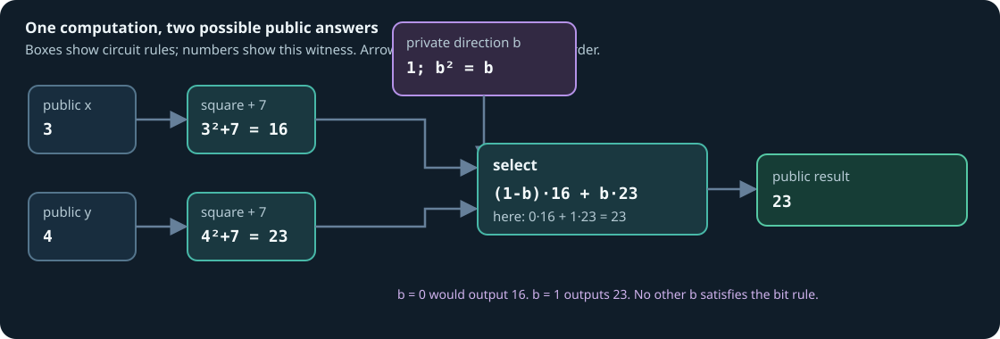

# A proof with a private choice, worked by hand

This example answers a different question from the [reduction and recurrence
examples](worked-proofs.md): **how can a private bit choose between two public
computations without letting the prover invent a third answer?** It uses
only numbers small enough to calculate on paper.

S31 calculates in the field $\mathbb F_p$, where $p=2^{31}-1=2147483647$.
All values below are smaller than $p$, so no modular wrap occurs. The
source has two one-position arrays. A **lane** is an array position; here
each array has one lane. An **AIR row** is a record in a proof trace, not a
source lane or a line of code.

## 1. The source and the public question

```s31
circuit choose_square_plus_seven(
    public x: [m31; 1],
    public y: [m31; 1],
    private direction: bit
) -> public [m31; 1] {
    let x_squared = x .* x;
    let y_squared = y .* y;
    let left = x_squared + splat<1>(7_m31);
    let right = y_squared + splat<1>(7_m31);
    let result = select(direction, left, right);
    result
}
```

`select(0,a,b)=a` and `select(1,a,b)=b`. With public `x=[3]` and `y=[4]`,
the left candidate is $3^2+7=16$ and the right candidate is $4^2+7=23$.
For the private `direction=[1]`, the public output is `result=[23]`:

| Named value | Hand calculation | Value |
| --- | --- | ---: |
| `x_squared` | $3\cdot3$ | 9 |
| `y_squared` | $4\cdot4$ | 16 |
| `left` | $9+7$ | 16 |
| `right` | $16+7$ | 23 |
| `1-direction` | $1-1$ | 0 |
| `result` | $0\cdot16+1\cdot23$ | 23 |

The verifier sees `x=[3]`, `y=[4]`, and `result=[23]`. It does **not** get
the private `direction`. The prover supplies that bit and all scratch
values. The eight-slot public ABI uses three slots here and zero-fills the
others.

## 2. What the text frontend gives the circuit compiler

`s31 lower` emits this complete normalized relation. Notice that `bit`
becomes a one-word `m31` selector in JSON; its Boolean obligation is
enforced when the `select` is compiled to circuit gates.

```json
{
  "version": 1,
  "name": "choose_square_plus_seven",
  "inputs": [
    {"name":"x","kind":"m31","length":1,"visibility":"public"},
    {"name":"y","kind":"m31","length":1,"visibility":"public"},
    {"name":"direction","kind":"m31","length":1,"visibility":"private"}
  ],
  "nodes": [
    {"name":"x_squared","op":"mul","lhs":"x","rhs":"x"},
    {"name":"y_squared","op":"mul","lhs":"y","rhs":"y"},
    {"name":"left","op":"add_const","lhs":"x_squared","constant":7},
    {"name":"right","op":"add_const","lhs":"y_squared","constant":7},
    {"name":"result","op":"select","lhs":"left","rhs":"right","selector":"direction"}
  ],
  "assertions": [],
  "public_outputs": ["result"]
}
```

Five relation nodes describe the computation. They are **not five AIR
rows**. The compiler introduces more wires and gates to constrain the
public inputs, fixed constants, Boolean selector, and final public result.

## 3. The circuit: boxes, wires, and values



Think of each box as a rule about its incoming and outgoing wires. For the
two square gates, the rules are $q_x=x\cdot x$ and $q_y=y\cdot y$. Fixed
constant gates supply 7. The two addition gates require
$L=q_x+7$ and $R=q_y+7$. The selector needs **two** rules:

$$
b^2-b=0,
\qquad
o=(1-b)L+bR.
$$

Over this field, $b^2-b=b(b-1)=0$ implies $b=0$ or $b=1$. For the hand
witness, the first equation is $1^2-1=0$ and the second is
$23-(1-1)16-1\cdot23=0$. If the prover tried $b=\tfrac12$, the second
equation could make a mixture, but the first would fail. If the prover tried
to claim `result=[17]`, neither allowed bit produces 17 for these public
inputs.

The **actual S31 circuit** expands the selector: it computes $1-b$,
multiplies that by $L$, multiplies $b$ by $R$, then adds the two terms. In
the `direct-gate` profile, the directly referenced selector input is a
wire whose producing self-product gate enforces $b^2=b$. One-position
arrays travel in packed QM31 circuit wires; the intended M31 value is in
the base coordinate. The source equation above is the meaning of this gate
sequence, not a claim that the implementation has one physical `select`
row.

Here is a **logical teaching trace** filled with the witness. Its rows
represent the arithmetic checks that matter to this explanation; they are
not physical row numbers or the complete emitted trace.

| Teaching check | In values | Out value | Zero equation on this witness |
| --- | --- | ---: | --- |
| Square `x` | $3,3$ | 9 | $9-3\cdot3=0$ |
| Square `y` | $4,4$ | 16 | $16-4\cdot4=0$ |
| Add 7 to `x_squared` | $9,7$ | 16 | $16-9-7=0$ |
| Add 7 to `y_squared` | $16,7$ | 23 | $23-16-7=0$ |
| Prove selector is a bit | $1,1$ | 1 | $1-1\cdot1=0$ |
| Compute $1-b$ | $1,1$ | 0 | $0-1+1=0$ |
| Multiply left branch | $0,16$ | 0 | $0-0\cdot16=0$ |
| Multiply right branch | $1,23$ | 23 | $23-1\cdot23=0$ |
| Add branch terms | $0,23$ | 23 | $23-0-23=0$ |

The real generic circuit AIR has fixed opcode flags and wire addresses,
witness and interaction columns, public binding, and padding. Schematically,
an add row checks $s_{\mathrm{add}}(C-A-B)=0$ and a multiply row checks
$s_{\mathrm{mul}}(C-AB)=0$. These two local equations alone would let a
prover copy `left=16` into one row and use an unrelated `left=17` in another.
S31's fixed wire addresses and LogUp interaction connect each use to its
producer, so the values must agree. The public binding connects the result
wire to the statement's 23. The [circuit chapter](circuits.md#inputs-assertions-selectors-and-public-binding)
explains these extra checks; this table is a teaching projection of them,
not a complete symbolic export of the generic AIR.

## 4. From the table to polynomials

Here is the smallest possible hand calculation showing what it means to
turn gate rows into a polynomial rule. Take only the two square checks and
label them with teaching row coordinates $T=0,1$:

| $T$ | Gate | $A$ | $B$ | $C$ |
| ---: | --- | ---: | ---: | ---: |
| 0 | $3\cdot3=9$ | 3 | 3 | 9 |
| 1 | $4\cdot4=16$ | 4 | 4 | 16 |

The unique degree-one polynomials through these two points are
$A(T)=3+T$, $B(T)=3+T$, and $C(T)=9+7T$. Substitution gives

$$
C(T)-A(T)B(T)
=9+7T-(3+T)^2
=-T(T-1).
$$

The right side is zero at both teaching rows. It is divisible by the
vanishing polynomial $Z(T)=T(T-1)$, with quotient $-1$. That small
factorization is **only an illustration**. The actual Stwo circuit has
many more rows and columns over a circle domain; its gate selectors,
address lookups, public boundary, and low-degree checks all take part in
the proof. Interpolating two hand rows does not generate a valid S31 proof.

The circuit's bit and branch equations are also polynomials in trace
values. There is no control-flow jump for the verifier to execute: it
checks algebraic rules for both branches and the selector, with the
chosen output bound to the public statement. Stwo commits to trace
columns, samples challenges, and verifies openings and FRI checks. The
verifier need not receive the table of witness values.

## 5. Exactly what acceptance means

For the fixed program and trusted verification key, acceptance of a proof
for public `(x,y,result)=(3,4,23)` means, up to the proof system's
soundness error, that **some** private bit $b$ and circuit witness satisfy

$$
b\in\{0,1\},\qquad
23=(1-b)(3^2+7)+b(4^2+7)\pmod p.
$$

For these public numbers, $b=1$ is the only possible selector. This is a
mathematical consequence of the relation; the verifier does not receive
`direction` as a public value. The proof claims the compiled relation,
not that the human-written source was translated correctly or that every
aspect of the private witness has a general zero-knowledge guarantee.

A Merkle path uses the **same private-bit rule** to order a leaf digest and
its sibling before hashing them. The [hash chapter's one-level path](hashes.md#a-one-level-merkle-opening-by-hand)
shows the actual Poseidon2 digest and root for that larger function. The
hash then adds many more constrained arithmetic gates; the Boolean
choice and wire-connection principle remain the same.

## Reproduce the example

Save the source block above as `choose_square_plus_seven.s31` and this
assignment as `choice.valid.json`:

```json
{
  "public_inputs": {"x": [3], "y": [4]},
  "private_inputs": {"direction": [1]},
  "public_outputs": {"result": [23]}
}
```

From the repository root, `s31 lower` shows the JSON above. `s31 trial`
builds the package, makes and verifies a proof, checks that a changed public
statement is rejected, and writes an inspection report:

```sh
python3 src/frontends/s31/python/s31.py lower choose_square_plus_seven.s31
python3 src/frontends/s31/python/s31.py trial choose_square_plus_seven.s31 choice.valid.json --lowering direct-gate --out zig-out/s31/docs-choice-trial
```

You can also use `s31 equations` and `s31 explain` on the resulting package
to inspect the semantic equations and source-to-builder map. Neither
command emits the complete generic circuit AIR; the [audit chapter](proofs.md)
states their exact scope.
