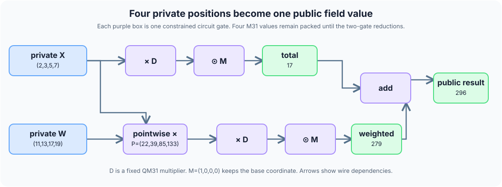

# Two proofs worked by hand: a reduction and a recurrence

This chapter follows two **complete, implemented** S31 functions. The first
combines four positions of private arrays into one public number. The second
applies the same step 16 times and uses a specialized transition AIR. Every
displayed number can be checked with ordinary arithmetic. S31's M31 field has
$p=2^{31}-1=2147483647$; reduce a result modulo $p$ if it reaches $p$.

## First, what are we doing?

Think of a computation as a worksheet. The prover writes answers and scratch
values. The verifier checks a short cryptographic proof that a **whole table
of scratch values exists** obeying the compiled rules. A circuit describes
the boxes and connections in the worksheet. An AIR describes the columns,
rows, and equations used to prove those boxes and connections. The proof
commits to the columns and checks algebraic relationships at unpredictable
points.

A **lane** below is one position in an S31 array. A **row** is one record in
a proof component's table. A lane is not an AIR row.

| Question | Reduction circuit | Recurrence chip |
| --- | --- | --- |
| What is a source step? | A sum, product, or array reduction. | One application of `v²+7`. |
| What does a teaching row represent? | One constrained gate, such as an add or multiplication. | One complete recurrence round for all four lanes. |
| What links the work? | Circuit wire addresses and LogUp. | Indexed input/output tuples and chip LogUp. |
| What binds the public claim? | An output binding gate for `[296]`. | Public circuit endpoints for initial and final arrays. |

The small tables below are **logical teaching tables**. Their row numbers,
wire letters, and ordering are not a dump of physical rows produced by S31.
The actual circuit has extra input, constant, public binding, lookup,
finalization, and padding rows. The chip has one logical row per round, but
Stwo stores its evaluations in circle-domain order.

## Example A: a private cross-lane computation

This is the checked-in [`lane_stats4.s31`](../examples/arithmetic/lane_stats4.s31):

```s31
use std@1;

circuit lane_stats4(private x: [m31; 4], private weights: [m31; 4])
    -> public [m31; 1] {
    let total = std::math::sum_lanes(x);
    let weighted = std::math::dot_lanes(x, weights);
    let result = total + weighted;
    result
}
```

`dot_lanes` multiplies matching positions and **then** sums across positions.
The complete mathematical claim is

$$
y=\sum_{j=0}^{3}x_j+\sum_{j=0}^{3}x_jw_j\pmod p.
$$

The [sample prover assignment](../examples/arithmetic/lane_stats4.valid.json) chooses
private `x=[2,3,5,7]`, private `weights=[11,13,17,19]`, and public
`result=[296]`. Each row in this table is one **array position**, not a
proof row:

| Position `j` | Private `x[j]` | Private `weights[j]` | Product `x[j]·weights[j]` |
| ---: | ---: | ---: | ---: |
| 0 | 2 | 11 | 22 |
| 1 | 3 | 13 | 39 |
| 2 | 5 | 17 | 85 |
| 3 | 7 | 19 | 133 |
| **Across positions** | **2+3+5+7=17** | — | **22+39+85+133=279** |

Thus `17+279=296`. The verifier receives the public statement
`result=[296]`; it has no public inputs. The private arrays are supplied to
the prover, not to the verifier.

### A1. What the text frontend lowers

`s31 lower` emits the following normalized relation.
`_s31_0` is the compiler-generated name for the intermediate product array:

```json
{
  "version": 1,
  "name": "lane_stats4",
  "inputs": [
    {"name":"x","kind":"m31","length":4,"visibility":"private"},
    {"name":"weights","kind":"m31","length":4,"visibility":"private"}
  ],
  "nodes": [
    {"name":"total","op":"sum_lanes","lhs":"x"},
    {"name":"_s31_0","op":"mul","lhs":"x","rhs":"weights"},
    {"name":"weighted","op":"sum_lanes","lhs":"_s31_0"},
    {"name":"result","op":"add","lhs":"total","rhs":"weighted"}
  ],
  "assertions": [],
  "public_outputs": ["result"]
}
```

This JSON specifies **four semantic nodes**. It is not four AIR rows. It
keeps the two inputs private and the one-word result public. The circuit
compiler assigns fixed wire addresses and builds gates for the operations.

### A2. Draw the circuit and fill the wires

Four M31 positions fit in one packed QM31 circuit wire. Pointwise
multiplication creates `P=(22,39,85,133)` from packed wires `X` and `W`.
The current reducer sums the four packed coordinates **without extracting
four separate wires**:



Here is why the two-gate reduction works. In QM31's basis
$(1,i,u,iu)$, $i^2=-1$ and $u^2=2+i$. Write the packed word as
$X=(a+bi)+(c+di)u$. The compiler uses the **fixed field constant**

$$
D=(1-i)+\frac{1-3i}{5}u,
\qquad
\frac{1-3i}{5}u^2=1-i.
$$

The base M31 coordinate of $X D$ is therefore the base coordinate of
$(a+bi)(1-i)+(c+di)(1-i)$, which is $a+b+c+d$. A constrained QM31
multiplication computes $X D$; a constrained pointwise multiplication by
$M=(1,0,0,0)$ keeps only its base coordinate. In canonical M31 coordinate
form, $D=(1,2147483646,858993459,1717986917)$. Thus the two complete
reductions are

| Input packed wire | Hand sum of positions | Base coordinate of `input·D` | After pointwise mask `M` |
| --- | ---: | ---: | --- |
| `X=(2,3,5,7)` | `2+3+5+7=17` | 17 | `(17,0,0,0)` |
| `P=(22,39,85,133)` | `22+39+85+133=279` | 279 | `(279,0,0,0)` |

The prover cannot choose unrelated totals: both gates constrain the full
QM31 wires. For an array longer than four, the compiler first adds packed
wires in a balanced tree. Whenever the final packed wire is partial, it
masks unused coordinates before reduction. Then the same $D$ and $M$ gates
produce the one-word result. The mask is essential: padding is not a
declared source lane.

For this four-position example, each `sum_lanes` node needs **two** builder
gates. One pointwise product and one final add make **six arithmetic builder
gates** for the four normalized nodes. Input packing, public binding, wire
accounting, and finalization add more gates. The current `direct-gate`
package has 304 raw QM31-operation rows, padded to 512. Earlier builds had
346 raw rows with per-coordinate reduction and individual private-input
guesses, then 323 with the packed reduction but individual input guesses.
Packing the private M31 input guesses gave the current 304. All three
four-lane builds padded to 512, so a lower raw count did not move this
trace-size boundary.

At 64 private lanes, the reduction-only change **did** move a padding
boundary in an earlier, pinned comparison. This measurement predates the
private-input packing described above. A
[ten-witness local measurement](../../../../design/s31/measurements/language/packed-reduction-2026-10-06.json)
on an Apple M5 Max, using `direct-gate` and the same canonical relation in
both builds, found:

| Measured quantity | Earlier per-coordinate reducer | Packed reducer |
| --- | ---: | ---: |
| Raw QM31 rows | 639 | 474 |
| Padded QM31 rows | 1024 | 512 |
| Median proof bytes | 73,567.5 | 55,578 |
| Median prover stage excluding proof of work | 1.983 ms | 1.358 ms |
| Median whole-process proving | 117 ms | 111 ms |

The [benchmark script](../benchmarks/benchmark_packed_reduction.py) uses one warmup
and ten distinct valid witnesses per version; both native verifiers accepted
their proofs and rejected a changed public output. The whole-process time
improves only slightly here because transcript-dependent proof of work
dominates and varies with the witness. These numbers describe this host,
program, and profile; they do not establish a general speedup over Cairo.

A separate, later [128-lane private-input comparison](../../../../design/s31/measurements/language/packed-inputs-2026-10-06.json)
kept the packed reducer on **both** sides and changed only how the private
M31 input positions become circuit wires. Seven valid witnesses per version
gave the following medians on the same host and `direct-gate` profile:

| Measured quantity | Individual private-input guesses | Packed private-input guesses |
| --- | ---: | ---: |
| Raw QM31 rows | 650 | 361 |
| Padded QM31 rows | 1024 | 512 |
| Fixed cells | 8192 | 4096 |
| Proof bytes | 72,944 | 55,719 |
| Prover stage excluding proof of work | 2.305 ms | 1.490 ms |
| Whole-process proving | 94 ms | 152 ms |

The second run's wall-clock median was **slower** because proof of work
varied substantially across witnesses. The non-proof-of-work stage and
trace geometry isolate the computation saved by input packing more clearly.
Each version's native verifier accepted its valid proofs and rejected a
changed public output. This measured record and the earlier 64-lane record
are separate comparisons; the current 64-lane geometry was not measured
in these records.

### A3. Which AIR equations check those wires?

These are the **six source arithmetic gates** as logical teaching rows,
with hand-filled witness values. The letters are explanatory wire names,
not actual S31 wire addresses or physical row positions. A pointwise
product checks four M31 equations; an ordinary `add` or QM31 `mul` checks
an equation in QM31. The `D` and `M` values are fixed circuit constants.

| Logical gate | Input `A` | Input `B` | Output `C` | Local zero equation |
| --- | --- | --- | --- | --- |
| Pointwise product | `X=(2,3,5,7)` | `W=(11,13,17,19)` | `P=(22,39,85,133)` | `C[j]−A[j]B[j]=0`; e.g. `85−5·17=0` at `j=2`. |
| QM31 multiply | `X=(2,3,5,7)` | fixed `D` | `T_X=(17,3,858993473,1717986919)` | `C−A·B=0`; the base coordinate is 17. |
| Pointwise mask | `T_X` | fixed `M=(1,0,0,0)` | `total=(17,0,0,0)` | `C[j]−A[j]B[j]=0` for all four coordinates. |
| QM31 multiply | `P=(22,39,85,133)` | fixed `D` | `T_P=(279,65,1288490434,429496772)` | `C−A·B=0`; the base coordinate is 279. |
| Pointwise mask | `T_P` | fixed `M` | `weighted=(279,0,0,0)` | `C[j]−A[j]B[j]=0` for all four coordinates. |
| Final add | `total=(17,0,0,0)` | `weighted=(279,0,0,0)` | `result=(296,0,0,0)` | `C−A−B=296−17−279=0` in base coordinate. |

In the generic circuit AIR, fixed opcode flags select the gate equations.
Schematically, for row-variable columns `A,B,C`,

$$
\begin{aligned}
s_{\rm add}(C-A-B)&=0,\\
s_{\rm mul}(C-A B)&=0,\\
s_{\rm pm}(C_j-A_jB_j)&=0\quad(j=0,1,2,3).
\end{aligned}
$$

The pinned AIR has further columns and constraints, including LogUp. These
equations state gate semantics; they are **not** a complete symbolic export
of the generic AIR. Local gate rows alone would let a dishonest prover use
`weighted=300` at the final add while separately showing a valid
`weighted=279` reduction. Fixed wire addresses and LogUp connect each
producer value to all uses of that address. The public binding connects
the final `result` wire to the verifier's claimed 296. Changing the
statement to `[297]` breaks that connected set of rules.

### A4. Where the polynomials enter

Take **coordinate 0** of two real gates from the hand table: the pointwise
product and the final add. Temporarily label them teaching rows $T=0,1$:

| Teaching row | Active gate | $A_0$ | $B_0$ | $C_0$ |
| ---: | --- | ---: | ---: | ---: |
| 0 | pointwise product | 2 | 11 | 22 |
| 1 | add | 17 | 279 | 296 |

Interpolate each column through its two numbers and use selectors
$s_{\rm pm}=1-T$, $s_{\rm add}=T$:

$$
A_0(T)=2+15T,\quad B_0(T)=11+268T,\quad C_0(T)=22+274T.
$$

Substituting gives two zero-on-the-rows constraint polynomials:

$$
\begin{aligned}
(1-T)(C_0-A_0B_0)&=T(T-1)(427+4020T),\\
T(C_0-A_0-B_0)&=-9T(T-1).
\end{aligned}
$$

Both are divisible by $Z(T)=T(T-1)$, the polynomial that vanishes on these
two teaching row labels. Their quotients are $427+4020T$ and $-9$, all
interpreted modulo $p$. This is a **hand calculation on two illustrative
rows**, not Stwo's domain or the complete AIR; the actual reduction has
all six gates, four coordinates where relevant, lookup columns, and many
other circuit rows. It shows why gate equations become polynomial tests.

Each actual AIR column is committed as evaluations of a low-degree
circle-domain polynomial. For example, the symbolic add expression is
$C_{\rm add}(T)=s_{\rm add}(T)(C(T)-A(T)-B(T))$. It must vanish at every
applicable trace row. If $Z_H(T)$ vanishes on trace domain $H$, the quotient
idea is

$$
Q_{\rm add}(T)=\frac{C_{\rm add}(T)}{Z_H(T)}.
$$

The verifier never receives the whole reduction table. Commitments bind its
columns; transcript challenges choose what the verifier checks; openings
and FRI support the low-degree claim. A wrong gate value, broken wire
connection, or different public result must fail the corresponding
algebraic and lookup checks, except with the protocol's soundness error.
The quotient notation explains the purpose of the polynomial constraints;
it does not specify Stwo's circle-domain factor or serialized proof format.
The [first walkthrough](walkthrough.md#4-why-polynomials-enter-the-proof)
factors a two-row constraint polynomial completely by hand.

### A5. What does acceptance prove?

For this program and fixed verification key, acceptance of the proof for
`result=[296]` says, subject to soundness, that **some** private arrays
`x,w` satisfy the compiled circuit and public binding

$$
296=\sum_j x_j+\sum_jx_jw_j\pmod p.
$$

It does not say the verifier knows `x` or `w`, and it does not identify
the particular assignment `[2,3,5,7]` and `[11,13,17,19]`; many
assignments could yield 296. These values are absent from the public
statement, but S31 does not currently promise general zero knowledge for
every proof aspect. The proof establishes the **compiled relation**; checking
that the source means the intended relation remains a separate compiler
audit. Package validation re-lowers the stored text and checks it matches
the sealed relation, which catches package inconsistency. That check does
not establish that the compiler's translation is mathematically correct.
As with any native verifier, the verifier binary and key must be the ones
the reader intends to trust.

## Example B: a recurrence with one transition per chip row

Now use a different function. The `step` below squares **each** lane and
adds 7. It never sums across lanes. `iterate<16>` applies that step exactly
16 times. This is an eligible small instance of S31's specialized
square-then-add chip:

```s31
fn step(v: [m31; 4]) -> [m31; 4] {
    v .* v + splat<4>(7_m31)
}

circuit square7_16(public x: [m31; 4]) -> public [m31; 4] {
    let result = iterate<16>(step, x);
    result
}
```

Its normalized relation has one `repeat` node, not 32 arithmetic nodes:

```json
{
  "version": 1,
  "name": "square7_16",
  "inputs": [{"name":"x","kind":"m31","length":4,"visibility":"public"}],
  "nodes": [{"name":"result","op":"repeat","lhs":"x","rounds":16,
             "body":[{"op":"square"},{"op":"add_const","constant":7}]}],
  "assertions": [],
  "public_outputs": ["result"]
}
```

For public `x=[1,2,3,4]`, let `s[0]=x` and
$s[i+1,j]=s[i,j]^2+7\pmod p$. The first three **logical transition rows**
can be filled by hand:

| Round index `i` | `in=s[i]` | `out=s[i+1]` | A hand check |
| ---: | --- | --- | --- |
| 0 | `[1,2,3,4]` | `[8,11,16,23]` | Lane 3: `23−4²−7=0`. |
| 1 | `[8,11,16,23]` | `[71,128,263,536]` | Lane 0: `71−8²−7=0`. |
| 2 | `[71,128,263,536]` | `[5048,16391,69176,287303]` | Lane 2: `69176−263²−7=0`. |
| ... | ... | ... | ... |
| 15 | `s[15]` | `s[16]=[1737765234,2070257821,1388597838,1651172055]` | Final public binding. |

The four values in one `in` or `out` cell are **four lanes in the same
transition row**, not four separate rows. The last array is the 16-round
result modulo $p$; repeated squaring quickly makes modular wrap matter.
A package built with `--lowering direct-chip` keeps public endpoint
bindings in the circuit and puts the 16 transitions in the separate chip
component. With `direct-gate`, the repeat is unrolled into circuit gates.
This specialization recognizes only the supported public, four-lane,
power-of-two square-plus-constant shape; it is not a general loop chip.

### B1. Local transition versus connected computation

The chip has one `index` column and four `in`/four `out` base columns. At
every logical row and lane it checks the **actual** transition equation

$$
C_j(i)=\operatorname{out}_{i,j}-\operatorname{in}_{i,j}^{2}-7=0,
\quad j=0,1,2,3.
$$

That only checks each row in isolation. Without a connection rule, a prover
could place `[8,11,16,23]` as row 0's output but put a different, unrelated
input into row 1. The chip uses indexed tuples

```text
I_i = (D, i,   in0,  in1,  in2,  in3)
O_i = (D, i+1, out0, out1, out2, out3)
```

with a fixed relation tag `D`. The row-0 `O_0` is exactly the row-1 `I_1`
in the honest table: both are `(D,1,8,11,16,23)`. Their lookup terms
cancel. The same cancellation links all internal rounds. The remaining
terms are the initial tuple `(D,0,x)` and final tuple `(D,16,y)`, which
the verifier checks against the public circuit endpoints. The lookup
constraints also enforce nonzero compressed-tuple denominators. The
[AIR chapter](air.md#the-chips-six-actual-row-constraints) writes all
**six actual chip row constraints**, including the two interaction
constraints and the endpoint equation.

This is the central difference between these examples: the reduction is a
**generic circuit graph** whose gate values meet by wire address; the
recurrence chip is a **transition table** whose row endpoints meet by
indexed lookup. Both are algebraic constraints in one Stwo proof, with
public bindings and low-degree checks.

### B2. What does the second verifier accept?

For public `x=[1,2,3,4]` and the displayed `y=s[16]`, acceptance means,
subject to soundness, that a 16-round path satisfying every transition and
both public endpoints exists for the fixed `square7_16` program. Since the
step is deterministic, that forces the final array shown above. The verifier
checks a proof; it does not trust the prover's host loop or receive all 16
rows as public data. The function `step` is compiled into the relation and
AIR. It is not executed as source code inside the native verifier.

This is the full prover assignment for that hand example. The verifier sees
its public input and output fields, but not the prover's intermediate state
array:

```json
{
  "public_inputs": {"x": [1, 2, 3, 4]},
  "private_inputs": {},
  "public_outputs": {"result": [1737765234, 2070257821, 1388597838, 1651172055]}
}
```

## Reproduce both paths

For an agent or a developer checking a new source, `trial` runs the whole
build–prove–verify loop, rejects a one-word change to the public statement,
and saves a compact report. Run this from the repository root:

```sh
python3 src/frontends/s31/python/s31.py oracle src/frontends/s31/examples/arithmetic/lane_stats4.s31 src/frontends/s31/examples/arithmetic/lane_stats4.valid.json
python3 src/frontends/s31/python/s31.py trial src/frontends/s31/examples/arithmetic/lane_stats4.s31 src/frontends/s31/examples/arithmetic/lane_stats4.valid.json --lowering direct-gate --out zig-out/s31/docs-lane-trial
```

`oracle` performs a separate Python calculation of the **normalized
relation** and checks the claimed output without building a proof.
For this assignment it reports `status: passed` and
`computed_public_outputs: {"result": [296]}`. It is independent of the Zig
circuit witness evaluator, but a `.s31` input still passes through the text
frontend to produce the relation. It does not establish that the circuit
constrains that relation or that a proof is sound.

Inspect `trial-report.json`, `equations.json`, `explain.json`, `proof.bin`,
and the public `statement.json` in that output directory. The report records
the assignment **path**, profile, canonical IR identity, geometry, proof
size, verifier results, `independent_value_oracle`, and one local timing
observation; it does not copy private assignment values. The oracle field
records `passed` and computed outputs for all current arithmetic and hash
relation nodes. BLAKE2s uses Python's `hashlib`; Poseidon2 uses separate
Python field arithmetic with the repository's pinned constants. If a future
node reports `unsupported`, treat that as **no independent value check**.
Neither the report nor the semantic equations are a complete dump
of the pinned circuit AIR. A single trial's time is not a reliable
performance comparison because cache state and proof of work vary.

To inspect each step manually, use the same checked-in reduction:

```sh
python3 src/frontends/s31/python/s31.py lower src/frontends/s31/examples/arithmetic/lane_stats4.s31
python3 src/frontends/s31/python/s31.py build src/frontends/s31/examples/arithmetic/lane_stats4.s31 --lowering direct-gate --out zig-out/s31/docs-lane-stats
python3 src/frontends/s31/python/s31.py equations zig-out/s31/docs-lane-stats
python3 src/frontends/s31/python/s31.py explain zig-out/s31/docs-lane-stats
python3 src/frontends/s31/python/s31.py prove zig-out/s31/docs-lane-stats src/frontends/s31/examples/arithmetic/lane_stats4.valid.json zig-out/s31/docs-lane-stats.proof
python3 src/frontends/s31/python/s31.py verify zig-out/s31/docs-lane-stats zig-out/s31/docs-lane-stats.proof
```

For the recurrence, put the `square7_16` source above in a `.s31` file and
the displayed assignment in a `.json` file, then run `trial` with
`--lowering direct-chip`. `s31 lower`, `equations`, and `explain`
expose different layers: `lower` prints the normalized relation;
`equations` prints **semantic field equations** for source nodes and gate
counts; `explain` maps source positions to canonical nodes and builder
spans. Neither command currently exports every symbolic term or physical
row of the pinned generic circuit AIR. The chip's six equations are
documented in full in [AIR and polynomials](air.md); [packages and
audit](proofs.md) explains the key and inspection boundary.
