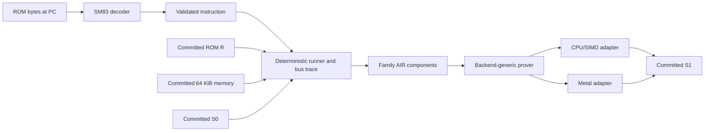

# `stwo_sm83_frontend`

The Sharp SM83 frontend is the ROM-agnostic machine boundary for proving Game
Boy programs. Pokémon Red and Blue are useful first fixtures, but no game,
cartridge, UI, or difficulty rule belongs in this package.

| Property | Value |
| --- | --- |
| Version | `0.1.0` |
| Layer | `frontend` |
| Owner | `sm83-frontend` |
| Focused CI host | Linux |

## Purpose and architecture

The intended public claim is: under a committed ROM `R`, committed initial
machine state `S0`, and committed actions `A`, SM83 execution reaches committed
state `S1`. Changing content within the admitted v7 DMG-B/type-`0x13` hardware
profile therefore changes public input, not the instruction semantics or proof
system. A ROM that reaches excluded mapper, MMIO, or timing behavior fails
closed and requires a versioned frontend extension. A verifier may check
several bounded executions and connect them by requiring each proof's final
state to equal the next proof's initial state.

The package now contains the complete 500-encoding flat ISA: 244 legal base
instructions and all 256 CB-prefixed instructions. Its deterministic
flat-memory runner and ordered execution proof cover ALU8, DAA, INC/DEC8,
INC/DEC16, accumulator rotates, LOAD8, LOAD16, ALU16, MISC, BRANCH, STACK,
INTERRUPT, CB rotate/shift, CB BIT, and CB RES/SET through 15 family selectors
plus a timer-disabled interrupt-service selector through 21 proof components.
The current proof binds consecutive CPU states,
M-cycles, public initial/final CPU state, family selection, program fetches to
a caller-supplied 32 KiB ROM, and data-memory accesses between committed
initial and final 64 KiB byte images. The v3 environment proof additionally
commits the action schedule, complete joypad and timer endpoints, selected
final RAM regions, and a non-empty canonical schedule of intermediate
`(mcycle, key, expected)` RAM samples. It composes joypad semantics, timer
ticks and delayed reload semantics, FF00 and FF04–FF07 MMIO, both devices'
ordered shared-memory updates to IF, and read-only intermediate observations
into the same memory history. The v7 machine proof extends that public prefix
with scheduler, HALT-bug, PPU, DMA, and CPU-visible APU state. Its ordered APU
lookup binds every execution access in FF10–FF3F to one semantic APU transition
and commits both APU endpoints and their raw system-image latches. CPU backend
selection remains outside this frontend.



## Public API

Import the package as `const sm83 = @import("stwo_sm83_frontend");`.

- `isa` exposes the complete instruction tables and their authority pins.
- `Instruction` describes operation, operands, condition, byte length, M-cycle
  timing, and opcode-family classification.
- `DecodedOpcode` is returned only after validating that an encoding is legal
  and complete.
- `decode` reads one base or CB-prefixed instruction and fails closed for the
  eleven unused base encodings or a truncated byte sequence.
- `runner` owns deterministic flat-memory execution and bus traces. `machine`
  exposes `Machine` and its canonical `MachineStepResult` scheduler boundary,
  including the divider/timer, delayed reload, interrupt dispatch, and HALT
  bug.
- `cartridge` validates the exact RTC-free MBC3 shape used by Pokémon Red and
  Blue and exposes pure ROM/SRAM bank resolution. `CartridgeMemory` and
  `stepCartridge` execute instructions through that address space while
  retaining logical/physical access and mapper-state metadata. Echo RAM is
  canonicalized and model-dependent unusable memory fails closed.
- `checkpoint` exposes `sameboy`, which imports only the pinned SameBoy
  `213a12ce93d66b105a113debd9396306066a7cfc` native-v15 plus BESS checkpoint
  shape. It cross-checks duplicated CPU, IO, memory, ROM identity, and MBC3
  fields before exposing CPU state, hidden timer/APU/DMA/PPU state, canonical
  system memory, and SRAM. Generic BESS-only and best-effort restore are
  deliberately rejected.
- `sameboy_instruction_trace` parses and compares the matching compact
  instruction-boundary oracle records without making the oracle a runtime
  dependency. Its comparator binds the restored absolute clock, every
  callback state, callback-to-callback timing across HALT/service rows, and
  complete oracle consumption.
- `pokemon_checkpoint_fixture` owns the hash-pinned 4,096-row short Pokémon
  input and contiguous 2^17-row battle chunks, their exact SameBoy replay and
  oracle ranges, committed machine images, device endpoints, and party-RAM
  observations. Its sibling `pokemon_checkpoint_fixture_input` owns pinned
  artifact/profile selection and endpoint-input helpers. Neither contains
  backend selection or game logic.
- `pokemon_checkpoint_replay` streams contiguous, configurable power-of-two
  battle chunks while retaining only one owned fixture at a time. It validates
  pinned prefix endpoints and refuses an uncommitted terminal action. Its
  sibling `pokemon_checkpoint_replay_profile` owns replay geometry and the
  one-time pinned artifact loading policy.
- `pokemon_battle_chain` proves and verifies those chunks through caller-owned
  prover and verifier engines, then checks every adjacent statement boundary.
- `cartridge_proof_statement` defines the detached-device, CPU-only public
  cartridge claim and its canonical ROM/system/SRAM commitment geometry.
- `cartridge_prover` executes that backend-generic cartridge proof
  transaction; concrete CPU/SIMD and Metal selection remains in integrations.
- `environment_statement` wraps the cartridge claim with committed actions,
  complete joypad and timer endpoints, selected final RAM regions, and required
  intermediate RAM samples for one proof-chain segment. `environment_prover`
  owns the backend-generic transaction that proves joypad actions, FF00 and
  FF04–FF07 MMIO, one timer tick per execution M-cycle, delayed TIMA reload,
  the joypad/timer IF-memory joins, and each intermediate sample against the
  ordered mutable-memory predecessor at that M-cycle.
- `machine_environment_statement` extends that exact v3 public prefix with
  the HALT-bug, PPU, APU, DMA, scheduler, and interrupt-service commitments
  required by the v7 machine transaction.
- `machine_environment_prover` derives the v7 trace and lookup
  witnesses, then proves them through a caller-selected backend.
- `machine_environment_verifier` reconstructs the canonical public
  preprocessing and verifies the same v7 statement independently.
- `machine_environment_chain` joins independently verified v7 statements only
  when ROM identity and every CPU, clock, mapper, memory, joypad, timer,
  HALT-bug, PPU, APU, and DMA endpoint agree exactly.
- `action_schedule`, `pokemon_battle_actions`, `joypad_trace`, and
  `ram_observation` define canonical, fail-closed public inputs and the checked
  device-event trace derived from cartridge execution.
  `machine_memory_replay` orders canonical instruction,
  HALT, wake, and interrupt-service memory events with scheduler samples and
  logical IF acknowledgement. `machine_environment_memory_replay` extends
  that same ten-phase history across actions, joypad, timer, PPU, DMA, and
  committed RAM observations.
- `air` exposes mutation-controlled ALU8, DAA, INC/DEC8, INC/DEC16,
  accumulator-rotate, LOAD8, LOAD16, ALU16, MISC, BRANCH, STACK, INTERRUPT,
  CB-rotate/shift, CB-BIT, and CB-RES/SET family components,
  ordered execution, the program-ROM LogUp relation, and the data-memory LogUp
  relation. Packed cartridge accesses are cross-bound to the execution bus,
  public mapper endpoints, the fixed 1 MiB ROM table, and ordered system/SRAM
  memory. The environment transaction also composes the joypad and timer
  binding, MMIO, and IF-memory components. Exact cartridge-access classifiers
  keep joypad and timer admission independent: enabling one device cannot
  admit the other's MMIO rows, and device addresses cannot be relabelled as
  generic system memory. Intermediate-observation rows are composed into the
  v3 environment transaction. The v7 machine transaction composes the
  mutation-controlled scheduler, PPU, DMA, HALT-bug, interrupt-service, and
  CPU-visible APU leaves with that same public ROM and memory history. The APU
  execution lookup constrains clock, ordinal, action, address, and value on
  both sides, including zero-event and multi-access instruction segments.
- `prover` owns the backend-generic execution transaction and protocol
  types. `ProverEngineForBackend` is the only concrete-backend substitution
  point.
- `Cpu`, `Memory`, and `StepTrace` are the runner's typed machine boundary.
  `Machine.restore` and `CartridgeMachine.restore` accept complete timer and
  HALT-bug checkpoints without replaying `init`'s boot-time DIV reset; both
  reject an already attached timer.
- `CartridgeMemory` is the borrowed RTC-free MBC3 address space;
  `CartridgeStepTrace` retains its per-cycle physical access metadata.
  `CartridgeMachine` and `CartridgeMachineStepResult` retain scheduler,
  mapper, and pinned interrupt-service provenance for complete machine proofs.
- `step` executes exactly one validated instruction.
- `stepCartridge` executes one instruction against RTC-free MBC3 ROM/SRAM and
  returns mapper-aware access metadata alongside the ordinary instruction
  trace.
- `rom` exposes `Rom`, which validates the current unbanked 32 KiB public ROM
  input.
- `memory` exposes `MemoryImage`, the committed initial or final 64 KiB byte
  image. Its ROM window must agree with `Rom`.
- `sameboy_instruction_trace` parses pinned oracle traces without making their
  external representation part of the runner API.
- `proveExecutionWithEngine` proves through a caller-selected engine;
  `proveMachineExecutionWithEngine` additionally accepts ordinary flat
  scheduler rows that begin with IME clear and are neither HALT nor STOP.
  Flat interrupt-service rows fail closed because they have discarded their
  pinned bus-cycle provenance; the v7 cartridge machine transaction owns
  those rows. Flat machine rows also reject timer register accesses, pending
  reloads, and DIV-byte transitions until the timer overlay is committed;
  `verifyExecutionWithEngine` is backend-independent.

The base proof covers the complete flat ISA, authenticates its byte-memory
reads and writes, and binds timer-disabled interrupt arbitration, IF
acknowledgement, vectoring, and stack writes for the current
`0xc000...0xdfff` stack window. The RTC-free MBC3 cartridge proof authenticates
banked ROM, system RAM, SRAM, and mapper endpoints and rejects attached-device
MMIO unless the enclosing environment grants that exact device admission.

The v3 environment transaction adds committed timer endpoints, canonical
FF04–FF07 reads and writes, one timer tick per M-cycle, DIV/TIMA/TMA/TAC and
delayed reload transitions, and timer IF bit-2 updates in the same ordered
memory history used by CPU and joypad IF accesses. It also binds every public,
canonical intermediate `(mcycle, key, expected)` sample as a read-only access
to that history; its count and digest are transcript-bound. CPU/SIMD and Metal
tests reject forged joypad, timer, and intermediate-observation witness rows.
The v7 machine transaction extends this claim with scheduler state, HALT and
wake behavior, interrupt service, PPU timing/MMIO, OAM DMA, and exact
CPU-visible APU latch/read-mask/power transitions. It does not clock APU
oscillators or the frame sequencer, generate pixels or audio samples, model RTC
behavior, or claim that complete Blargg, Mooneye, or Pokémon ROM runs have been
proved.

## Dependencies

The package depends on `stwo_core` for field values, `stwo_prover_api` for the
typed engine contract, and `stwo_prover_engine` for shared transaction
ownership and the prover/verifier component ABI. The
instruction metadata is checked against the public SM83 opcode authority
identified in `isa/authority.zig`. Differential execution uses the separately
pinned SingleStepTests corpus and SameBoy oracle rather than adding them as
runtime dependencies.

## Build, test, and run

Run the owned package gate from the repository root:

```sh
zig build test --build-file src/frontends/sm83/build.zig -Doptimize=ReleaseFast -j2
python3 scripts/sm83_frontend_gate.py
```

Use the narrowest local command that owns the change:

```sh
zig build test-isa --build-file src/frontends/sm83/build.zig -Doptimize=ReleaseSafe
zig build test-runner --build-file src/frontends/sm83/build.zig -Doptimize=ReleaseSafe
python3 scripts/sm83_frontend_gate.py --opcode 80
python3 scripts/sm83_frontend_gate.py --opcode cb:11
python3 scripts/sm83_frontend_gate.py --family increment_decrement8
python3 scripts/sm83_frontend_gate.py --family increment_decrement8 --proof
python3 scripts/sm83_frontend_gate.py --family load8 --proof
python3 scripts/sm83_frontend_gate.py --family alu8
python3 scripts/sm83_frontend_gate.py --family alu8 --proof
python3 scripts/sm83_frontend_gate.py --family increment_decrement8 --proof --metal
python3 scripts/sm83_frontend_gate.py --cartridge
python3 scripts/sm83_frontend_gate.py --cartridge-proof
python3 scripts/sm83_frontend_gate.py --joypad
python3 scripts/sm83_frontend_gate.py --environment
python3 scripts/sm83_frontend_gate.py --scheduler
python3 scripts/sm83_frontend_gate.py --ppu
python3 scripts/sm83_frontend_gate.py --dma
zig build test-apu-binding --build-file src/frontends/sm83/build.zig \
  -Doptimize=ReleaseFast -j2
python3 scripts/sm83_frontend_gate.py --mooneye-focused
python3 scripts/sm83_frontend_gate.py --mooneye-focused --mooneye-rom acceptance/ei_timing.gb
python3 scripts/sm83_frontend_gate.py --pokemon-fixture
python3 scripts/sm83_frontend_gate.py --pokemon-fixture --proof-fast
python3 scripts/sm83_frontend_gate.py --pokemon-proof
python3 scripts/sm83_frontend_gate.py --pokemon-proof --proof-fast --smoke
python3 scripts/sm83_frontend_gate.py --pokemon-proof --proof-fast
python3 scripts/sm83_frontend_gate.py --pokemon-proof --proof-fast --metal
python3 scripts/sm83_frontend_gate.py --pokemon-proof --proof-fast-chunk 1 --smoke
python3 scripts/sm83_frontend_gate.py --pokemon-proof --proof-fast-chunk 2 --smoke
python3 scripts/sm83_frontend_gate.py --pokemon-proof --start-release
python3 scripts/sm83_frontend_gate.py --pokemon-proof --battle-chunk 1
python3 scripts/sm83_frontend_gate.py --pokemon-proof --battle-chunk 2
python3 scripts/sm83_frontend_gate.py --pokemon-battle-chain
python3 scripts/sm83_frontend_gate.py --pokemon-battle-chain --chain-chunks 17 --smoke
python3 scripts/sm83_frontend_gate.py --pokemon-proof --smoke
python3 scripts/sm83_frontend_gate.py --pokemon-proof --start-release --metal
python3 scripts/sm83_frontend_gate.py --pokemon-proof --smoke --metal
python3 scripts/sm83_frontend_gate.py --mooneye-dma-live
zig build test-mooneye-ppu-live --build-file src/frontends/sm83/build.zig \
  -Doptimize=Debug -- /path/to/mts-20260714-0944-31510e1
zig build test-mooneye-dma-live --build-file src/frontends/sm83/build.zig \
  -Doptimize=Debug -- /path/to/mts-20260714-0944-31510e1
zig build test-sameboy-checkpoint --build-file src/frontends/sm83/build.zig \
  -Doptimize=Debug -- /path/to/PE-AGI/v1
zig build test-sameboy-replay --build-file src/frontends/sm83/build.zig \
  -Doptimize=ReleaseSafe -- /path/to/PE-AGI/v1
zig build test-pokemon-fixture --build-file src/frontends/sm83/build.zig \
  -Doptimize=ReleaseFast -- /path/to/PE-AGI/v1
python3 scripts/sm83_frontend_gate.py --precommit
zig build test-machine-environment --build-file src/integrations/sm83_cpu/build.zig -Doptimize=Debug
zig build test-machine-environment --build-file src/integrations/sm83_metal/build.zig -Doptimize=Debug
zig build test-pokemon-checkpoint --build-file src/integrations/sm83_cpu/build.zig \
  -Doptimize=ReleaseFast -- /path/to/PE-AGI/v1
zig build test-pokemon-checkpoint --build-file src/integrations/sm83_cpu/build.zig \
  -Doptimize=ReleaseFast -- /path/to/PE-AGI/v1 --battle-chunk-1
zig build test-pokemon-checkpoint --build-file src/integrations/sm83_cpu/build.zig \
  -Doptimize=ReleaseFast -- /path/to/PE-AGI/v1 --battle-chunk-2
zig build test-pokemon-checkpoint --build-file src/integrations/sm83_cpu/build.zig \
  -Doptimize=ReleaseFast -- /path/to/PE-AGI/v1 --proof-fast
zig build test-pokemon-checkpoint --build-file src/integrations/sm83_cpu/build.zig \
  -Doptimize=ReleaseFast -- /path/to/PE-AGI/v1 --proof-fast --smoke
zig build test-pokemon-checkpoint --build-file src/integrations/sm83_cpu/build.zig \
  -Doptimize=ReleaseFast -- /path/to/PE-AGI/v1 --proof-fast-dma-probe --smoke
zig build test-pokemon-checkpoint --build-file src/integrations/sm83_cpu/build.zig \
  -Doptimize=ReleaseFast -- /path/to/PE-AGI/v1 --proof-fast-chunk-1 --smoke
zig build test-pokemon-checkpoint --build-file src/integrations/sm83_cpu/build.zig \
  -Doptimize=ReleaseFast -- /path/to/PE-AGI/v1 --proof-fast-chunk-2 --smoke
zig build test-pokemon-checkpoint --build-file src/integrations/sm83_cpu/build.zig \
  -Doptimize=ReleaseFast -- /path/to/PE-AGI/v1 --smoke
zig build test-pokemon-battle-chain --build-file src/integrations/sm83_cpu/build.zig \
  -Doptimize=ReleaseFast -- /path/to/PE-AGI/v1
zig build test-pokemon-battle-chain --build-file src/integrations/sm83_cpu/build.zig \
  -Doptimize=ReleaseFast -- /path/to/PE-AGI/v1 --smoke
```

The first two commands run one opcode's 1,000 transitions. The family command
runs all decoded opcodes in that family. The Python gate spells a numbered
chunk as `--battle-chunk 2`; the underlying Zig executable spells the same
selection as `--battle-chunk-2`. `--proof` adds the real CPU/SIMD proof and
mutation controls; `--metal` proves and verifies through Metal on macOS.
Pokémon proofs use the 96-bit profile by default; `--smoke` explicitly selects
the three-query development profile. `--proof-fast` selects the separately
hash-pinned `_ROGUE_FAST` `pokered_rogue_fast_e2e.gbc` fixture and is mutually
exclusive with
`--start-release` and `--battle-chunk`; ROM, checkpoint, and oracle hash
mismatches remain fail-closed. The battle-chain gate defaults to three
chunks; `--chain-chunks N` (or the Zig executable's `--chunks N`) streams a
bounded 1...256-chunk prefix without claiming that the requested count is the
battle's terminal boundary.
`--precommit` is the complete local gate.

The pinned SameBoy replay checks the 182,452,224-byte oracle by SHA-256,
executes a 4,096-row proof prefix from the imported Pokémon checkpoint, and
uses bounded lookahead to close a trailing HALT interval. Its exact positive
frontier is 929 instruction callbacks, 5,211 prefix M-cycles, and 930 consumed
oracle records after lookahead.

Every scoped run still hashes all 500 corpus files against the pinned digest,
then parses and executes only the selected files. Warm opcode and family runs
therefore stay fast without trading away corpus identity. Unsupported proof
scope is a command-line error: until a family owns a real proof component,
`--proof` cannot make that family look complete.

The first command checks decoder metadata, runner semantics, AIR constraints,
public signatures, and focused family checks.
The second runs the exact pinned 500-file, 500,000-transition
SingleStepTests corpus. A missing corpus is
downloaded at its immutable revision; a missing tool, unavailable download,
wrong content digest, wrong case count, or semantic mismatch fails the lane.
Pass output states the positive file and case counts. Of those cases, 498,000
also match bus cycles exactly. `HALT` is state-only because the corpus driver
adds two stopped cycles, while `STOP` is reported separately because the corpus
models it as one byte and GBDev plus SameBoy consume its second byte. The gate
also reports exactly 485 redundant-`EI` latch conflicts: those vectors retain a
pending latch when IME is already enabled, while pinned SameBoy treats `EI` as
a no-op in that state. Every architectural field remains strict. The gate also
requires exactly 72,000 ALU8, 1,000 DAA, 16,000 INC/DEC8, 8,000
INC/DEC16, 4,000 accumulator-rotate, 85,000 LOAD8, 6,000 ALU16, 64,000 CB
rotate/shift, 64,000 CB BIT, 128,000 CB RES/SET, and 6,000 LOAD16 AIR rows to
accept both their direct semantics and execution bindings. The remaining
base-family slices add 6,000 MISC, 29,000 branch, 8,000 STACK, and 3,000
INTERRUPT rows. These exact positive counts total all 500,000 pinned
transitions. CPU/SIMD passes 29/29 focused tests and Metal passes 21/21,
including real proofs, committed data-memory activity, and adversarial
mutations across all 15 selectors plus the v3 environment roundtrip. The
package contracts pin the integration checks named `environment CPU proof
binds actions devices and observations` and `environment Metal proof binds
actions devices and observations`. Separate CPU/SIMD and Metal v7 Debug machine
gates prove and verify the transaction and reject public-state, lookup-claim,
semantic-witness, and vacuity mutations. Their honest fixtures include a
non-empty committed action and authenticated active WRAM-to-OAM DMA. APU
focused gates additionally reject transition, endpoint, ordering, ownership,
count, and all-inactive mutations; historical proof receipts below retain the
statement version under which they were produced.

The machine runner passes all 11 pinned Blargg `cpu_instrs` ROMs across
25,298,812 executed instructions and 25,299,830 machine steps, including
timer-driven interrupt delivery and HALT wake-up in `02-interrupts`. This is
emulator integration evidence, not a claim that those whole ROM executions
have been proved. Twenty-five pinned, PPU-independent Mooneye ROMs also pass
across 535,337 instructions and 535,411 machine steps, covering EI sequencing,
rapid DI/EI cancellation, RETI redispatch, interrupt timing and IE-alias
cancellation, HALT and POP timing, F-register masking, DAA, OAM byte storage,
DIV writes and reads, every timer frequency, DIV-trigger edges, timer start/stop
glitches, and the delayed TIMA/TMA reload windows. `if_ie_registers` remains
outside this gate because CPU accesses to `FF0F` fail closed in the proof until
a dedicated masked IF-MMIO relation binds its stored low five bits to the
CPU-visible high bits. The hardware runners already return bits 5–7 high and
mask writes correctly. The official release ROM hashes are pinned because 112
of 115 locally assembled ROMs differed across macOS and the release's Linux
builder despite pinned source and WLA-DX revisions.

The separate live-PPU gate runs the official, hash-pinned
`ppu/stat_lyc_onoff` and `ppu/stat_irq_blocking` ROMs through an immutable
32 KiB ROM-only mapping. It restores an explicit DMG-ABC CPU, timer, HALT, IF,
IE, and PPU checkpoint, advances the existing PPU state by exactly four dots
for every instruction, HALT, and interrupt-service M-cycle, and accepts only
Mooneye's executed magic-breakpoint register signature. Each ROM also has a
one-million-step detached-PPU control that must time out, so a constant-LY
headless path cannot satisfy this gate. The ROM-only adapter does not pad test
ROMs into, or weaken, the Pokémon MBC3 cartridge validator. These runs are
emulator conformance evidence; they do not claim that the whole ROM traces have
been proved.

The separate live-DMA gate runs the official, hash-pinned
`acceptance/oam_dma/basic` ROM through the same immutable ROM-only mapping. It
passes at exactly 103,142 instructions and 183,761 M-cycles, copies all 160
bytes from ROM into OAM, and requires DMA to be idle at the final clock. A
detached-DMA control must fail and a post-run OAM mutation must be rejected.
This is emulator conformance evidence; the proof keeps unsupported blocked CPU
cycles and open-bus behavior fail-closed.

## PR handoff evidence

| Scope | Current verified evidence |
| --- | --- |
| Decode and emulator | All 244 legal base and 256 CB encodings are represented; 11 illegal base encodings fail closed. All 500,000 pinned SingleStepTests transitions pass, with 498,000 cycle-exact cases and the named HALT/STOP authority differences above. |
| Family AIR and backend parity | Exact family counts cover all 500,000 corpus rows. The focused CPU/SIMD lane passes 29/29 tests and the Metal lane passes 21/21, including real proofs and semantic, ownership, and vacuity mutations across all 15 selectors. |
| Whole-machine runner gates | All 11 pinned Blargg CPU ROMs and 25 PPU-independent Mooneye ROMs pass. Two live-PPU ROMs and the live-DMA ROM pass their focused gates. These are emulator evidence, not whole-ROM proof receipts. |
| V7 machine transaction | Focused CPU/SIMD and Metal proofs bind a non-empty action, active authenticated WRAM-to-OAM DMA, public endpoints, and adversarial mutations. |
| Pinned Pokemon proof | Both backends prove and verify the 4,096-row normal short fixture at the 3-bit smoke profile and the 8,192-row `_ROGUE_FAST` short fixture at both 3-bit smoke and 96-bit secure profiles. |
| Scaling frontier | The 16,384-row active-DMA probe proves on CPU/SIMD. CPU/SIMD and Metal both prove and verify the exact 131,072-row `_ROGUE_FAST` chunk 1 at 96-bit security. |

The proof claim is the reduced, versioned DMG-B profile described below. The
table is not a claim of universal Game Boy hardware fidelity or a completed
Pokemon battle proof.

### Draft contribution-boundary work

The generic decoder, runner, AIR, statements, prover, and verifier are
ROM-agnostic. The current draft still co-locates the pinned Pokemon action,
checkpoint, replay, and hardware-audit fixtures in this frontend package so
CPU and Metal exercise one identical external oracle. That placement does not
meet the repository rule that frontends contain no application-specific
content and is a merge blocker. Before merge, move those files and their build
steps into a dedicated SM83 application-fixture package while preserving the
frontend's generic public interfaces and the exact pinned gates.

The prior manual-source ceiling violations are resolved without generated-file
exceptions: the fixture is 818 lines plus a 209-line input helper, replay is
821 plus a 174-line profile helper, the APU component is 755 plus a 196-line
support helper, and the Python gate test is 811 plus a 217-line contract test.
Source conformance reports zero violations.

## Hardware fidelity and graduation

The v7 statement identifies a reduced DMG-B, cartridge-type-`0x13` machine
profile. This is a versioned proof claim, not a permanent frontend limitation:
every reduced device can be replaced by a more complete AIR without changing
SM83 instruction semantics or making the ROM application-specific. There are
two distinct completion targets:

- **Target-execution complete:** every hardware behavior reached by the
  committed ROM, checkpoint, and actions is either modeled exactly or rejected.
- **Universal admitted-machine complete:** every documented state of the named
  DMG-B revision and admitted cartridge hardware is modeled, including behavior
  the target ROM never reaches.

The Pokémon proof needs the first target. The second is useful for unrestricted
execution within one named machine profile, but is not required merely to prove
battle-state transitions. Other console revisions and cartridge controllers are
separate profiles; completing DMG-B plus MBC3 type `0x13` does not imply CGB,
RTC-MBC3, MBC1, or MBC5 support.

“Full” must always name a hardware revision and an observation surface. Here it
means DMG-B behavior, not every DMG/CGB/SGB revision, and a headless proof does
not need speakers or pixels unless audio or a framebuffer is public output. A
reduced profile remains a sound theorem about that reduced profile; passing a
host-side replay does not silently upgrade it into a faithful DMG-B theorem.
Increasing fidelity is a proof-protocol change, not a runtime switch: the
statement version and domain, public endpoints, trace geometry, transcript, and
verifier components must change together. Existing v6 proofs remain valid only
for v6 and cannot be presented as v7 proofs; affected proof receipts must be
regenerated.

There is no frontend or proof-system barrier to a fuller implementation. The
limits are engineering cost and oracle coverage: hidden device state must become
explicit trace state, and the verifier must constrain it. A SameBoy replay alone
is differential evidence, not a substitute for those constraints.
Because SM83 has no Sail model in this project, “universal” means equivalence to
the named DMG-B profile under the pinned SameBoy and hardware-test authorities;
it is not an unqualified claim about every undocumented silicon or analog effect.

A device graduates into the target-execution claim only when all of these are
true in the verifier, rather than only in runner preflight:

1. every reached CPU-visible read, write, interrupt, bus arbitration event, and
   future-influencing hidden state has pinned reference semantics;
2. the execution trace is lookup-bound to the device transition trace and its
   initial/final state is part of the public machine endpoint;
3. every unimplemented path is rejected by AIR constraints, including forged
   selectors and inactive/vacuous witnesses; and
4. differential vectors, a real CPU/SIMD proof, a real Metal proof, and
   semantic plus ownership mutations all pass with exact positive counts.

Consequently, “not rendered” can be complete for a RAM-observation claim, while
“MMIO bytes happen to match the oracle” cannot: CPU-visible device behavior may
change later control flow even when its physical output is not observed.

The table reports verifier coverage, not merely runner behavior. Some rejected
paths already have runner semantics so they can be tested, but that does not make
them part of the theorem until their values and effects are lookup-bound in AIR.

| Surface | What v7 currently proves | Deliberate exclusion and graduation rule |
| --- | --- | --- |
| CPU and interrupts | All legal SM83 instruction semantics, M-cycle state chaining, HALT bug, ordinary HALT/wake, priority, IF clear, vectors, and service-stack accesses | STOP's instruction transition is proved, but the scheduler rejects stopped continuation: there is no STOP idle/wake or clock policy. Active-DMA HALT also fails closed. Interrupt service accounts for its named OAM-bug M-cycle but not the real mode-2 OAM side effect. HALT/STOP corpus authority exceptions remain named; hardware-derived vectors must replace them before universal timing parity. |
| Cartridge / MBC3 | Exact 1 MiB ROM, 32 KiB SRAM, RTC-free MBC3 type `0x13` banking, enable, all-byte RAM-selector aliases, live ROM-register aliases, and mapper endpoints | Proof builders still reject disabled-SRAM open-bus access, and checkpoint import rejects raw ROM-register snapshots above `0x7f`. Universal type-`0x13` checkpoint support must quotient those remaining snapshot aliases and authenticate open-bus results rather than reject them. RTC-capable types `0x0f`/`0x10` additionally need live and latched registers, halt/day/carry state, latch sequencing, a deterministic committed time source, and lookup constraints. Other mappers remain separate profiles. |
| CPU-visible MMIO and bus | Dedicated joypad `FF00`, timer `FF04`–`FF07`, APU `FF10`–`FF3F`, PPU `FF40`–`FF45` plus `FF4A`, device IF producer/update, and `FF46` DMA relations | Direct CPU `FF0F` access and other unowned `FF00`–`FF7F` addresses fail closed or retain explicitly reduced system-image semantics. Serial, palettes, `WX`, the boot-ROM latch, unusable-range behavior, and remaining open-bus effects need device/bus relations if reached, otherwise verifier-enforced forbidden-address rules. |
| PPU | Fixed 172-dot mode-3, non-rendering timing, LCD/STAT/SCY/SCX/LY/LYC/WY state and endpoints, IF transitions, and verifier-native binding of every CPU VRAM/OAM access to a hardware-certain PPU clock window | No pixel FIFO, window/object fetch stalls, sprite selection/priority, palettes, framebuffer, mode-2 OAM corruption, or variable mode-3 output. The verifier conservatively rejects otherwise legal uncertain-window accesses until dot 384 rather than trusting the earliest fixed HBlank boundary. Add dot/FIFO/fetcher/arbitration state whenever it can affect CPU-visible timing; add a committed framebuffer or pixel digest only when pixels belong to the public claim. |
| OAM DMA | Active state, 160-byte progression, restart ordering, authenticated WRAM/echo source bytes, destination writes, clock, CPU-bus binding, and endpoint commitments | The runner models blocked reads/writes and more source regions, but the verifier rejects them. ROM, SRAM, and VRAM sources; blocked CPU accesses; active-DMA HALT/STOP; and mid-render PPU corruption need mapper/memory/bus/PPU constraints and hardware-tested vectors before admission. |
| APU | Ordered execution binding for each FF10–FF3F access; register latches, read masks, NR52 power/status knowledge, DMG wave-RAM aliasing, raw image bytes, and initial/final public endpoints | No oscillator, length/envelope/sweep, frame-sequencer, sample, or speaker timing. A transition that needs unknown live channel status or wave phase fails closed; add a clocked APU trace before admitting such an access or claiming audio output. |
| Time and observations | One timer, joypad, PPU, and DMA transition per execution M-cycle, with four PPU dots per M-cycle; ordered APU transitions at the exact accessing M-cycle; committed initial/final machine images and selected WRAM/SRAM observations | No universal T-cycle/subphase ordering, APU frame-sequencer/channel timing, audio waveform, serial peer, wall clock, VRAM/OAM/MMIO observation, or framebuffer observation. Add a shared device-phase clock and exact same-cycle IF/bus ordering for universal timing; add typed observations only when they affect the claim. |

The path from reduced to complete is therefore mechanical rather than blocked:
replace each generic or rejected access with an exact device transition, bind it
to the shared execution clock and memory bus, commit every continuation-relevant
endpoint field, then run the same differential, real-proof, and mutation gates.
For a headless Pokémon proof, pixel and sample generation can remain absent;
their CPU-visible timing, interrupts, register reads, and bus effects cannot.

The smallest graduation order for the pinned headless workload is:

1. retain the v7 CPU-visible APU execution binding, public endpoints, and zero
   touched generic MMIO invariant;
2. run the same exact-count hardware audit over every battle chunk, not only the
   current three-chunk prefix;
3. expand PPU timing and DMA arbitration only if that audit reaches a state the
   current hardware-certain policy rejects; and
4. add APU clocks, the pixel pipeline, complete bus conflicts, or serial in a
   separately versioned universal DMG-B profile when unrestricted ROMs or
   pixel/audio observations require them.

A read-only replay audit of the first three pinned battle chunks found:
393,216 scheduler rows, 446,882 M-cycles, 42,302 callbacks, two actions, and
86,311 CPU accesses. All 853 accesses to 40 addresses in `FF00`–`FF7F` are
owned by dedicated verifier relations. The audit also records 2,896 CPU VRAM
writes, no CPU OAM access, 25 `FF46=C3` DMA starts, and 4,000 authenticated DMA
source bytes. Every VRAM write and every scroll/window/DMA register write occurs
in VBlank; no CPU access observes a DMA-blocked bus. Thus this prefix does not
depend on mode-2/3 contention or variable mode-3 length.

A target-completeness audit also pins exact zero counts for stopped boundaries
and STOP continuations, active-DMA HALT/STOP, direct CPU `FF0F`, mode-2
interrupt-service OAM-bug cycles, verifier-rejected DMA source/OAM accesses,
and all unowned MMIO addresses and accesses. These are semantic events, not all
reducible to the CPU-access address histogram; any nonzero drift fails the
pinned gate.

The prior v5 audit exposed 303 generic MMIO accesses. V6 promoted the 75 `SCY`,
`SCX`, and `WY` writes into the PPU relation; v7 promotes the remaining 228 APU
and wave-RAM events. This leaves zero generic MMIO accesses in the pinned
three-chunk prefix. It does not establish that property for the complete battle:
every remaining chunk must pass the same exact inventory before the conclusion
is extended beyond this prefix.

An exact CPU-visible DMG-B APU register leaf, detached AIR component, and pinned
SameBoy checkpoint projection now cover register masks, power state, `NR52`, and
wave-RAM access at a known live phase. V7 lookup-binds every supplied APU
transition to the ordered machine-execution access tuple and commits the initial
and final APU state plus all 48 raw FF10–FF3F image bytes. The prefix contains
228 events: 20 matching `FF25` reads and 208 writes, including five ordered
16-byte wave-RAM bursts. Each burst begins six M-cycles after an `FF1A` DAC
disable makes addressed wave access certain. The final overlay has unknown
channel status and wave phase after later triggers, so an arbitrary continuation
still needs full APU timing or a proven disabling event before a relevant
`NR52`/wave access. This defines the reached CPU-visible APU surface for the
three audited chunks at the verifier boundary. The relations are exercised by
focused v7 CPU/SIMD and Metal machine proofs; the complete 228-event replay
still needs a passing v7 long-chunk receipt. It is not full APU timing or
sample generation.

`SCY`, `SCX`, and `WY` have runner transitions and CPU-to-PPU AIR lookups,
including latch chaining and component boundary constraints. V7 preserves the
23-byte v6 endpoint encoding as an exact prefix, appends the 53-byte APU state,
domain-separates the resulting 76-byte digest, authenticates all corresponding
system-image values, and rejects independent PPU and APU join mutations.

The v7 PPU policy is no longer a prover-only promise. Its AIR reuses the
execution-bound DMA bus relation, binds VRAM/OAM selectors to phase-zero PPU
rows, constrains STAT and video-memory accesses to hardware-certain windows,
forces the HBlank STAT source off, permits at most one PPU IF request per
M-cycle, and rejects every VRAM-source DMA. Public observations still cannot
name VRAM, OAM, MMIO, echo, or framebuffer state under RAM-observation v1.

The SameBoy checkpoint gate imports exactly one externally owned, hash-pinned
`boundary-000000.s1` and `pokered_rogue_e2e.gbc` pair and requires an exact
positive count. Neither file is copied into this repository. SameBoy's save
state does not serialize the current host pressed-key mask or the caller's
action/frame phase; those remain separate committed action inputs for replay.
The importer retains SameBoy's exact raw APU, DMA, and video sections rather than
pretending their hidden timing state is equivalent to the frontend's smaller
device models.

All `_ROGUE_FAST` profiles use this exact external artifact bundle:

| Artifact | Relative path under `PE-AGI/v1` | Bytes / records | SHA-256 |
| --- | --- | ---: | --- |
| ROM | `pokered_rogue_fast_e2e.gbc` | 1,048,576 bytes | `fa7a4a2a0d2bc3a1911ae4cec883b382e2db7671a843248ff583fd408f6f9283` |
| SameBoy checkpoint | `build/traces/battle-seed-1-fast/boundary-000000.s1` | 83,469 bytes | `1749ebdbd39ce73c0409be0ec8b3fb53df03f314d762f8116bbf5af879184190` |
| Instruction oracle | `build/traces/battle-seed-1-fast/instructions.bin` | 30,408,704 bytes / 1,048,576 records | `83ca922367d3609ae9f63039452fc1eb16813edb4ad00fc6a4ff412654118e18` |

The fixture begins at M-cycle 5,967,713 with captured `A` pressed. It has one
explicit, fast-only initial PPU projection, applied only after every artifact
hash passes. The raw checkpoint must report display cycle 374, line cycle 89,
line 1, SameBoy mode 3, and `FF41=0x83`; any other shape fails closed. At the
derived canonical dot 272, only the saved mode is changed to the v7 fixed
model's mode 0 and `FF41=0x80`. Every subsequent row and instruction callback
remains exact. This is neither raw-checkpoint equivalence nor full
variable-timing PPU equivalence; it is the named initial-state projection for
the fixed-timing proof model.

PE-AGI's six 2^20 boundaries count instruction callbacks, not
`CartridgeStepResult` scheduler rows, so they are oracle capture boundaries
rather than proof boundaries. Battle proofs instead use contiguous 2^17
scheduler-row chunks and record each chunk's exact half-open SameBoy oracle
range.

The owned Pokémon fixture prepares a 4,096-row slice with 929 SameBoy
instruction callbacks, 5,211 M-cycles, two committed party-RAM observations,
and validated APU image endpoints. Its last recorded 96-bit CPU/SIMD and Metal
proof receipts used v6 and took 70.61 and 76.56 seconds respectively; they are
not v7 receipts. V7 ReleaseFast CPU/SIMD and Metal smoke proofs now prove and
verify the pinned short fixture with the three-query development profile:
4,096 rows, 5,211 M-cycles, 929 callbacks, no actions, no DMA source bytes, 12
execution-bound APU events, and two observations. Metal verification uses CPU
preprocessing. No runtime is recorded for either v7 receipt. The three-bit
profile exists only for short smoke feedback. This slice has an empty action
schedule and inactive DMA, so active-action and active-DMA soundness remain
pinned by the separate synthetic mutation gate rather than being attributed to
the Pokémon fixture.

The `proof_fast_short` fixture has fresh ReleaseFast CPU/SIMD and Metal smoke
and secure receipts. Every receipt has:

```text
rows=8192 callbacks=301 mcycles=8600 lookahead=7637 oracle_records=302 actions=0 dma=0 apu_events=0 observations=2
```

The secure receipts use
`security_bits=96`; Metal reports `verifier_preprocessing=cpu`. This establishes
secure proving only for that 8,192-row proof-fast short slice, not the complete
optimized battle.

### Complete proof-fast benchmark battle

PE-AGI's `make proof-benchmark-test` fixture is now the primary backend
benchmark. It is a complete level-100 Snorlax-versus-level-100 Lapras battle:
four moves per side, 33 accepted-poll press/release events, a public seeded
battle RNG, opponent faint, battle return, and rogue-stage progression. The
proof-fast run has 594,575 SameBoy instruction callbacks and 1,436,786
M-cycles. Its 16-event game-logic transcript matches the visual ROM at digest
`624f4742bef3c46c555c8f6b3d7c2dcba8e5c3b774f7b0387eae014a018aa1eb`.

Run the secure CPU/SIMD gate and emit a machine-readable receipt with:

```sh
python3 scripts/sm83_pokemon_benchmark.py \
  --pokemon-dir ../PE-AGI/v1 --backend cpu
```

The gate authenticates the ROM, checkpoint, SameBoy trace, action tape, battle
logic, and both reference boundary files; runs the exact hardware-surface
audit; then proves and independently verifies twelve contiguous 65,536-row v7
statements at 96-bit security. It validates every complete machine-state join,
rejects CPU-join, action, RAM-observation, and final-image mutations, and binds
the outer action schedule with digest
`89be37761cdef991ee299f16adfde19fad405be3a5c1adf50b925ee1a4b914ba`.

The current pinned receipt is:

```text
proof_ready=true security_bits=96 chunks=12 rows=786432
mcycles=1505332 callbacks=601239 actions=33 dma_sources=13600
initial_mcycle=5967321 final_mcycle=7472653
final_system_digest=bd371af12b911647f1e6f175ddf5ef587cc57abf18f3bbe4001cbb8679275780
battle_result=0 enemy_hp=0 battle_hp=180 party_hp=430 in_battle=0 stage=1
```

The proof boundary extends 6,664 instruction callbacks beyond the battle-end
marker to the next fixed scheduler boundary. `rows` counts scheduler rows, not
instructions or user actions. The chain's public inputs are the pinned ROM,
initial complete machine image, exact action schedule, and each joining/final
complete machine image. Pokémon-specific endpoint bytes are checked by the
fixture but are not part of the generic SM83 AIR.

The PE-AGI reference manifest correctly remains `proof_ready=false`: its
SameBoy records do not themselves contain ordered bus cycles. The frontend
restores the checkpoint, regenerates the ordered bus/device execution, and
differentially checks every instruction callback against that pinned trace.
Only the downstream Stwo receipt becomes `proof_ready=true` after all twelve
proofs and joins verify.

The benchmark reaches 1,157,525 CPU accesses, 1,010 MMIO accesses, 7,912 VRAM
writes, 85 WRAM-to-OAM DMA launches, and 13,600 authenticated DMA source bytes.
It reaches no CPU OAM access, APU event, STOP, active-DMA HALT/STOP, direct IF
access, OAM bug, rejected DMA access, or unowned MMIO address. Four write-only
presentation latches (`BGP`, `OBP0`, `OBP1`, and `WX`) remain committed as raw
system-image state. Seventeen scroll/window writes and one DMA launch occur
outside VBlank; they affect omitted pixels only. The admitted headless claim
therefore covers CPU-visible execution and continuation state, not rendered
pixels or audio samples.

Proof memory is part of the operational contract. On the local 38 GB M4 Max,
262,144-row CPU chunks exceeded 22 GB RSS and the Metal full-battle path
exceeded 25 GB wired unified memory, so both runs were stopped. The checked-in
CPU command uses twelve 65,536-row chunks and one prover/Merkle worker; its
observed peak stayed below 9 GB. Metal uses the identical frontend statement
and verifier with no fallback, but it has no completed full-battle receipt yet.
Its direct CLI requires an explicit high-memory opt-in in the Python harness;
streamed/resident commitment memory is the backend optimization target.

`--precommit` runs frontend tests, the full corpus, Blargg, focused Mooneye,
CPU/SIMD and Metal proofs, mutation controls, formatting, package and CI
contracts, authority pins, source conformance, and a clean-patch check. Other
hosts report that the macOS-only Metal lane was not selected rather than
presenting it as passed.

## Contract and invariants

Decoding is total and deterministic for every two-byte opcode space entry.
Illegal and truncated inputs return errors instead of producing an executable
instruction. Immediate words are little-endian. Timing uses M-cycles, where one
M-cycle is four T-states. Conditional timing records both not-taken and taken
paths. Opcode-family labels are organizational only and do not alter semantics.
Typed AIR inputs reject the wrong family before witness extraction.
Program fetches and data accesses use separate LogUp relations. The data-memory
relation binds each read to the preceding value and orders accesses by clock,
while the fixed boundary table commits all 65,536 initial and final bytes.

The frontend must remain independent of Pokémon-specific memory layouts,
checkpoints, battle logic, or verifier policy. Those are content and product
concerns layered above the proven SM83 transition relation.

Concrete backend selection also stays outside the frontend. CPU/SIMD and Metal
adapters call the same `proveExecutionWithEngine` path, so backend work cannot
fork trace geometry, statement mixing, or verification semantics.

Joypad and timer attachment are separate public proof permissions. A joypad
permission cannot admit timer rows, a timer permission cannot admit joypad
rows, and neither permission admits PPU rows. FF00 and FF04–FF07 accesses must
carry their exact attached-device classifier; a generic `.system` relabel is
rejected before it can enter the environment witness. V7 independently requires
every FF10–FF3F execution access to carry `.apu_mmio` and cancel against the
ordered APU transition relation.

Intermediate RAM observations are public, canonical, non-empty schedules.
Each sample fixes an M-cycle, mutable-memory key, and expected byte and must
cancel against the exact ordered predecessor in the shared cartridge-memory
relation. Final RAM observation regions remain a separate digest of selected
bytes in the committed final memory image.

## Change checklist

When changing decode or execution, keep the tables complete, update pinned
authorities only with an auditable reason, preserve fail-closed behavior, and
run both focused gates above. New execution semantics require family-level
differential coverage with positive case counts before AIR use. Do not turn a
missing corpus, unavailable oracle, or changed known-limitation count into
skipped success.

For each AIR family, keep the development order fixed:

```text
decode -> scoped corpus -> direct AIR -> backend-generic proof
       -> CPU/SIMD mutation checks -> Metal proof
```

The frontend owns statement, trace, transcript, and verification changes.
Backend adapters may select an engine and add backend-specific acceptance
evidence; they must not fork those shared semantics.

## Related documentation

GitHub issue 155 defines the product claim, staged conformance strategy, proof
soundness requirements, mutation checks, and diagnostic expectations. The
[CPU integration](../../integrations/sm83_cpu/README.md) owns the first real
prove/verify roundtrip. The repository package contract in
`package.contract.json` owns the public module, API names, and focused CI lane.
