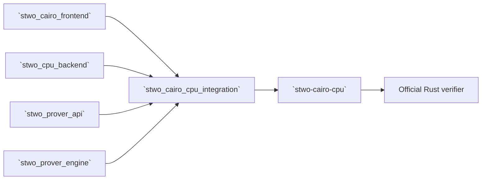

# `stwo_cairo_cpu_integration`

`stwo_cairo_cpu_integration` binds the backend-neutral Cairo frontend to the
portable CPU backend and the official plain-Blake2s proving transaction. It is
the narrow composition owner used by the released `stwo-cairo-cpu` product.

| Property | Value |
| :--- | :--- |
| Version | `0.1.0` |
| Layer | `integration` |
| Owner | `cairo-cpu-integration` |
| Public Zig module | `stwo_cairo_cpu_integration` |
| Focused CI host | Linux |
| Product state | Released |

See the [package contract](package.contract.json) and
[public facade](mod.zig) for the exact package boundary.

## Architecture



The integration chooses `CpuBackend`, the plain Blake2s Merkle
hasher/channel, the Cairo statement transaction, and the official PCS
configuration. It does not own Cairo semantics or generic prover algorithms.

## Public API

```zig
const cairo_cpu = @import("stwo_cairo_cpu_integration");

const Transaction = cairo_cpu.prover.transaction;
const Engine = Transaction.Engine;
const config = Transaction.official_pcs_config;
```

| Export | Responsibility |
| :--- | :--- |
| `prove_trace` | CPU-specialized raw Cairo trace proving and verification |
| `prover` | Official fixture transaction, including `proveFixture`, recorder support, and `verifyAndConsume` |

`prover.transaction.Result` is parameterized by the concrete CPU engine and
owns proof-side allocations. `verifyAndConsume` verifies the transaction and
consumes the mutable result according to the frontend's ownership contract.

## Dependencies

- `stwo_cairo_frontend`
- `stwo_core`
- `stwo_cpu_backend`
- `stwo_prover_api`
- `stwo_prover_engine`

The integration must not import Metal or CUDA.

## Build, test, and run

Focused package suite:

```sh
zig build test --build-file src/integrations/cairo_cpu/build.zig -Doptimize=ReleaseFast -j2
```

Build and run the assembled product:

```sh
zig build stwo-cairo-cpu -Doptimize=ReleaseFast

zig-out/bin/stwo-cairo-cpu run-and-prove \
  --program program.executable.json \
  --program-type executable \
  --arguments arguments.json \
  --proof proof.json \
  --verify
```

Run `zig build test-cairo-cpu-oracle -Doptimize=ReleaseFast` for the serial
official-verifier corpus.

## Contract and invariants

- API signature: the CPU transaction satisfies `stwo_prover_api`.
- Behavioral invariant: the binding selects the official plain-Blake2s
  protocol and its pinned PCS configuration.

Product acceptance additionally requires deterministic artifact publication
and acceptance of the exact published bytes by the official Rust verifier.

## Change checklist

1. Keep backend selection explicit and CPU-only.
2. Do not fork Cairo statement or proof-plan semantics in this package.
3. Preserve the official hasher/channel and PCS profile.
4. Verify allocator/consumption behavior on success and failure.
5. Run the package suite and Cairo CPU oracle gate.

## Related documentation

- [Cairo frontend](../../frontends/cairo/README.md)
- [CPU backend](../../backends/cpu_scalar/README.md)
- [Cairo production-port goal](../../../conformance/2026-07-26-stwo-cairo-production-port-goal.md)
- [Repository Cairo guide](../../../README.md#cairo-frontend)
