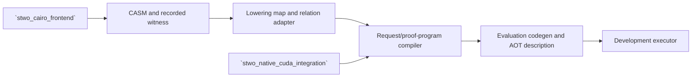

# `stwo_cairo_cuda_integration`

`stwo_cairo_cuda_integration` lowers authenticated Cairo proof inputs into the
generic resident CUDA proof-program model. It owns Cairo-specific request
compilation, relation adaptation, witness-oracle recording, evaluation
code-generation/AOT descriptions, and diagnostic execution.

| Property | Value |
| :--- | :--- |
| Version | `0.1.0` |
| Layer | `integration` |
| Owner | `cairo-cuda-integration` |
| Public Zig module | `stwo_cairo_cuda_integration` |
| Focused CI host | Linux |
| Product state | Development-only/staged; not released |

The [package contract](package.contract.json) and [mod.zig](mod.zig) are the
authoritative package records.

## Architecture and current boundary



No production CUDA runtime is exposed by this facade today. The emitter is
explicitly limited to proof-derived development semantics. Product descriptors
and host tests must not be interpreted as release admission.

## Public API

```zig
const cairo_cuda = @import("stwo_cairo_cuda_integration");

var compiled = try cairo_cuda.request_compiler.compileDevelopmentRequest(
    allocator,
    &prepared_program,
    protocol,
    target,
);
defer compiled.deinit();
```

Concrete signatures vary by diagnostic/compiler module; consult the linked
source before integrating. The top-level contractual surface is:

| Area | Exports |
| :--- | :--- |
| Input and identity | `identity`, `casm_input`, `recorded_witness`, `recorded_witness_oracle` |
| Lowering | `base_writer_plan`, `lowering_map`, `relation_adapter`, `native_ec` |
| Program construction | `program`, `request_compiler` |
| Evaluation machinery | `eval_codegen`, `eval_aot`, `eval_product_registry`, `eval_simd_oracle` |
| Parity fixtures | `eval_parity_fixture`, `relation_sn2_parity_fixture` |
| Diagnostics | `diagnostic_sn2`, `executor` |

## Dependencies

- `stwo_backend_contracts`
- `stwo_cairo_frontend`
- `stwo_core`
- `stwo_cuda_backend`
- `stwo_native_cuda_integration`
- `stwo_prover_engine`

This is deliberately an integration layer; it may compose those packages but
must not move their responsibilities into the CUDA backend itself.

## Build, test, and run

Host-independent tests use C stubs and support `-Dtest-filter`:

```sh
zig build test --build-file src/integrations/cairo_cuda/build.zig -Doptimize=ReleaseFast -j2
```

The staged Linux product step is `stwo-cairo-cuda` and requires a fully
explicit CUDA toolchain. There is no released Cairo CUDA CLI to run. Use the
released CPU product or parity-gated Metal product for production work.

## Contract and invariants

- API signature: the Cairo CUDA emitter remains explicitly development-only.
- Behavioral invariant: production admission derives from configured source
  authority and an exact proof plan.

Before activation, the integration needs complete semantic coverage,
authenticated AOT, real-device execution, exact CPU/Rust proof acceptance,
wrong-statement/mutation corpora, stable telemetry, and zero fallback.

## Change checklist

1. Keep development and production admission visibly distinct.
2. Authenticate source semantics and recorded-witness provenance.
3. Keep lowering maps and relation adapters total over admitted components.
4. Reject unsupported components and geometry rather than approximating them.
5. Run host contracts and the future explicit Linux/NVIDIA acceptance scope.

## Related documentation

- [Cairo frontend](../../frontends/cairo/README.md)
- [CUDA backend](../../backends/cuda/README.md)
- [Native CUDA integration](../native_cuda/README.md)
- [CUDA system architecture goal](../../../conformance/2026-07-24-cuda-system-architecture-goal.md)
- [Cairo production-port goal](../../../conformance/2026-07-26-stwo-cairo-production-port-goal.md)
