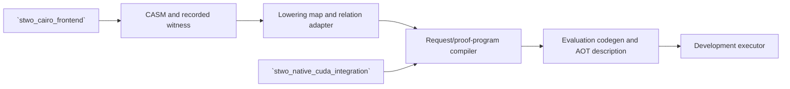

# `stwo_cairo_cuda_integration`

`stwo_cairo_cuda_integration` lowers authenticated Cairo proof inputs into the
generic resident CUDA proof-program model. It owns Cairo-specific request
compilation, relation adaptation, witness-oracle recording, evaluation
code-generation/AOT descriptions, and diagnostic execution.

| Property | Value |
| :--- | :--- |
| Version | `0.1.0` |
| Layer | `integration` |
| Owner | `cairo-cuda-integration` |
| Public Zig module | `stwo_cairo_cuda_integration` |
| Focused CI host | Linux |
| Product state | Development-only/staged; not released |

The [package contract](package.contract.json) and [mod.zig](mod.zig) are the
authoritative package records.

## Architecture and current boundary


```mermaid
flowchart LR
    Cairo[`stwo_cairo_frontend`] --> Input[CASM and recorded witness]
    Input --> Lower[Lowering map and relation adapter]
    Lower --> Compiler[Request/proof-program compiler]
    Native[`stwo_native_cuda_integration`] --> Compiler
    Compiler --> Eval[Evaluation codegen and AOT description]
    Eval --> Diagnostic[Development executor]
```

The staged CLI now derives witness geometry, relations, AIR constants and PCS
controllers directly from the authenticated source input. The SN2 proof-derived
path remains a compatibility diagnostic. Production admission still requires
real NVIDIA proofs accepted by the pinned official Rust verifier; host tests and
CuMetal translation do not satisfy that requirement.

## Canonical source path

`canonical_source.Prepared` owns the input and derives the complete proof plan
from the pinned Stwo-Cairo AIR library. The canonical archive selects 64 witness
kernels and 68 parametric AIR bodies, in addition to the 48 common Native entries.
It excludes the 271 legacy SN2 evaluation bodies. CPU, Metal and CUDA share the
preprocessed profile admission policy: the small profile automatically upgrades
to canonical when the input requires it; an explicitly undersized profile fails.

The protocol matches the CPU/Metal suite: 70 queries, 26 query PoW bits,
24 interaction PoW bits, blowup 1, FRI fold step 1, final degree bound 0,
no lifting and channel salt 0. CUDA verifies the decoded proof independently in
Zig before publishing official Rust proof JSON. Publication alone does not
establish official Rust acceptance.

Compile the complete CLI locally, including Linux code, without a GPU:

```sh
zig build check-cairo-cuda-local -Doptimize=ReleaseFast
zig build check-cairo-cuda-local -Doptimize=ReleaseFast -Dtarget=x86_64-linux-gnu
```

On NVIDIA, `scripts/benchmark_cairo_cuda.py` qualifies all four SN PIEs with
an isolated pinned Rust verifier and records proof digests, ingress, proving,
adapted-input wall time, host RSS and sampled whole-device memory. Inputs are
already adapted: these measurements exclude PIE execution and queueing.
It rejects noncanonical security, changed proof files and unverified results.

## Public API

```zig
const cairo_cuda = @import("stwo_cairo_cuda_integration");

var compiled = try cairo_cuda.request_compiler.compileDevelopmentRequest(
    allocator,
    &prepared_program,
    protocol,
    target,
);
defer compiled.deinit();
```

Concrete signatures vary by diagnostic/compiler module; consult the linked
source before integrating. The top-level contractual surface is:

| Area | Exports |
| :--- | :--- |
| Input and identity | `identity`, `casm_input`, `recorded_witness`, `recorded_witness_oracle` |
| Lowering | `base_writer_plan`, `lowering_map`, `relation_adapter`, `native_ec` |
| Program construction | `program`, `request_compiler` |
| Evaluation machinery | `eval_codegen`, `eval_aot`, `eval_product_registry`, `eval_simd_oracle` |
| Parity fixtures | `eval_parity_fixture`, `relation_sn2_parity_fixture` |
| Diagnostics | `diagnostic_sn2`, `executor` |

## Dependencies

- `stwo_backend_contracts`
- `stwo_cairo_frontend`
- `stwo_core`
- `stwo_cuda_backend`
- `stwo_native_cuda_integration`
- `stwo_prover_engine`

This is deliberately an integration layer; it may compose those packages but
must not move their responsibilities into the CUDA backend itself.

## Build, test, and run

Host-independent tests use C stubs and support `-Dtest-filter`:

```sh
zig build test --build-file src/integrations/cairo_cuda/build.zig -Doptimize=ReleaseFast -j2
```

The staged Linux product step is `stwo-cairo-cuda` and requires a fully
explicit CUDA toolchain. There is no released Cairo CUDA CLI to run. Use the
released CPU product or parity-gated Metal product for production work.

## Contract and invariants

- API signature: the Cairo CUDA emitter remains explicitly development-only.
- Behavioral invariant: production admission derives from configured source
  authority and an exact proof plan.

Before activation, the integration needs complete semantic coverage,
authenticated AOT, real-device execution, exact CPU/Rust proof acceptance,
wrong-statement/mutation corpora, stable telemetry, and zero fallback.

## Change checklist

1. Keep development and production admission visibly distinct.
2. Authenticate source semantics and recorded-witness provenance.
3. Keep lowering maps and relation adapters total over admitted components.
4. Reject unsupported components and geometry rather than approximating them.
5. Run host contracts and the future explicit Linux/NVIDIA acceptance scope.

## Related documentation

- [Cairo frontend](../../frontends/cairo/README.md)
- [CUDA backend](../../backends/cuda/README.md)
- [Native CUDA integration](../native_cuda/README.md)
- [CUDA system architecture goal](../../../conformance/2026-07-24-cuda-system-architecture-goal.md)
- [Cairo production-port goal](../../../conformance/2026-07-26-stwo-cairo-production-port-goal.md)


Canonical AIR codegen v3 classifies dynamic base constants using the authenticated
source templates. Fixed base/extension literals remain executable constants;
segment and memory-stride values remain request parameters, including zero/one
segment addresses. Scalar operations use the shared frontend field-shape facts.
Constraint accumulation follows canonical root order after each register's final
write, reducing live ranges without assuming that registers are written once.
The `cuda-cairo-local-parity` fixture checks these rules on the Apple GPU against
independent Python field arithmetic; it does not qualify an NVIDIA proof.
Canonical witness codegen v17 shares generic EC deductions and felt inversion,
and reuses disjoint input/output scratch across serial deduction calls. Inputs
are populated before output callbacks and copied results keep their original
register/store schedule. Long deduction chains use bounded device functions
with a compact carry bank derived from scheduled reads and writes. AIR programs
exceeding 8,192 instructions materialize thread-private register banks to bound
compiler memory; numerical checks include imperative register rewrites.
