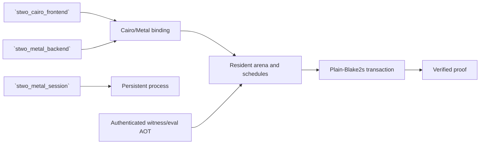

# `stwo_cairo_metal_integration`

`stwo_cairo_metal_integration` composes the backend-neutral Cairo proof plan
with the resident Metal engine, authenticated AOT witness/evaluation programs,
arena bindings, and persistent-process services. It is the composition owner
for the parity-gated `stwo-cairo-metal` product.

| Property | Value |
| :--- | :--- |
| Version | `0.1.0` |
| Layer | `integration` |
| Owner | `cairo-metal-integration` |
| Public Zig module | `stwo_cairo_metal_integration` |
| Focused CI host | macOS |
| Product state | Parity-gated, authenticated AOT |

The exact API and dependencies are declared in
[package.contract.json](package.contract.json) and exported by
[mod.zig](mod.zig).

## Architecture



This package maps Cairo memory, OODS, quotient inputs, interaction work, lookup
storage, and decommit geometry onto a resident Metal schedule. It owns the
composition glue, not the underlying Cairo semantics or Metal runtime.

## Public API

```zig
const cairo_metal = @import("stwo_cairo_metal_integration");

const Transaction = cairo_metal.prover.transaction;
try Transaction.initializeRuntime(allocator, runtime_policy);
defer Transaction.shutdown() catch {};

const before = try Transaction.telemetrySnapshot();
```

| Area | Exports |
| :--- | :--- |
| Transaction and interaction | `prover`, `interaction_executor`, `resident_lookup` |
| Arena and scheduling | `arena_binding`, `schedule_bindings`, `recipe_requirements`, `composition_prewarm` |
| Cairo proof stages | `memory_trace`, `oods`, `quotient_inputs`, `quotient_reference`, `runtime_decommit_geometry` |
| Generated programs | `eval_codegen`, `witness_codegen`, `witness_aot` |
| Persistent process | `process_backend`, `process_runner` |

The transaction exposes runtime initialization, telemetry/lifecycle snapshots,
fixture proving, verification/consumption, and shutdown. Production callers
must retain telemetry evidence proving that no fallback path completed.

## Dependencies

- `stwo_backend_contracts`
- `stwo_cairo_frontend`
- `stwo_core`
- `stwo_metal_backend`
- `stwo_metal_session`
- `stwo_prover_engine`

There is no CPU backend dependency.

## Build, test, and run

The owner-local step requires macOS and the Apple Metal SDK. It compiles the
integration tests and Objective-C runtime binding:

```sh
zig build test --build-file src/integrations/cairo_metal/build.zig -Doptimize=ReleaseSafe -j2
```

Build and validate the assembled authenticated-AOT product on a full-Xcode
host:

```sh
zig build stwo-cairo-metal -Doptimize=ReleaseFast
zig build test-cairo-metal-oracle -Doptimize=ReleaseFast
```

A consumer host may instead pass a retained bundle with
`-Dmetal-core-aot-bundle=/absolute/path`; the product remeasures and validates
the bundle before runtime creation.

## Contract and invariants

- API signature: the Metal transaction satisfies the stable prover contract.
- Behavioral invariant: it selects the official plain-Blake2s protocol.

Acceptance also requires exact CPU proof parity, official Rust verification,
authenticated AOT identity, deterministic missing-device failure, repeated
session safety, bounded residency, allocation rollback, and zero fallback.

## Change checklist

1. Keep generated programs identity-bound and fail closed.
2. Preserve the no-CPU dependency.
3. Update arena lifetimes, bindings, schedules, and telemetry together.
4. Test initialization, repeated requests, errors, and teardown.
5. Run compilation checks and full-Xcode/device oracle acceptance.

## Related documentation

- [Cairo frontend](../../frontends/cairo/README.md)
- [Metal backend](../../backends/metal/README.md)
- [Metal session service](../../tools/metal_session/README.md)
- [Cairo production-port goal](../../../conformance/2026-07-26-stwo-cairo-production-port-goal.md)
- [Repository AOT instructions](../../../README.md#cairo-frontend)
