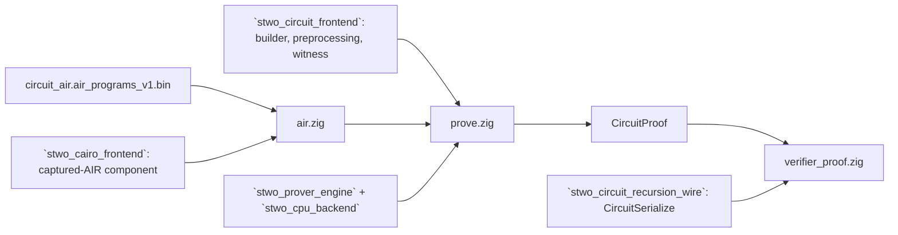

# `stwo_circuit_cpu_integration`

`stwo_circuit_cpu_integration` is the circuit prover of the circuit recursion
stage on the CPU backend: the Zig port of `crates/circuit_prover` of
[starkware-libs/proving](https://github.com/starkware-libs/proving) at
commit `5a7c5ede4299c91a61df19a07cba4f7502c14230` (milestone M7 of the
[recursion design](../../../design/starknet-proving-pipeline/recursion/02-design.md),
§4). Given a finalized circuit's value table and its preprocessed circuit, it
produces the same proof bytes as upstream `prove_circuit_assignment`, on
either channel profile, and converts the proof into the in-circuit verifier's
CircuitSerialize format.

| Property | Value |
| :--- | :--- |
| Version | `0.1.0` |
| Layer | `integration` |
| Owner | `circuit-cpu-integration` |
| Public Zig module | `stwo_circuit_cpu_integration` |
| Focused CI host | Linux |
| Upstream | `proving@5a7c5ed` |

See the [package contract](package.contract.json) and the
[public facade](mod.zig) for the exact package boundary.

## Architecture



The integration owns only composition:

- **Witness** comes from `stwo_circuit_frontend.witness`: the eleven
  components' base columns and LogUp lookups, and the interaction trace built
  with the prover engine's `air.logup_columns` (the `LogupTraceGenerator`
  port).
- **Constraints** are not ported. The oracle records the eleven
  `circuit_air` `FrameworkEval`s into `STWZEVA/1` evaluation programs
  (`vectors/circuit/official/circuit_air.air_programs_v1.bin`, design §4.2),
  and the Cairo lane's generic captured-AIR component evaluates them. `air.zig`
  rebinds the recorded instance to a proof's component log sizes and
  preprocessed layout: trace and evaluation log sizes, denominator inverses
  and preprocessed indices change; constraint, mask and relation order do not.
- **Transcript**: `prove.zig` is the only place that sequences channel
  operations (salt, FRI config, preprocessed commit, circuit hash, claim,
  base commit, 20-bit interaction grind, lookup draw, claimed sums,
  interaction commit, `prove_ex` with every preprocessed column sampled and
  the FRI grind). Both grinds use the Rust `SimdBackend` nonce order.
- **Profiles**: `Internal` is `Prover(Blake2sM31MerkleChannel)` (leaves and
  internal folds), `Root` is `Prover(Blake2sMerkleChannel)`. Both commit
  with the plain Blake2s Merkle hasher, so one preprocessed tree serves both.

## Public API

```zig
const circuit_cpu = @import("stwo_circuit_cpu_integration");

var bundle = try circuit_cpu.air.parse(allocator, bundle_bytes);
var proof = try circuit_cpu.Internal.prove(allocator, values, &preprocessed_circuit, &bundle, pcs_config, .{}, {});
var verifier_proof = try circuit_cpu.verifier_proof.prepare(allocator, &proof);
const bytes = try verifier_proof.serialize(allocator);
```

| Export | Responsibility |
| :--- | :--- |
| `air` | Parse the circuit AIR bundle and bind it to a proof's geometry |
| `prove` | `Prover(MC)`, `Options`, `Step`, `defaultPcsConfig` and the transcript |
| `Internal` | The prover on the internal (M31 channel) profile |
| `Root` | The prover on the root (plain Blake2s channel) profile |
| `verifier_proof` | `prepare_circuit_proof_for_circuit_verifier` and CircuitSerialize bytes |

`prove` takes an optional observer (`onStep`, `onLookupElements`,
`onTraces`) for conformance tests and an `Options` value whose fields change
only execution: a stage-profile recorder and compact polynomial storage,
which drops each tree's blown-up evaluations after hashing and evaluates the
constraints from coefficients.

## Dependencies

- `stwo_cairo_frontend`: the captured-AIR component and `STWZEVA/1` bundle
  reader (`proving.air.component`, `witness.composition_bundle`).
- `stwo_circuit_frontend`: builder, component list, preprocessing, circuit
  hash and witness.
- `stwo_circuit_recursion_wire`: the CircuitSerialize proof format.
- `stwo_core`: fields, channel profiles, PCS configuration and proofs.
- `stwo_cpu_backend`: the CPU backend.
- `stwo_prover_api`: the engine contract.
- `stwo_prover_engine`: the PCS, FRI and composition engine.

## Build, test, and run

```sh
zig build test --build-file src/integrations/circuit_cpu/build.zig -Doptimize=ReleaseSafe -j2
zig build circuit-parity-r7 --build-file src/integrations/circuit_cpu/build.zig -Doptimize=ReleaseSafe -j2
STWO_CIRCUIT_MULTIVERIFIER_INPUTS=<path> \
  zig build circuit-parity-r7-multiverifier --build-file src/integrations/circuit_cpu/build.zig -Doptimize=ReleaseFast -j2
```

`circuit-parity-r7` proves the six `prover_test.rs` circuits under the
upstream tests' default config and two of them under the 26-bit circuit FRI
config on both profiles, and compares every transcript digest, nonce, lookup
element, claimed sum, commitment, FRI root, last layer and per-column trace
digest with the oracle (`vectors/circuit/r7/prove_small.json`,
`prove_profiles.json`), plus the CircuitSerialize bytes and upstream
`verify_circuit`'s verdicts on them (`vectors/circuit/r7/verify/`).

`circuit-parity-r7-multiverifier` reproduces
`test_data/circuit_multiverifier/proof.bin` byte for byte. Its input, the
179 MB multiverifier circuit and value table, is written by
`stwo-circuit-oracle multiverifier-inputs --proving-root <proving>
--inputs-output <path>` and pinned by `vectors/circuit/r7/multiverifier_inputs.json`;
without the environment variable the test is skipped.
`STWO_CIRCUIT_STAGE_PROFILE=1` prints the stage times and
`STWO_CIRCUIT_COMPACT_MIN_LOG` (default 18, `off` to disable) selects compact
storage. `STWO_CIRCUIT_R7_EMIT_DIR` makes both steps write the proofs and the
oracle's `verify-circuit` requests.

## Measurements

Apple M4 Max, AC power, `ReleaseFast`, compact storage from log 18:

| Circuit | Build (Rust, value mode) | Preprocess | Prove (Zig) | Peak RSS |
| :--- | ---: | ---: | ---: | ---: |
| multiverifier of two Cairo proofs (2^21 qm31_ops rows, blowup 3, 27-bit FRI grind) | 0.05 s | 0.2 s (Rust), 0.15 s (Zig, from the dump) | 39.8 s | 5 GB |

The builder share of this fold proof is about 0.1% of wall time (0.7%
with preprocessing), far below the 10% at which design §9.1 would schedule
the topology tape (M13). The Zig builder cannot build this circuit yet (the
in-circuit verifier gadgets are later milestones), so the builder number is
upstream's; the Zig builder is a call-order port of it.

Grinds, measured separately (`STWO_CIRCUIT_STAGE_PROFILE=1`; the CPU search
runs about 26-30 million Blake2s hashes per second on this host, and the
time is set by the Rust-order position `hi * 2^20 + lo` of the nonce):

| Proof | Interaction grind (20 bits) | FRI grind |
| :--- | ---: | ---: |
| multiverifier, internal profile | 3 ms (`hi = 0`) | 11.3 s at 27 bits (`hi = 276`), 28% of the proof |
| `blake_g_gate`, internal profile | 51 ms (`hi = 1`) | 1.23 s at 26 bits (`hi = 35`) |
| `fibonacci`, root profile | 45 ms (`hi = 1`) | 1.28 s at 26 bits (`hi = 35`) |
| `blake_g_gate`, root profile | 17 ms (`hi = 0`) | 3.34 s at 26 bits (`hi = 95`) |
| `fibonacci`, internal profile | 3 ms (`hi = 0`) | 14 ms at 26 bits (`hi = 0`) |

The expected cost of a 26-bit grind is about 2^26 hashes (2.2 s here); of a
20-bit grind, about 2^20 (35 ms).

## Contract and invariants

- Proof bytes equal upstream's for the same inputs on both profiles; every
  field is covered by R7.
- The circuit AIR bundle is authenticated by SHA-256 (`air.bundle_sha256`)
  before it is used and must list the eleven components in `ComponentList`
  order.
- `Options` never changes proof bytes.
- The lookup sum of every proof is checked to be zero before the
  interaction trace is committed.

## Change checklist

- Run `circuit-parity-r7` after any change to the witness, the bundle
  binding, the transcript or the engine paths it uses.
- Run `circuit-parity-r7-multiverifier` after any change that affects
  blowup above 1, the FRI fold step, lifting, or compact storage.
- Regenerate an oracle vector only from `tools/stwo-circuit-oracle-rs` and
  record it in `vectors/circuit/provenance.json`.

## Related documentation

- [Recursion design](../../../design/starknet-proving-pipeline/recursion/02-design.md)
- [Rust porting map](../../../design/starknet-proving-pipeline/recursion/01-rust-map.md)
- [Circuit frontend](../../frontends/circuit/README.md)
- [Circuit oracle](../../../tools/stwo-circuit-oracle-rs/README.md)
