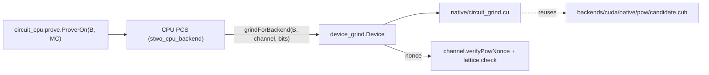

# `stwo_circuit_cuda_integration`

The circuit prover of the circuit recursion stage with its proof-of-work
grinds on an NVIDIA GPU (milestone M12 of the
[recursion design](../../../design/starknet-proving-pipeline/recursion/02-design.md),
§4.6, §4.7 and §9.2 item 7). It proves with the transcript of
[`circuit_cpu.prove`](../circuit_cpu/prove.zig), the port of
`crates/circuit_prover` of
[starkware-libs/proving](https://github.com/starkware-libs/proving) at
`5a7c5ede4299c91a61df19a07cba4f7502c14230`, on the CPU PCS. Both grinds of
every proof run on the device: the 20-bit interaction grind and the FRI grind
(26 bits in production).

| Property | Value |
| :--- | :--- |
| Version | `0.1.0` |
| Layer | `integration` |
| Public Zig module | `stwo_circuit_cuda_integration` |
| Device | NVIDIA, CUDA runtime; qualification target H100 (`sm_90`) |
| State | Hybrid circuit prover measured on H100; resident circuit PCS still open |
| Upstream | `proving@5a7c5ed` |

## What runs where



- `B` is `stwo_cpu_backend.configured(.{ .proof_of_work = device_grind.Device })`:
  the CPU backend, with `prover.pcs.proof_of_work.grindForBackend` sending
  every grind to the provider. The circuit prover calls the same function for
  the interaction grind when its backend is not the plain CPU backend.
- `native/circuit_grind.cu` uses the CUDA backend's PoW lattice pieces
  (`pow/candidate.cuh`: the fixed 40-byte Blake2s compression and
  `trailing_zeros`) and the loop of `pow/search.cu`: a dense index walk, one
  ascending residue class per thread, and a device atomic minimum. It adds
  the `Blake2sM31Channel` output policy (the candidate's first word reduced
  mod `2^31 - 1`) and takes the prefix from the host. `search.cu` itself is
  not changed, because qualified source snapshots pin its bytes.
- **Byte equality.** Everything except the two nonces is the CPU oracle's
  code. The nonces are the canonical minimum of
  `core/channel/blake2s_pow_order.zig` (Rust `SimdBackend` order,
  `(hi << 32) | lo` with `lo < 2^20`, hi-major). The minimum over all residue
  classes' first hits does not depend on the grid shape, and the engine
  rejects any nonce that is off the lattice or does not verify.
- **Fail closed.** If no device is visible, or on any CUDA runtime error, the
  grind returns an error (`CudaDeviceUnavailable`, `CudaRuntimeFailure`).
  There is no CPU fallback. `tests/fail_closed_test.zig` checks this on
  every host.

### Not in this package yet

The design's full M12 also covers a *resident* circuit prover (LDE, Merkle,
quotients and FRI on the device) and the gather and `blake_g` witness
kernels. `stwo_cuda_backend` exposes a resident proof session
(`CudaBackend.Session`), not the host-slice PCS contract that
`prover.engine.ProverEngine` binds. So unlike `circuit_metal`, which re-binds
the transcript to `MetalCommitBackend`, a resident CUDA circuit prover is new
engine work and is not a re-binding. The grinds come first because the design
names them as the reason for the kernels (§9.2 item 7). The same kernel's M31
mode also serves the Stage B Cairo lane's 24- and 26-bit grinds (§6.3 item 6)
once that lane is wired to a provider.

The pinned circuit AIR's eleven constraint programs now lower through the
same authenticated CUDA evaluator used by Cairo. Run
`zig build circuit-cuda-air-aot --build-file src/integrations/circuit_cuda/build.zig`
to generate eleven unique kernels and their placement manifest in the Zig
build cache. Normalized kernel identities were checked across two distinct
circuit-size bindings; all eleven kernels passed `sm_80` and `sm_90` PTX compilation
with an NVPTX-capable Clang. This completes the circuit AIR code-generation
piece, **not** device composition, PCS commitment, quotient, FRI, or the
PIE-to-root CUDA pipeline. Those stages still need an actual resident proof
session and H100 byte-parity measurements.
`zig build circuit-cuda-air-ptx-check --build-file
src/integrations/circuit_cuda/build.zig
-Dcuda-clang=/opt/homebrew/opt/llvm/bin/clang` regenerates the authenticated
sources and lowers every body to `sm_80` and `sm_90` PTX. The check also
validates each source SHA-256 and the exact eleven-body placement inventory.

## Build steps

Run each one with `zig build <step> --build-file src/integrations/circuit_cuda/build.zig`,
or from this directory.

| Step | Host | What it proves |
| :--- | :--- | :--- |
| `test` | any | Checks the kernel's own search code (compiled as host C++ with `STWO_CIRCUIT_GRIND_HOST_EMULATION`) against Rust Stwo's known answers (both channels; 20, 24 and 26 bits) and against the CPU grind, for any grid shape. Also checks the provider path through `grindForBackend`, and that the provers fail closed without a device. |
| `circuit-parity-r7-cuda-emulated` | any | R7: all ten `prover_test.rs` proofs (small, internal and root profiles, including the 26-bit FRI configs), with both grinds on the emulated kernel, byte for byte against the CPU oracle's fixture. |
| `circuit-cuda-compile-check -Dcuda-clang=<clang>` | any | Type-checks the kernel's host code and lowers the kernels to PTX for `sm_80` and `sm_90` with an NVPTX-capable Clang and no toolkit (`native/compile_check/include`). Also compiles and links every GPU artifact (device tests, R7, R9, bench) against the no-device stand-in. Apple Clang has no NVPTX target; Homebrew LLVM (`/opt/homebrew/opt/llvm/bin/clang`) does. |
| `test-cuda-device` | GPU | The device grind against Rust known answers (up to 26 bits), 64 transcripts × 7 widths per channel against the CPU grind, fresh 20- and 26-bit grinds, and the provider path. |
| `circuit-parity-r7-cuda` | GPU | R7 with both grinds on the device, byte for byte against the CPU fixture. |
| `circuit-parity-r9-cuda` | GPU (large) | R9: the recursive tree over the golden leaves, with every reduction's grinds on the device, byte for byte against upstream. |
| `circuit-cuda-grind-bench [reps]` | GPU | Times the CPU grind (all cores) and the device grind in interleaved runs on fresh transcripts, both channels, 20 and 26 bits. Checks every device nonce against the CPU nonce and prints the median, min..max and speedup. |

The GPU steps need `-Dcuda-nvcc=<nvcc>` and `-Dcuda-library-dir=<dir holding libcudart>`.
`-Dcuda-arch` takes a comma-separated list of SM numbers and defaults to `90`.
Without the first two options, these steps fail and name the missing
options.

## H100 qualification plan

This host has no CUDA device, so nothing here has run on a GPU. Run the
following on an H100 host (CUDA 12.x, driver ≥ 525) from the repository
root, in this order. Stop at the first failure.

```sh
B=src/integrations/circuit_cuda/build.zig
CUDA="-Dcuda-nvcc=/usr/local/cuda/bin/nvcc -Dcuda-library-dir=/usr/local/cuda/lib64 -Dcuda-arch=90"

# 0. The host checks (no GPU needed; they must already pass).
zig build test --build-file $B -Doptimize=ReleaseSafe -j2
zig build circuit-parity-r7-cuda-emulated --build-file $B -Doptimize=ReleaseSafe -j2

# 1. The kernel on the device: Rust known answers, CPU agreement, 26-bit shapes.
zig build test-cuda-device --build-file $B -Doptimize=ReleaseSafe $CUDA

# 2. R7 on the device, byte for byte (ten proofs, four at 26 bits).
STWO_CIRCUIT_STAGE_PROFILE=1 zig build circuit-parity-r7-cuda --build-file $B -Doptimize=ReleaseSafe $CUDA

# 3. The grind throughput (median of 15 interleaved CPU/GPU runs).
zig build circuit-cuda-grind-bench --build-file $B -Doptimize=ReleaseFast $CUDA -- 15

# 4. R9 on the device (large lane: well above 8 GB of host RAM, like `circuit-parity-large`).
zig build circuit-parity-r9-cuda --build-file $B -Doptimize=ReleaseSafe $CUDA

# 5. The CPU ladder, unchanged by this package, must stay green on the same host.
zig build circuit-parity --build-file src/integrations/circuit_cpu/build.zig -Doptimize=ReleaseSafe
```

The package is qualified when:

1. Steps 1, 2 and 4 pass. Byte equality in steps 2 and 4 is the release
   gate. A single differing byte is a failure, never a tolerance.
2. Step 3 prints no `MISMATCH`, and the 26-bit device median is at least 20x
   the CPU median on the same host. An H100 should reach tens of GH/s of
   Blake2s compressions, so a 2^26 grind should take milliseconds. If the
   device median sits near the first-call time, look at context creation and
   the per-call `cudaMalloc`/stream setup (each grind is synchronous and
   allocates its own 16-byte workspace), not at the kernel.
3. With `STWO_CIRCUIT_STAGE_PROFILE=1`, the per-proof FRI grind time reported
   by step 2 is below 50 ms at 26 bits after the first proof.
4. `nvidia-smi` shows no other process on the device during steps 2 to 4, and
   the timings are reported as medians with min..max.

Record the driver and CUDA versions, the `nvidia-smi -q` clocks and power
limit, the CPU model, and the step outputs alongside the result.

## PIE-to-root hybrid measurement

`circuit-recursion-cuda-hybrid` installs a CLI with the same `leaf-wrap` and
`fold-tree` interface as the CPU product. It uses the CPU Cairo leaf prover and
CPU circuit PCS, with both circuit proof-of-work grinds on CUDA. This is a
**hybrid baseline**, not a resident CUDA prover. The pinned M31/lifted Cairo
leaf has now produced Rust-verified proofs for both contiguous mainnet inputs
on H100 in the separate Cairo CUDA product. This hybrid CLI does not consume
them: it still proves Cairo on CPU. A complete GPU pipeline also needs a
resident circuit prover for wrap and fold.

On an NVIDIA host, build it with:

```sh
zig build circuit-recursion-cuda-hybrid --build-file src/integrations/circuit_cuda/build.zig \
  -Doptimize=ReleaseFast -Dcuda-nvcc=/usr/local/cuda/bin/nvcc \
  -Dcuda-library-dir=/usr/local/cuda/lib64 -Dcuda-arch=90
```

`tools/starknet-block-collector/benchmark_circuit_cuda_hybrid.py` takes the
adapted inputs and preimages from a qualified CPU/Metal `circuit_pipeline.py`
receipt, measures each leaf's load/Cairo/wrap and the root fold, and rejects
any proof or root file that differs from that reference. Adaptation is excluded
from its timed scope and the receipt says so explicitly.

The 30 September 2026 H100 diagnostic was byte-equal to the qualified CPU
root. Adapted input to root took 296.902 s: Cairo proving 155.270 s, wrap
87.600 s, fold 51.509 s, and the remainder load/process overhead. Those
stages predominantly ran on the host CPU; only the grinds used CUDA. This
receipt is therefore a coverage diagnostic, not a full-CUDA throughput result.

### Expected effect (hypothesis, from CPU measurements)

On the M4 Max development host (AC power, other agents running, so these are
indicative), R7's four 26-bit CPU FRI grinds take 0.017 s, 1.46 s, 1.45 s and
3.91 s (median of 3). The spread follows the nonce's position in the lattice.
The interaction grinds take 4 to 60 ms. Each circuit reduction in R8b and R9
does one 26-bit and one 20-bit grind, about 2^26 expected compressions or
roughly 2.5 s of CPU per reduction at the measured rate. The device grind
should remove nearly all of that. The rest of the proof stays on the CPU
until the resident prover exists.
