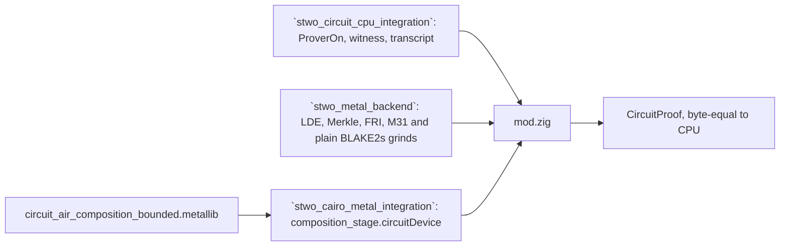

# `stwo_circuit_metal_integration`

`stwo_circuit_metal_integration` is the circuit prover of
`stwo_circuit_cpu_integration` on the Metal backend (milestone M12 of the
[recursion design](../../../design/starknet-proving-pipeline/recursion/02-design.md),
§4.6). It proves the same transcript (`crates/circuit_prover/src/prover.rs`
of [starkware-libs/proving](https://github.com/starkware-libs/proving) at
commit `5a7c5ede4299c91a61df19a07cba4f7502c14230`) with `MetalCommitBackend`,
and a device proof must be byte-equal to the CPU scalar oracle.

| Property | Value |
| :--- | :--- |
| Version | `0.1.0` |
| Layer | `integration` |
| Owner | `circuit-metal-integration` |
| Public Zig module | `stwo_circuit_metal_integration` |
| Focused CI host | macOS |
| Upstream | `proving@5a7c5ed` |

See the [package contract](package.contract.json) and the
[public facade](mod.zig) for the exact package boundary.

## Architecture



| Stage | Where | Reused machinery |
| :--- | :--- | :--- |
| Witness (base and interaction traces) | host | `circuit_cpu` and the circuit frontend |
| Interpolation, LDE, Merkle commitments | device | `MetalCommitBackend` |
| Interaction grind (20 bits) and FRI grind (26 bits) | device | `stwo_zig_blake2s_m31_pow_search` (internal profile) and `stwo_zig_blake2s_pow_search` (root), both in the Rust `SimdBackend` `(hi, lo < 2^20)` order |
| Composition | device | the Cairo lane's device stage (`cairo.proving.air.device_stage`) over the circuit AIR bundle, with the circuit's pinned composition library |
| Quotients, FRI folds, decommitment | device | `MetalCommitBackend` |

The composition library is
`vectors/circuit/official/circuit_air_composition_bounded.metallib`, admitted
only by its SHA-256 (`composition_aot.circuit_bounded_sha256_hex`); its recipe
and mint host are recorded next to it
(`circuit_air_composition_bounded.provenance.json`). Metallib bytes are not
reproducible across Xcode versions, so a new toolchain means a new mint and a
new pin, never a relaxed check.

## Public API

```zig
const circuit_metal = @import("stwo_circuit_metal_integration");

var proof = try circuit_metal.Internal.prove(allocator, values, &preprocessed_circuit, &bundle, pcs_config, .{}, {});
// The recursion drivers take the set: `LeafWrap.provers`, `Fold.provers`.
const fold = circuit_cpu.recursion.Fold{ .provers = &circuit_metal.provers, ... };
```

| Export | Responsibility |
| :--- | :--- |
| `Backend` | `MetalCommitBackend` |
| `Internal` | The prover on the internal (M31 channel) profile, with the Metal composition stage injected |
| `Root` | The prover on the root (plain Blake2s channel) profile, likewise |
| `provers` | Both profiles as a `circuit_cpu.prove.Provers` set for the leaf wrap and the fold tree |

## Dependencies

- `stwo_cairo_cpu_integration`: the leaf Cairo proof of the device R8/R8b
  rungs (the Cairo leaf stays on the CPU lane).
- `stwo_cairo_frontend`: the captured-AIR component and its device stage.
- `stwo_cairo_metal_integration`: the composition stage and library admission.
- `stwo_circuit_cpu_integration`: `ProverOn`, the witness and the transcript.
- `stwo_circuit_frontend`: preprocessing and the rung fixtures.
- `stwo_core`: channel profiles and PCS configuration.
- `stwo_metal_backend`: the device PCS, FRI and grinds.
- `stwo_prover_api`: the engine contract.
- `stwo_prover_engine`: the prover engine.

## Build, test, and run

```sh
zig build test --build-file src/integrations/circuit_metal/build.zig -Doptimize=ReleaseSafe -j2
```

R7 on the device, strict (all ten prove-small cases, both profiles):

```sh
STWO_ZIG_METAL_REQUIRE_GPU=1 zig build circuit-parity-r7-metal \
  --build-file src/integrations/circuit_metal/build.zig -Doptimize=ReleaseSafe -j2
```

The large rungs (a 2^23-row multiverifier per reduction):

```sh
zig build circuit-parity-r8-metal  --build-file src/integrations/circuit_metal/build.zig -Doptimize=ReleaseFast -j2
zig build circuit-parity-r8b-metal --build-file src/integrations/circuit_metal/build.zig -Doptimize=ReleaseFast -j2
zig build circuit-parity-r9-metal  --build-file src/integrations/circuit_metal/build.zig -Doptimize=ReleaseFast -j2
```

R7 and R9 reuse the CPU integration's rung tests and R8/R8b the circuit
recursion product's, each with `circuit_provers_under_test` bound to
`tests/metal_provers.zig`; the fixtures are the CPU oracle's and upstream's.

## Contract and invariants

- Device proof bytes equal the CPU scalar oracle's (and so upstream's) on both
  profiles; R7-R9 on the device are the evidence.
- Both grinds return exactly the §4.7 nonce; the host re-verifies each nonce
  and its lattice position before it enters the transcript.
- Fail closed: with `STWO_ZIG_METAL_REQUIRE_GPU=1` every stage the device
  cannot take is an error (`MetalHost*Forbidden`), never a silent CPU run: a
  missing grind kernel, a component the composition library does not cover, a
  mid-stage device error, host FRI inverses. Without it the backend's
  documented hybrid policy applies; the bytes are the same either way.
- The composition library is admitted only by its pinned digest and length.

## Change checklist

- Run `circuit-parity-r7-metal` under `STWO_ZIG_METAL_REQUIRE_GPU=1` after any
  change to the Metal backend paths, the grind kernels or the composition
  stage.
- Re-mint and re-pin the composition library after any change to the circuit
  AIR bundle or the composition code generator, and record the new host.

## Related documentation

- [Recursion design](../../../design/starknet-proving-pipeline/recursion/02-design.md)
- [Circuit CPU integration](../circuit_cpu/README.md)
- [Cairo Metal integration](../cairo_metal/README.md)
- [Metal backend](../../backends/metal/README.md)
