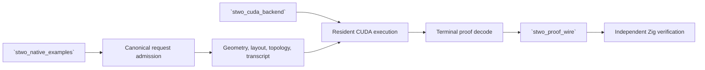

# `stwo_native_cuda_integration`

`stwo_native_cuda_integration` maps the Native example AIRs onto the resident
CUDA proof architecture. It owns application-specific request admission,
geometry, layouts, proof programs, transcript schedules, resident bindings,
terminal decoding, and parity targets.

| Property | Value |
| :--- | :--- |
| Version | `0.1.0` |
| Layer | `integration` |
| Owner | `native-cuda-integration` |
| Public Zig module | `stwo_native_cuda_integration` |
| Focused CI host | Linux |
| Product state | Staged; not released |

See [package.contract.json](package.contract.json) and
[mod.zig](mod.zig) for the exact owner boundary.

## Architecture and status



Shared machinery lives under `common`; each application owns a separate
adapter. CPU materialization may be retained as a correctness oracle, but
production geometry and proof-program construction must not depend on CPU
trace allocation.

Several adapters remain activation-disabled or experimental. In particular,
Plonk/LogUp and exact state-machine release flags fail closed, and only the
exact Blake structure is product-admissible. The root CUDA product remains
staged and is not part of the released product matrix.

## Public API

```zig
const native_cuda = @import("stwo_native_cuda_integration");

const geometry = try native_cuda.wide_fibonacci.request.admit(.{
    .statement = statement,
    .protocol = protocol,
});
const Driver = native_cuda.wide_fibonacci.NativeDriver;
```

| Export | Responsibility |
| :--- | :--- |
| `common` | Shared resident pipeline, transcript, FRI, quotient, proof assembly, and decode machinery |
| `blake` | Exact Blake CUDA structure and retained legacy contracts |
| `plonk` | Plonk adapter |
| `plonk_logup` | Activation-disabled exact Plonk/LogUp adapter |
| `poseidon` | Poseidon adapter and AOT pack |
| `state_machine` | Exact semantics with hardware activation fail closed |
| `wide_fibonacci` | Wide-Fibonacci request, plan, and resident driver |
| `xor` | XOR lookup adapter |

Use each application's request/admission module before constructing a driver.
Admission binds statement geometry and the exact parity protocol.

## Dependencies

- `stwo_backend_contracts`
- `stwo_core`
- `stwo_cuda_backend`
- `stwo_native_examples`
- `stwo_proof_wire`
- `stwo_prover_engine`

## Build, test, and run

Host-independent integration tests do not require a GPU and accept an optional
`-Dtest-filter`:

```sh
zig build test --build-file src/integrations/native_cuda/build.zig -Doptimize=ReleaseFast -j2
```

The staged `stwo-native-cuda` Linux product requires every explicit CUDA
compiler, runtime, archive, home, library, and architecture option. It is not a
released CLI and must not be selected implicitly.

## Contract and invariants

- API signature: the integration exposes an owned request and driver boundary.
- Behavioral invariant: wide-Fibonacci admission rejects every shape lacking a
  pinned parity contract.

Device activation requires exact CPU/Rust parity, authenticated AOT, stable
launch topology, bounded residency, zero fallback, proof-byte determinism, and
independent verification.

## Change checklist

1. Keep activation flags fail closed until their complete evidence exists.
2. Separate canonical inputs, geometry, layout, program, and execution.
3. Bind every admitted request to exact parity targets and AOT identity.
4. Keep CPU data paths diagnostic-only.
5. Run host contracts, Linux device acceptance, and proof mutation corpora.

## Related documentation

- [Native examples](../../examples/README.md)
- [CUDA backend](../../backends/cuda/README.md)
- [Proof-wire codec](../../interop/proof_wire/README.md)
- [CUDA system architecture goal](../../../conformance/2026-07-24-cuda-system-architecture-goal.md)
- [Repository CUDA status](../../../README.md#product-support)
