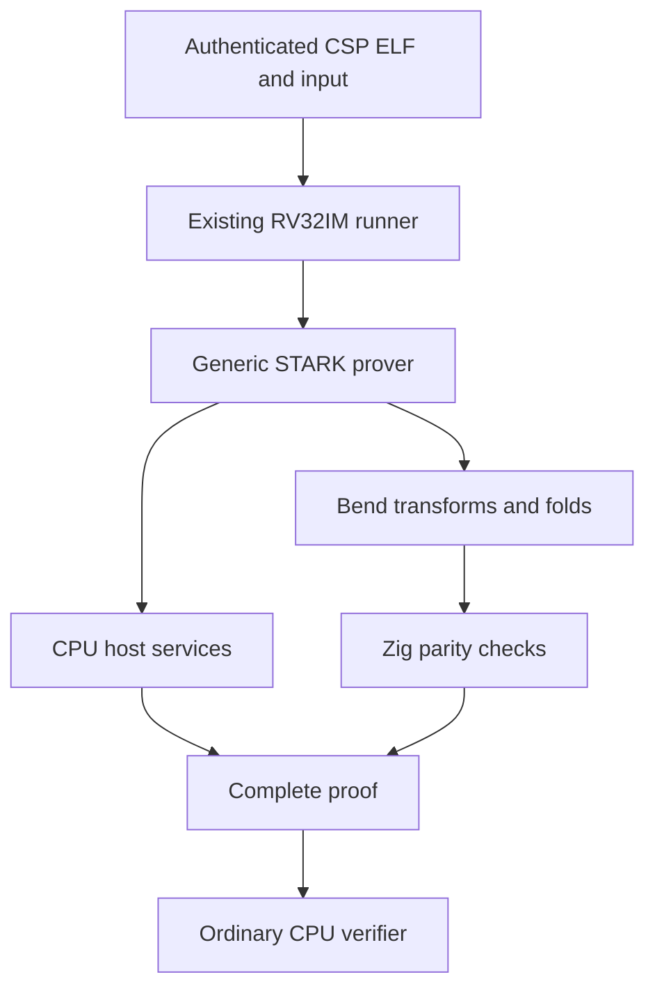

# `stwo_riscv_bend_integration`

| Fact | Value |
|---|---|
| Version | `0.1.0` |
| Layer | `integration` |
| Owner | `bend-experiment` |
| Focused CI host | Linux |

## Purpose

This experimental package runs real CSP RV32IM guests through the existing
Sail-authoritative runner and backend-generic STARK prover. It binds Bend Circle
transforms and FRI folds to the established CPU host services. It is a complete
proof-producing integration, not a claim that every operation is implemented in
Bend. Merkle commitments, composition evaluation, interactions, field inversion,
transcripts and verification remain on the host. The ordinary product registry
is unchanged: these research measurements do not grant production admission or
official CSP leaderboard status.



## Public API

`Engine` takes a compile-time Bend runtime configuration and returns the RISC-V
prover engine. Import it with `@import("stwo_riscv_bend_integration")`. Its backend
uses `BendBackendWithHost` to inject CPU composition services without introducing
backend-to-backend or backend-to-frontend package dependencies. The resulting
engine follows the existing prover and proof ownership contracts. Call
`@import("stwo_bend_backend").runtime.shutdown()` after using a persistent worker.
The caller must ensure all proof operations have completed before shutdown.

## Dependencies

`stwo_core` supplies protocol types. `stwo_prover_engine` owns the unchanged
STARK protocol. `stwo_riscv_frontend` owns guest execution, AIR, statement binding
and verification orchestration. `stwo_bend_backend` supplies the native worker
and checked arithmetic. `stwo_cpu_backend` supplies host composition and the
independent verification engine. The benchmark reuses the frontend's existing
Postcard module for proof serialization; it does not define another wire format.

## Build, test, and run

```sh
zig build test --build-file src/integrations/riscv_bend/build.zig -Doptimize=ReleaseFast -j2
python3 scripts/build_bend_experiment.py --bend-root /path/to/pinned/bend --output .zig-cache/bend-pass3/native
zig build --build-file src/integrations/riscv_bend/build.zig -Doptimize=ReleaseFast -Dbend-executable="$PWD/.zig-cache/bend-pass3/native" --prefix "$PWD/.zig-cache/bend-pass3/qualified" -j2
python3 autoresearch/benchmarks/bend_csp.py --cli .zig-cache/bend-pass3/qualified/bin/bend-csp-bench --bend .zig-cache/bend-pass3/native --output /tmp/bend-csp.json
```

The harness defaults to three alternating CPU/Bend pairs at the minimum canonical
SHA-256, Keccak, Poseidon2 and ECDSA secp256k1 input sizes. ECDSA is
substantially larger; `--targets ecdsa_secp256k1` selects it alone. Completed
lane receipts are saved immediately, including when the paired lane fails. Every sample runs in a
fresh process and writes proof bytes under the selected artifact directory.

## Contract and invariants

The benchmark authenticates the committed CSP manifest, ELF and input hashes,
checks exact guest cycle counts and canonical public outputs, and uses the
unchanged secure PCS configuration: 26 proof-of-work bits, 70 queries, 2x blowup,
last-layer degree log zero and single-step FRI. It requires CPU verification,
matching prover/verifier transcript states, byte-identical CPU/Bend proofs, and
nonzero Bend transform and fold counters. Failed samples are retained as failures.

Reported proving duration includes execution, witness and proof construction.
Verification and serialization are reported separately. Wall time includes the
whole process. Native CPU use, RSS, transport bytes and per-operation call counts
are retained. Bend uses persistent independent sessions, each bounded to 65,536 requests and
explicitly terminated after the proof. The benchmark defaults to four processes
with two native threads each; `-Dbend-workers=N -Dbend-threads=N` changes this.
Each receipt records actual resolved Zig pool size and Bend configuration, and
the harness explicitly sets `STWO_ZIG_WORKERS=8` in both lanes (`--workers`
overrides it). Peak concurrent native requests attest column-level overlap.
The runner uses a cold, per-proof 64 MiB exact-request cache of Bend-produced
arrays. Full request bytes must match; hashes alone never authorize reuse.
Shutdown clears all entries. The budget is split across sessions. Each session
also retains its last exact twiddle template in both Zig and native memory, up to
4*(2^24-1) bytes per side; this storage is separate from the result cache. BND3
frames omit a repeated template only after complete byte equality. Native calls, cache hits and boundary timings are
reported separately, and cached results still pass the Zig parity check.
There is no silent fallback to CPU when the Bend worker fails.

## Change checklist

Keep protocol parameters, input corpus, guest ABI, CPU baseline and verifier
unchanged. Run native parity and persistent-worker tests before proofs. Retain
source and executable hashes, raw samples and rejected runs. Distinguish host
services from Bend computation and research evidence from release qualification.
Pinned Rust qualification, GPU execution, full typed-interaction lowering and
production cancellation remain separate admission work.

## Related documentation

See the [Bend backend](../../backends/bend/README.md),
[CSP experiment harness](../../../autoresearch/benchmarks/bend_csp.py), and
[PR #199](https://github.com/teddyjfpender/stwo-zig/pull/199), stacked on #198.


## Qualified timing without duplicate arithmetic

Per-operation Zig shadow checks remain on by default. An explicitly built runner
with `-Dshadow-check=false` uses native Bend results directly after boundary
validation. The benchmark harness requires `--parity-report` naming a successful
receipt of at least 4096 fixtures bound to the exact native executable hash.
Every complete proof still requires CPU verification, correct canonical public
output, transcript agreement and byte-identical CPU/Bend proof bytes. Each receipt
states `bend_shadow_check`; checked and unshadowed times must be labelled separately.
See [pass5 evidence](../../../vectors/reports/bend-pr198/pass5/README.md).
