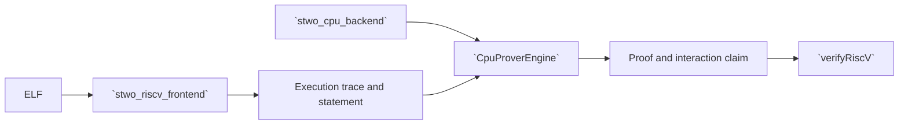

# `stwo_riscv_cpu_integration`

`stwo_riscv_cpu_integration` binds the Sail-authoritative RV32IM frontend to
`CpuBackend`. It provides typed prove, verify, diagnostic, ELF round-trip, and
Ethereum block helpers for the released RISC-V CPU product.

| Property | Value |
| :--- | :--- |
| Version | `0.1.0` |
| Layer | `integration` |
| Owner | `riscv-cpu-integration` |
| Public Zig module | `stwo_riscv_cpu_integration` |
| Focused CI host | Linux |
| Product state | Release-gated |

See [package.contract.json](package.contract.json) and
[mod.zig](mod.zig) for the authoritative surface.

## Architecture



Witness generation, instruction semantics, and AIR ownership remain in the
frontend. This integration makes one policy choice: the concrete engine backend
is `CpuBackend`.

## Public API

```zig
const riscv_cpu = @import("stwo_riscv_cpu_integration");

var statement = try riscv_cpu.proveAndVerifyElf(
    allocator,
    elf_bytes,
    max_steps,
    pcs_config,
);
defer statement.deinit(allocator);
```

| Export | Responsibility |
| :--- | :--- |
| `CpuProverEngine` | Stable transaction instantiated with `CpuBackend` |
| `Poseidon2ProveOutput`, `Poseidon2InteractionClaim` | Owned profile proof and detailed-claim types |
| `poseidon2_proof_artifact` | Canonical bounded fresh-process artifact codec |
| `proveRiscV` | Prove an execution trace |
| `proveRiscVSegmentV2`, `verifyRiscVSegmentV2` | Prove or independently verify one versioned segment statement for recursive admission |
| `proveRiscVWithRecorder` | Prove while collecting stage-profile data |
| `proveRiscVWithPublicData` | Bind explicit public data into the statement |
| `proveRiscVWithPublicDataAndExecution` | Return the owned execution result alongside the public-data-bound proof |
| `provePoseidon2WithPublicData` | Prove profile caller/provider components in the same CPU-backed STARK |
| `diagnoseRiscVRelations` | Produce relation diagnostics without publishing a proof |
| `verifyPoseidon2` | Independently reconstruct and verify the profile transcript |
| `verifyRiscV` | Verify proof, statement, and interaction claim |
| `proveAndVerifyElf` | Execute, prove, and verify an ELF |
| `proveEthereumBlock` | Host-bound Ethereum block proving helper |
| `recursive_node_artifact_store_v1` | Project recursive-node artifacts into the shared Zig CAS and canonical stage keys/manifests |

The recursive integration surface is deliberately explicit. Binary-parent
construction and publication are exported as
`recursive_binary_composition_authority`, `recursive_binary_outer`,
`recursive_binary_outer_cohort`, and `recursive_binary_verified_publication`;
the PCS/FRI authority is `recursive_fri_outer`. Parent-statement ownership is
split between `recursive_parent_statement_source` and
`recursive_parent_statement_air_source`.

Segment V2 admission and publication are owned by
`recursive_segment_v2_leaf_outer`, `recursive_segment_v2_noncore_owner`,
`recursive_segment_v2_outer_admission_v2`, `recursive_segment_v2_outer_cohort`,
`recursive_segment_v2_outer_engine`,
`recursive_segment_v2_temporal_child_authority`,
`recursive_segment_v2_tuple_closure_diagnostic`,
`recursive_segment_v2_verified_artifact`, and
`recursive_segment_v2_verified_publication`. Temporal 2-to-1 authority is
exported through `recursive_temporal_child_authority`,
`recursive_temporal_nonfri_source_v2`, `recursive_temporal_pair_authority_v2`,
`recursive_temporal_parent_cohort_v3`,
`recursive_temporal_parent_manifest_v3`,
`recursive_temporal_parent_prefix_runtime`,
`recursive_temporal_parent_row18_source_v3`,
`recursive_temporal_parent_row35_owner_v1`,
`recursive_temporal_parent_suffix_v3`, and
`recursive_temporal_parent_verifier_input_publication_v3`. These modules expose
authenticated authorities and verified-publication types; they do not make an
unverified proof or capture publishable.

The retained height-two composition surface is exported through
`recursive_temporal_level2_cohort_v1`,
`recursive_temporal_level2_composition_v1`,
`recursive_temporal_level2_prefix_v1`,
`recursive_temporal_level2_suffix_v1`,
`recursive_temporal_level2_transcript_v1`,
`recursive_temporal_level2_verifier_input_v1`,
`recursive_temporal_parent_pair_authority_v1`,
`recursive_temporal_parent_recursive_admission_v1`,
`recursive_temporal_parent_transcript_prefix_v1`, and
`recursive_temporal_parent_verified_artifact_v1`.

Returned proof/statement values own allocations according to the frontend
types. Callers must deinitialize them and must not publish before verification
and output-transaction commit.


Experimental Ethereum and recursion exports (not a production block-proof guarantee):

- `bulk_memcpy_current_selected_segment_authority_v1`
- `bulk_memcpy_retained_journal_v1`
- `bulk_memcpy_retained_microproof_command_v1`
- `bulk_memcpy_retained_microproof_receipt_v1`
- `bulk_memcpy_retained_microproof_receipt_v2`
- `bulk_memcpy_retained_microproof_v1`
- `bulk_memcpy_retained_observation_v1`
- `bulk_memcpy_retained_replay_v1`
- `bulk_memcpy_statement_artifact_v1`
- `bulk_memcpy_tape_artifact_v1`
- `ethereum_block_compact_replay`
- `ethereum_block_compact_replay_receipt`
- `ethereum_block_leaf_compact_manifest`
- `ethereum_block_leaf_contract`
- `ethereum_block_leaf_evidence`
- `ethereum_block_leaf_materializer`
- `ethereum_block_leaf_producer`
- `ethereum_block_leaf_support`
- `ethereum_block_leaf_verifier`
- `ethereum_candidate_combined_execution_capture_command_v1`
- `ethereum_candidate_combined_execution_capture_receipt_v1`
- `ethereum_candidate_combined_execution_capture_v1`
- `ethereum_candidate_combined_execution_replay_command_v1`
- `ethereum_candidate_combined_execution_replay_receipt_v1`
- `ethereum_candidate_combined_execution_replay_v1`
- `ethereum_candidate_degree5_provider_batch_execution_v1`
- `ethereum_candidate_degree5_provider_order_batch_v1`
- `ethereum_candidate_degree5_provider_prepared_batch_v1`
- `ethereum_degree5_provider_proof_artifact_v1`
- `ethereum_guest_pc_profile`
- `ethereum_incremental_capture_materializer_v3`
- `ethereum_incremental_capture_materializer_v4`
- `ethereum_incremental_capture_postprocess_command_v4`
- `ethereum_incremental_full_leaf_replay_command_v4`
- `ethereum_incremental_full_leaf_throughput_execution_v1`
- `ethereum_incremental_native_leaf_profile_v3`
- `ethereum_incremental_native_leaf_proof_artifact_v3`
- `ethereum_incremental_native_leaf_proof_v3`
- `ethereum_matched_ab_geometry_audit_v1`
- `ethereum_matched_ab_leaf_request_v1`
- `ethereum_matched_ab_rematerialization_authority_v1`
- `ethereum_matched_ab_rematerialization_command_v1`
- `ethereum_matched_ab_rematerialization_controller_v1`
- `ethereum_poseidon_leaf_geometry_command`
- `ethereum_poseidon_leaf_geometry_snapshot`
- `ethereum_poseidon_leaf_matched_ab_baseline_command_v1`
- `ethereum_poseidon_leaf_matched_ab_result_v1`
- `ethereum_poseidon_leaf_product_contract`
- `ethereum_poseidon_leaf_product_producer`
- `ethereum_poseidon_leaf_product_request`
- `ethereum_poseidon_leaf_product_verifier`
- `ethereum_poseidon_leaf_profile_receipt`
- `ethereum_poseidon_provider_call_artifact_v1`
- `ethereum_poseidon_provider_combined_v1`
- `ethereum_poseidon_provider_fused_v1`
- `ethereum_poseidon_provider_hpc_benchmark_v1`
- `ethereum_poseidon_provider_prepared_capture_receipt_v1`
- `ethereum_poseidon_provider_prepared_capture_v1`
- `ethereum_poseidon_provider_proof_artifact_v1`
- `ethereum_poseidon_provider_proof_artifact_v2`
- `ethereum_poseidon_provider_raw_batch_benchmark_v2`
- `ethereum_poseidon_provider_raw_pair_benchmark_v1`
- `ethereum_poseidon_provider_resource_plan_v1`
- `ethereum_poseidon_provider_retained_batch_receipt_v3`
- `ethereum_poseidon_provider_retained_batch_v3`
- `ethereum_poseidon_provider_retention_admission_v2`
- `ethereum_poseidon_provider_retention_sweep_v1`
- `ethereum_poseidon_provider_stage_a_checkpoint_v1`
- `ethereum_poseidon_provider_stage_b_lifecycle_v1`
- `ethereum_poseidon_provider_stage_b_prefix_v2`
- `ethereum_poseidon_provider_topology_sweep_v1`
- `ethereum_precompile_artifact_io`
- `ethereum_proof_artifact`
- `ethereum_provider_omitted_leaf_bundle_v1`
- `ethereum_segment_proof_artifact`
- `ethereum_segment_source_wire`
- `ethereum_unoptimized_baseline_admission_receipt_v1`
- `ethereum_unoptimized_baseline_admission_v1`
- `recursive_circuit_registry_v1`
- `recursive_common_ethereum_incremental_leaf_field_public_v4`
- `recursive_common_ethereum_incremental_leaf_input_v4`
- `recursive_common_fold_field_public_v2`
- `recursive_common_fold_input_v1`
- `recursive_common_fold_input_v2`
- `recursive_common_real_omitted_leaf_input_v1`
- `recursive_common_wrapper_authority_v1`
- `recursive_common_wrapper_authority_v2`
- `recursive_common_wrapper_manifest_v1`
- `recursive_common_wrapper_padding_v1`
- `recursive_field_node_public_v2`
- `recursive_node_artifact_store_v2`
- `recursive_node_artifact_v2`
- `recursive_pipeline_worker_protocol_v1`
- `recursive_pipeline_worker_v1`
- `recursive_temporal_child_transcript_authority_v1`
- `recursive_temporal_empty_parent_source_v1`
- `recursive_temporal_empty_parent_transcript_v1`
- `recursive_temporal_ethereum_leaf_bridge_v1`
- `recursive_temporal_ethereum_leaf_descriptor_v1`
- `recursive_temporal_heterogeneous_pair_v1`
- `recursive_temporal_leaf_or_empty_v1`
- `recursive_temporal_node_profile_v1`
- `recursive_temporal_profile_plan_transport_v1`
- `recursive_temporal_proof_security_v1`
- `recursive_temporal_statement_plan_v1`
- `recursive_temporal_topology_v1`
- `recursive_temporal_verified_node_v1`
- `recursive_temporal_verified_parent_capture_v1`
- `recursive_temporal_verified_reducer_v1`
- `resource_usage`

## Dependencies

- `stwo_riscv_frontend`
- `stwo_artifact_store`
- `stwo_core`
- `stwo_cpu_backend`
- `stwo_prover_api`
- `stwo_prover_engine`

Metal and CUDA are forbidden from this product boundary.

## Build, test, and run

Focused package tests:

```sh
zig build test --build-file src/integrations/riscv_cpu/build.zig -Doptimize=ReleaseFast -j2
```

Run the backend-owned universal recursion PCS/FRI proof gate directly with:

```sh
zig build test-recursion-air-proof \
  --build-file src/integrations/riscv_cpu/build.zig \
  -Doptimize=ReleaseSafe -j1
```

Build the released product and run its application registry:

```sh
zig build stwo-zig-riscv-cpu -Doptimize=ReleaseFast
zig-out/bin/stwo-zig-riscv-cpu applications
```

Run the complete proving corpus with:

```sh
zig build test-riscv-prover -Doptimize=ReleaseFast
```

## Contract and invariants

- API signature: `CpuProverEngine` satisfies the stable transaction contract.
- Behavioral invariant: the integration can select only `CpuBackend`.

The RISC-V release gate additionally checks all opcode families, trace-vector
reproduction, statement binding, adversarial witnesses, AIR uniqueness
evidence, artifact publication, and independent verification.

## Change checklist

1. Keep backend selection explicit and CPU-only.
2. Do not duplicate runner, witness, or AIR semantics here.
3. Preserve public-data and statement binding.
4. Verify and consume outputs before publication.
5. Run package tests and the complete RISC-V release gate.

The Ethereum leaf and provider development commands live in
`build_ethereum_leaf_steps.zig`. From the repository root,
`python3 scripts/zig_serial_build.py --cwd src/integrations/riscv_cpu run-ethereum-node-proof-v1 -Doptimize=Debug`
runs a serialized 30-level path/provider proof with fresh verification and
adversarial witnesses. Append `-- produce /absolute/artifact.bin` or
`-- verify /absolute/artifact.bin` for separate producer/verifier processes.
Its diagnostic PCS settings are not a security profile.

The common-fold recursion test can retain its completed proof in the existing
artifact store before running transcript diagnostics. From the repository root:

```sh
STWO_RECURSION_CHECKPOINT_STORE="$PWD/.git/local-ethereum/recursion-checkpoints" \
python3 scripts/zig_serial_build.py --cwd src/integrations/riscv_cpu \
  test-recursive-common-fold-transcript-program-v1 -Doptimize=ReleaseSafe --summary all
```

To debug the verifier or transcript AIR, reuse the `node_sha256` printed by
`COMMON_FOLD_CHECKPOINT`:

```sh
STWO_RECURSION_CHECKPOINT_STORE="$PWD/.git/local-ethereum/recursion-checkpoints" \
STWO_RECURSION_CHECKPOINT_NODE=PASTE_NODE_SHA256 \
python3 scripts/zig_serial_build.py --cwd src/integrations/riscv_cpu \
  test-recursive-common-fold-transcript-replay-v1 -Doptimize=ReleaseSafe --summary all
```

Replay rebuilds the canonical child fixtures, verifies the retained fold against
the current cohort, and runs the same transcript AIR and mutation checks. Missing,
corrupt or incompatible artifacts fail the check. Replay timings exclude fresh
fold proving and cannot replace a proving benchmark. These fixtures still depend
on native child custody; they are not an independently verifiable Ethereum root.

## Ethereum wrapper development

Start with the small complete STARK gate from the repository root:

```sh
python3 scripts/zig_serial_build.py --cwd src/integrations/riscv_cpu \
  test-ethereum-small-composition-proof -Doptimize=ReleaseSafe --summary all
```

It proves two nonzero components with different degree bounds, serializes the
proof, destroys producer state, and reconstructs an independent verifier. It
also rejects the former incompatible composition split. This is a focused
composition regression, not an Ethereum block proof.

The full experimental wrapper lifecycle uses the retained native proof corpus:

```sh
STWO_ETHEREUM_PROOF_CORPUS="$PWD/.git/local-ethereum" \
STWO_ETHEREUM_PROOF_PROGRESS=/tmp/ethereum-wrapper-progress.log \
STWO_ROLE0_GENUINE_WORKER_COUNT=1 \
python3 scripts/zig_serial_build.py --cwd src/integrations/riscv_cpu \
  test-ethereum-complete-proof -Doptimize=ReleaseSafe \
  -Dethereum-proof-strip=true --summary all
```

This command includes the genuine retained input-commitment failure, complete
wrapper proving, serialization, producer destruction, and fresh verification.
All cases must pass; missing corpus files fail instead of skipping. The corpus
contains the pinned `base-bound-v3/` pair and `program.elf`, plus the rejected
`role0-genuine-stage101/` case. Copy the corpus to another laptop to preserve
the exact regressions. `test-ethereum-native-base-bound-producer` regenerates
and independently verifies the current native pair; it does not recreate the
historical failing input.

For a real wrapper whose retained PCS columns exceed laptop RAM, set
`STWO_ETHEREUM_PCS_SCRATCH_DIR=/absolute/path/on/local/disk` on this command.
This explicit CPU storage mode maps retained LDE column values to preallocated,
immediately unlinked scratch files, and uses the same storage owner for typed-AIR
quotient evaluation buffers. It preserves the AIR, transcript and proof
format; without the variable, the existing in-memory route remains selected.
Allow disk capacity for all retained trees plus composition, using the printed
memory plan as a lower bound. Scratch mappings live until PCS teardown and are
released on normal exit or process termination. Disk allocation failures reject
the request; sparse mappings are not used as a fallback. Phase logs report current
and peak physical footprint, and total mapped bytes are reported at teardown.
This mode trades disk I/O for RAM and is not a performance improvement claim.

Core-verified wrapper bytes are retained under `wrapper-candidates/` before
cold geometry or capture admission. After a downstream failure, replay those
bytes without constructing another wrapper proof:

```sh
STWO_ETHEREUM_PROOF_CORPUS="$PWD/.git/local-ethereum" \
STWO_ETHEREUM_WRAPPER_CANDIDATE=/absolute/path/to/wrapper-candidates/DIGEST.bin \
STWO_ETHEREUM_PROOF_PROGRESS=/tmp/ethereum-wrapper-replay-progress.log \
STWO_ROLE0_GENUINE_WORKER_COUNT=1 \
python3 scripts/zig_serial_build.py --cwd src/integrations/riscv_cpu \
  test-ethereum-wrapper-candidate-replay -Doptimize=ReleaseSafe \
  -Dethereum-proof-strip=true --summary all
```

Candidate metadata records custody only. Replay checks its content hash, then
rebuilds the verifier from pinned native artifacts and ELF bytes and verifies
the candidate. It then runs the same recursive publication, node serialization,
child projection, and query/sample mutation checks as the full lifecycle.
Incompatible profiles fail. Replay excludes proof construction and cannot be
reported as proving latency. This recursive-publication check rebuilds native
child authority; the detached field-wrapper check below consumes only the root
bundle. A leaf wrapper does not establish a succinct whole-block root.

For ordinary leaves feeding the detached parent, use
`test-ethereum-root-production` with the same admitted native inputs, corpus,
worker and scratch settings as the complete-proof command. It proves the full
36-component root, retains its key/inputs/proof bundle and canonical wrapper,
destroys producer state, and independently verifies the exact expected public
inputs. It requires a durable corpus and rejects materialization-only requests.
Run the fresh-process rejection command below on the emitted root bundle before
passing it to `test-ethereum-saved-real-parent`. The parent consumes that bundle
directly; the broader native-aware publication replay remains available through
the complete-proof and candidate-replay diagnostics. Initial leaves use their
separately admitted profile. `check-ethereum-root-production` compiles this route
without producing a proof.

### Check a retained field wrapper without rebuilding native inputs

A root bundle contains `key.json`, `inputs.json`, and `proof.bin`. Use the key
SHA256 from the separately admitted circuit/lifecycle receipt. Computing a hash
of a candidate-selected key does not admit that circuit.

Build the verifier and canonical mutation exporter once:

```sh
python3 scripts/zig_serial_build.py --cwd src/integrations/riscv_cpu \
  build-ethereum-wrapper-root-verifier build-ethereum-wrapper-root-rejections \
  -Doptimize=ReleaseSafe -Dethereum-proof-strip=true \
  --prefix "$PWD/.git/local-ethereum/root-tools" --summary all
```

For an ordinary interior leaf, export rejection fixtures through the shared Zig
statement, public-input and circuit definitions. Both output directories below
must be new. Set `ETH_WRAPPER_BUNDLE` to the retained bundle and
`ETH_WRAPPER_KEY_SHA256` to its independently admitted key pin.

```sh
.git/local-ethereum/root-tools/bin/ethereum-wrapper-root-rejections-v1 \
  "$ETH_WRAPPER_BUNDLE" "$ETH_WRAPPER_KEY_SHA256" "$ETH_WRAPPER_REJECTIONS"
```

Retain the SHA256 of the manifest emitted by that successful exporter as
`ETH_WRAPPER_FIXTURE_SHA256`. Then one command runs the genuine proof and nine
rejections, each in a fresh verifier process, with no native inputs or reproving:

```sh
python3 scripts/ethereum_wrapper_root_check.py \
  .git/local-ethereum/root-tools/bin/ethereum-wrapper-root-verify-v1 \
  "$ETH_WRAPPER_BUNDLE" --expected-key-sha256 "$ETH_WRAPPER_KEY_SHA256" \
  --rejection-fixtures "$ETH_WRAPPER_REJECTIONS" \
  --rejection-manifest-sha256 "$ETH_WRAPPER_FIXTURE_SHA256" \
  --output "$ETH_WRAPPER_CHECK_OUTPUT"
```

The Python checker requires Python 3.11 or newer. It checks key-pin, claim,
nonce, proof-byte, statement, boundary, position, protocol and circuit-parameter
mutations. Resource failures and unrelated errors fail the gate. The two altered
circuit keys are explicit test-only cases; the genuine proof retains its original
key pin. Initial and terminal leaves need their own position cases: this exporter
rejects unsupported positions before creating output. Use the full lifecycle and
real cohort replay when changing preparation or recursive publication; this fast
verification command alone cannot validate those changes.

Use `test-ethereum-prepared-wrapper-boundary` for immutable owner, borrowed-view
admission, and field transcript profile checks. Use
`test-ethereum-raw-clock-boundary` for canonical raw clock encodings, zero-aware
access bounds, checked native cycle ranges, and private witness routing. Use
`test-ethereum-symbolic-public-boundary` for public and wire sum mutation
checks, or `test-recursive-common-ethereum-incremental-leaf-field-public-v4`
for the broader admission and routing suite. The `check-ethereum-complete-proof`
and `check-ethereum-wrapper-candidate-replay` targets compile without opening
the external corpus. Stripping debug symbols preserves ReleaseSafe checks.
The full fixture can exceed physical laptop RAM; phase logs report its memory
footprint. Build scheduling limits do not cap proof runtime allocations.
`STWO_ROLE0_GENUINE_HOST_BYTE_BUDGET` supplies the Stage101 CPU composition
request's `host_byte_budget`. It is not a cap on wrapper proving, Merkle or FFT
storage, materialization, or total process memory. The wrapper request currently
passes the worker count separately, without forwarding this byte budget. Record
measured phase/process memory alongside the requested budget.
`STWO_ROLE0_GENUINE_WORKER_COUNT` controls fixture/materialization and proving
workers. Cold verification currently uses its own Merkle scheduling; this setting
does not make the complete request single-threaded. Record
`STWO_ZIG_MERKLE_WORKERS` when comparing runs that override that scheduling.

## Real retained Ethereum campaigns

`test-ethereum-retained-campaign-geometry-v1` checks the explicit campaign and
execution-policy options. V4 capture and full-leaf replay keep the legacy
210-segment admission by default. Select `--campaign-geometry authenticated-v1`
to admit a different count and step budget from the authenticated materialization
and source request, within the existing 2–210 segment wire bound. This selection
does not alter CSP protocols or defaults.

The proof-free `ethereum-block-leaf-materialize` command accepts
`--snapshot-workers 1` for synchronous boundary hashing; the existing default
remains 16. Synchronous hashing avoids queuing snapshots from subsequent leaves.
A smaller segment budget reduces the retained execution trace, while increasing
the number of leaf proofs needed for the block.

The explicit CPU sibling
`ethereum-incremental-full-leaf-replay-prepared-cpu-v1` accepts the same retained
materialization, publication root, segment index, output, and campaign options as
`ethereum-incremental-full-leaf-replay-produce-v4`, plus required `--workers`,
`--host-byte-budget`, and `--host-byte-limit` values. It uses the prepared
core-plus-provider transaction also used by the Metal lane, serializes the leaf,
destroys producer state, freshly verifies on CPU, and only then publishes the
artifact. Optional `--claim-admission` accepts `legacy_aggregate_v2` (the unchanged
default), `selected_detailed_v3`, or `field_authority_v4`. The shared CPU/Metal
producer mints that exact profile, and fresh verification checks it before release;
the claim-admission receipt records the selected name and schema. The historical
Metal A/B harness still pins its original CPU artifact and authenticated AOT bundle;
new campaign/profile bytes require a separately admitted oracle and bundle.
`--host-byte-budget` governs the Stage101 composition allocator. The optional
`--pcs-retained-byte-budget` independently bounds the prepared field4 route's
retained PCS evaluation estimate; by default it uses `--host-byte-limit`.
This PCS check excludes Merkle trees, FRI, quotient buffers, twiddles, witnesses
and allocator overhead. Neither budget imposes an operating-system memory cap. Start with one leaf in flight
and measure peak process memory before increasing concurrency.

## Related documentation

- [RISC-V frontend](../../frontends/riscv/README.md)
- [CPU backend](../../backends/cpu_scalar/README.md)
- [RISC-V Sail differential gate](../../../conformance/riscv-sail-differential-gate.md)
- [Repository RISC-V guide](../../../README.md#risc-v-frontend)

The retained full-leaf replay accepts `--global-metadata-output <path>` to
publish a create-only `ethereum_full_leaf_bundle_verifier_v1.LeafV1` JSON
sidecar after fresh native verification. It contains the authenticated retained
source's global `MetadataV3` and the exact proof length/SHA256. Local proof
clocks are not used to reconstruct global metadata. The proof is published
first; a sidecar write failure leaves that valid proof intact and reports an
error. Bundle construction can copy it to the verifier's `<sha256>.bin` name.

For development with an already retained canonical tape/public-wire pair,
`--selected-leaf-admission-root <separate-directory>` explicitly selects a
leaf-scoped admission. `--publication-root` still points to the raw pair's
source directory. The command authenticates STWESG31, ELF/input/output, journal,
compact tape and public wire; reconstructs the selected leaf's entry sparse
tree; and uses the shared mint and independent cold-publication routines.
It writes `selected-leaf-admission-v1.json` only after those checks. Subsequent
runs require the same retained identities and cold-open the committed files.
The selected directory must be separate and contain no campaign seals.

This route does not establish full campaign coverage and never creates
STWIMF04/STWIPF04 manifests. Its sparse-tree custody genesis starts at the
selected leaf's actual index and root. Omitting the option retains the existing
whole-campaign seal requirement. The same flag is forwarded by the explicit
prepared CPU route and the native-provider Metal comparison command.


Build only the prepared CPU command with
`python3 scripts/zig_serial_build.py --cwd src/integrations/riscv_cpu build-ethereum-prepared-leaf-cpu-v1 -Doptimize=ReleaseSafe`.
The installed `ethereum-prepared-leaf-cpu-v1` accepts the shared prepared-leaf
options, with or without the existing
`ethereum-incremental-full-leaf-replay-prepared-cpu-v1` command prefix.
The serial bundle controller accepts optional
`--selected-leaf-admission-root <directory>` and assigns one create-only
`leaf-000000` directory per index, shared by that index's retry attempts.
Its persisted plan binds this selection; final independent bundle verification
still checks the original job, every proof, exact coverage and continuation.
