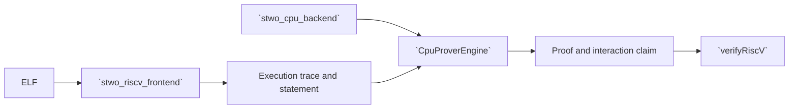

# `stwo_riscv_cpu_integration`

`stwo_riscv_cpu_integration` binds the Sail-authoritative RV32IM frontend to
`CpuBackend`. It provides typed prove, verify, diagnostic, ELF round-trip, and
Ethereum block helpers for the released RISC-V CPU product.

| Property | Value |
| :--- | :--- |
| Version | `0.1.0` |
| Layer | `integration` |
| Owner | `riscv-cpu-integration` |
| Public Zig module | `stwo_riscv_cpu_integration` |
| Focused CI host | Linux |
| Product state | Release-gated |

See [package.contract.json](package.contract.json) and
[mod.zig](mod.zig) for the authoritative surface.

## Architecture



Witness generation, instruction semantics, and AIR ownership remain in the
frontend. This integration makes one policy choice: the concrete engine backend
is `CpuBackend`.

## Public API

```zig
const riscv_cpu = @import("stwo_riscv_cpu_integration");

var statement = try riscv_cpu.proveAndVerifyElf(
    allocator,
    elf_bytes,
    max_steps,
    pcs_config,
);
defer statement.deinit(allocator);
```

| Export | Responsibility |
| :--- | :--- |
| `CpuProverEngine` | Stable transaction instantiated with `CpuBackend` |
| `proveRiscV` | Prove an execution trace |
| `proveRiscVWithRecorder` | Prove while collecting stage-profile data |
| `proveRiscVWithPublicData` | Bind explicit public data into the statement |
| `diagnoseRiscVRelations` | Produce relation diagnostics without publishing a proof |
| `verifyRiscV` | Verify proof, statement, and interaction claim |
| `proveAndVerifyElf` | Execute, prove, and verify an ELF |
| `proveEthereumBlock` | Host-bound Ethereum block proving helper |

Returned proof/statement values own allocations according to the frontend
types. Callers must deinitialize them and must not publish before verification
and output-transaction commit.

## Dependencies

- `stwo_riscv_frontend`
- `stwo_core`
- `stwo_cpu_backend`
- `stwo_prover_api`
- `stwo_prover_engine`

Metal and CUDA are forbidden from this product boundary.

## Build, test, and run

Focused package tests:

```sh
zig build test --build-file src/integrations/riscv_cpu/build.zig -Doptimize=ReleaseFast -j2
```

Build the released product and run its application registry:

```sh
zig build stwo-zig-riscv-cpu -Doptimize=ReleaseFast
zig-out/bin/stwo-zig-riscv-cpu applications
```

Run the complete proving corpus with:

```sh
zig build test-riscv-prover -Doptimize=ReleaseFast
```

## Contract and invariants

- API signature: `CpuProverEngine` satisfies the stable transaction contract.
- Behavioral invariant: the integration can select only `CpuBackend`.

The RISC-V release gate additionally checks all opcode families, trace-vector
reproduction, statement binding, adversarial witnesses, AIR uniqueness
evidence, artifact publication, and independent verification.

## Change checklist

1. Keep backend selection explicit and CPU-only.
2. Do not duplicate runner, witness, or AIR semantics here.
3. Preserve public-data and statement binding.
4. Verify and consume outputs before publication.
5. Run package tests and the complete RISC-V release gate.

## Related documentation

- [RISC-V frontend](../../frontends/riscv/README.md)
- [CPU backend](../../backends/cpu_scalar/README.md)
- [RISC-V Sail differential gate](../../../conformance/riscv-sail-differential-gate.md)
- [Repository RISC-V guide](../../../README.md#risc-v-frontend)
