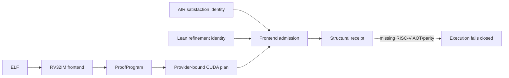

# `stwo_riscv_cuda_integration`

`stwo_riscv_cuda_integration` is the typed, fail-closed boundary between the
backend-neutral RV32IM frontend and the resident CUDA architecture. It binds a
RISC-V `ProofProgram`, its CUDA execution plan, an explicit NVIDIA CUDA or
CuMetal provider identity, AIR-satisfaction evidence, and Lean refinement
evidence into one content-addressed receipt.

| Property | Value |
| :--- | :--- |
| Version | `0.1.0` |
| Layer | `integration` |
| Owner | `riscv-cuda-integration` |
| Public Zig module | `stwo_riscv_cuda_integration` |
| Focused CI host | Linux |
| Product state | Structural; execution unavailable |

The structural boundary is usable now. Execution remains deliberately closed
until a RISC-V constraint AOT catalogue and independent end-to-end CUDA parity
receipt exist. A CuMetal receipt is Apple-GPU translation evidence and cannot
satisfy an NVIDIA-device acceptance gate.

## Architecture



No CPU or Metal prover fallback exists at this seam. Ownership transfers only
after compilation and receipt admission both succeed, so failed admission
leaves the caller's program intact.

## Public API

```zig
const riscv_cuda = @import("stwo_riscv_cuda_integration");

var program = try buildRiscVProofProgram(allocator);
var prepared = try riscv_cuda.compile(
    allocator,
    &program,
    cumetal_target,
    .{
        .air_satisfaction = air_digest,
        .lean_refinement = lean_digest,
    },
);
defer prepared.deinit(allocator);
```

| Export | Responsibility |
| :--- | :--- |
| `FormalEvidence` | Validates and hashes AIR and Lean evidence identities. |
| `Prepared` | Owns the admitted proof program, provider plan, and receipt. |
| `compile` | Compiles and admits one RV32IM program, transferring ownership on success. |
| `execution_blocker` | Stable explanation for the closed execution gate. |
| `frontend` | Backend-neutral RISC-V frontend namespace. |
| `production_ready` | Explicitly reports that execution is not production-ready. |
| `requireExecution` | Fails closed until AOT and parity evidence are complete. |

## Dependencies

- `stwo_backend_contracts` supplies the backend-neutral proof-program schema.
- `stwo_cuda_backend` supplies provider-bound plans and admission receipts.
- `stwo_riscv_frontend` owns RV32IM execution and AIR semantics.

## Build, test, and run

The focused tests are host-independent and do not require CUDA, Metal, or
CuMetal libraries:

```sh
zig build test --build-file src/integrations/riscv_cuda/build.zig -Doptimize=ReleaseFast -j2
```

There is intentionally no runnable `stwo-riscv-cuda` product yet. The product
descriptor stays unavailable until `requireExecution` can validate a complete
frontend-specific AOT catalogue and independent proof parity evidence.

## Contract and invariants

- API signature: `compile` consumes a backend-neutral RV32IM `ProofProgram`
  only after provider-bound plan admission succeeds.
- Evidence invariant: AIR satisfaction and Lean refinement identities must both
  be nonzero and are bound into the receipt.
- Provider invariant: NVIDIA and CuMetal plan identities and evidence classes
  are disjoint.
- Runtime invariant: structural admission cannot be mistaken for development
  or production execution admission.
- Fallback invariant: absent RISC-V AOT/parity evidence returns an error; no CPU
  or Metal path is selected.

## Change checklist

- Keep proof-program ownership in the RISC-V frontend.
- Include the provider in all plan and receipt identities.
- Add AOT entries only through an authenticated RISC-V product catalogue.
- Require independent proof parity before opening execution admission.
- Test NVIDIA and CuMetal identities separately.
- Do not add SM83 through this package.

## Related documentation

- [`../../backends/cuda/README.md`](../../backends/cuda/README.md)
- [`../riscv_metal/README.md`](../riscv_metal/README.md)
- [`package.contract.json`](package.contract.json)
