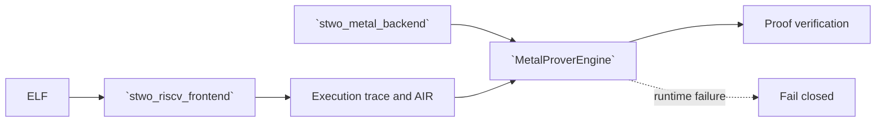

# `stwo_riscv_metal_integration`

`stwo_riscv_metal_integration` binds the backend-neutral RV32IM frontend to the
fail-closed Metal commitment engine. It preserves frontend-owned execution and
AIR semantics while selecting a device-only proving transaction.

| Property | Value |
| :--- | :--- |
| Version | `0.1.0` |
| Layer | `integration` |
| Owner | `riscv-metal-integration` |
| Public Zig module | `stwo_riscv_metal_integration` |
| Focused CI host | macOS |
| Product state | Parity-gated |

The [package contract](package.contract.json) and [mod.zig](mod.zig) define the
reviewed package boundary.

## Architecture



The integration never substitutes the CPU commitment backend when Metal
initialization, admission, or execution fails.

## Public API

```zig
const riscv_metal = @import("stwo_riscv_metal_integration");

var statement = try riscv_metal.proveAndVerifyElf(
    allocator,
    elf_bytes,
    max_steps,
    pcs_config,
);
defer statement.deinit(allocator);
```

| Export | Responsibility |
| :--- | :--- |
| `MetalProverEngine` | Stable transaction instantiated with `MetalCommitBackend` |
| `proveRiscV` | Prove an execution trace |
| `proveRiscVWithRecorder` | Prove with stage-profile recording |
| `proveRiscVWithPublicData` | Bind explicit public data |
| `verifyRiscV` | Verify proof, statement, and interaction claim |
| `proveAndVerifyElf` | Execute, prove, and verify an ELF |

## Dependencies

- `stwo_riscv_frontend`
- `stwo_core`
- `stwo_metal_backend`
- `stwo_prover_api`
- `stwo_prover_engine`

`stwo_cpu_backend` is intentionally absent.

## Build, test, and run

The focused package step requires macOS and the Apple Metal SDK and compiles the
integration test root:

```sh
zig build test --build-file src/integrations/riscv_metal/build.zig -Doptimize=ReleaseSafe -j2
```

Build and exercise the assembled product on a Metal-capable Mac:

```sh
zig build stwo-riscv-metal -Doptimize=ReleaseFast
zig build test-riscv-metal -Doptimize=ReleaseFast
zig build riscv-csp-bench-metal -Doptimize=ReleaseFast
```

Use `zig-out/bin/stwo-zig-riscv-metal` for the installed CLI; inspect its help
or application registry for the exact current flags. The root build produces
the authenticated core AOT bundle first and installs it beside the CLI; an
explicit retained bundle can instead be supplied with
`-Dmetal-core-aot-bundle=<absolute-path>`.

## Contract and invariants

- API signature: the Metal engine satisfies the shared prover transaction.
- Behavioral invariant: its backend type is exactly `MetalCommitBackend`, so
  the integration cannot select CPU.
- Runtime invariant: prove and bench initialize only from the manifest-bound
  authenticated metallib before warmup; source JIT is not a product fallback.
- Evidence invariant: both resident semantic and lookup polynomial batches must
  dispatch for every verified sample, with zero eligible-route declines.

Device acceptance must also prove deterministic parity, real Metal execution,
zero fallback, runtime identity, and successful independent verification.

## Change checklist

1. Keep CPU imports and fallback paths out.
2. Reuse frontend statements and semantics without duplication.
3. Treat runtime admission and telemetry as correctness evidence.
4. Test missing-device and runtime-failure paths.
5. Run focused compile checks and real-device RISC-V Metal gates.

## Related documentation

- [RISC-V frontend](../../frontends/riscv/README.md)
- [Metal backend](../../backends/metal/README.md)
- [CPU integration](../riscv_cpu/README.md)
- [RISC-V release evidence](../../../conformance/riscv-release-evidence.md)
- [Repository RISC-V guide](../../../README.md#risc-v-frontend)
