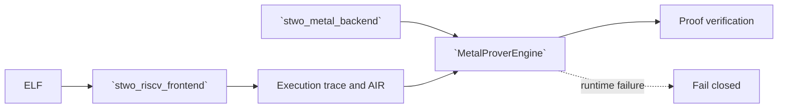

# `stwo_riscv_metal_integration`

`stwo_riscv_metal_integration` binds the backend-neutral RV32IM frontend to the
fail-closed Metal commitment engine. It preserves frontend-owned execution and
AIR semantics while selecting a manifest-bound Metal proving transaction.

| Property | Value |
| :--- | :--- |
| Version | `0.2.0` |
| Layer | `integration` |
| Owner | `riscv-metal-integration` |
| Public Zig module | `stwo_riscv_metal_integration` |
| Focused CI host | macOS |
| Product state | Parity-gated |

The [package contract](package.contract.json) and [mod.zig](mod.zig) define the
reviewed package boundary.

## Architecture



The integration never substitutes the CPU commitment backend when Metal
initialization, admission, or execution fails.

## Public API

```zig
const riscv_metal = @import("stwo_riscv_metal_integration");

var statement = try riscv_metal.proveAndVerifyElf(
    allocator,
    elf_bytes,
    max_steps,
    pcs_config,
);
defer statement.deinit(allocator);
```

| Export | Responsibility |
| :--- | :--- |
| `MetalProverEngine` | Stable transaction instantiated with `MetalCommitBackend` |
| `guest_precompile` | Exact authenticated-AOT admission for `rv32im-zkvm-poseidon2-v1` |
| `proveRiscV` | Prove an execution trace |
| `proveRiscVWithRecorder` | Prove with stage-profile recording |
| `proveRiscVWithPublicData` | Bind explicit public data |
| `verifyRiscV` | Verify proof, statement, and interaction claim |
| `proveAndVerifyElf` | Execute, prove, and verify an ELF |
| `riscv_polynomial_codegen` | Authenticated RISC-V Metal polynomial codegen assets |

## Dependencies

The experimental Stage101 commands also depend on `stwo_riscv_cpu_integration`
for shared leaf orchestration and CPU verification. The normal Metal engine
retains its explicit backend selection.


- `stwo_riscv_frontend`
- `stwo_core`
- `stwo_metal_backend`
- `stwo_prover_api`
- `stwo_prover_engine`

`stwo_cpu_backend` is intentionally absent.

## Build, test, and run

For typed detached leaf/parent production and fresh standalone verification, use
the [canonical recursion route](../../../design/riscv-proving-stack/canonical-typed-recursion.md).
CPU and Metal commands share the producer implementation and select explicit engines.

The focused package step requires macOS and the Apple Metal SDK. It executes the
device-free contract suite; the real-device proof skips unless its dedicated
lane supplies a bundle:

```sh
zig build test --build-file src/integrations/riscv_metal/build.zig -Doptimize=ReleaseSafe -j2
```

Run the explicit integration acceptance lane on a Metal-capable Mac:

```sh
zig build test-authenticated-aot --build-file src/integrations/riscv_metal/build.zig -Doptimize=ReleaseFast -Dmetal-core-aot-bundle=/absolute/path/to/core -j2
```

Build and exercise the assembled product on a Metal-capable Mac:

```sh
zig build stwo-riscv-metal -Doptimize=ReleaseFast -Dmetal-core-aot-bundle=/absolute/path/to/core
zig build test-riscv-metal -Doptimize=ReleaseFast -Dmetal-core-aot-bundle=/absolute/path/to/core
zig build test-riscv-metal-guest-poseidon2-aot -Doptimize=ReleaseFast -Dmetal-core-aot-bundle=/absolute/path/to/core -j2
zig build riscv-csp-bench-metal -Doptimize=ReleaseFast -Dmetal-core-aot-bundle=/absolute/path/to/core
```

Use `zig-out/bin/stwo-zig-riscv-metal` for the installed CLI; inspect its help
or application registry for the exact current flags. The root build consumes
the explicit retained bundle supplied with
`-Dmetal-core-aot-bundle=<absolute-path>` and installs that authenticated
closure beside the CLI.

The installed CLI keeps the existing base commands unchanged. The only guest
extension routes are explicit:

```sh
zig-out/bin/stwo-zig-riscv-metal guest-poseidon2-prove \
  --elf guest.elf --input input.bin --backend metal --max-steps 900000 \
  --output proof.stw --report-out proof-report.json
zig-out/bin/stwo-zig-riscv-metal guest-poseidon2-verify \
  --artifact proof.stw
```

Both default to the secure PCS policy. `--protocol functional` is an explicit
development/evidence policy and is labelled `functional-development` in the
receipt. No command claims generic guest or generic precompile support.

## Contract and invariants

- API signature: the Metal engine satisfies the shared prover transaction.
- Behavioral invariant: its backend type is exactly `MetalCommitBackend`, so
  the integration cannot select CPU.
- Runtime invariant: prove and bench initialize only from the manifest-bound
  authenticated metallib before warmup; source JIT is not a product fallback.
- Evidence invariant: both resident semantic and lookup polynomial batches must
  dispatch for every verified sample, with zero eligible-route declines.
- Guest-profile invariant: the final caller/provider components carry the exact
  version-1 semantic identities. They intentionally use the reviewed generic
  evaluator because each combines direct and LogUp constraints; that placement
  is not a backend fallback. Every backend fallback counter must remain zero.
- Publication invariant: the product independently verifies the bounded binary
  profile artifact and cleanly shuts down the authenticated runtime before the
  proof becomes visible.

Device acceptance must also prove deterministic parity, real Metal execution,
zero fallback, runtime identity, and successful independent verification.

## Change checklist

1. Keep CPU imports and fallback paths out.
2. Reuse frontend statements and semantics without duplication.
3. Treat runtime admission and telemetry as correctness evidence.
4. Test missing-device and runtime-failure paths.
5. Run focused compile checks and real-device RISC-V Metal gates.

## Related documentation

- [RISC-V frontend](../../frontends/riscv/README.md)
- [Metal backend](../../backends/metal/README.md)
- [CPU integration](../riscv_cpu/README.md)
- [RISC-V Sail differential gate](../../../conformance/riscv-sail-differential-gate.md)
- [Repository RISC-V guide](../../../README.md#risc-v-frontend)

## Explicit real-leaf comparison admission

The Stage101 experiment retains its original artifact and AOT pins by default.
For another freshly CPU-verified retained leaf, explicitly set
`STWO_ZIG_STAGE101_BENCHMARK_ADMISSION_V2` to a JSON file containing:

```json
{
  "schema": "stwo.stage101-benchmark-admission.v2",
  "artifact_bytes": 123,
  "artifact_sha256": "<64 lowercase hexadecimal characters>",
  "claim_schema": 4,
  "manifest_sha256": "<64 lowercase hexadecimal characters>",
  "metallib_sha256": "<64 lowercase hexadecimal characters>"
}
```

Populate the size and digest from the actual CPU artifact, and both AOT digests
from the newly built bundle. This is an explicit benchmark custody tuple; it
does not replace native proof verification. The command still requires exact
CPU/Metal artifact parity, fresh CPU verification, authenticated AOT identity,
resident kernel coverage and explicit timing/resource receipts. The V2 tuple
is accepted only on `--provider-route native`. Its claim schema must match
`--claim-admission` (`legacy_aggregate_v2`, `selected_detailed_v3` or
`field_authority_v4`). No legacy pin is overwritten.

`STWO_ZIG_STAGE101_REFERENCE_ARTIFACT` selects the CPU artifact;
`STWO_RISCV_METAL_AOT_BUNDLE` selects the authenticated bundle. Worker and host
budget settings remain explicit through `STWO_ZIG_STAGE101_WORKER_COUNT`,
`STWO_ZIG_STAGE101_HOST_BYTE_BUDGET` and `STWO_ZIG_STAGE101_HOST_BYTE_LIMIT`.
The host budget applies to the Stage101 composition request, not total process
memory. Keep one leaf in flight until the complete request is measured.
`STWO_ZIG_STAGE101_BUDGET_MS` records four explicit phase ceilings when the
original five-second target is not yet met; raising them does not establish
that target as achieved.
