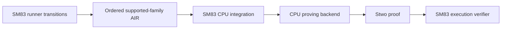

# `stwo_sm83_cpu_integration`

| Fact | Value |
|---|---|
| Version | `0.1.0` |
| Layer | `integration` |
| Owner | `sm83-cpu-integration` |
| Focused CI host | Linux |

## Purpose and architecture

This package joins the ROM-agnostic SM83 frontend to the scalar and SIMD CPU
proving backend. It proves all 15 flat-ISA family selectors: ALU8, DAA,
INCDEC8, INCDEC16, accumulator rotate, LOAD8, LOAD16, ALU16, MISC, BRANCH,
STACK, INTERRUPT, CB rotate/shift, CB BIT, and CB RES/SET. These are composed
plus timer-disabled interrupt service. These are composed through Stwo
commitment, composition, FRI, and verification as 21 canonical
components. Consecutive CPU state, PC, M-cycles, public boundaries, ROM
fetches, and flat committed data-memory reads and writes are bound. Actions,
final or intermediate observations, MBC banking, timer MMIO, and HALT
scheduling are not part of this base flat-execution entry point.

The v3 environment entry point composes the RTC-free MBC3 cartridge claim with
committed joypad and timer endpoints, actions, FF00 and FF04–FF07 MMIO, one
timer tick per execution M-cycle, delayed TIMA reload semantics, and ordered
joypad/timer IF updates in shared committed memory. It also commits selected
final RAM regions and a non-empty canonical schedule of intermediate
`(mcycle, key, expected)` RAM samples, each joined read-only to that ordered
memory history. Joypad and timer admission remain independent, so enabling one
cannot admit the other's rows or a PPU row.

The v7 machine-environment entry point adds the canonical scheduler,
halt-bug state, interrupt-service memory cycles, PPU timing and MMIO, DMA
execution and memory rows, and ordered CPU-visible APU transitions. It binds
every execution access in FF10–FF3F to the APU trace and commits the APU
endpoints and raw system-image latches. The frontend still owns the statement,
AIR, transcript, and proof transaction; this package selects the CPU/SIMD
backend.

The split keeps game content out of the proof system. Pokémon Red, Pokémon Blue, or a forked ROM will eventually be values supplied to one machine statement; none is compiled into this integration. The frontend owns SM83 decode, execution semantics, witness layout, AIR, and the backend-generic proof transaction. This package owns only the concrete CPU/SIMD backend selection and its adversarial integration tests.



## Public API

Import the package with:

```zig
const sm83_cpu = @import("stwo_sm83_cpu_integration");
```

`proveExecution` accepts validated `StepTrace` values, a `Rom`, and committed
initial and final `MemoryImage` values, then returns `ProveOutput`.
`proveMachineExecution` accepts canonical `MachineStepResult` rows containing
ordinary instructions beginning with IME clear (excluding HALT/STOP). Flat
interrupt-service rows fail closed because they no longer retain pinned
SameBoy bus-cycle provenance; the v7 cartridge machine entry point owns them.
This restricted surface also excludes timer-register accesses, pending
reloads, and DIV-byte transitions.
`verifyExecution` consumes the same public inputs and proof under an
`ExecutionStatement`. `CpuProverEngine` fixes the backend selection; transcript
implementation types remain private to the integration.

`EnvironmentProverEngine`, `EnvironmentExecutionStatement`, and
`EnvironmentProveOutput` expose the same CPU backend for the committed
joypad-and-timer environment. `proveEnvironmentExecution` and
`verifyEnvironmentExecution` bind its ROM, memory and device boundary states,
public actions, FF00 and FF04–FF07 MMIO, timer ticks and reload state, and
ordered IF updates. They also accept selected final RAM regions and required
intermediate RAM samples; the verifier revalidates both public inputs.

`MachineEnvironmentProverEngine` and `MachineEnvironmentVerifierEngine`
select that backend for v7. `proveMachineEnvironmentExecution` accepts one
`MachineEnvironmentInput` containing public ROM/images/actions/observations
and canonical `CartridgeMachineStepResult` rows.
`verifyMachineEnvironmentExecution` consumes the returned proof and public
`MachineEnvironmentExecutionStatement`. The prover returns both as
`MachineEnvironmentProveOutput`.

## Dependencies

`stwo_sm83_frontend` supplies runner transitions, columns, constraints, the
component adapter, and backend-generic proof orchestration.
`stwo_cpu_backend` supplies the concrete proving engine. `stwo_core` and
`stwo_prover_engine` supply the PCS signature and the exact rejection error
checked by the adversarial tests.

## Build, test, and run

Run the focused package gate:

```sh
zig build test --build-file src/integrations/sm83_cpu/build.zig -Doptimize=ReleaseFast -j2
```

For the shortest v7 machine-environment feedback loop, run:

```sh
zig build test-machine-environment --build-file src/integrations/sm83_cpu/build.zig -Doptimize=ReleaseFast
```

Prove and independently verify the hash-pinned 4,096-row Pokémon checkpoint
slice with the external PE-AGI corpus:

```sh
zig build test-pokemon-checkpoint --build-file src/integrations/sm83_cpu/build.zig \
  -Doptimize=ReleaseFast -- /path/to/PE-AGI/v1
zig build test-pokemon-checkpoint --build-file src/integrations/sm83_cpu/build.zig \
  -Doptimize=ReleaseFast -- /path/to/PE-AGI/v1 --start-release
zig build test-pokemon-checkpoint --build-file src/integrations/sm83_cpu/build.zig \
  -Doptimize=ReleaseFast -- /path/to/PE-AGI/v1 --battle-chunk-1
zig build test-pokemon-checkpoint --build-file src/integrations/sm83_cpu/build.zig \
  -Doptimize=ReleaseFast -- /path/to/PE-AGI/v1 --battle-chunk-2
zig build test-pokemon-checkpoint --build-file src/integrations/sm83_cpu/build.zig \
  -Doptimize=ReleaseFast -- /path/to/PE-AGI/v1 --proof-fast
zig build test-pokemon-checkpoint --build-file src/integrations/sm83_cpu/build.zig \
  -Doptimize=ReleaseFast -- /path/to/PE-AGI/v1 --proof-fast --smoke
zig build test-pokemon-checkpoint --build-file src/integrations/sm83_cpu/build.zig \
  -Doptimize=ReleaseFast -- /path/to/PE-AGI/v1 --proof-fast-dma-probe --smoke
zig build test-pokemon-checkpoint --build-file src/integrations/sm83_cpu/build.zig \
  -Doptimize=ReleaseFast -- /path/to/PE-AGI/v1 --proof-fast-chunk-1 --smoke
zig build test-pokemon-checkpoint --build-file src/integrations/sm83_cpu/build.zig \
  -Doptimize=ReleaseFast -- /path/to/PE-AGI/v1 --proof-fast-chunk-2 --smoke
zig build test-pokemon-checkpoint --build-file src/integrations/sm83_cpu/build.zig \
  -Doptimize=ReleaseFast -- /path/to/PE-AGI/v1 --proof-fast-turn --smoke
zig build test-pokemon-checkpoint --build-file src/integrations/sm83_cpu/build.zig \
  -Doptimize=ReleaseFast -- /path/to/PE-AGI/v1 --smoke
zig build test-pokemon-battle-chain --build-file src/integrations/sm83_cpu/build.zig \
  -Doptimize=ReleaseFast -- /path/to/PE-AGI/v1
zig build test-pokemon-battle-chain --build-file src/integrations/sm83_cpu/build.zig \
  -Doptimize=ReleaseFast -- /path/to/PE-AGI/v1 --smoke
zig build test-pokemon-battle-chain --build-file src/integrations/sm83_cpu/build.zig \
  -Doptimize=ReleaseFast -- /path/to/PE-AGI/v1 --chunks 17 --smoke
```

The default is the repository's 96-bit production PCS profile (`pow=26`, 70
queries). `--smoke` explicitly selects the three-query development profile.
The chain defaults to three chunks and accepts `--chunks N` for a bounded
1...256-chunk prefix; this is an operational count, not an asserted battle end.
The historical v6 checkpoint slice had an empty action schedule and inactive
DMA; the focused v7 machine-environment gate retains active-action, active-DMA,
semantic-witness, and vacuity mutations.

A fresh v7 CPU/SIMD ReleaseFast receipt passes the short checkpoint fixture
with `profile=smoke`, `fixture_profile=short`, `security_bits=3`, `rows=4096`,
`mcycles=5211`, `callbacks=929`, `actions=0`, `dma_sources=0`, `apu_events=12`,
and `observations=2`. This receipt covers only the three-bit development
profile and short fixture; it does not establish a secure-profile or larger
chunk v7 result.

Fresh v7 CPU/SIMD ReleaseFast proof-fast receipts pass with
`fixture_profile=proof_fast_short`, `rows=8192`, `mcycles=8600`,
`callbacks=301`, `actions=0`, `dma_sources=0`, `apu_events=0`,
`observations=2`, `lookahead=7637`, and `oracle_records=302`: the explicit
development run reports `profile=smoke` and `security_bits=3`, while the
default secure run reports `profile=secure` and `security_bits=96`. These
receipts establish both profiles only for this short fixture, not a whole
battle or larger chunk.

For this fast-only profile, the raw pinned checkpoint is projected by a
fail-closed PPU normalization: SameBoy's variable mode 3 at derived dot 272 is
normalized to mode 0 in the reduced fixed model. The pinned raw checkpoint and
callbacks remain independently checked, but this proof is not raw
variable-timing PPU equivalence.

The former 2^14 active-DMA rejection was a PPU-policy degree-accounting bug:
the policy used a quartic form for a visibility selector whose equivalent cubic
form is justified by the timing AIR. The shared-tree CPU/SIMD smoke proof now
passes with 16,384 rows, 857 callbacks, 17,415 M-cycles, and 160 DMA source
bytes.

Both direct 2^17 `_ROGUE_FAST` profiles prepare and replay exactly. Chunk 1 has
131,072 rows, 12,425
callbacks, 146,040 M-cycles, 10,645 lookahead rows, 1,280 DMA bytes, and no
action. CPU/SIMD proves and verifies chunk 1 at 96-bit security. Chunk 2 skips
that exact prefix and has 131,072 rows, 7,424 callbacks,
141,366 M-cycles, 9,727 lookahead rows, 1,280 DMA bytes, and one action. These
are pinned replay specifications; chunk 2 has no post-fix proof receipt.

The exact `_ROGUE_FAST` ROM, checkpoint, and oracle paths, sizes, and SHA-256
digests are listed in the frontend owner guide. This adapter neither embeds
nor substitutes those external artifacts.

The following timings are historical v6 receipts and must not be presented as
v7 proof results. The `--start-release` smoke proof completed locally in 25.49
seconds with
131,072 rows, 163,027 M-cycles, 25,115 SameBoy callbacks, one committed action,
1,440 DMA source bytes, and two observations.
The contiguous `--battle-chunk-1` smoke proof passed in 87.61 seconds with
131,072 rows, 142,224 M-cycles, 8,809 callbacks, no local actions, 1,280 DMA
source bytes, and two observations.
The contiguous `--battle-chunk-2` smoke proof passed in 91.72 seconds with
131,072 rows, 141,631 M-cycles, 8,378 callbacks, one local action, 1,280 DMA
source bytes, and two observations.

The recorded v6 battle-chain gate sequentially proved and CPU-verified those
three chunks,
releasing each fixture and proof before loading the next. It validates both
complete public machine joins, rejects a mutated joining CPU state at each
join, and pins the outer two-action digest
`6eabf9e757684a8e963e9b8f42491d3ca2171fafe1570141559494f864965724`.
Both the 3-bit smoke and 96-bit secure configurations passed with 393,216 rows,
446,882 M-cycles, 42,302 callbacks, two outer actions, and three chunks; the
secure run completed in 140.94 seconds. These are reduced fixed-172-dot device
model proofs, not variable-timing PPU claims.

The focused gate defaults to `-Dmachine-environment-log=4`, or 16 execution
rows. Use a log size from 4 through 16 for local scaling without changing the
source or the broad package test:

```sh
zig build test-machine-environment --build-file src/integrations/sm83_cpu/build.zig -Doptimize=ReleaseFast -Dmachine-environment-log=12
```

The scaling option changes only the existing honest v7 proof fixture; it does
not add another proof run. The fixture heap-allocates execution rows and checks
the exact row count, scheduler activity, DMA execution count, the 160-byte OAM
transfer, and the post-completion DMA endpoint.

The historical pre-v7 package and focused machine-environment receipts were
28/28 and 3/3. Together they proved all 15
instruction-family selectors plus interrupt service,
including nonzero committed STACK memory activity and DI/EI/RETI state and
stack reads. It rejects arithmetic, state-chain, opcode, bus-order,
multiplicity, activity, public-state, ROM, memory, preprocessing, and
lookup-claim mutations. Its environment roundtrip additionally rejects forged
joypad, timer, and intermediate-observation witness rows. The package contract
pins this check as `environment CPU proof binds actions devices and
observations`. The current v7 roundtrip fixture contains an actual
interrupt-service row, one committed joypad action, and authenticated active
WRAM-to-OAM DMA, with action, DMA-source, public halt-state, balanced
lookup-claim, and zero-activity DMA-count mutations. Its protocol additionally
binds CPU-visible APU accesses and APU endpoints. The short-fixture v7 receipts
above do not replace the historical larger-chunk timings.

## Contract and invariants

Prover and verifier share one family-selector layout, canonical ROM and memory
preprocessing, transcript, and Blake2s protocol. Input batches are powers of
two with at least sixteen rows, and every row selects exactly one implemented
family. The verifier recomputes the ROM and memory digests and preprocessing
commitment.

The base execution API is not a whole-machine or whole-ROM claim. Its
INTERRUPT component owns DI, EI, and RETI; interrupt service separately owns
priority, IF clear, vectoring, and stack writes while the timer is disabled.
The environment API composes MBC banking, actions, joypad, and the timer
boundary described above, selected final RAM regions, and read-only
intermediate RAM observations, with exact per-device admission and no
cross-device permission widening.

The v7 machine-environment API composes those boundaries with PPU, DMA, HALT
state, interrupt scheduling, and CPU-visible APU register semantics. This is
an SM83 machine proof, not a Pokémon-specific proof: the ROM and machine
endpoints remain public inputs. Its verifier AIR forces HBlank STAT off,
permits at most one PPU IF request per M-cycle, rejects all VRAM-source DMA,
and proves the reduced fixed-172-dot PPU model. It also binds every CPU
VRAM/OAM access to a phase-zero PPU row, rejects accesses whose result could
depend on variable mode-3 timing, and binds FF10–FF3F execution accesses to
ordered APU latch/read-mask/power transitions. It does not prove APU clocks,
audio samples, or speaker output. The frontend owner guide records the exact
reduced/full hardware boundary and the graduation rule for each device.

## Change checklist

Keep the frontend free of CPU backend imports. Update the statement mix and verifier together. Preserve exact commitment geometry. Add a mutation check whenever a new committed semantic field appears. Run the focused integration gate, the frontend corpus gate, formatting, and package-workspace validation. Do not expose a Pokémon-specific type or constant here.

## Related documentation

See the [SM83 frontend owner guide](../../frontends/sm83/README.md) for opcode authority, corpus counts, runner scope, and the staged whole-machine plan.
