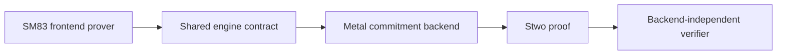

# `stwo_sm83_metal_integration`

| Property | Value |
| :--- | :--- |
| Version | `0.1.0` |
| Layer | `integration` |
| Owner | `sm83-metal-integration` |
| Focused CI host | macOS |

## Purpose and architecture

This package selects the existing fail-closed Metal proving engine for the
backend-generic SM83 execution proof path. The frontend still owns trace generation,
AIR, statement mixing, and verification; this adapter contains no SM83
semantics and never falls back to CPU.



## Public API

Import the package with:

```zig
const sm83_metal = @import("stwo_sm83_metal_integration");
```

`proveExecution` and `verifyExecution` mirror the CPU adapter.
`proveMachineExecution` accepts canonical ordinary rows beginning with IME
clear (excluding HALT/STOP). Flat interrupt-service rows fail closed because
they no longer retain pinned SameBoy bus-cycle provenance; the v7 cartridge
machine entry point owns them. Timer-register accesses, pending reloads, and
DIV-byte transitions are also rejected.
`MetalProverEngine` is the only backend selection. `ExecutionStatement` and
`ProveOutput` are aliases of the types owned by `stwo_sm83_frontend.prover`.
This keeps a caller's statement and verifier code identical across CPU/SIMD
and Metal.

`EnvironmentProverEngine`, `EnvironmentExecutionStatement`, and
`EnvironmentProveOutput` select the same Metal backend for the committed
joypad-and-timer environment. `proveEnvironmentExecution` and
`verifyEnvironmentExecution` use the frontend-owned ROM, committed joypad and
timer endpoints, actions, FF00 and FF04–FF07 MMIO, timer tick/reload semantics,
selected final RAM regions, required intermediate RAM samples, and the ordered
shared-memory transaction without defining a Metal-specific claim.

`MachineEnvironmentProverEngine`, `MachineEnvironmentExecutionStatement`, and
`MachineEnvironmentProveOutput` expose the v7 machine transaction, including
ordered CPU-visible APU access binding and committed APU endpoints.
`proveMachineEnvironmentExecution` accepts the frontend-owned input containing
`CartridgeMachineStepResult` rows; `verifyMachineEnvironmentExecution`
reconstructs the public preprocessing and verifies the resulting proof. Both
entry points select `MetalProverEngine` explicitly and propagate Metal errors
without retrying on CPU.

## Dependencies

- `stwo_sm83_frontend` — backend-neutral proof orchestration and SM83 semantics.
- `stwo_metal_backend` — Metal commitment engine and runtime.
- `stwo_cpu_backend` — independently recomputes canonical preprocessing only
  in the external Pokémon proof gate.
- `stwo_core` — PCS configuration used by the adapter signature.

## Build, test, and run

On macOS:

```sh
zig build test --build-file src/integrations/sm83_metal/build.zig -Doptimize=ReleaseSafe -j2
zig build test-machine-environment --build-file src/integrations/sm83_metal/build.zig -Doptimize=ReleaseSafe -j2
zig build test-pokemon-checkpoint --build-file src/integrations/sm83_metal/build.zig -Doptimize=ReleaseFast -- /path/to/PE-AGI/v1
zig build test-pokemon-checkpoint --build-file src/integrations/sm83_metal/build.zig -Doptimize=ReleaseFast -- /path/to/PE-AGI/v1 --start-release
zig build test-pokemon-checkpoint --build-file src/integrations/sm83_metal/build.zig -Doptimize=ReleaseFast -- /path/to/PE-AGI/v1 --battle-chunk-1
zig build test-pokemon-checkpoint --build-file src/integrations/sm83_metal/build.zig -Doptimize=ReleaseFast -- /path/to/PE-AGI/v1 --battle-chunk-2
zig build test-pokemon-checkpoint --build-file src/integrations/sm83_metal/build.zig -Doptimize=ReleaseFast -- /path/to/PE-AGI/v1 --proof-fast
zig build test-pokemon-checkpoint --build-file src/integrations/sm83_metal/build.zig -Doptimize=ReleaseFast -- /path/to/PE-AGI/v1 --proof-fast --smoke
zig build test-pokemon-checkpoint --build-file src/integrations/sm83_metal/build.zig -Doptimize=ReleaseFast -- /path/to/PE-AGI/v1 --proof-fast-dma-probe --smoke
zig build test-pokemon-checkpoint --build-file src/integrations/sm83_metal/build.zig -Doptimize=ReleaseFast -- /path/to/PE-AGI/v1 --proof-fast-chunk-1 --smoke
zig build test-pokemon-checkpoint --build-file src/integrations/sm83_metal/build.zig -Doptimize=ReleaseFast -- /path/to/PE-AGI/v1 --proof-fast-chunk-2 --smoke
zig build test-pokemon-checkpoint --build-file src/integrations/sm83_metal/build.zig -Doptimize=ReleaseFast -- /path/to/PE-AGI/v1 --proof-fast-turn --smoke
zig build test-pokemon-checkpoint --build-file src/integrations/sm83_metal/build.zig -Doptimize=ReleaseFast -- /path/to/PE-AGI/v1 --smoke
zig build test-pokemon-battle-chain --build-file src/integrations/sm83_metal/build.zig -Doptimize=ReleaseFast -- /path/to/PE-AGI/v1 --smoke
```

The focused lane passes 21/21 tests and executes all 15 flat-ISA family
selectors plus timer-disabled interrupt service and committed data reads and
writes through `MetalProverEngine`,
proving the same claims as CPU/SIMD. It also asserts that the adapter selects
`MetalCommitBackend`. This is a development slice, not broad Metal runtime
acceptance.
The environment roundtrip proves and verifies the v3 transaction through Metal
and rejects forged joypad, timer, and intermediate-observation witness rows.
The package contract pins this check as `environment Metal proof binds actions
devices and observations`.
The focused machine-environment lane targets one canonical 16-row v7
`CartridgeMachineStepResult` trace with a committed joypad action and
authenticated active WRAM-to-OAM DMA. It rejects action, DMA-source, semantic
row, and empty-trace vacuity mutations. It is the shortest local Metal gate
for the v7 machine geometry and transcript.
The hash-pinned Pokémon checkpoint gate proves its 4,096-row slice through
Metal, then makes the frontend-owned verifier recompute the canonical
preprocessed root through `CpuBackend` and verify that same proof. It rejects a
mutated public RAM observation before verification. This is an
external-corpus development executable and cross-backend root-equivalence
check, not a public integration API or a CPU proving fallback. The default is
the repository's 96-bit profile (`pow=26`, blowup log 1, 70 queries);
`--smoke` explicitly selects the three-query development profile.
A fresh v7 Metal ReleaseFast receipt passes the short checkpoint fixture with
`profile=smoke`, `fixture_profile=short`, `security_bits=3`, `rows=4096`,
`mcycles=5211`, `callbacks=929`, `actions=0`, `dma_sources=0`, `apu_events=12`,
`observations=2`, and `verifier_preprocessing=cpu`. CPU is used only to
recompute canonical verifier preprocessing; Metal remains the proving backend
without fallback. This receipt does not establish a secure-profile or larger
chunk v7 result.

Fresh v7 Metal ReleaseFast proof-fast receipts pass with
`fixture_profile=proof_fast_short`, `rows=8192`, `mcycles=8600`,
`callbacks=301`, `actions=0`, `dma_sources=0`, `apu_events=0`,
`observations=2`, `lookahead=7637`, `oracle_records=302`, and
`verifier_preprocessing=cpu`: the explicit development run reports
`profile=smoke` and `security_bits=3`, while the default secure run reports
`profile=secure` and `security_bits=96`. CPU only recomputes canonical verifier
preprocessing; Metal remains the proving backend without fallback. These
receipts establish both profiles only for this short fixture, not a whole
battle or larger chunk.

The backend-neutral complete-battle chain is wired into this package too. It
compiles, selects `MetalProverEngine`, and has no CPU proving fallback; the
frontend-owned verifier remains unchanged. A local 65,536-row full-battle
smoke attempt exceeded 25 GB of wired unified memory and was stopped before a
proof receipt. Metal therefore does not yet have a completed full-battle
claim. Use the direct command only on a suitable host; the Python benchmark
harness requires `--allow-high-memory-metal`. Reducing resident commitment
high-water memory is the measured Metal optimization frontier.

For this fast-only profile, the raw pinned checkpoint is projected by a
fail-closed PPU normalization: SameBoy's variable mode 3 at derived dot 272 is
normalized to mode 0 in the reduced fixed model. The pinned raw checkpoint and
callbacks remain independently checked, but this proof is not raw
variable-timing PPU equivalence.

The former 2^14 active-DMA rejection was a shared PPU-policy
degree-accounting bug, not a Metal capacity limit. The corrected cubic policy
passes the exact 16,384-row CPU/SIMD probe and the larger Metal proof below.

Both direct 2^17 `_ROGUE_FAST` profiles prepare and replay exactly. Chunk 1 has
131,072 rows, 12,425
callbacks, 146,040 M-cycles, 10,645 lookahead rows, 1,280 DMA bytes, and no
action. Metal proves and verifies chunk 1 at 96-bit security with canonical CPU
verifier preprocessing and no proving fallback. Chunk 2 skips that exact prefix
and has 131,072 rows, 7,424 callbacks,
141,366 M-cycles, 9,727 lookahead rows, 1,280 DMA bytes, and one action. These
are pinned replay specifications; chunk 2 has no post-fix proof receipt.

The exact `_ROGUE_FAST` ROM, checkpoint, and oracle paths, sizes, and SHA-256
digests are listed in the frontend owner guide. This adapter neither embeds
nor substitutes those external artifacts.

The following timings are historical v6 receipts and must not be presented as
v7 proof results. The `--start-release` smoke proof completed locally in 95.92
seconds with
131,072 rows, 163,027 M-cycles, 25,115 SameBoy callbacks, one committed action,
1,440 DMA source bytes, and two observations.
The contiguous `--battle-chunk-1` smoke proof passed in 93.61 seconds with
131,072 rows, 142,224 M-cycles, 8,809 callbacks, no local actions, 1,280 DMA
source bytes, and two observations.
The contiguous `--battle-chunk-2` smoke proof passed in 95.42 seconds with
131,072 rows, 141,631 M-cycles, 8,378 callbacks, one local action, 1,280 DMA
source bytes, and two observations. All three standalone chunks remain inside
the reduced fixed-172-dot device model.

The historical v6 aggregate three-proof chain was exercised with CPU/SIMD
proving and CPU verification. At both 3 and 96 security bits it bound 393,216
rows, 446,882 M-cycles, 42,302 callbacks, two actions, and three chunks,
mutation-checks both joins, and pins outer digest
`6eabf9e757684a8e963e9b8f42491d3ca2171fafe1570141559494f864965724`;
the secure CPU chain completed in 140.94 seconds. The v6 Metal receipts cover
three independently verified standalone statements; Metal does not yet own a
separate aggregate chain executable. The short-fixture v7 receipts above do
not supersede these larger historical results. All of these claims remain
inside the reduced fixed-172-dot device model.

## Contract and invariants

The Metal engine must satisfy the same typed engine contract and exact
Blake2s-prefixed transcript protocol as CPU/SIMD. Backend errors propagate;
there is no fallback. Any semantic or statement change belongs in the frontend
and must compile through both adapters.

The proof is verified by the frontend's backend-independent verifier. The
adapter does not define another statement, trace layout, transcript order, or
proof type. That is the central pluggability invariant: changing the backend
must not change the claim.

The base claim covers the complete flat ISA and timer-disabled interrupt
delivery. The environment claim additionally composes RTC-free MBC3, actions,
committed timer endpoints, FF04–FF07 access, timer ticks and delayed reload,
timer IF bit-2 updates, selected final RAM regions, and canonical read-only
intermediate RAM observations in the CPU/joypad memory history. Exact joypad
and timer permissions remain independent and do not admit PPU rows or
`.system` relabels.

The base and v3 environment entry points are not complete-machine claims. The
v7 machine-environment entry point composes their exact prefix with PPU
timing/MMIO, DMA, HALT/interrupt scheduling, and ordered CPU-visible APU
register transitions. It binds every FF10–FF3F execution access and commits
the APU endpoints and raw system-image latches. It still does not claim
rendered pixels, PPU contention/corruption, APU clocks or audio output, RTC
behavior, or a proved whole-ROM execution.
Its verifier AIR forces HBlank STAT off, permits at most one PPU IF request per
M-cycle, rejects all VRAM-source DMA, and proves the reduced fixed-172-dot PPU
model. It also binds every CPU VRAM/OAM access to a phase-zero PPU row and
rejects accesses whose result could depend on variable mode-3 timing. The
frontend owner guide records the exact reduced/full hardware boundary and the
graduation rule for each device.

Ownership follows the shared prover transaction. Trace columns move into the
selected engine, the engine consumes commitment state during proof assembly,
and verification consumes the proof. Allocation or Metal initialization
failures propagate to the caller without retrying through CPU.

## Change checklist

Run the frontend corpus gate and both integration package gates. Keep all SM83
semantics in the frontend. Add telemetry and larger resident workloads before
claiming device-only runtime acceptance. If a future Metal optimization needs
a new prepared-column shape, add it to the shared engine contract only when
CPU/SIMD can implement the same semantics.

## Related documentation

See the [SM83 frontend guide](../../frontends/sm83/README.md) and
[CPU/SIMD integration](../sm83_cpu/README.md).
