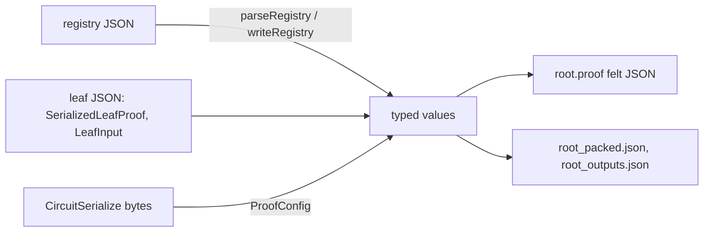

# `stwo_circuit_recursion_wire`

`stwo_circuit_recursion_wire` reads and writes the files and byte streams of
StarkWare's circuit recursion stage (leaf wrap, 2-to-1 folds, recursive tree)
exactly as the Rust binaries of
[`starkware-libs/proving`](https://github.com/starkware-libs/proving) at
commit `5a7c5ede4299c91a61df19a07cba4f7502c14230` produce them. Byte parity
with those producers is the contract: a file the Rust wrote parses and
re-emits to the same bytes, and a value the Zig port builds serializes to the
bytes the Rust would write for it.

| Property | Value |
| :--- | :--- |
| Version | `0.1.0` |
| Layer | `interchange` |
| Owner | `circuit-recursion` |
| Public Zig module | `stwo_circuit_recursion_wire` |
| Focused CI host | Linux |
| Upstream authority | `proving@5a7c5ed` (Circuit Recursion Lane, `conformance/upstream.md`) |

The [package contract](package.contract.json) and [public facade](mod.zig) are
the authoritative API records. The port's design is
[`02-design.md`](../../../design/starknet-proving-pipeline/recursion/02-design.md)
(section 2.3).

## Purpose and boundaries



| Format | Module | Rust producer |
| :--- | :--- | :--- |
| Circuit proof, binary, sized by a `ProofConfig` | `circuit_serialize` | `circuit_serialize` crate |
| Felt252 primitives, felt JSON text | `cairo_serialize` | `stwo-cairo-serialize` (`crates/cairo-serialize`) |
| Root proof felt stream (`CairoCircuitProof`) | `circuit_felt_stream` | `circuit_cairo_serialize`, `cairo-air/src/utils.rs` |
| `SerializedLeafProof`, `DigestHex`, `LeafInput`, leaves manifest | `leaf_proof_json` | `leaf_proof_format`, `stwo_run_and_prove_recursive_tree/src/leaf_io.rs` |
| `PackedNode` tree, root output digest | `packed_node` | `leaf_proof_format`, `stwo_run_and_prove_recursive_tree/src/output.rs` |
| Circuit registry and its queries | `registry` | `circuit_registry`, `ProverParameters` |
| Registry definition (`circuit-params --definition`) | `registry_definition` | `circuit_params::RegistryDefinition` |
| Leaf output digest from a decimal felt preimage | `blake2_felt252` | `LeafInput::output_digest`, `Blake2Felt252::encode_felts_to_u32s` |
| `verify_circuit` inputs besides the proof | `verify_request` | the oracle's `verify-circuit --request` (`VerifyRequest`) |
| serde_json pretty and compact text | `json_text` | `serde_json` |

This package owns encodings only. It does not know the circuit AIR: the column
counts a `ProofConfig` needs come from the caller (the circuit frontend, or in
tests the oracle's R3 checkpoint). `ProofConfig` is
`core.circuit_proof_shape.ProofShape`, the one shape and size model the
in-circuit verifier uses too. It does not verify proofs, build circuits,
or check that a registry's hashes match any circuit; those belong to the
circuit frontend and the recursion products.

Where the Rust is lenient in a way that would break a byte-identical round
trip, decoding fails closed instead, and each case is documented at its
decoder: an M31 at or above P in the felt stream (Rust reduces it), a
non-canonical `0x` felt string, a felt above `u64::MAX` (every felt of the
Blake2s-hashed root stream fits), a duplicate key in the registry's config map
(serde keeps the last), and nesting deeper than `packed_node.max_depth`.
Otherwise reading follows serde, including ignoring unknown JSON fields and
two release-build behaviours the R0 vectors pin: `Felt::from_dec_str` wraps
its digit add modulo 2^256 (`2^256 + 3` reads as 3), and a leaf proof's
base64 may omit or shorten its `=` padding (`serde_with`'s
`DecodePaddingMode::Indifferent`; trailing bits must still be zero).

## Public API

```zig
const wire = @import("stwo_circuit_recursion_wire");

var decoded = try wire.circuit_serialize.deserializeProof(allocator, bytes, config);
defer decoded.deinit();
try wire.circuit_serialize.serializeProof(writer, &decoded.proof, config);

var registry = try wire.registry.parseRegistry(allocator, registry_text);
defer registry.deinit();
try wire.registry.writeRegistry(writer, registry.registry);
```

| Area | Exports |
| :--- | :--- |
| Binary circuit proofs | `circuit_serialize` (`ProofConfig`, `ComponentShape`, `Proof`, `deserializeProof`, `serializeProof`, `serializeProofAlloc`) |
| Felt primitives | `cairo_serialize`, the injected CairoSerde transport `src/interop/felt_json.zig` shared with the Cairo frontend (`FeltReader`, `FeltWriter`, `FeltList`, `FeltJsonWriter`, `parseFeltJson`, `sortAndTransposeQueriedValues`) |
| Root proof stream | `circuit_felt_stream` (`CairoCircuitProof`, `decode`, `encode`, `writeJson`) |
| Leaf files | `leaf_proof_json` (`DigestHex`, `SerializedLeafProof`, `LeafInput`, parse and write functions, `decodeBase64`, `parseLeavesManifest`) |
| Tree outputs | `packed_node` (`PackedNode`, `parsePackedNode`, `writePackedNode`, `writeRootOutputs`, `parseRootOutputs`) |
| Registry | `registry` (`CircuitRegistry` with `config`, `leafVerifier`, `maxLeafTraceLogSize`, `multiverifier`; `parseProverParameters`, `parseFriConfig` for the definition's parameter files) |
| Registry definition | `registry_definition` (`RegistryDefinition`, `parseRegistryDefinition`) |
| Felt preimages | `blake2_felt252` (`parseDecimalFelt`, `appendFeltWords`, `outputDigest`) |
| Verify requests | `verify_request` (`VerifyRequest`, `parseVerifyRequest`, `writeVerifyRequest`) |
| JSON text | `json_text` (`Writer`, strict field readers) |

Decoders return a value together with the arena that owns its slices; call
`deinit` on it. Writers take a `*std.Io.Writer` and never allocate, except
`serializeProofAlloc`.

## Dependencies

- `stwo_core` — M31 and QM31 field types and `FriConfigV2` of the
  `proving_5a7c5ed` protocol revision.
- `interop_felt_json` — the single-file CairoSerde transport at
  `src/interop/felt_json.zig` (felt JSON text, `stwo-cairo-serialize`
  primitives, the verifier's queried-value layout), injected as a module
  because the Cairo frontend shares it; this package re-exports it as
  `cairo_serialize`.

No prover, backend, frontend, or integration package is allowed in this
interchange layer.

## Build, test, and run

From the repository root:

```sh
zig build test --build-file src/interop/circuit_recursion/build.zig -Doptimize=ReleaseFast -j2
```

The package test step runs two roots. The unit tests in each module cover
encodings, rejection paths and serde text details. `vectors_test.zig` runs
from the repository root and round-trips the upstream goldens copied into
`vectors/circuit/official/`:

- the three multiverifier proofs (`circuit_multiverifier/*.bin`, 182,884 bytes
  each) through `CircuitSerialize`, byte-identical;
- the three registries, re-emitted byte-identically;
- the leaf prover's `expected_output.json` and the `four_leaves` `leaf.json`,
  re-emitted byte-identically, with their embedded proofs round-tripped;
- `four_leaves/root.proof` (1.5 MB of felt JSON) parsed and re-emitted
  byte-identically, and checked against the registry;
- `root_packed.json` and `root_outputs.json` rebuilt from the leaf and the
  registry alone, byte-identical;
- the R0 format checkpoints (felt252 encoding, `DigestHex`, leaf JSON).

## Contract and invariants

- Every encoder's output for a value decoded from Rust output equals that
  output byte for byte.
- `circuit_serialize` writes exactly `ProofConfig.serializedLen()` bytes
  (upstream `ProofInfo::total_bytes()`), and refuses a proof whose shape does
  not match its config.
- Decoders never read past their input and report errors instead of the
  upstream panics.
- Fixtures are upstream files verbatim; `scripts/check_upstream_pins.py`
  authenticates them against `vectors/circuit/provenance.json`.

## Change checklist

1. Cite the upstream file and commit for any encoding change and keep the
   comment at the decoder in step with the Rust.
2. Add or update a golden round trip in `vectors_test.zig` for every format
   touched; upstream goldens go through
   `scripts/generate_circuit_oracle_vectors.py` and the provenance record.
3. Update `package.contract.json` and this README when the public API changes.
4. Run the focused package command above and
   `python3 scripts/check_package_workspace.py`.

## Related documentation

- [Circuit recursion design](../../../design/starknet-proving-pipeline/recursion/02-design.md)
- [Rust porting map](../../../design/starknet-proving-pipeline/recursion/01-rust-map.md)
- [Circuit recursion fixtures](../../../vectors/circuit/README.md)
- [Proof interchange package](../proof_wire/README.md)
