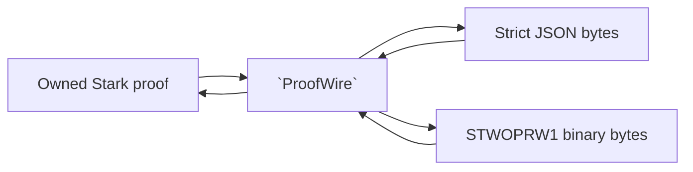

# `stwo_proof_wire`

`stwo_proof_wire` maps the canonical lifted Blake2s STARK proof to a
cross-language JSON shape and to a compact versioned binary representation. It
owns proof encoding and reconstruction, not statement framing or proof
verification policy.

| Property | Value |
| :--- | :--- |
| Version | `0.1.0` |
| Layer | `interchange` |
| Owner | `proof-wire` |
| Public Zig module | `stwo_proof_wire` |
| Focused CI host | Linux |
| Upstream proof shape | raw Stwo `a8fcf4bd` |

The [package contract](package.contract.json) and [public facade](mod.zig) are
the authoritative API records.

## Purpose and boundaries



The JSON decoder rejects unknown fields and non-canonical field elements. The
binary decoder requires the `STWOPRW1` header, rejects unsupported versions,
truncation, trailing bytes, and out-of-range values.

This package does **not** bind a proof to an application statement, choose
security parameters, run the verifier, or provide the fixed-memory preflight
used for hostile artifact admission. Callers handling untrusted files must use
the product's framing, size limits, statement checks, and verifier policy in
addition to this codec.

## Public API

```zig
const wire = @import("stwo_proof_wire");

const json_bytes = try wire.encodeProofBytes(allocator, proof);
defer allocator.free(json_bytes);

var decoded = try wire.decodeProofBytes(allocator, json_bytes);
defer decoded.deinit(allocator);
```

| Area | Exports |
| :--- | :--- |
| Concrete proof identity | `Hasher`, `Proof` |
| Wire shape | `ProofWire`, `PcsConfigWire`, `FriConfigWire`, `FriProofWire`, `FriLayerWire`, `MerkleDecommitmentWire` |
| Scalar encodings | `HashWire`, `Qm31Wire` |
| JSON codec | `encodeProofBytes`, `encodeProofHexAlloc`, `decodeProofBytes` |
| Binary codec | `encodeProofBytesBinary`, `decodeProofBytesBinary` |
| Shape conversion | `proofToWire`, `wireToProof` |
| Errors | `CodecError` |

All decode functions return an independently owned `Proof`. The caller must
deinitialize it with the same allocator. `ProofWire` contains borrowed or
allocator-owned slices according to how it was constructed; prefer the
high-level byte codecs unless direct shape access is required.

## Dependencies

- `stwo_core` — proof, PCS, FRI, field, and lifted Merkle types.

No prover, backend, frontend, or integration package is allowed in this
interchange layer.

## Build, test, and run

From the repository root:

```sh
zig build test --build-file src/interop/proof_wire/build.zig -Doptimize=ReleaseFast -j2
```

This is a codec library and has no standalone command. The repository
interoperability CLI is an assembled consumer:

```sh
zig build interop-cli -Doptimize=ReleaseFast
```

See the [repository README](../../../README.md) for product-level prove and
verify commands, which include statement and policy checks absent here.

## Contract and invariants

- API signature: byte codecs preserve owned byte/proof result contracts.
- Behavioral invariant: the binary decoder rejects every truncation and wrong
  version exercised by the corpus.

Any wire-shape change must consider canonical encoding, cross-language
compatibility, allocation limits, wrong-statement handling, and downgrade
behavior. Do not silently reinterpret a prior binary version.

## Change checklist

1. Preserve strict JSON field handling and canonical field decoding.
2. Version binary changes rather than changing `STWOPRW1` semantics in place.
3. Add round-trip plus truncation, mutation, trailing-byte, and wrong-version
   tests.
4. Confirm product-level framing and independent verifier consumers.
5. Run this package test, protocol interchange tests, and the release gate.

## Related documentation

- [Protocol core](../../core/README.md)
- [Repository artifact and CLI overview](../../../README.md)
- [Package-workspace audit](../../../conformance/2026-07-28-zig-package-workspace-release-audit.md)
- [Package release policy](../../../conformance/zig-package-release-policy.md)
