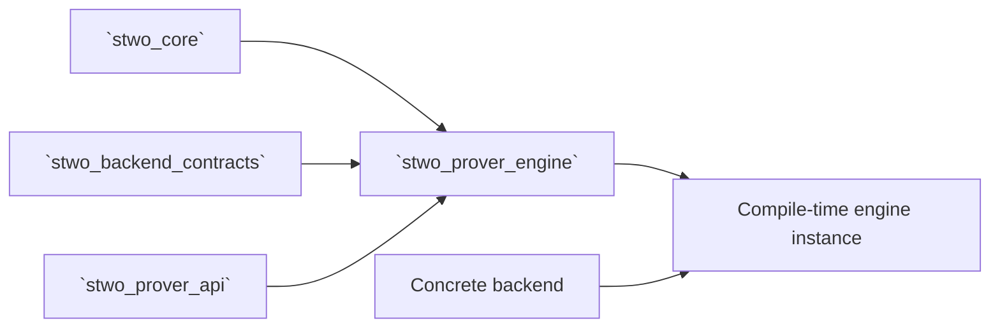

# `stwo_prover_engine`

`stwo_prover_engine` implements backend-generic STARK proving. It owns
commitment-scheme orchestration, component accumulation, quotient work, FRI,
task scheduling, sessions, and measurement while conforming to the stable
transaction contract in `stwo_prover_api`.

| Property | Value |
| :--- | :--- |
| Version | `0.1.0` |
| Layer | `engine` |
| Owner | `prover-engine` |
| Public Zig module | `stwo_prover_engine` |
| Focused CI host | Linux |

The [package contract](package.contract.json) defines the reviewed exports and
dependencies. [mod.zig](mod.zig) is the package facade.

## Purpose and boundaries

This package implements the proving algorithm but remains generic over storage,
field operations, commitments, and runtime policy supplied by a backend.



It does not own VM semantics, application statements, proof interchange
formats, or a concrete CPU/GPU choice. Those belong to frontends, examples,
`stwo_proof_wire`, and backend integrations.

## Public API

A consumer normally creates a typed engine and lets a frontend or example drive
the transaction:

```zig
const prover = @import("stwo_prover_engine");
const cpu = @import("stwo_cpu_backend");

const Engine = prover.engine.ProverEngine(
    cpu.CpuBackend,
    MyMerkleHasher,
    MyMerkleChannel,
    MyChannel,
);

comptime prover.engine.assertProverEngine(Engine);
```

| Area | Exports |
| :--- | :--- |
| Engine and entry points | `engine`, `prove`, `session`, `execution` |
| AIR and lookup proving | `air`, `lookups` |
| Polynomial protocol | `fft_pool`, `line`, `poly`, `secure_column` |
| Commitments and FRI | `pcs`, `fri`, `vcs`, `vcs_lifted`, `channel` |
| Scheduling and storage | `task_graph`, `work_pool`, `host_budget_allocator`, `resident_storage`, `mmap_alloc` |
| Observability | `measurement`, `stage_profile`, `task_profile`, `work_profile` |
| Prepared transaction ownership | `transaction` |

The low-level `prove.prove`, `prove.proveEx`, and
`prove.proveExWithRecorder` functions consume a commitment scheme. The typed
engine exposes the same ownership rule through the stable transaction API:
`commit` consumes column requests and `prove` consumes the scheme.
`transaction` owns prepared-column transfer, commitment ordering, statement
mixing, and cleanup for frontend-selected engines.
`host_budget_allocator` is the coordinator-only live-byte limiter used by
execution-aware CPU backends; shared worker stacks and submission envelopes are
admitted separately by `work_pool` and `task_graph`.
`task_profile` re-exports the stable flat schema used by profiled bounded task
graphs. Its graph-local elapsed time and outer-task concurrency are exact;
physical-worker concurrency and busy time remain absent when a
`pool_exclusive` task contains uninstrumented child work.
`work_profile` owns the exact-work site inventory and completion receipts used
to join prover execution with the typed-AIR static profile. Receipts publish
only after their producer-defined transaction succeeds.

## Dependencies

- `stwo_core` — protocol types and verifier-compatible proof structures.
- `stwo_backend_contracts` — compile-time backend capabilities.
- `stwo_prover_api` — stable transaction and profiling types.

The engine may depend on those contracts; the stable API must not depend back
on this implementation.

## Build, test, and run

Run the owner-local build and tests from the repository root:

```sh
zig build test --build-file src/prover/build.zig -Doptimize=ReleaseFast -j2
```

Build the focused aggregate library surface with:

```sh
zig build stwo-prover -Doptimize=ReleaseFast
```

The package is not a standalone CLI. Run it through a Native example or a
frontend/backend integration so the engine receives a concrete backend,
statement, channel, and commitment configuration.

## Contract and invariants

- API signature: the engine re-exports and satisfies the stable transaction
  contract.
- Behavioral invariant: secure circle-polynomial interpolation round-trips
  from evaluations.

The broader suite covers commitment ownership, prepared and unprepared proving,
sampled-value consistency, FRI scheduling, lifting, streaming commitments,
session reuse, and verifier round-trips.

## Change checklist

1. Keep frontend and product policy out of the engine.
2. Preserve the ownership semantics of schemes, columns, proofs, and sessions.
3. Update `stwo_prover_api` first when changing a stable transaction signature.
4. Validate both ordinary and resident/device backend paths.
5. Run this package, downstream-module smoke tests, and the release gate for
   proof-visible changes.

## Related documentation

- [Stable prover API](../prover_api/README.md)
- [Backend contracts](../backend/README.md)
- [Protocol core](../core/README.md)
- [Package-workspace audit](../../conformance/2026-07-28-zig-package-workspace-release-audit.md)
- [Universal AIR to Sail refinement plan](../../soundness/UNIVERSAL_AIR_SAIL_REFINEMENT.md)
