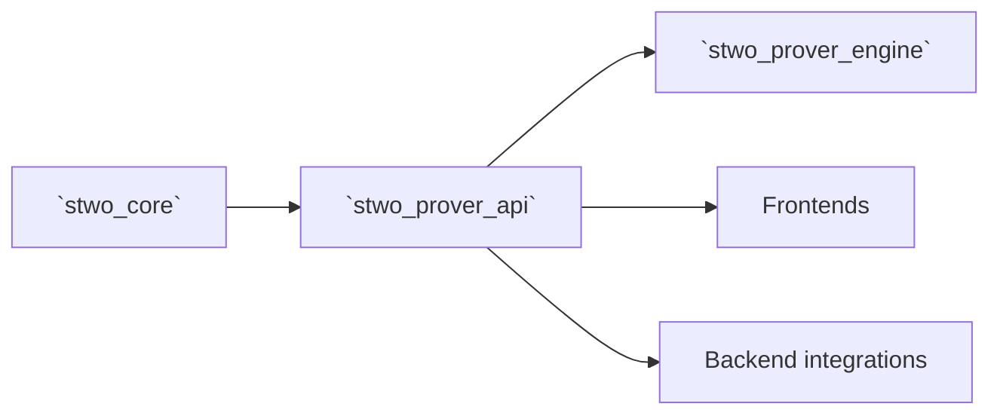

# `stwo_prover_api`

`stwo_prover_api` is the stable transaction boundary shared by frontends,
integrations, and prover engines. It defines owned/borrowed column requests,
proof options, stage-profile schemas, and the compile-time engine signature
check without importing the prover implementation.

| Property | Value |
| :--- | :--- |
| Version | `0.1.0` |
| Layer | `api` |
| Owner | `prover-api` |
| Public Zig module | `stwo_prover_api` |
| Focused CI host | Linux |

The authoritative declarations are the [package contract](package.contract.json)
and [public facade](mod.zig).

## Purpose and architecture

Frontends should be able to describe a proof transaction without depending on
commitment-tree construction, quotient evaluation, FRI scheduling, or engine
internals. That separation lets CPU and device integrations implement the same
transaction shape while the engine evolves behind a narrow API.



The package does not construct proofs, select a backend, or own runtime
lifecycle policy.

## Public API

```zig
const std = @import("std");
const prover_api = @import("stwo_prover_api");

const options = prover_api.ProveOptions{
    .include_all_preprocessed_columns = false,
    .recorder = null,
    .composition_stage = null,
    .cpu_composition_execution = .{
        .worker_count = 4,
        .host_byte_budget = std.math.maxInt(usize),
        .contention_policy = .strict,
    },
};

comptime prover_api.assertProverEngine(MyEngine);
```

| Area | Exports |
| :--- | :--- |
| Column transaction | `ColumnEvaluation`, `ColumnSource`, `QuotientOpsError`, `column` |
| Engine contract | `ProveOptions`, `CpuCompositionContentionPolicy`, `CpuCompositionExecutionRequest`, `DeviceCompositionStage`, `assertProverEngine`, `device_composition`, `engine` |
| Observability | `stage_profile` |

`ColumnEvaluation` is a borrowed view and validates both its declared log size
and storage length. `ColumnSource` records whether a commitment column is
materialized or produced by a recognized structural recipe.
`DeviceCompositionStage` is a per-proof, fail-closed injection point. Its result
storage is type-erased so this package does not import prover implementation
types; only the engine and an integration that already owns those types adapt
the callback.
`CpuCompositionExecutionRequest` carries only worker count, host byte budget,
and strict-versus-compatibility policy. After an optional device composition
stage declines, the engine privately adapts the request to its worker pool and
threads it through execution-aware CPU backend evaluators and the generic
prepared fallback. Closed secure-recurrence and fully prepared generic/RISC-V
plans admit finite budgets: reserved helper stacks and fixed submission
envelopes are charged separately from coordinator-owned heap. Unprepared
fallbacks and plans declaring non-heap scratch or device residency reject
finite caps before launching work. Legacy backend hooks without the
execution-aware ABI retain their own resource contract.
`assertProverEngine` checks the associated types and exact `init`, `deinit`,
`commit`, and `prove` signatures at compile time.

## Dependencies

The sole dependency is:

- `stwo_core` — PCS configuration, field elements, and protocol types appearing
  in the stable signatures.

Keeping the API independent of `stwo_prover_engine` is a hard boundary. A
dependency in the opposite direction would prevent frontends from depending on
the contract alone.

## Build, test, and run

From the repository root:

```sh
zig build test --build-file src/prover_api/build.zig -Doptimize=ReleaseFast -j2
```

This is a library-only package. There is no standalone runtime; use it from a
frontend, backend integration, or custom engine implementation.

## Contract and invariants

- API signature: the engine transaction is structurally checked.
- Behavioral invariant: column evaluation rejects invalid storage and lifting
  geometry.

Changes to `ProveOptions`, engine method signatures, column ownership, or
stage-profile schemas affect multiple independently owned packages and require
transitive review.

## Change checklist

1. Keep implementation imports out of this package.
2. State ownership and lifetime semantics on every new transaction type.
3. Add a compile-time signature test for every required engine operation.
4. Version observability schemas when serialized fields change.
5. Run this package test and all transitive package lanes selected by the
   workspace checker.

## Related documentation

- [Prover engine implementation](../prover/README.md)
- [Backend capability contracts](../backend/README.md)
- [Package-workspace audit](../../conformance/2026-07-28-zig-package-workspace-release-audit.md)
- [Package release policy](../../conformance/zig-package-release-policy.md)
