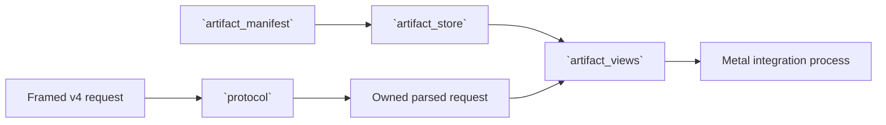

# `stwo_metal_session`

`stwo_metal_session` defines the host-neutral protocol and content-addressed
artifact services used by persistent Metal proving processes. Despite its
name, this package has no dependency on Metal frameworks or any other
first-party package.

| Property | Value |
| :--- | :--- |
| Version | `0.1.0` |
| Layer | `service` |
| Owner | `metal-session` |
| Public Zig module | `stwo_metal_session` |
| Focused CI host | Linux |
| Session protocol | `stwo-zig-metal-prover-session` v4 |

The [package contract](package.contract.json) and [public facade](mod.zig) are
the authoritative boundary.

## Purpose and architecture



The package owns:

- strict parsing of prove and shutdown frames;
- sequence and protocol-version admission;
- content-addressed ingestion and immutable object references;
- canonical manifests, file measurements, roles, and provenance; and
- validated views over preprocessed evaluations, trees, and composition
  programs.

It does not launch Metal kernels, manage a GPU device, or prove a statement.

## Public API

```zig
const session = @import("stwo_metal_session");

const kind = try session.protocol.frameKind(allocator, line);
var request = try session.protocol.parseRequest(
    allocator,
    line,
    expected_sequence,
    true,
);
defer request.deinit();
```

| Export | Responsibility |
| :--- | :--- |
| `protocol` | v4 frame schema, strict parsing, sequencing, and shutdown validation |
| `artifact_manifest` | protocol identity, measurements, roles, provenance, and digests |
| `artifact_store` | content-addressed ingest, immutable snapshots, and copy policy |
| `artifact_views` | validated file/object views consumed by proving processes |

Parsing returns owned data. Callers must keep the artifact root and sequence
policy explicit and deinitialize `ParsedRequest` with its allocator.

## Dependencies

There are no first-party package dependencies. This allows protocol and
artifact validation to run in ordinary Linux CI without Metal hardware or
Apple frameworks.

## Build, test, and run

From the repository root:

```sh
zig build test --build-file src/tools/metal_session/build.zig -Doptimize=ReleaseFast -j2
```

This is a service library, not the persistent process executable. It is run by
the Cairo Metal integration and associated product tools.

## Contract and invariants

- API signature: `parseRequest` returns an owned `ParsedRequest`.
- Behavioral invariant: the strict v4 parser rejects prior versions and
  requests missing a composition program.

Protocol changes must fail closed, preserve sequencing, bound frame size, and
bind every consumed artifact to a measured identity. Backward compatibility
must be explicit; never reinterpret a prior protocol version.

## Change checklist

1. Version incompatible frame or manifest changes.
2. Keep parsing strict and allocation ownership explicit.
3. Test truncation, unknown fields, wrong sequence/version, missing artifacts,
   digest mismatch, and path confinement.
4. Keep this package host neutral.
5. Run package tests and the consuming Metal integration gates.

## Related documentation

- [Metal backend](../../backends/metal/README.md)
- [Cairo Metal integration](../../integrations/cairo_metal/README.md)
- [Package-workspace audit](../../../conformance/2026-07-28-zig-package-workspace-release-audit.md)
- [Package release policy](../../../conformance/zig-package-release-policy.md)
